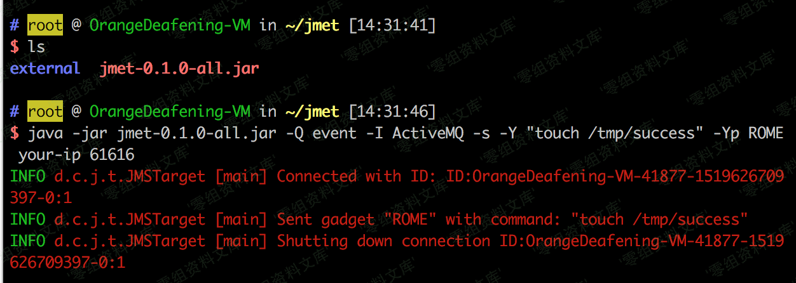
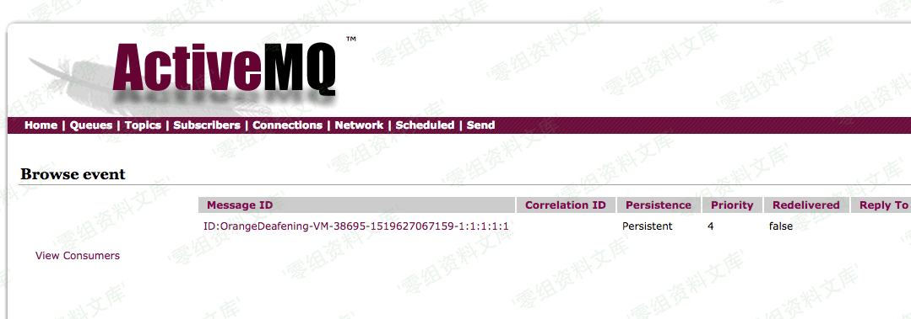
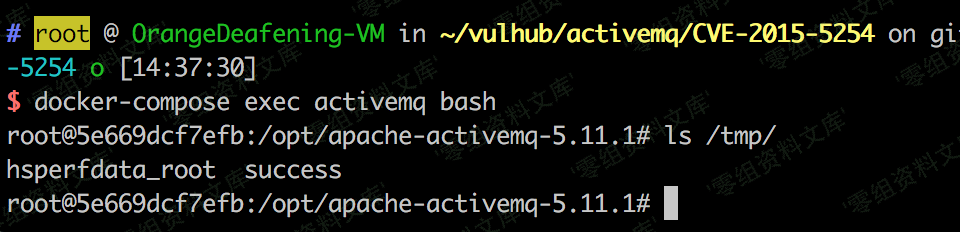
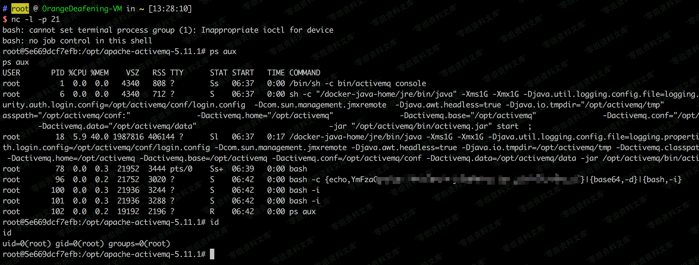

# （CVE-2015-5254）ActiveMQ 反序列化漏洞

<!-- vulwiki-editorial:start -->
## 校订与适用边界

- 适用前提：5.x<5.13.0、投递消息权限、可用gadget；管理查看需admin或诱导受害者，或客户端正常消费
- 证据范围：明确触发依赖消费/查看，和86同源实验但更简短，无独立根因扩展

### 尚未解决的证据缺口

以下限制仍适用于后文历史材料；相关版本、结果或修复结论不能据此视为已验证：

- 应改为原作者jmet来源并固定版本/校验信息
- 多处图片后重复路径残文
- 缺修复过滤机制/凭据配置和测试JVM，不能任意5.x无条件用ROME

本页为文本校订，未执行代码、PoC 或目标请求；原图仅保留引用，未据此确认复现成功。
<!-- vulwiki-editorial:end -->

## 技术正文与历史材料

一、漏洞简介
------------

Apache ActiveMQ
5.13.0之前5.x版本中存在安全漏洞，该漏洞源于程序没有限制可在代理中序列化的类。远程攻击者可借助特制的序列化的Java
Message Service(JMS)ObjectMessage对象利用该漏洞执行任意代码。

二、漏洞影响
------------

Apache ActiveMQ 5.13.0之前的5.x版本

三、复现过程
------------

漏洞利用过程如下：

1.  构造（可以使用ysoserial）可执行命令的序列化对象

2.  作为一个消息，发送给目标61616端口

3.  访问web管理页面，读取消息，触发漏洞

使用[jmet](https://github.com/ianxtianxt/jmet)进行漏洞利用。首先下载jmet的jar文件，并在同目录下创建一个external文件夹（否则可能会爆文件夹不存在的错误）。

jmet原理是使用ysoserial生成Payload并发送（其jar内自带ysoserial，无需再自己下载），所以我们需要在ysoserial是gadget中选择一个可以使用的，比如ROME。

执行：

    java -jar jmet-0.1.0-all.jar -Q event -I ActiveMQ -s -Y "touch /tmp/success" -Yp ROME your-ip 61616

ActiveMQ反序列化漏洞/media/rId25.png)

此时会给目标ActiveMQ添加一个名为event的队列，我们可以通过`http://your-ip:8161/admin/browse.jsp?JMSDestination=event`看到这个队列中所有消息：

ActiveMQ反序列化漏洞/media/rId26.png)

点击查看这条消息即可触发命令执行，此时进入容器`docker-compose exec activemq bash`，可见/tmp/success已成功创建，说明漏洞利用成功：

ActiveMQ反序列化漏洞/media/rId27.png)

将命令替换成弹shell语句再利用：

ActiveMQ反序列化漏洞/media/rId28.png)

值得注意的是，通过web管理页面访问消息并触发漏洞这个过程需要管理员权限。在没有密码的情况下，我们可以诱导管理员访问我们的链接以触发，或者伪装成其他合法服务需要的消息，等待客户端访问的时候触发。

参考链接
--------

> https://vulhub.org/\#/environments/activemq/CVE-2015-5254/
