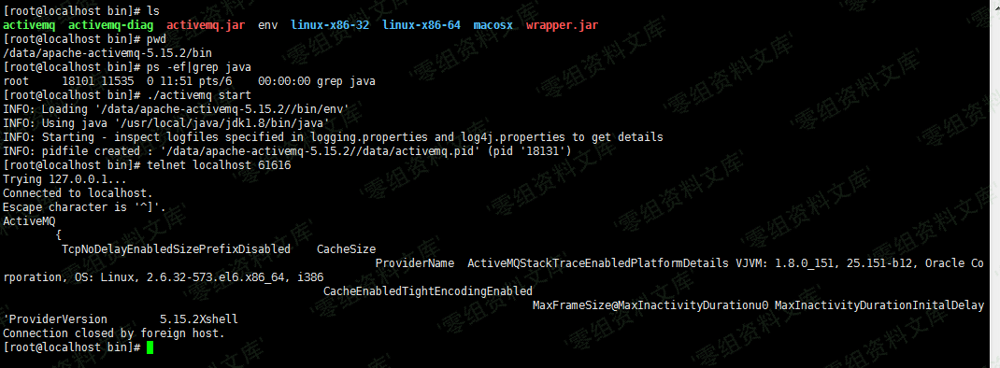

# （CVE-2017-15709）ActiveMQ 信息泄漏漏洞

<!-- vulwiki-editorial:start -->
## 校订与适用边界

- 适用前提：OpenWire监听可达且握手暴露详细平台字段，文列5.15.0–.2/5.14.0–.5
- 证据范围：信息类型说明存在但实际协议请求/响应全靠单图未视检

### 尚未解决的证据缺口

以下限制仍适用于后文历史材料；相关版本、结果或修复结论不能据此视为已验证：

- 版本两段黏连，无修复版或厂商说明
- 不能因为61616开放就认定暴露所有字段，需实际握手证据
- 图片后路径残文

本页为文本校订，未执行代码、PoC 或目标请求；原图仅保留引用，未据此确认复现成功。
<!-- vulwiki-editorial:end -->

## 技术正文与历史材料

一、漏洞简介
------------

Apache
ActiveMQ默认消息队列61616端口对外，61616端口使用了OpenWire协议，这个端口会暴露服务器相关信息，这些相关信息实际上是debug信息。

会返回应用名称，JVM，操作系统以及内核版本等信息。

二、漏洞影响
------------

apache-activemq-5.15.0 to apache-activemq-5.15.2apache-activemq-5.14.0 to apache-activemq-5.14.5

三、复现过程
------------

ActiveMQ信息泄漏漏洞/media/rId24.png)
