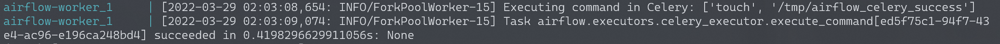
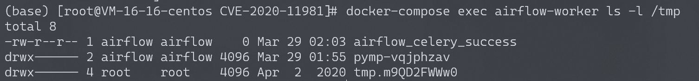

# Apache Airflow Celery 消息中间件命令执行 CVE-2020-11981

<!-- vulwiki-editorial:start -->
## 校订与适用边界

- 适用前提：<=1.10.10且CeleryExecutor、攻击者有发布/控制消息中间件能力，Redis未认证仅靶场配置
- 证据范围：明确broker是前置权限与执行在Worker，非AirflowWeb匿名直接RCE；PoC只链接

### 本次正文校订

- 按实际内容修正 3 处代码围栏语言标记，保留其中方法与请求内容。

### 尚未解决的证据缺口

以下限制仍适用于后文历史材料；相关版本、结果或修复结论不能据此视为已验证：

- 缺固定版/命令验证修复机制
- [your-vps-ip]指目标Redis位置容易与攻击机混淆，应规范参数
- 和示例DAG11978不同入口，不因相同Worker执行结果合并

本页为文本校订，未执行代码、PoC 或目标请求；原图仅保留引用，未据此确认复现成功。
<!-- vulwiki-editorial:end -->

## 技术正文与历史材料

## 漏洞描述

Apache Airflow是一款开源的，分布式任务调度框架。在其1.10.10版本及以前，如果攻击者控制了Celery的消息中间件（如Redis/RabbitMQ），将可以通过控制消息，在Worker进程中执行任意命令。

由于启动的组件比较多，可能会有点卡，运行此环境可能需要准备2G以上的内存。

参考链接：

- https://lists.apache.org/thread/cn57zwylxsnzjyjztwqxpmly0x9q5ljx
- [apache/airflow#9178](https://github.com/apache/airflow/pull/9178)

## 环境搭建

Vulhub依次执行如下命令启动Apache Airflow 1.10.10：

```
#初始化数据库
docker-compose run airflow-init

#启动服务
docker-compose up -d
```

## 漏洞复现

利用这个漏洞需要控制消息中间件，Vulhub环境中Redis存在未授权访问。通过未授权访问，攻击者可以下发自带的任务`airflow.executors.celery_executor.execute_command`来执行任意命令，参数为命令执行中所需要的数组。

使用[exploit_airflow_celery.py](https://github.com/vulhub/vulhub/blob/master/airflow/CVE-2020-11981/exploit_airflow_celery.py)这个脚本来执行命令`touch /tmp/airflow_celery_success`：

```shell
pip install redis
python exploit_airflow_celery.py [your-vps-ip]
```

查看日志：

```shell
docker-compose logs airflow-worker
```

可以看到如下信息：




```shell
docker-compose exec airflow-worker ls -l /tmp
```

可以看到成功创建了文件`airflow_celery_success`：




---

> 来源：Threekiii/Vulnerability-Wiki（https://github.com/Threekiii/Vulnerability-Wiki）
