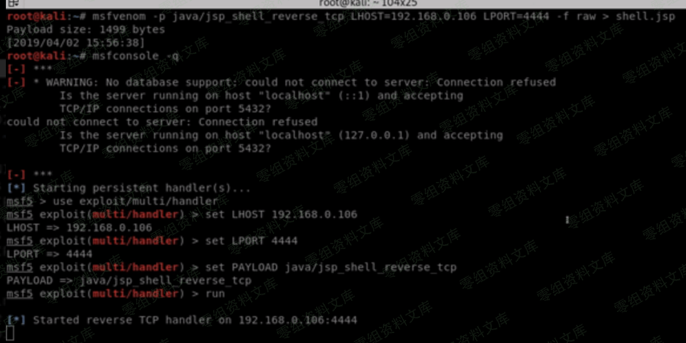
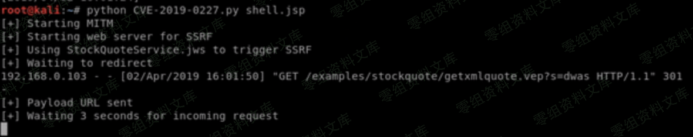
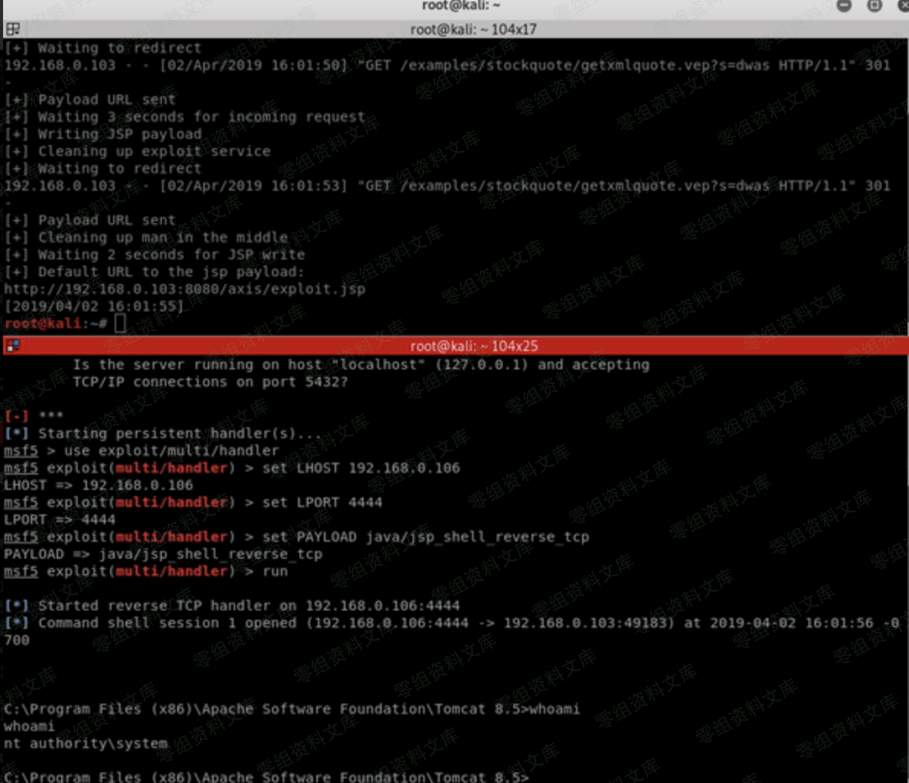

# （CVE-2019-0227）Apache Axis 1.4远程代码执行

<!-- vulwiki-editorial:start -->
## 校订与适用边界

- 适用前提：默认示例服务存在且向硬编码HTTP域发请求，能控制该域响应或网络MITM，重定向到localhost管理服务
- 证据范围：本篇包含真正0227入口，和32开放AdminService实验不同；中文转载丢原作者归因并加入Axis2也受影响断言

### 已有来源支持的更正

- 原研究明确Axis1.4硬编码域/SSRF/MITM及购买域名者Rhino；不支持本文扩称Axis2同受该CVE

### 尚未解决的证据缺口

以下限制仍适用于后文历史材料；相关版本、结果或修复结论不能据此视为已验证：

- Axis2也受此漏洞缺依据，应分不同产品与不同SSRF链
- Python参数全角引号/中文网关变量/转义空格损坏，不能直接复制
- 缺原作者David Yesland/Rhino直接链接和补丁/删除样例建议
- 图片后路径残文；我们购买域名是原作者行动，须明确转述

### 核验来源

- https://rhinosecuritylabs.com/application-security/cve-2019-0227-expired-domain-rce-apache-axis/

本页为文本校订，未执行代码、PoC 或目标请求；原图仅保留引用，未据此确认复现成功。
<!-- vulwiki-editorial:end -->

## 技术正文与历史材料

一、漏洞简介
------------

Apache
Axis™是一个简单对象访问协议（SOAP）引擎。在最近的一次红队行动中，我们发现目标装有老版本的Apache
Axis（1.4）。现在较新的有Apache Axis2, Apache CXF,和Metro等。尽管Apache
Axis已经过时，但它仍然在许多情况下被使用，例如使用Axis构造的项目难以重写或者项目中含有使用SOAP编码的服务。

我们的目标仍在使用过时的版本，因此我们觉得值得深入挖掘，看看是否有可利用的漏洞。最后，我们找到了一个RCE漏洞，该漏洞是由于在默认的示例中使用了过期的硬编码域名作为默认安装。Apache官方为该漏洞签署编号：CVE-2019-0227。现在，我们已经购买了过期域名（www.xmltoday.com）从而防止该漏洞被恶意利用。在本文中，我们将在本地环境中（无需域名）为你演示这个漏洞，同时这个漏洞对Axis2也有影响。

Axis如果你在服务器的Apache
Axis或Axis2的找到服务端请求伪造（SSRF）漏洞，你也可能实现目标服务器的代码执行。在Ambionics
Security的博客文章中有类似的介绍。因为涉及到产权保护，我不会介绍那篇文章的太多细节，总而言之：Axis以管理员权限处理localhost的请求，攻击者可以通过SSRF漏洞修改HTTP
GET请求部分来伪装成localhost用户。

二、漏洞影响
------------

Apache Axis版本= 1.4

三、复现过程
------------

https://github.com/ianxtianxt/cve-2019-0227

### 1、需要在msf设置监听，另外需要修改代码24-30行处

    ＃您需要更改这些变量以匹配您的配置
                            
    myip =  “ 192.168.0.117 ”  ＃您机器的IP
                            
    target =  “ 192.168.0.102 ”  ＃目标IP
                            
    网关=  “ 192.168.0.1 ”  ＃默认网关
                            
    targetport =  “ 8080 ”  ＃目标运行轴的端口（可能是8080）
                            
    pathtoaxis =  “ http://192.168.0.102:8080/axis ”  ＃这可以是自定义的视轴安装，但是这是默认
                            
    spoofinterface =  “ eth0 ”  ＃伪造的接口
                            
    jspwritepath =  “ webapps \\ axis \\ exploit.jsp ”  ＃在目标上写入JSP有效负载的相对路径这是Tomcat安装的默认路径

ApacheAxis1.4远程代码执行/media/rId25.png)

### 2、然后执行py文件

ApacheAxis1.4远程代码执行/media/rId27.png)

等待返回shellApacheAxis1.4远程代码执行/media/rId28.png)
