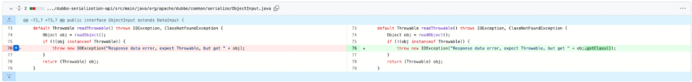
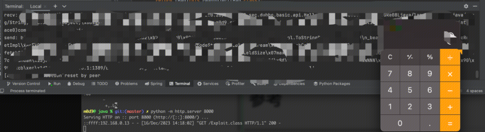
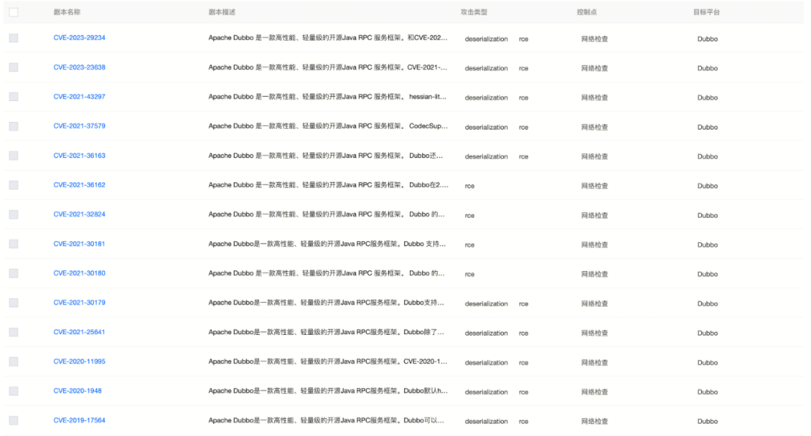

# 安全验证 | Dubbo CVE-2023-29234 反序列化漏洞分析

<!-- vulwiki-editorial:start -->
## 校订与适用边界

- 适用前提：consumer 主动连接恶意或受控 provider；注册中心未授权仅为伪造 provider 的一个场景
- 证据范围：保留有价值的 provider→consumer 攻击方向、readThrowable 调用链和补丁链接；未提供完整协议 PoC。

### 尚未解决的证据缺口

以下限制仍适用于后文历史材料；相关版本、结果或修复结论不能据此视为已验证：

- 43297 是历史机制类比，不能作为本篇主漏洞
- consumer/provider 初步判断需保留推断措辞；producer/provider 术语混用
- 版本 3.1.0–3.1.10、3.2.0–3.2.4 需补明确对应修复版本
- 大量 BAS 营销、二维码和重复强调符号应分离

本页为文本校订，未执行代码、PoC 或目标请求；原图仅保留引用，未据此确认复现成功。
<!-- vulwiki-editorial:end -->

## 技术正文与历史材料

原创 云鼎实验室  云鼎实验室   2023-12-18 16:32  
  
****  
**漏洞描述**  
  
2023年12月15日，Apache 官方发布安全通告，披露了其 Dubbo 存在反序列化漏洞，漏洞编号CVE-2023-29234。  
  
Dubbo 是阿里巴巴公司开源的一个高性能优秀的服务框架，使得应用可通过高性能的 RPC 实现服务的输出和输入功能，可以和 Spring 框架无缝集成。  
  
据官方描述，Apache Dubbo 某些版本在解码恶意包时存在反序列化漏洞，导致远程攻击者可利用该漏洞执行任意代码。  
  
  
**影响版本******  
- 3.1.0 <= Apache Dubbo <= 3.1.10  
  
- 3.2.0 <= Apache Dubbo <= 3.2.4  
  
**解决方案******  
### 升级修复方案  
  
升级Apache Dubbo 至对应安全版本。****  
  
  
**漏洞复现**  
### 补丁分析  
- https://github.com/apache/dubbo/commits/dubbo-3.1.11  
  
- https://github.com/apache/dubbo/commit/9ae97ea053dad758a0346a9acda4fbc8ea01429a  
  
  
  
toString 这个补丁对Dubbo 历史漏洞分析过的应该很熟悉，在CVE-2021-43297 中，就是利用 "+" 的隐式调用触发了toString，造成反序列化。  
### 复现  
  
回溯调用链如下：  
```
ObjectInput#readThrowable
  DecodeableRpcResult#handleException
      DecodeableRpcResult#decode
```  
  
DecodeableRpcResult 是consumer 上的行为，初步判断这个漏洞是provider打consumer。其余的原理与  
CVE-2021-43297 相似。  
  
  
  
影响评估：需要consumer主动去连接provider，场景如下：  
1. 利用producer 横向移动consumer。  
  
1. 内网如果zookeeper未授权，可以用fake producer攻击consumer。  
  
**安全验证规则******  
  
腾讯安全验证服务（BAS） 已支持针对该漏洞安全验证。此外，腾讯安全验证服务也支持几乎历史上所有的 Dubbo 严重漏洞。  
  
  
  
  
**关于安全验证服务(BAS)******  
  
腾讯安全验证服务（BAS）提供自动化的安全防御有效性验证，是腾讯安全服务体系里的一项关键能力。能够帮助企业持续评估安全防御体系，发现防御弱点，优化策略配置，规划安全投入，提升安全水位。  
  
目前已服务金融、交通、制造、互联网等多个行业用户。更多内容，可点击链接了解详情：https://cloud.tencent.com/product/bas。  
  
  
  
  
**END**  
  
****  
  
  
更多精彩内容点击下方扫码关注哦~  
  
  
  
  
  
  
   云鼎实验室视频号  
  
  一分钟走进趣味科技  
  
     -扫码关注我们-  
  
  
  
  
  
关注云鼎实验室，获取更多安全情报  
  
  
  
  
  
  


---

> 来源：gelusus/wxvl（微信公众号漏洞文章自动归档，原文见文首链接）
