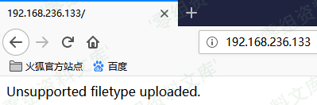
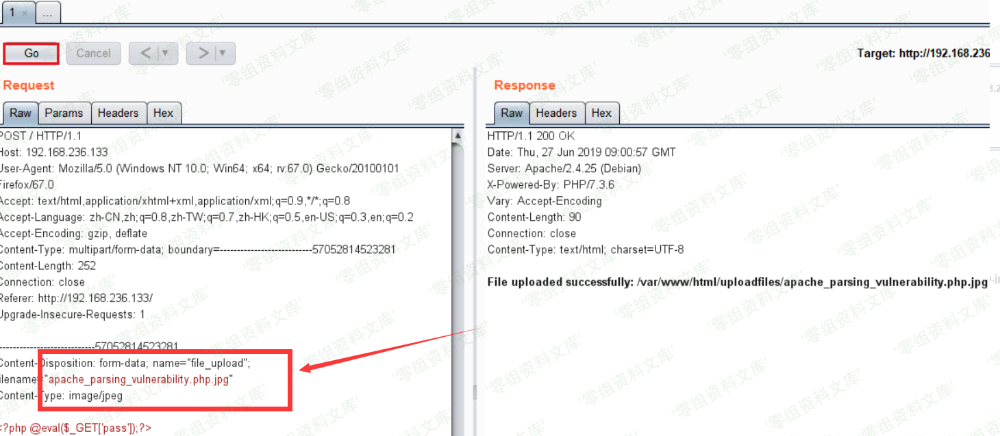
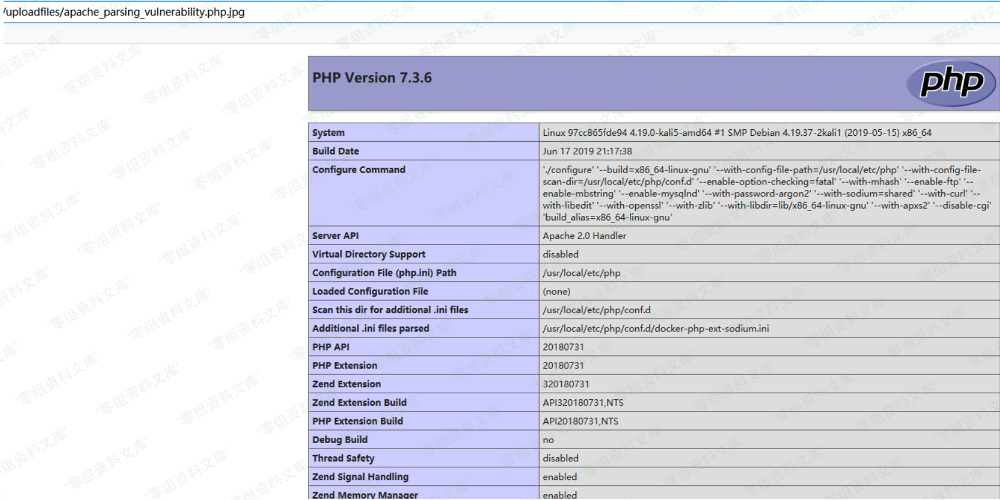

# Apache HTTPD 多后缀解析漏洞

<!-- vulwiki-editorial:start -->
## 校订与适用边界

- 适用前提：明确 AddHandler application/x-httpd-php .php，上传保留多扩展名且可经 Web 执行
- 证据范围：正文清楚说明多后缀机制，不应作为所有 HTTPd 的普遍解析漏洞。

### 尚未解决的证据缺口

以下限制仍适用于后文历史材料；相关版本、结果或修复结论不能据此视为已验证：

- 影响范围章节空白，应改为配置条件而非补虚构版本
- 没有上传业务代码/请求及来源，结果依赖未视检图片

### 操作风险与资料使用

- 含落盘脚本或账户创建：会留下持久状态。记录本次生成的路径或账户，测试后清理这些对象并撤销关联令牌；不要删除既有业务对象。

本页为文本校订，未执行代码、PoC 或目标请求；原图仅保留引用，未据此确认复现成功。
<!-- vulwiki-editorial:end -->

## 技术正文与历史材料

一、漏洞简介
------------

Apache HTTPD
支持一个文件拥有多个后缀，并为不同后缀执行不同的指令。比如，如下配置文件：

    AddType text/html .html
    AddLanguage zh-CN .cn

其给`.html`后缀增加了media-type，值为`text/html`；给`.cn`后缀增加了语言，值为`zh-CN`。此时，如果用户请求文件`index.cn.html`，他将返回一个中文的html页面。

以上就是Apache多后缀的特性。如果运维人员给`.php`后缀增加了处理器：

    AddHandler application/x-httpd-php .php

那么，在有多个后缀的情况下，只要一个文件含有`.php`后缀的文件即将被识别成PHP文件，没必要是最后一个后缀。利用这个特性，将会造成一个可以绕过上传白名单的解析漏洞。

//说白了就是文件重命名为`xxx.php.jpg`就可以被识别成php文件

二、漏洞影响
------------

三、复现过程
------------

首先正常上传一个 `xxx.php` 文件

这里可以看到上传失败了。我们更改一下文件后缀名

将上传文件命名为 `xxx.php.jpg`

通过游览器访问上传的"jpg文件"

