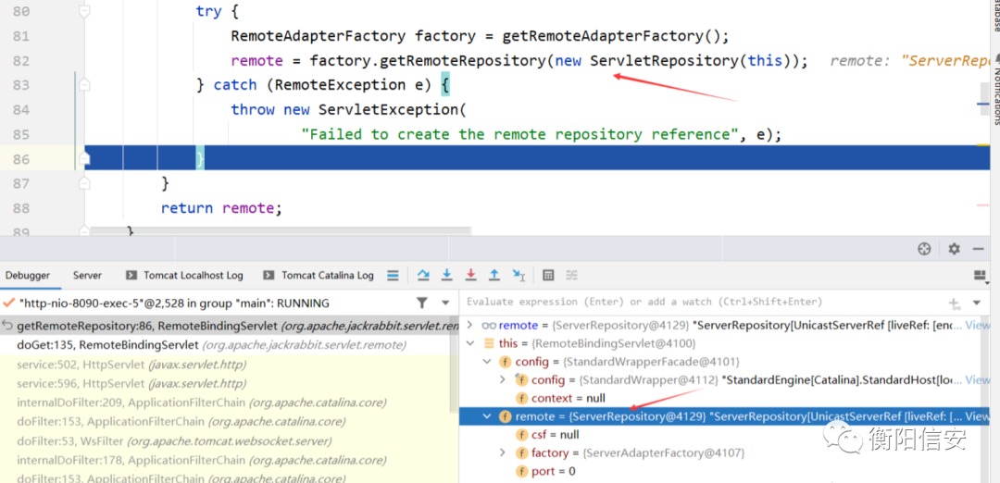
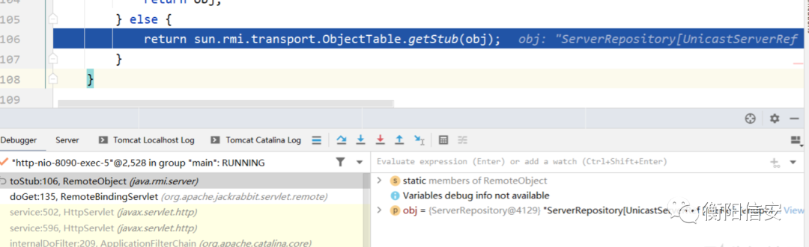
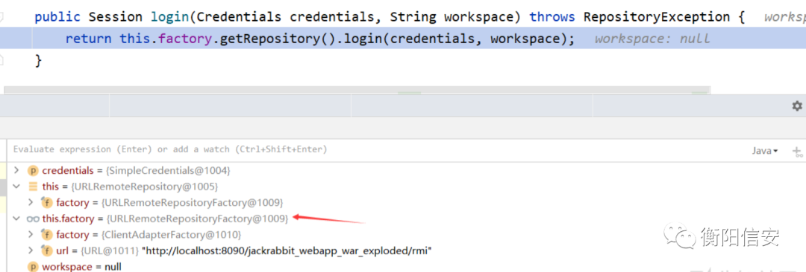
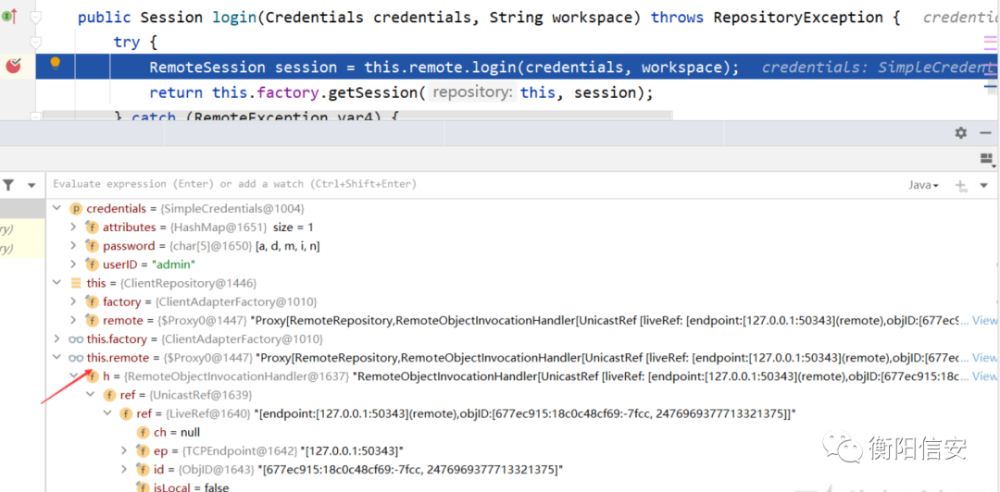
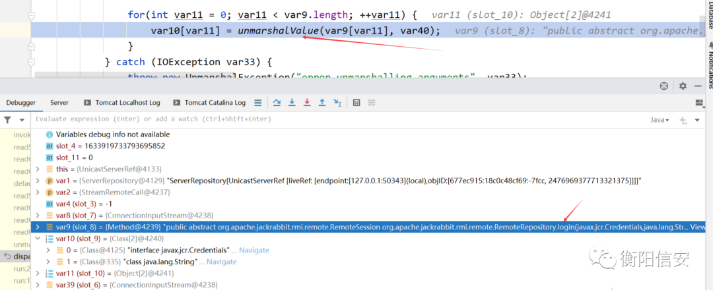
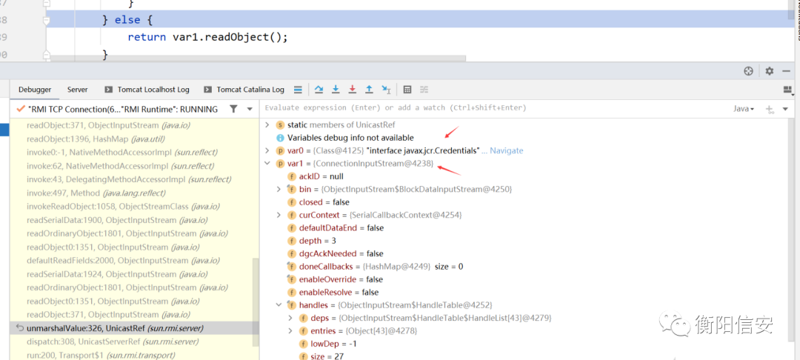
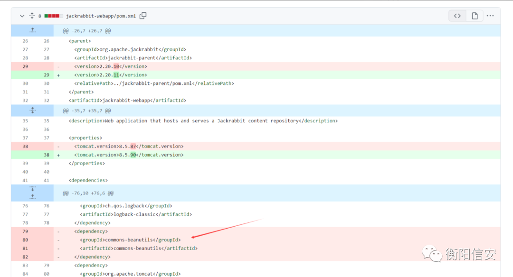

# Apache Jackrabbit RMI 远程代码执行漏洞分析(CVE-2023-37895)

<!-- vulwiki-editorial:start -->
## 校订与适用边界

- 适用前提：RMI服务可达，包含 commons-beanutils gadget，序列化Credentials可到服务端；JDK条件待核
- 证据范围：文字保留从/rmi取stub、调用login传SimpleCredentials attributes的机制；大量代码块全部为空，EXP/栈均丢失。

### 本次正文校订

- 移除 20 组不含任何正文的空代码围栏；保留全部非空代码。

### 尚未解决的证据缺口

以下限制仍适用于后文历史材料；相关版本、结果或修复结论不能据此视为已验证：

- 关键代码/EXP/调用栈十余空块，需从原文恢复，不能当完整复现
- 版本2.20.11与2.21.0区间粘连
- 开头称恶意对象发Web /rmi即可RCE，与后文GET /rmi只返回stub、再走RMI不同，应明确服务端实际攻击入口
- 登录方法反序列化发生在认证前还是后需官方/源码证据，不能因名称login直接认定已有凭证
- 保留原作者Dili署名和原文精确链接，减少聚合源代替原出处

本页为文本校订，未执行代码、PoC 或目标请求；原图仅保留引用，未据此确认复现成功。
<!-- vulwiki-editorial:end -->

## 技术正文与历史材料

 船山信安   2023-11-28 00:02  
  
## 简介  
  
Apache Jackrabbit™ 内容存储库是完全符合 Java 技术 API 内容存储库（JCR，在 JSR 170 和 JSR 283 中指定）的实现。内容存储库是一个分层内容存储库，支持结构化和非结构化内容、全文搜索、版本管理、事务、观察等。  
## 使用  
  
要访问远程内容存储库，需要在应用程序中使用 jackrabbit-jcr-rmi 组件  
  
使用 RMI registry访问版本库所需的代码是  
  
或者使用URLRemoteRepository  
## 漏洞详情  
  
在Apache Jackrabbit webapp和standalone中使用了commons-beanutils组件，该组件包含一个可用于通过 RMI 远程执行代码的类。攻击者可利用该组件构造恶意的序列化对象，发送到服务端的RMI服务端口或者Web服务的/rmi路径，目标服务器对恶意对象反序列化导致RCEhttps://nvd.nist.gov/vuln/detail/CVE-2023-37895  
## 影响版本  
  
1.0.0 <= apache:jackrabbit < 2.20.112.21.0 <= apache:jackrabbit < 2.21.18  
## 利用链  
## 漏洞环境及利用  
  
下载Apache Jackrabbit 2.20.10，编译并使用Tomcat部署https://github.com/apache/jackrabbit/releases/tag/jackrabbit-2.20.10客户端使用下面EXP，运行即可导致服务端RCE，弹出计算器  
## 漏洞分析  
  
在web.xml存在/rmi路由对应的Servlet  
  
根据对应的servelet-class，可以找到对应的类org.apache.jackrabbit.servlet.remote.RemoteBindingServlet，这个类继承HttpServlet，负责对相关请求的处理，其doGet方法如下：  
  
这段代码的作用是将远程存储库对象进行序列化，并将序列化后的对象以二进制流的形式作为响应发送给客户端.  
  
进入getRemoteRepository方法详细查看  
  
进入ServerAdapterFactory的getRemoteRepository方法  
  
返回remote  
  
  
  
在RemoteObject.toStub方法中将远程对象转换为远程引用的 Stub 对象  
  
  
  
最后使用writeObject将其传输给客户端  
  
客户端拿到Repository对象后，调用其login方法  
  
进入重载方法  
  
  
  
通过getRepository获取的是ClientRepository对象，调用其login方法这段代码是一个 login() 方法的实现，用于通过提供的凭据和工作空间登录到远程存储库，并返回一个会话（Session）对象  
  
  
  
ServerRepository的login方法  
  
这里的关键点是credentials是通过客户端传递过来的，而Credentials接口继承了Serializable接口  
  
因此可以构造特殊的Credentials对象，从而在该对象反序列化过程中执行任意代码这里可以找到一个Credentials子类SimpleCredentials，它继承了Credentials，与此同时，它的attributes属性是一个HashMap对象  
  
存在一个公有方法设置attributes属性  
  
这里的value设置成恶意的对象，能够在反序列化的过程中触发RCE，具体设置成什么，则需要在Apache Jackrabbit寻找其他可利用的链  
  
在整个项目web模块的maven配置文件中添加了如下依赖：  
  
所以这里可以尝试使用CB链来构造恶意对象  
  
接下来的过程就是调用远程ServerRepository的login方法，其参数是构造的恶意SimpleCredentials，其过程是服务端开启了一个RMI服务，客户端调用该服务并发送恶意对象，服务端反序列化恶意对象，触发RCE具体可参考https://xz.aliyun.com/t/12780#toc-7  
  
服务端对客户端传递的数据经过解包、反序列化后导致命令执行  
  
  
  
来到unmarshalValue，它用于从 ObjectInput 流中反序列化一个对象  
  
  
  
接下来的过程就是对SimpleCredentials进行反序列化及CB链的过程，不详细展开。  
## 函数调用栈  
  
来自于服务端：  
## EXP  
## 漏洞修复  
  
在版本2.20.10和2.20.11的对比中，maven配置中删除了commons-beanutils依赖https://github.com/apache/jackrabbit/compare/jackrabbit-2.20.10...jackrabbit-2.20.11  
  
  
  
来源：https://xz.aliyun.com/ 感谢【  
Dili  
 】  
  

---

> 来源：gelusus/wxvl（微信公众号漏洞文章自动归档，原文见文首链接）
