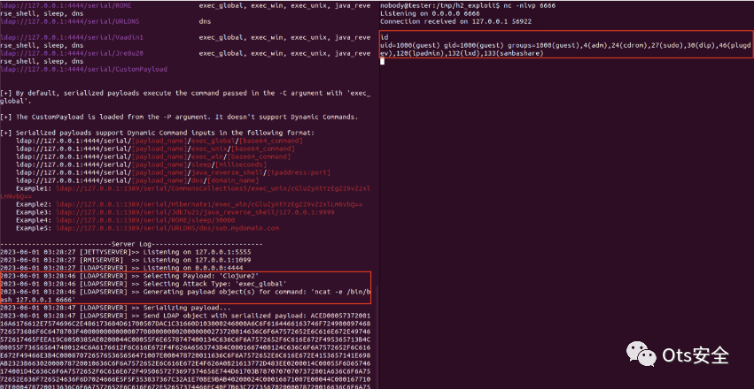
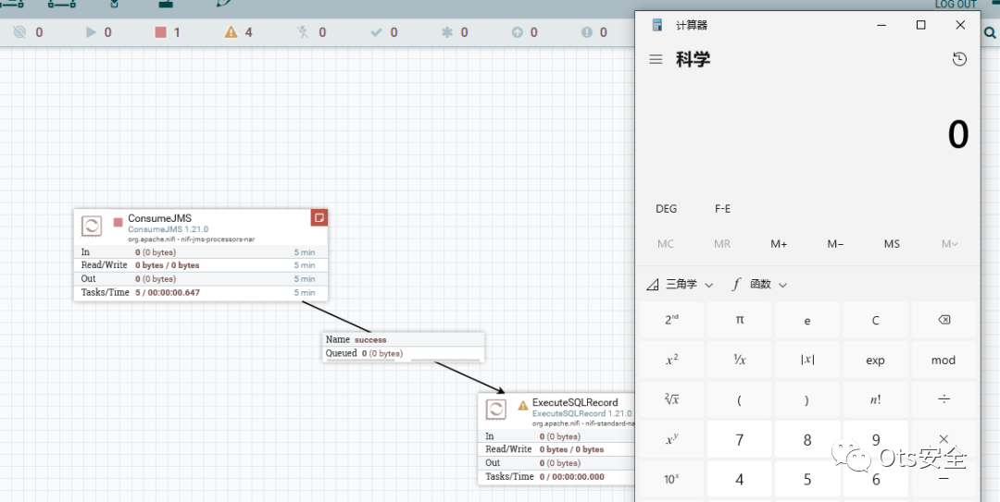

# CVE-2023-34212：通过 Apache NiFi 中的 JNDI 组件进行 Java 反序列化

<!-- vulwiki-editorial:start -->
## 校订与适用边界

- 适用前提：1.8.0–1.21.0，已认证且获授权配置JndiJmsConnectionFactoryProvider及JMS处理器URL/库属性
- 证据范围：核心条件清楚，但实际PoC在外部PDF且未读取；本页不是完整复现。

### 尚未解决的证据缺口

以下限制仍适用于后文历史材料；相关版本、结果或修复结论不能据此视为已验证：

- 缺修复版本和配置权限具体边界
- 斗象复现内容仅图片，外部PDF未核验
- 大量推广动图应移除

### 操作风险与资料使用

- 涉及 LDAP/RMI/DNS/HTTP 外带：回连只证明相应网络交互，不能单独证明命令执行；使用自控接收端，避免把日志、凭据或真实业务数据发送给第三方。

本页为文本校订，未执行代码、PoC 或目标请求；原图仅保留引用，未据此确认复现成功。
<!-- vulwiki-editorial:end -->

## 技术正文与历史材料

 Ots安全   2023-11-25 09:21  
  
  
  
Apache NiFi 1.8.0 到 1.21.0 中的 JndiJmsConnectionFactoryProvider 控制器服务以及 ConsumeJMS 和 PublishJMS 处理器允许经过身份验证和授权的用户配置 URL 和库属性，从而能够从远程位置反序列化不受信任的数据。  
  
  
  
  
概念证明：  
更多细节和利用过程可以在这个PDF中找到。  
  
https://github.com/mbadanoiu/CVE-2023-34212/blob/main/Apache%20NiFi%20-%20CVE-2023-34212.pdf  
  
  
**斗象智能安全**  
 漏洞复现  
  
 Apache NiFi JMS JNDI 反序列化漏洞(CVE-2023-34212)  
  
  
  
  
  
  
感谢您抽出  
  
  
  
.  
  
  
  
.  
  
  
  
来阅读本文  
  
  
  
**点它，分享点赞在看都在这里**  
  

---

> 来源：gelusus/wxvl（微信公众号漏洞文章自动归档，原文见文首链接）
