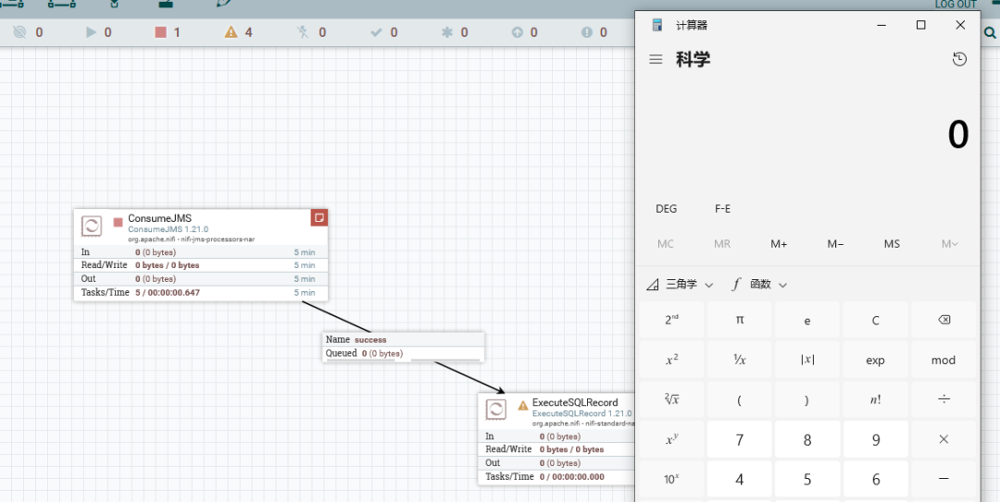
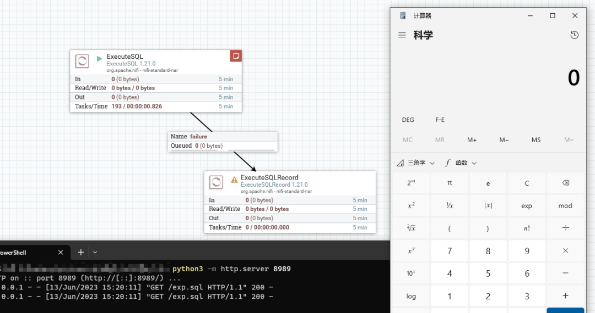

# 漏洞情报 | Apache NiFi 多个漏洞通告(CVE-2023-34468、CVE-2023-34212)

<!-- vulwiki-editorial:start -->
## 校订与适用边界

- 适用前提：认证授权用户可配置对应Controller Service；JMS与H2 JDBC两类独立路径
- 证据范围：明确两组不同起始版本、1.21.0演示和1.22.0修复；复现细节仅图片。

### 尚未解决的证据缺口

以下限制仍适用于后文历史材料；相关版本、结果或修复结论不能据此视为已验证：

- 无原始请求、参数、权限角色或结果文本，应标通告/截图演示而非完整复现
- 官方与第三方补丁下载应清晰区分信任来源，优先官方
- 表格内联样式和重复发布/推广链接噪声

### 操作风险与资料使用

- 涉及 LDAP/RMI/DNS/HTTP 外带：回连只证明相应网络交互，不能单独证明命令执行；使用自控接收端，避免把日志、凭据或真实业务数据发送给第三方。

本页为文本校订，未执行代码、PoC 或目标请求；原图仅保留引用，未据此确认复现成功。
<!-- vulwiki-editorial:end -->

## 技术正文与历史材料

 斗象智能安全   2023-06-15 11:40  
  
**1.1  漏洞概述**  
  
  
  
  
2023 年 6 月 13 日，斗象科技漏洞情报中心监控到Apache NiFi发布发布了安全通告，修复了 2 个安全漏洞。斗象漏洞情报中心研究员紧急对发布的安全漏洞进行分析复现，并推出针对性的修复建议。  
  
Apache NiFi是一个易于使用、强大、可靠的系统，用于处理和分发数据。它支持强大和可扩展的数据路由、转换和系统中介逻辑的有向图。  
  
**1.2  影响范围******  
  
  
  
  
<table><tbody><tr><td width="138" valign="middle" style="word-break: break-all;" align="center"><strong>CVE编号</strong></td><td width="250" valign="middle" style="word-break: break-all;" align="center"><strong>影响范围</strong></td></tr><tr><td width="158" valign="middle" style="word-break: break-all;" align="center">CVE-2023-34212</td><td width="250" valign="middle" style="word-break: break-all;" align="center">1.8.0 &lt;= Apache NiFi
&lt;= 1.21.0</td></tr><tr><td width="158" valign="middle" style="word-break: break-all;" align="center">CVE-2023-34468</td><td width="250" valign="middle" style="word-break: break-all;" align="center">0.0.2 &lt;= Apache NiFi
&lt;= 1.21.0</td></tr></tbody></table>  
  
**1.3  复现环境**  
  
  
  
  
Apache NiFi 1.21.0  
  
**1.4  漏洞复现**  
  
  
  
  
**>> 1.4.1  Apache NiFi JMS JNDI 反序列化漏洞(CVE-2023-34212)**  
  
Apache NiFi 的 JndiJmsConnectionFactoryProvider  
控制器服务可以让经过身份验证和授权的用户设置URL和库属性，这些属性会让 ConsumeJMS 和 PublishJMS 处理器用来从远端获取数据进行反序列化利用。  
  
  
  
**>> 1.4.2  Apache NiFi H2 JDBC 远程代码执行漏洞(CVE-2023-34468)**  
  
Apache NiFi 中的 DBCPConnectionPool 和 HikariCPConnectionPool   
控制器服务允许经过认证和授权的用户用H2驱动配置数据库URL，从而实现自定义代码执行。  
  
  
  
**1.5  修复建议******  
  
  
  
  
**>> 1.5.1  版本升级**  
  
  
  
  
厂商已发布了漏洞修复程序，安全版本如下：  
  
Apache NiFi >= 1.22.0  
  
  
官方下载地址：  
  
https://github.com/apache/nifi/releases/tag/rel%2Fnifi-1.22.0  
  
若访问官网较慢，可访问斗象情报中心搭建的补丁站进行下载更新包：  
  
https://vip.tophant.com/patch?keyword=Apache/Apache%20NiFi/Apache%20NiFi%20%e5%a4%9a%e4%b8%aa%e6%bc%8f%e6%b4%9e%e9%80%9a%e5%91%8a(CVE-2023-34468%e3%80%81CVE-2023-34212)/1.22.0/  
  
**1.6  参考链接**  
  
  
  
  
https://lists.apache.org/thread/w5rm46fxmvxy216tglf0dv83wo6gnzr5  
  
  
  
  
  
  
  
  
  
  
  
  
  
  
  

---

> 来源：gelusus/wxvl（微信公众号漏洞文章自动归档，原文见文首链接）
